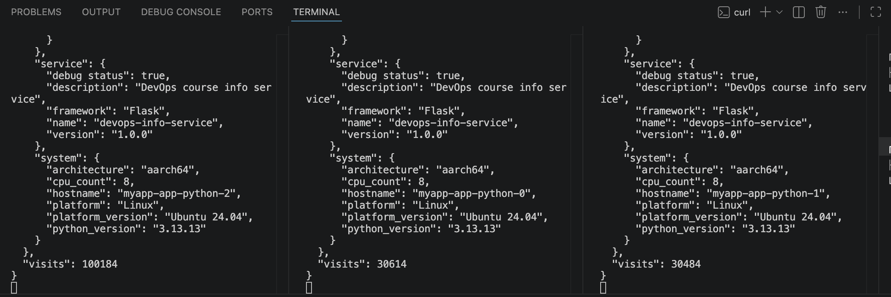
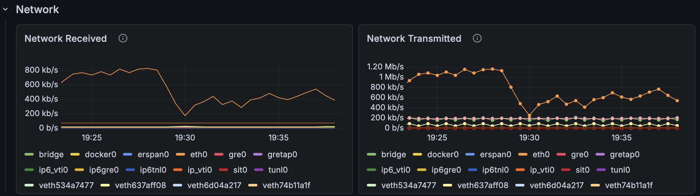
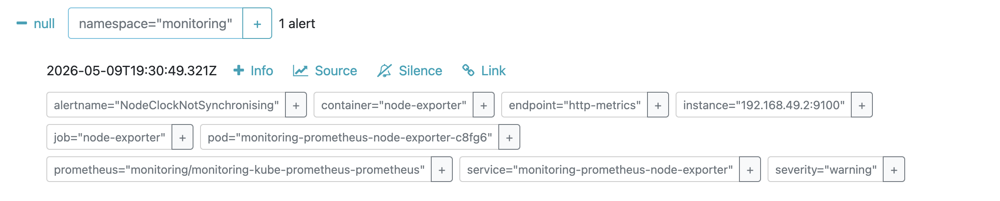

# Documentation

## Stack Components

### Descriptions in your own words

- Prometheus Operator: it's a kubernates tool that allows you to automate prometheus deployment and management. it provides a set of custom resource definitions, and you can make your own configuration with those.

- Prometheus: it's a tool for monitoring and alerting, it stores metrics as a series of timestampts.

- Alertmanager: an instruments to manage alerts. when metrics reach invalid state, alertmanager will receive alerts, group and send them to asignees. you can configure when to silence alerts or start reaching out to the next person if the first one is not responding (it's an escalation), and create other custom settings.

- Grafana: it is a dashboard for tracking the current state of the system by visualising logs and metrics. you can define alert rules there to see if the new metric value is out of the valid tresholds. 

- kube-state-metrics: it's a service that exposes metrics related to kubernates objects, they are created automatically and describe your pods current state. 

- node-exporter: it's an agent that exposes internal metrics for a node (like cpu, memory, etc), then prometheus can scrape those metrics.

## Installation Evidence

### kubectl get po,svc -n monitoring

```bash
fountainer@Veronicas-MacBook-Air DevOps-Core-Course % helm repo add prometheus-community https://prometheus-community.github.io/helm-charts
"prometheus-community" already exists with the same configuration, skipping
fountainer@Veronicas-MacBook-Air DevOps-Core-Course % helm repo update
Hang tight while we grab the latest from your chart repositories...
...Successfully got an update from the "hashicorp" chart repository
...Successfully got an update from the "argo" chart repository
...Successfully got an update from the "prometheus-community" chart repository
Update Complete. ⎈Happy Helming!⎈
```

```bash
fountainer@Veronicas-MacBook-Air DevOps-Core-Course % kubectl get po,svc -n monitoring
NAME                                                         READY   STATUS    RESTARTS   AGE
pod/alertmanager-monitoring-kube-prometheus-alertmanager-0   2/2     Running   0          2m34s
pod/monitoring-grafana-bbc5c674-8cbd9                        3/3     Running   0          2m56s
pod/monitoring-kube-prometheus-operator-54f68d65b4-99ck2     1/1     Running   0          2m56s
pod/monitoring-kube-state-metrics-5957bd45bc-5rpqr           1/1     Running   0          2m56s
pod/monitoring-prometheus-node-exporter-c8fg6                1/1     Running   0          2m57s
pod/prometheus-monitoring-kube-prometheus-prometheus-0       2/2     Running   0          2m34s

NAME                                              TYPE        CLUSTER-IP       EXTERNAL-IP   PORT(S)                      AGE
service/alertmanager-operated                     ClusterIP   None             <none>        9093/TCP,9094/TCP,9094/UDP   2m34s
service/monitoring-grafana                        ClusterIP   10.110.156.182   <none>        80/TCP                       2m57s
service/monitoring-kube-prometheus-alertmanager   ClusterIP   10.111.243.229   <none>        9093/TCP,8080/TCP            2m57s
service/monitoring-kube-prometheus-operator       ClusterIP   10.99.16.80      <none>        443/TCP                      2m57s
service/monitoring-kube-prometheus-prometheus     ClusterIP   10.106.17.206    <none>        9090/TCP,8080/TCP            2m57s
service/monitoring-kube-state-metrics             ClusterIP   10.102.26.186    <none>        8080/TCP                     2m57s
service/monitoring-prometheus-node-exporter       ClusterIP   10.100.205.92    <none>        9100/TCP                     2m57s
service/prometheus-operated                       ClusterIP   None             <none>        9090/TCP                     2m34s
```

## Dashboard Answers

### Pod Resources: CPU/memory usage of your StatefulSet

Due to the pods and the app itself being very lightweight, CPU and memory usage never went higher than initially allocated resources (100m CPU and 128Mi memory). Even under high load (I used multiple loops with curl), the initial resources were enough.

Example for pod 2:


### Namespace Analysis: Which pods use most/least CPU in default namespace?

I decided to use Prometheus for evidence, since the resource usage was really low, and didn't show up properly in Grafana.

curl I used (the first count is much bigger since I previously tested only with pod 2)



usage


As we can see, all statefulset pods used roughly the same amount of CPU and memory resources. This is anticipated, because load balancing is used for routing traffic to different pods. 

### Node Metrics: Memory usage (% and MB), CPU cores


### Kubelet: How many pods/containers managed?


### Network: Traffic for pods in default namespace



### Alerts: How many active alerts? Check Alertmanager UI



## Init Containers

### Implementation and proof of success