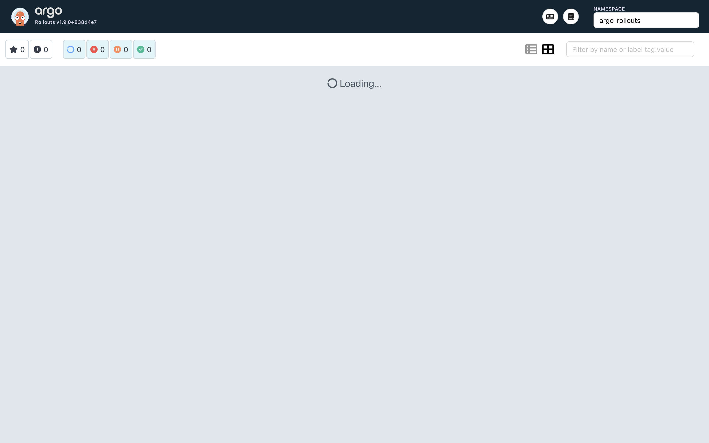
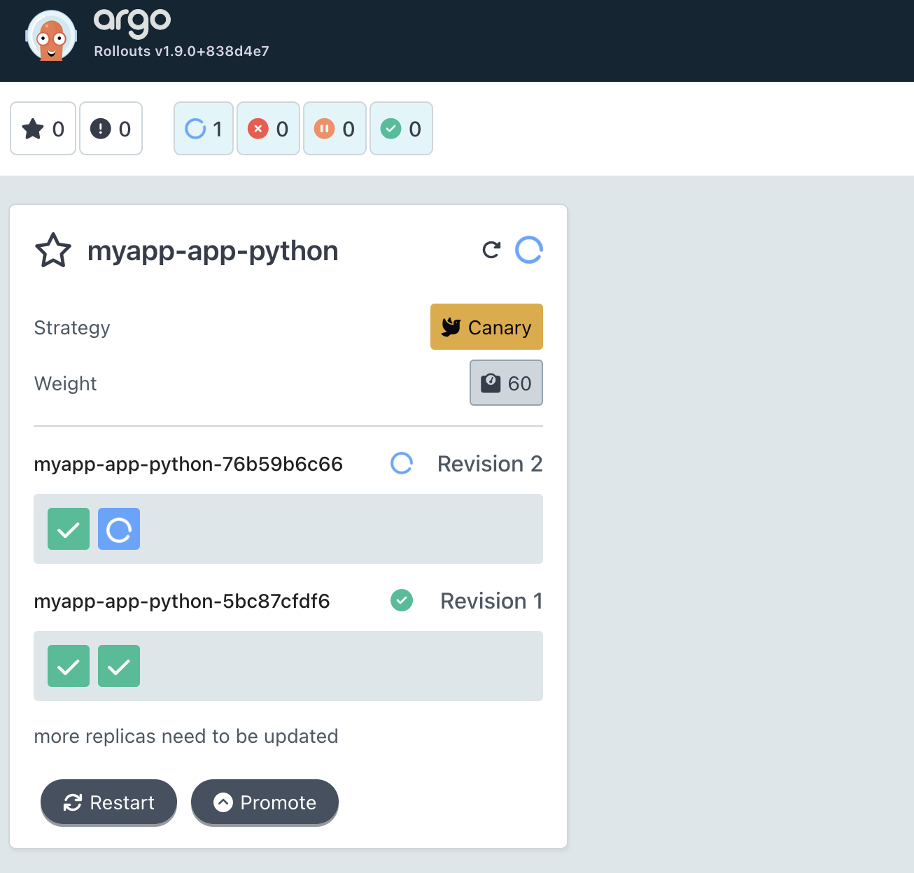
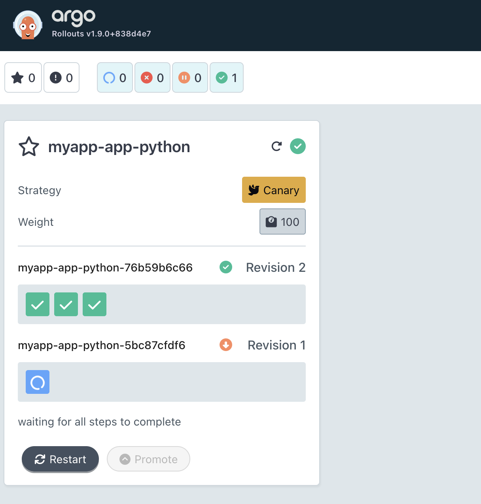
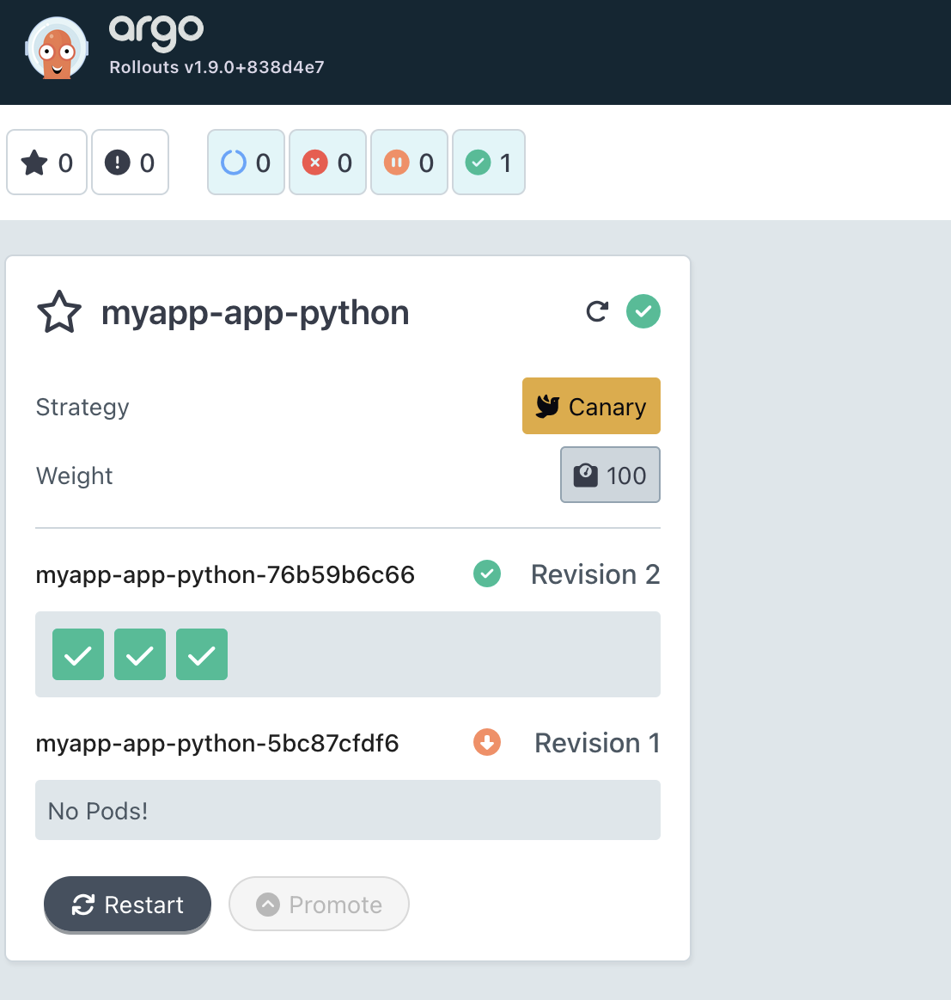
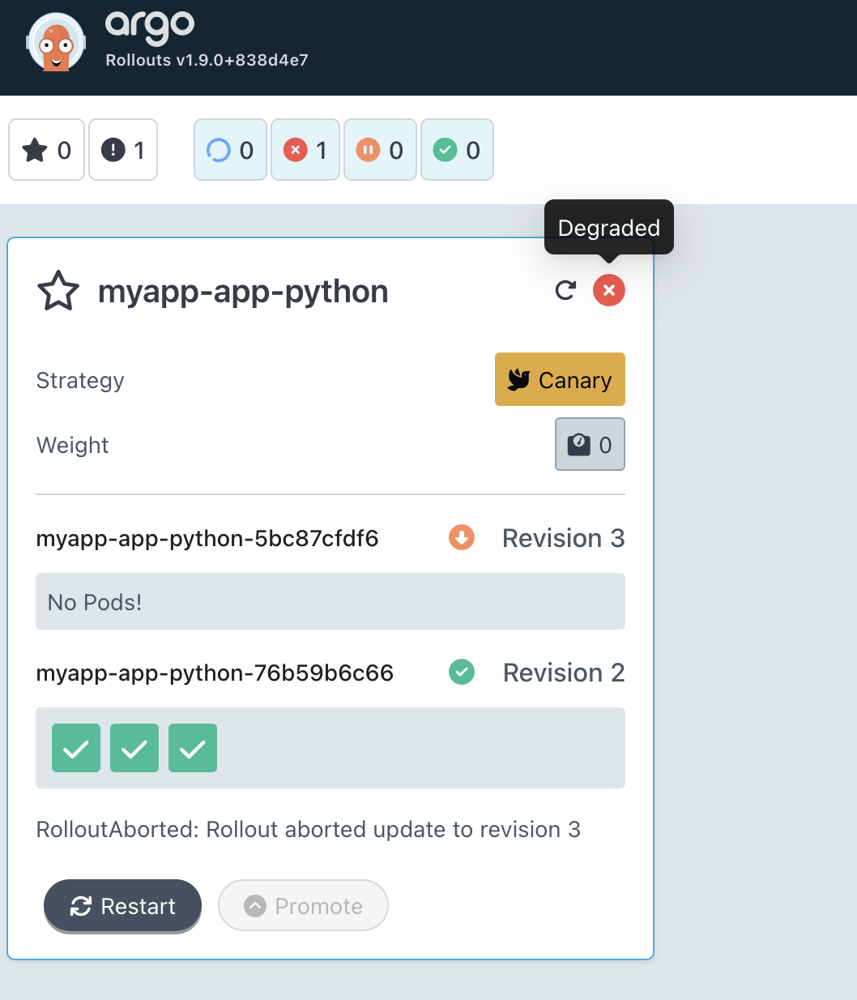

# Documentation

## Argo Rollouts Setup

### Installation verification

```bash
fountainer@Veronicas-MacBook-Air DevOps-Core-Course % kubectl apply -n argo-rollouts -f https://github.com/argoproj/argo-rollouts/releases/latest/download/install.yaml
customresourcedefinition.apiextensions.k8s.io/analysisruns.argoproj.io created
customresourcedefinition.apiextensions.k8s.io/analysistemplates.argoproj.io created
customresourcedefinition.apiextensions.k8s.io/clusteranalysistemplates.argoproj.io created
customresourcedefinition.apiextensions.k8s.io/experiments.argoproj.io created
customresourcedefinition.apiextensions.k8s.io/rollouts.argoproj.io created
serviceaccount/argo-rollouts created
clusterrole.rbac.authorization.k8s.io/argo-rollouts created
clusterrole.rbac.authorization.k8s.io/argo-rollouts-aggregate-to-admin created
clusterrole.rbac.authorization.k8s.io/argo-rollouts-aggregate-to-edit created
clusterrole.rbac.authorization.k8s.io/argo-rollouts-aggregate-to-view created
clusterrolebinding.rbac.authorization.k8s.io/argo-rollouts created
configmap/argo-rollouts-config created
secret/argo-rollouts-notification-secret created
service/argo-rollouts-metrics created
deployment.apps/argo-rollouts created
fountainer@Veronicas-MacBook-Air DevOps-Core-Course % kubectl get pods -n argo-rollouts
NAME                            READY   STATUS    RESTARTS   AGE
argo-rollouts-5f64f8d68-zxx5z   1/1     Running   0          54s
```
```bash
==> Fetching downloads for: kubectl-argo-rollouts
✔︎ Formula kubectl-argo-rollouts (v1.8.3)                                                                                    Verified    130.1MB/130.1MB
==> Installing kubectl-argo-rollouts from argoproj/tap
```

```bash
fountainer@Veronicas-MacBook-Air DevOps-Core-Course % kubectl argo rollouts version
kubectl-argo-rollouts: v1.8.3+49fa151
  BuildDate: 2025-06-04T22:19:21Z
  GitCommit: 49fa1516cf71672b69e265267da4e1d16e1fe114
  GitTreeState: clean
  GoVersion: go1.23.9
  Compiler: gc
  Platform: darwin/amd64
```

### Dashboard access

```bash
fountainer@Veronicas-MacBook-Air DevOps-Core-Course % kubectl get pods -n argo-rollouts
NAME                                      READY   STATUS    RESTARTS   AGE
argo-rollouts-5f64f8d68-zxx5z             1/1     Running   0          12m
argo-rollouts-dashboard-755bbc64c-pnkl6   1/1     Running   0          28s
```



### Understand Rollout vs Deployment

Rollout CRD vs Deployment

- Rollout and Deployment are kinda similar and both have replicas, selector, template, strategy fields, they manage pod creation. But rollout has additional fields for strategy that allow to perform more controllable rollouts with specific configurations, like rolling an update for a group of users, not for all. 

Additional fields for progressive delivery

- canary: allows gradual traffic shifting to a new version using steps (e.g., setWeight, pause)
- blueGreen: supports switching between old and new versions using separate services
- steps: defines staged rollout progression
- analysis: integrates automated checks (metrics, tests) during rollout
- pause: enables manual or timed pauses between steps
- trafficRouting: controls how traffic is split between versions (with ingress/service mesh)


## Canary Deployment

### Strategy configuration explained

The rollout uses a canary strategy to gradually shift traffic from the old version to the new one. It is configured in steps (20%, 40%, 60%, 80%, 100%) with pauses to allow validation and manual control. This approach reduces risk by exposing the new version to a small part of users before full deployment.

### Step-by-step rollout progression (screenshots from dashboard)





### Promotion and abort demonstration

Promotion (screenshots can be seen in the prev step)

```bash
(devops) fountainer@Veronicas-MacBook-Air app_python % kubectl argo rollouts get rollout myapp-app-python -n argo-rollouts 
Name:            myapp-app-python
Namespace:       argo-rollouts
Status:          ॥ Paused
Message:         CanaryPauseStep
Strategy:        Canary
  Step:          1/9
  SetWeight:     20
  ActualWeight:  25
Images:          fountainer/my-app:16-04 (canary, stable)
Replicas:
  Desired:       3
  Current:       4
  Updated:       1
  Ready:         4
  Available:     4

NAME                                          KIND        STATUS     AGE  INFO
⟳ myapp-app-python                            Rollout     ॥ Paused   17m  
├──# revision:2                                                           
│  └──⧉ myapp-app-python-76b59b6c66           ReplicaSet  ✔ Healthy  69s  canary
│     └──□ myapp-app-python-76b59b6c66-pgtgq  Pod         ✔ Running  68s  ready:1/1
└──# revision:1                                                           
   └──⧉ myapp-app-python-5bc87cfdf6           ReplicaSet  ✔ Healthy  17m  stable
      ├──□ myapp-app-python-5bc87cfdf6-2tzkc  Pod         ✔ Running  17m  ready:1/1
      ├──□ myapp-app-python-5bc87cfdf6-bnpd6  Pod         ✔ Running  17m  ready:1/1
      └──□ myapp-app-python-5bc87cfdf6-qfg9s  Pod         ✔ Running  17m  ready:1/1
(devops) fountainer@Veronicas-MacBook-Air app_python % kubectl argo rollouts promote myapp-app-python -n argo-rollouts
rollout 'myapp-app-python' promoted
```

Abort

```bash
(devops) fountainer@Veronicas-MacBook-Air app_python % kubectl get rollouts -n argo-rollouts
NAME               DESIRED   CURRENT   UP-TO-DATE   AVAILABLE   AGE
myapp-app-python   3         4         1            4           31m
(devops) fountainer@Veronicas-MacBook-Air app_python % kubectl argo rollouts abort myapp-app-python -n argo-rollouts
rollout 'myapp-app-python' aborted
(devops) fountainer@Veronicas-MacBook-Air app_python % kubectl argo rollouts get rollout myapp-app-python -n argo-rollouts
Name:            myapp-app-python
Namespace:       argo-rollouts
Status:          ✖ Degraded
Message:         RolloutAborted: Rollout aborted update to revision 3
Strategy:        Canary
  Step:          0/9
  SetWeight:     0
  ActualWeight:  0
Images:          fountainer/my-app:16-04 (stable)
Replicas:
  Desired:       3
  Current:       3
  Updated:       0
  Ready:         3
  Available:     3

NAME                                          KIND        STATUS        AGE  INFO
⟳ myapp-app-python                            Rollout     ✖ Degraded    32m  
├──# revision:3                                                              
│  └──⧉ myapp-app-python-5bc87cfdf6           ReplicaSet  • ScaledDown  32m  canary
└──# revision:2                                                              
   └──⧉ myapp-app-python-76b59b6c66           ReplicaSet  ✔ Healthy     16m  stable
      ├──□ myapp-app-python-76b59b6c66-pgtgq  Pod         ✔ Running     16m  ready:1/1
      ├──□ myapp-app-python-76b59b6c66-7cwr4  Pod         ✔ Running     10m  ready:1/1
      └──□ myapp-app-python-76b59b6c66-skfdd  Pod         ✔ Running     10m  ready:1/1
```


## Blue-Green Deployment

### Strategy configuration explained

### Preview vs active service

### Promotion process

## Strategy Comparison

### When to use canary vs blue-green

### Pros and cons of each

### Your recommendation for different scenarios

## CLI Commands Reference

### Useful commands you used

### Monitoring and troubleshooting

