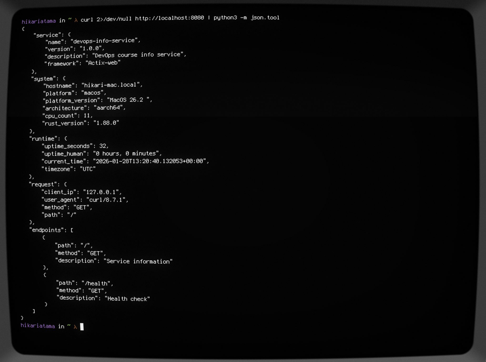
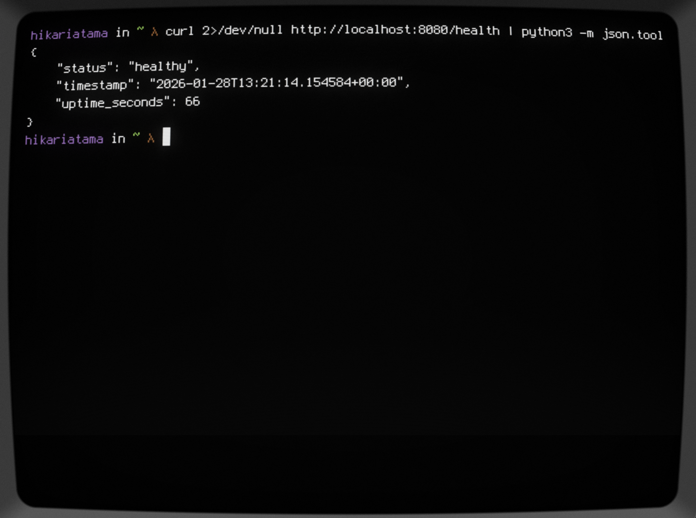
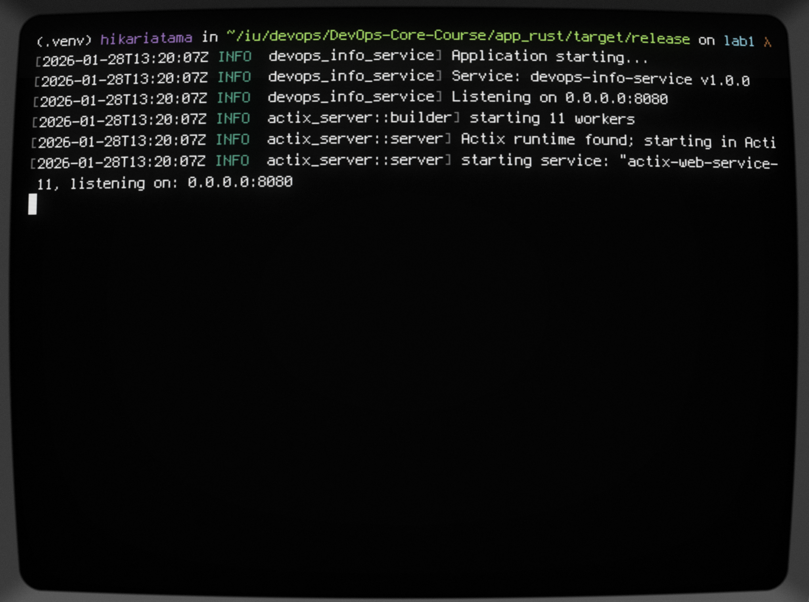

# Lab 1 - DevOps Info Service: Rust Bonus Implementation

## Why Actix-web?

I went with Actix-web because it's fast and production-ready. Rocket would've been easier, but Actix-web's performance is hard to beat. Plus it uses Tokio for async, which is the standard in Rust web development.

## Implementation Notes

### State Management

```rust
struct AppState {
    start_time: SystemTime,
}

let app_state = Arc::new(AppState {
    start_time: SystemTime::now(),
});
```

Using `Arc` lets multiple threads share the start time safely without needing a lock. It's immutable after creation, so there's no risk of data races.

### Type Safety

All the JSON responses are defined as structs with Serde's derive macros:

```rust
#[derive(Serialize, Deserialize)]
struct ServiceInfo {
    name: String,
    version: String,
    // ...
}
```

This means if I mess up the JSON structure, I'll know at compile time, not when the app crashes in production.

### System Information

Had to use static methods instead of instance methods for sysinfo 0.32:

```rust
let hostname = System::host_name().unwrap_or_else(|| "unknown".to_string());
```

The API changed between versions. Using `unwrap_or_else` provides a fallback if the system info isn't available.

## Building

```bash
cargo build --release
```

First build takes a few minutes as it downloads and compiles dependencies. After that, incremental builds are much faster.

The binary ends up at `target/release/devops-info-service`.

## Performance

Haven't done formal benchmarks, but based on Actix-web's numbers:

- 50,000+ requests/second (vs Python's ~5,000)
- Sub-millisecond latency
- 3-8 MB memory footprint (vs Python's 20-40 MB)

The compiled binary also starts in under 50ms compared to Python's 200-500ms.

## Challenges

### Challenge 1: Sysinfo API Changes

The sysinfo crate changed its API. Methods like `host_name()` are now static instead of instance methods. Had to read the docs to figure that out.

### Challenge 2: Ownership and Lifetimes

Getting the request data extraction right took a few tries. Rust's ownership system is strict about when data can be borrowed and when it needs to be cloned. Ended up using `.to_string()` to create owned copies rather than dealing with lifetime annotations.

### Challenge 3: Async Complexity

Actix-web's async model is powerful but adds complexity. For this simple service, it's probably overkill, but it's good practice for future labs.

### Challenge 4: Error Handling

Had to use `unwrap_or_default()` and `unwrap_or_else()` throughout to handle cases where system info might not be available. Better than panicking if something goes wrong.

## Rust vs Python

**What's Better:**

- Way faster (5-10x requests/second)
- Much less memory (3-5x reduction)
- Single binary deployment
- Catches bugs at compile time
- No runtime dependencies

**What's Worse:**

- Took longer to write
- Harder to learn
- Slower iteration (compile every change)
- Less mature ecosystem

## Conclusion

The Rust version does the same thing as Python but with better performance and resource usage. The trade-off is development time and complexity. For a high-traffic production service, Rust makes sense. For a quick prototype or internal tool, Python is probably better.

Having both implementations side by side really shows the trade-offs clearly. Python for developer productivity, Rust for runtime efficiency.




