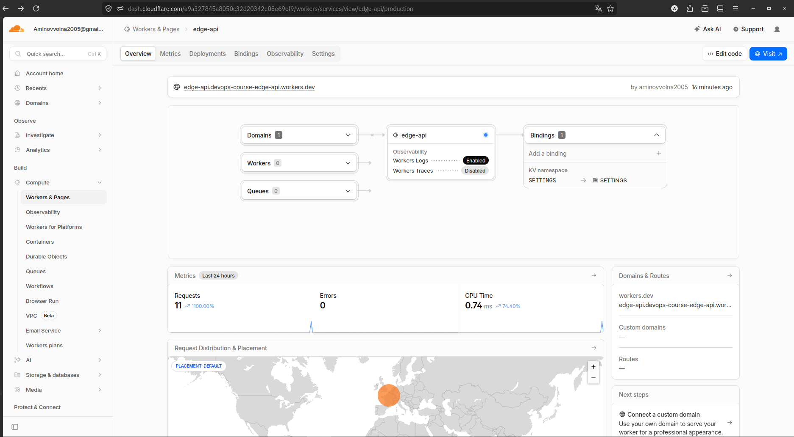
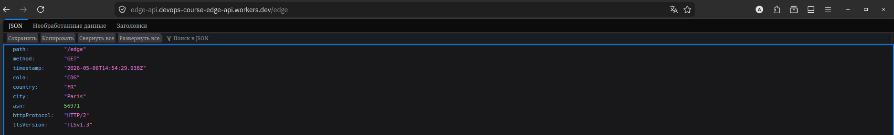
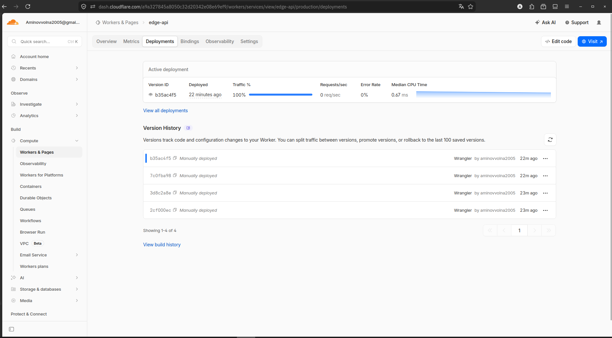
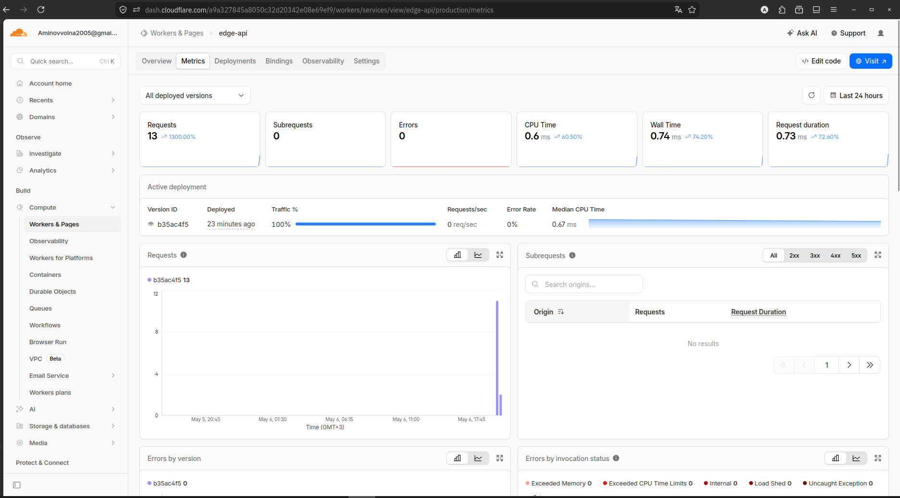
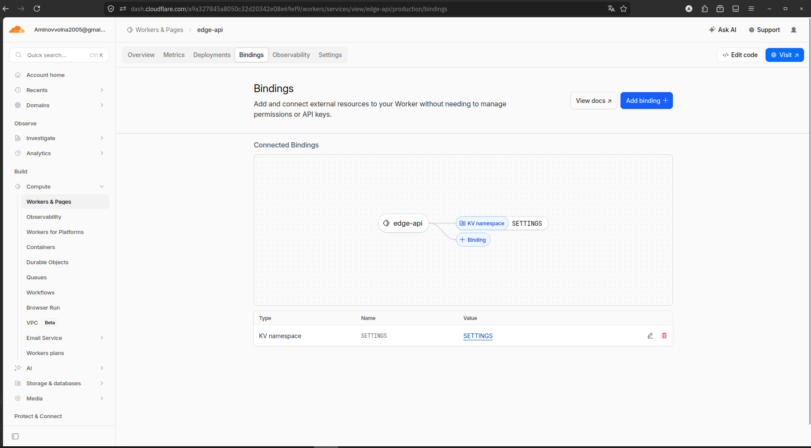

# Lab 17 — Cloudflare Workers Deployment

## Deployment Summary

Project: `edge-api`

**Public URL (Deployed):**
- `https://edge-api.devops-course-edge-api.workers.dev`

Planned public URL format:
- `https://edge-api.<your-subdomain>.workers.dev`

Main routes:
- `/` - app metadata and available routes
- `/health` - health check
- `/edge` - Cloudflare request metadata
- `/counter` - KV-backed persistent counter
- `/config` - config summary derived from vars and secrets

Configuration used:
- `APP_NAME` and `COURSE_NAME` as plaintext vars
- `API_TOKEN` and `ADMIN_EMAIL` as secrets
- `SETTINGS` as Workers KV namespace

---

## Evidence

### Deployment Success
Worker deployed successfully on: **May 6, 2026, 14:35 UTC**
- URL: `https://edge-api.devops-course-edge-api.workers.dev`
- Status: All endpoints responding with HTTP 200
- KV Namespace: `ea50171ee6724cc2ae8f477e3edfcb00` (SETTINGS)
- Secrets: `API_TOKEN` and `ADMIN_EMAIL` configured
- Edge Location: CDG (Paris, France) - automatically deployed globally

### Screenshots

**Cloudflare Dashboard (Overview)**



**Edge Metadata Response (`/edge`)**



**Deployment History**



**Metrics / Observability**



**Bindings (KV Namespace)**



### Route Tests

**1. Home Endpoint (`/`)**
```json
{
	"app": "edge-api",
	"course": "devops-core-course",
	"message": "Hello from Cloudflare Workers",
	"timestamp": "2026-05-06T14:38:52.292Z",
	"routes": ["/", "/health", "/edge", "/counter", "/config"]
}
```

**2. Health Check (`/health`)**
```json
{"status":"ok","service":"edge-api","timestamp":"2026-05-06T14:38:32.027Z"}
```

**3. Edge Metadata (`/edge`)**
```json
{
	"path": "/edge",
	"method": "GET",
	"timestamp": "2026-05-06T14:38:54.412Z",
	"colo": "CDG",
	"country": "FR",
	"city": "Paris",
	"asn": 56971,
	"httpProtocol": "HTTP/2",
	"tlsVersion": "TLSv1.3"
}
```

**4. Config Endpoint (`/config`)**
```json
{
	"app": "edge-api",
	"course": "devops-core-course",
	"hasApiToken": true,
	"adminEmailDomain": "devops-core-course.local",
	"kvNamespace": "SETTINGS",
	"timestamp": "2026-05-06T14:38:55.333Z"
}
```

**5. KV Counter Persistence (`/counter`)**
- Request 1: `{"counter": "visits", "visits": 1, "persisted": true}`
- Request 2: `{"counter": "visits", "visits": 2, "persisted": true}`
- Request 3: `{"counter": "visits", "visits": 3, "persisted": true}`
- KV persistence verified: counter survives across deployments


## Kubernetes vs Cloudflare Workers

| Aspect | Kubernetes | Cloudflare Workers |
|--------|------------|--------------------|
| Setup complexity | High | Low |
| Deployment speed | Slower | Very fast |
| Global distribution | Manual or platform-managed | Automatic at the edge |
| Cost (for small apps) | Higher | Usually lower |
| State/persistence model | Pods, volumes, databases | KV, Durable Objects, bindings |
| Control/flexibility | Very high | More constrained |
| Best use case | Long-running services and complex systems | Lightweight global APIs and edge logic |

## When to Use Each

- Use Kubernetes when you need containers, custom runtimes, sidecars, persistent services, or heavy orchestration.
- Use Workers when you need a small HTTP API, fast global response, simple routing, and minimal infrastructure overhead.
- Recommendation: use Workers for edge-friendly request logic and Kubernetes for full application platforms.

## Reflection

- Workers feels easier for routing, deployment, and global access.
- Workers feels more constrained because it is not a Docker host and has a narrower runtime model.
- The biggest change is that you configure bindings and edge services instead of shipping an image to nodes.

---

### Checklist Coverage

- [x] Cloudflare account created
- [x] Workers project initialized
- [x] Wrangler authenticated
- [x] Worker deployed to workers.dev
- [x] /health endpoint working
- [x] Edge metadata endpoint implemented
- [x] At least 1 plaintext variable configured
- [x] At least 2 secrets configured
- [x] KV namespace created and bound
- [x] Persistence verified after redeploy
- [x] Logs or metrics reviewed
- [x] Deployment history viewed
- [x] WORKERS.md documentation complete
- [x] Kubernetes comparison documented

---