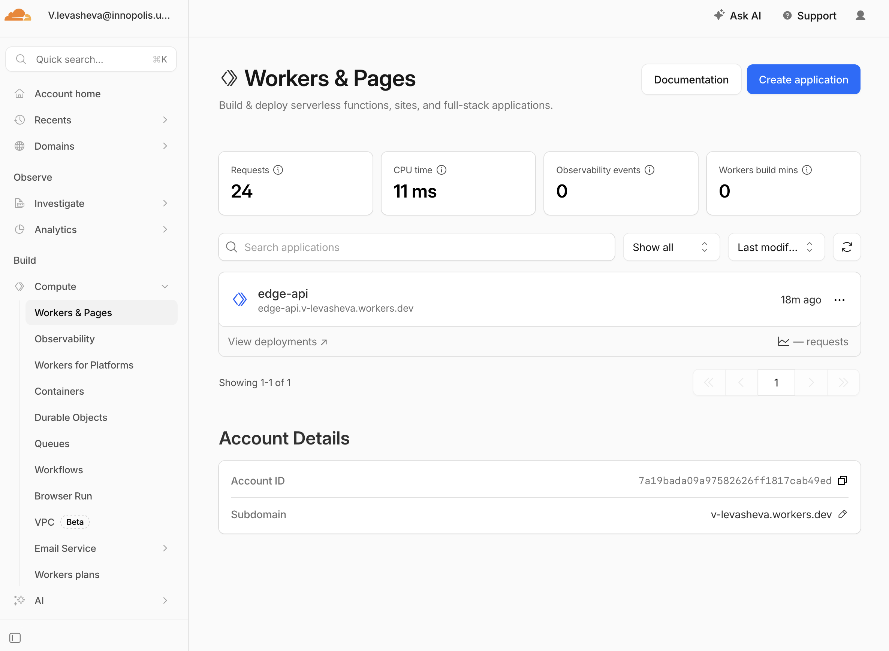
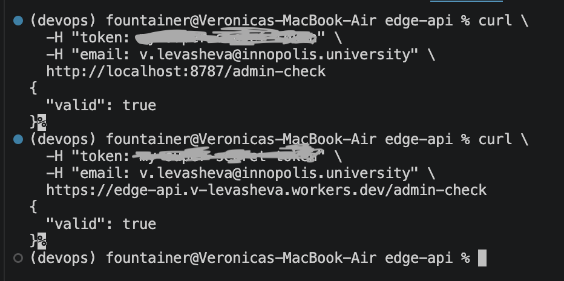
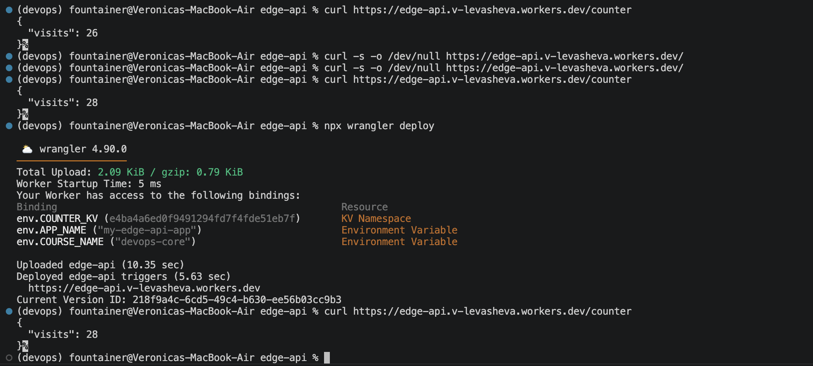

# Documentation

## Deployment summary

### Worker URL

[https://edge-api.v-levasheva.workers.dev](https://edge-api.v-levasheva.workers.dev)

### Main routes

/ for general app info
/health for health status
/edge for cloudflare edge metadata
/counter for a persistent KV-based request counter, which shows the number of visits for / route
/admin-check is for checking if the requester is an admin, it uses secrets API_TOKEN and ADMIN_EMAIL, and the requester should provide valid token and email in the request headers
and also there is "Not Found" response for non-existent route

### Configuration used

the worker was configured using wrangler.jsonc, which defines the worker name, entrypoint (src/index.ts), compatibility date, environment variables, and resource bindings. the project uses a TypeScript Worker template and includes an APP_NAME variable binding together with a COUNTER_KV KV namespace binding used for persistent storage in the /counter endpoint.

## Evidence

### Screenshot of Cloudflare dashboard



### Example /edge JSON response

Firstly, the local testing of all endpoints (for the deployed /edge some info such as asn and httpProtocol were added):


And the /edge endpoint in the deployed worker:


### How Workers distributes execution globally?

cloudflare workers are automatically executed on cloudflare edge locations around the world, so requests are handled close to the user without manually selecting regions. unlike traditional VM or PaaS platforms where you often deploy separately to regions, workers use cloudflare’s global network automatically, so there is no separate “deploy to 3 regions” step.

### The difference between workers.dev, Routes, and Custom Domains

- workers.dev is the default public cloudflare subdomain automatically provided for testing and accessing workers

- routes are specific url endpoints that worker will provide access to 

- custom domains allow exposing the worker directly through an owned custom domain, not through a provided workers.dev

### Example log or metrics screenshot

## Configuration, Secrets & Persistence

### Explain why plaintext vars are not suitable for secrets

variables I added: "APP_NAME" and "COURSE_NAME"

plaintext vars are not safe for secrets because they are stored in config and visible in repo and dashboard, so anyone can read them

### Secrets

I added 2 secrets: API_TOKEN and ADMIN_EMAIL. They are used in the /admin-check endpoint, where the requester can pass their access token and email and see if they can be authenticated as an admin.

```bash
(devops) fountainer@Veronicas-MacBook-Air edge-api % npx wrangler secret list
[
  {
    "name": "ADMIN_EMAIL",
    "type": "secret_text"
  },
  {
    "name": "API_TOKEN",
    "type": "secret_text"
  }
]
```



### Workers KV persistence

### Document what you stored and how you verified it

I stored the number of visits of the / endpoint. Each time / is visited, the counter increases by one, and visits value is updated. The value then can be accessed through the /visits endpoint.

The persistance verification:



## Kubernetes vs Cloudflare Workers Comparison

| Aspect | Kubernetes | Cloudflare Workers |
|--------|------------|--------------------|
| Setup complexity | blalallallla | blaldlalsdklas |
| Deployment speed | | |
| Global distribution | | |
| Cost (for small apps) | | |
| State/persistence model | | |
| Control/flexibility | | |
| Best use case | | |

## When to Use Each

### Scenarios favoring Kubernetes

### Scenarios favoring Workers

### Your recommendation

## Reflection

### What felt easier than Kubernetes?

### What felt more constrained?

### What changed because Workers is not a Docker host?

