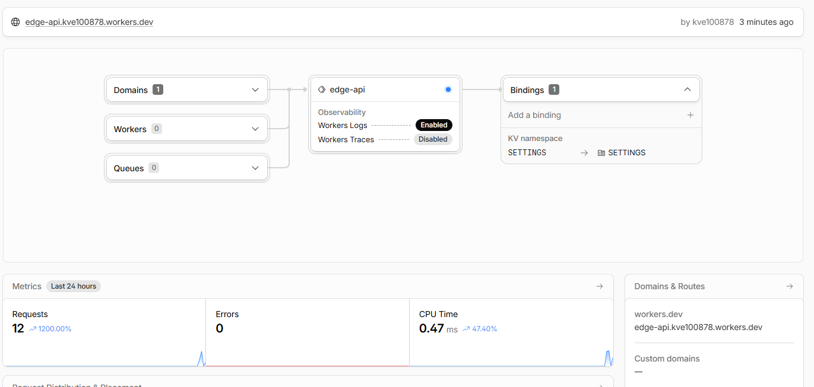
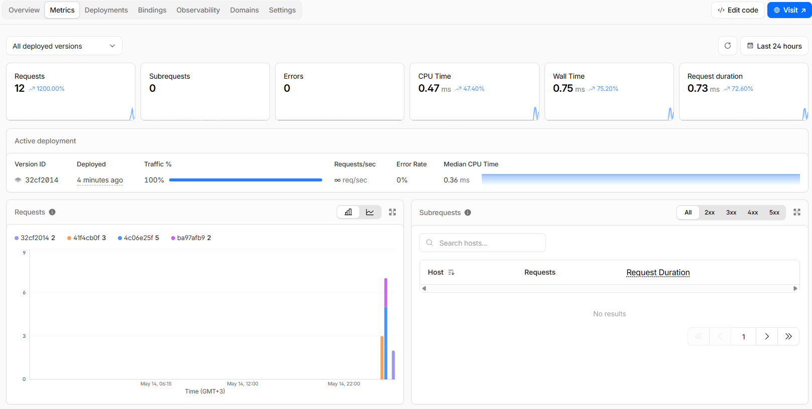
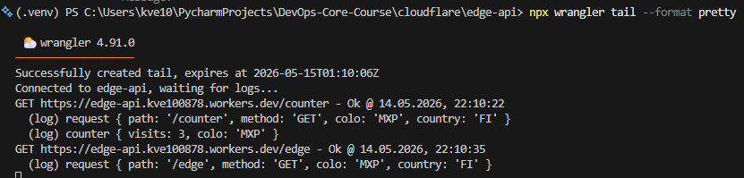
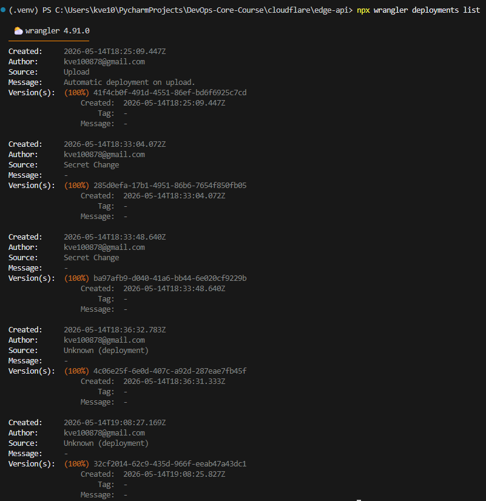
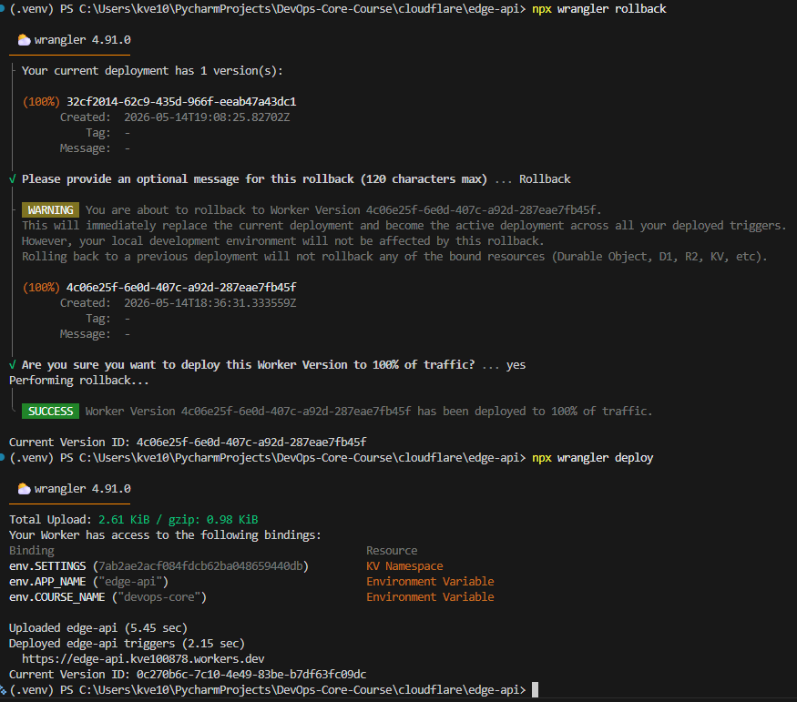

# WORKERS.md — Lab 17: Cloudflare Workers Edge Deployment

Serverless HTTP API deployed to Cloudflare's global edge network using Cloudflare
Workers, Wrangler, TypeScript and Workers KV.

---

## 1. Deployment Summary

| Item | Value |
|------|-------|
| **Worker name** | `edge-api` |
| **Public URL** | https://edge-api.kve100878.workers.dev |
| **Runtime** | Cloudflare Workers (V8 isolates, no containers) |
| **Language** | TypeScript |
| **Config file** | `wrangler.jsonc` |
| **Compatibility date** | `2026-05-01` |
| **Observability** | Enabled (`observability.enabled = true`) |

### Main routes

| Method | Route | Description |
|--------|-------|-------------|
| `GET` | `/` | App information + list of available routes |
| `GET` | `/health` | Health status and Worker version |
| `GET` | `/edge` | Cloudflare edge metadata from `request.cf` |
| `GET` | `/counter` | Visit counter persisted in Workers KV |
| `GET` | `/info` | Configuration / secrets / KV binding presence (secrets masked) |

### Configuration used

**Plaintext variables** (`vars` in `wrangler.jsonc` — visible in code and dashboard):

| Variable | Value |
|----------|-------|
| `APP_NAME` | `edge-api` |
| `COURSE_NAME` | `devops-core` |

Plaintext `vars` are **not** suitable for secrets: they are stored unencrypted in
the configuration file, committed to Git, and shown in plain text in the Cloudflare
dashboard. Anything sensitive must be a secret instead.

**Secrets** (encrypted, set with `wrangler secret put`, never committed to Git):

| Secret | Purpose |
|--------|---------|
| `API_TOKEN_DEMO` | Demo API token, read through `env.API_TOKEN_DEMO` |
| `ADMIN_EMAIL` | Admin contact, returned **masked** by `/info` (`a***@gmail.com`) |

**Workers KV** (persistent edge key-value store):

| Binding | Namespace ID | Usage |
|---------|--------------|-------|
| `SETTINGS` | `7ab2ae2acf084fdcb62ba048659440db` | Stores the `visits` key used by `/counter` |

---

## 2. Evidence

### 2.1 Example `/edge` JSON response

Captured from the public URL — proves Cloudflare injects request metadata at the
edge via `request.cf`:

```json
{
  "colo": "MXP",
  "country": "FI",
  "city": "Helsinki",
  "region": "Uusimaa",
  "asn": 210644,
  "asOrganization": "Iranian Research Organization for Science & Technology",
  "httpProtocol": "HTTP/1.1",
  "tlsVersion": "TLSv1.3",
  "timezone": "Europe/Helsinki"
}
```

- `colo` — Cloudflare data center (PoP) that served the request (`MXP` = Milan).
- `country` / `city` / `region` — geolocation derived by Cloudflare.
- `asn` / `asOrganization` — network the request arrived from.
- The request never reached an origin server — the Worker ran **inside the edge PoP**.

### 2.2 `/counter` — KV persistence

```text
GET /counter  ->  { "visits": 1 }
GET /counter  ->  { "visits": 2 }
```

The counter is stored in the `SETTINGS` KV namespace under key `visits`. The value
**survives redeploys** because KV is a separate, durable store independent of the
Worker code (see verification in section 4).

### 2.3 Cloudflare dashboard

The `edge-api` Worker in the Cloudflare dashboard (Workers & Pages → Overview):



### 2.4 Metrics

The **Metrics** tab shows request count, success/error rate and CPU time per
request — the key signals for a Worker. There is no node or pod resource view as in
Kubernetes, because the platform manages the runtime entirely:



### 2.5 Logs

The Worker calls `console.log()` on every request (a `request` event with path,
method and `colo`, plus a `counter` event on `/counter`). These were streamed live
with `wrangler tail`:



### 2.6 Deployment history & rollback

`wrangler deployments list` shows the full version history — the initial upload, two
secret changes, several code deploys (including `v0.2.0`), an explicit **Rollback**
entry, and the final redeploy:



A rollback was performed with `wrangler rollback`. It re-publishes a previous
version without rebuilding — visible above as the entry with `Message: Rollback`
pointing back at an earlier version ID. The current version was then redeployed:



---

## 3. Kubernetes vs Cloudflare Workers Comparison

| Aspect | Kubernetes | Cloudflare Workers |
|--------|------------|--------------------|
| **Setup complexity** | High — cluster, nodes, `kubectl`, manifests, Ingress, container registry | Very low — one CLI (`wrangler`) and one config file (`wrangler.jsonc`) |
| **Deployment speed** | Minutes — build image, push to registry, roll out pods | Seconds — `wrangler deploy` pushes code live globally |
| **Global distribution** | Manual — multi-region clusters, federation, traffic routing you build yourself | Automatic — deployed to 300+ edge PoPs by default, no region selection |
| **Cost (for small apps)** | High baseline — control plane + minimum nodes run 24/7 even at zero traffic | Generous free tier, pay-per-request, scales to zero — costs nothing when idle |
| **State/persistence model** | PersistentVolumes / PVC, StatefulSets, external databases — full filesystem & DB control | KV, D1, R2, Durable Objects — purpose-built edge stores; KV is eventually consistent |
| **Control/flexibility** | Full — any container, any runtime, sidecars, DaemonSets, custom networking | Constrained — V8 isolate only, no filesystem, CPU-time limits, no long-running processes |
| **Best use case** | Long-running stateful services, heavy/complex microservices, custom runtimes | Globally distributed low-latency APIs, edge middleware, lightweight stateless logic |

---

## 4. When to Use Each

### Scenarios favoring Kubernetes
- Long-running or background processes (queues, workers, schedulers, websockets at scale).
- Heavy or specialized compute (GPU, large memory, custom native binaries).
- Workloads that need a real filesystem, a full OS, or arbitrary runtimes.
- Stateful services and databases you want to self-host close to the app.
- Fine-grained control over networking, scaling policies, and the runtime environment.

### Scenarios favoring Cloudflare Workers
- Globally distributed HTTP APIs that must be low-latency for users everywhere.
- Edge middleware: auth checks, redirects, request rewriting, A/B routing.
- Lightweight, mostly stateless services with spiky or unpredictable traffic.
- Teams that want fast iteration and zero infrastructure to operate.
- Projects where "scale to zero" and per-request billing matter.

### Recommendation
For this lab's info-service — a small, stateless HTTP API with a KV-backed counter —
**Cloudflare Workers is the better fit**. It removes all cluster operations, deploys
globally in seconds, and costs nothing at low traffic. Kubernetes would be
over-engineering here. Kubernetes only becomes the right choice once the workload
needs long-running processes, a real database, or a custom runtime that the Workers
isolate cannot host.

---

## 5. Reflection

**What felt easier than Kubernetes?**
No cluster to provision, no nodes to size, no Ingress or `kubectl`. A single
`wrangler deploy` ships the code to the entire global network in seconds. Secrets
(`wrangler secret put`) and persistent state (`wrangler kv namespace create`) are
each one command, versus Secrets + PVC + StatefulSet manifests in Kubernetes. Global
distribution is free and automatic — there is nothing to configure.

**What felt more constrained?**
The Workers runtime is a V8 isolate, not a container: no filesystem, no long-running
processes, and CPU-time limits per request. You cannot just lift-and-shift an
existing app — it must fit the `fetch` handler model. Persistence is KV (eventually
consistent key-value), not a relational database, so data modeling is more limited.

**What changed because Workers is not a Docker host?**
The Lab 2 Docker image could not be deployed at all. The application was rebuilt
**Workers-native**: a TypeScript `fetch` handler using Web platform APIs
(`Request`/`Response`/`URL`) instead of FastAPI + uvicorn. State moved from a
container volume / PVC to a Workers KV namespace. Configuration moved from
environment variables in a Dockerfile to `vars` + secrets bindings in
`wrangler.jsonc`. The operational concerns are the same — routes, health checks,
config, state, logs, deployments — but the implementation is bound to the edge
runtime rather than a portable container image.
