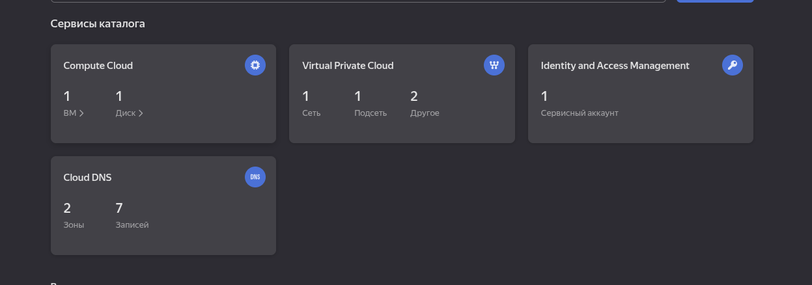
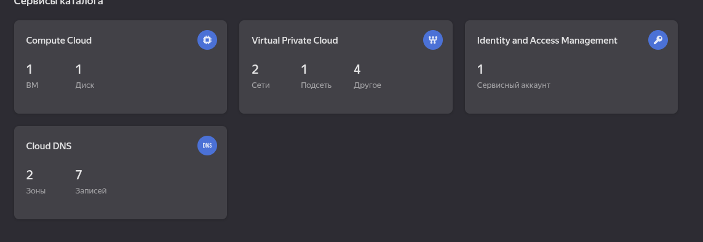
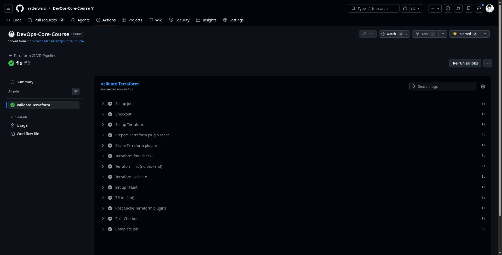

# Cloud provider seletion 

As cloud provider used Yandex Cloud service. Why this choose? Because Yandex Cloud has clearly guide for using terraform for Yandex Cloud VM.
Also it give grant for new billing account 4000 rub.


# Task 1

## Terraform setup in local machine

All setups of the terraform done by guid from the Yandex Cloud Service

Link: https://yandex.cloud/ru/docs/tutorials/infrastructure-management/terraform-quickstart

## Terraform version what used. 

As terraform version choosen 3.14 because it is avalable from AUR package in Arch linux 

Installed using command: 

```bash
yay -S terraform
```

## Added terraform files to `.gitignore`

```.gitignore
# Terraform files
*.tfstate
*.tfstate.*
*.tfvars
.terraform/
terraform.tfvars

# Sensitive files
secrets.auto.tfvars
```

## terraform.tfvars

This file in `.gitignore` but in the `terraform` directory you can found `terraform.tfvars.example` file

## `terraform plan` command output

```bash
➜  terraform git:(lab4) ✗ terraform plan
data.yandex_vpc_network.default: Reading...
yandex_compute_disk.boot-disk-1: Refreshing state... [id=fv4975a78m65hdgfp9ck]
data.yandex_vpc_network.default: Read complete after 1s [id=enpgtmn84rsa6f087a0q]
yandex_vpc_subnet.subnet-1: Refreshing state... [id=fl8kq39okktku0aaglvb]

Terraform used the selected providers to generate the following execution plan. Resource actions are indicated with the following symbols:
  + create
-/+ destroy and then create replacement

Terraform will perform the following actions:

  # yandex_compute_disk.boot-disk-1 must be replaced
-/+ resource "yandex_compute_disk" "boot-disk-1" {
      ~ created_at  = "2026-02-14T13:52:02Z" -> (known after apply)
      ~ folder_id   = "b1gv65t8e2aljrlbd9ek" -> (known after apply)
      ~ id          = "fv4975a78m65hdgfp9ck" -> (known after apply)
      - labels      = {} -> null
        name        = "boot-disk-1"
      ~ product_ids = [
          - "f2erq6hp9j4r8leept6g",
        ] -> (known after apply)
      ~ status      = "ready" -> (known after apply)
      ~ zone        = "ru-central1-d" -> "ru-central1-a" # forces replacement
        # (6 unchanged attributes hidden)

      ~ disk_placement_policy (known after apply)
      - disk_placement_policy {
            # (1 unchanged attribute hidden)
        }

      ~ hardware_generation (known after apply)
      - hardware_generation {
          - legacy_features {
              - pci_topology = "PCI_TOPOLOGY_V1" -> null
            }
        }
    }

  # yandex_compute_instance.vm-1 will be created
  + resource "yandex_compute_instance" "vm-1" {
      + created_at                = (known after apply)
      + folder_id                 = (known after apply)
      + fqdn                      = (known after apply)
      + gpu_cluster_id            = (known after apply)
      + hardware_generation       = (known after apply)
      + hostname                  = (known after apply)
      + id                        = (known after apply)
      + maintenance_grace_period  = (known after apply)
      + maintenance_policy        = (known after apply)
      + metadata                  = {
          + "ssh-keys" = <<-EOT
                ubuntu:ssh-ed25519 AAAAC3NzaC1lZDI1NTE5AAAAIAByPOk3aT5p1UzFU+KcISYZSVKofjNm0ZLC2XAqw7dX s.zaynulin@innopolis.university
            EOT
        }
      + name                      = "terraform1"
      + network_acceleration_type = "standard"
      + platform_id               = "standard-v1"
      + status                    = (known after apply)
      + zone                      = "ru-central1-a"

      + boot_disk {
          + auto_delete = true
          + device_name = (known after apply)
          + disk_id     = (known after apply)
          + mode        = (known after apply)

          + initialize_params (known after apply)
        }

      + metadata_options (known after apply)

      + network_interface {
          + index          = (known after apply)
          + ip_address     = (known after apply)
          + ipv4           = true
          + ipv6           = (known after apply)
          + ipv6_address   = (known after apply)
          + mac_address    = (known after apply)
          + nat            = true
          + nat_ip_address = (known after apply)
          + nat_ip_version = (known after apply)
          + subnet_id      = (known after apply)
        }

      + placement_policy (known after apply)

      + resources {
          + core_fraction = 100
          + cores         = 2
          + memory        = 2
        }

      + scheduling_policy (known after apply)
    }

  # yandex_vpc_subnet.subnet-1 must be replaced
-/+ resource "yandex_vpc_subnet" "subnet-1" {
      ~ created_at     = "2026-02-14T13:52:02Z" -> (known after apply)
      ~ folder_id      = "b1gv65t8e2aljrlbd9ek" -> (known after apply)
      ~ id             = "fl8kq39okktku0aaglvb" -> (known after apply)
      ~ labels         = {} -> (known after apply)
        name           = "subnet-terraform"
      ~ v6_cidr_blocks = [] -> (known after apply)
      ~ zone           = "ru-central1-d" -> "ru-central1-a" # forces replacement
        # (4 unchanged attributes hidden)
    }

Plan: 3 to add, 0 to change, 2 to destroy.

Changes to Outputs:
  + external_ip_address_vm_1 = (known after apply)
  + internal_ip_address_vm_1 = (known after apply)
╷
│ Warning: Cannot connect to YC tool initialization service. Network connectivity to the service is required for provider version control.
│ 
│ 
│   with provider["registry.terraform.io/yandex-cloud/yandex"],
│   on main.tf line 11, in provider "yandex":
│   11: provider "yandex" {
│ 
╵

───────────────────────────────────────────────────────────────────────────────────────────────────────────────────────────────────────────────────────────────────────────────

Note: You didn't use the -out option to save this plan, so Terraform can't guarantee to take exactly these actions if you run "terraform apply" now.
```

## Terraform apply output

```bash
➜  terraform git:(lab4) ✗ terraform apply
data.yandex_vpc_network.default: Reading...
yandex_compute_disk.boot-disk-1: Refreshing state... [id=fv4975a78m65hdgfp9ck]
data.yandex_vpc_network.default: Read complete after 1s [id=enpgtmn84rsa6f087a0q]
yandex_vpc_subnet.subnet-1: Refreshing state... [id=fl8kq39okktku0aaglvb]

Terraform used the selected providers to generate the following execution plan. Resource actions are indicated with the following symbols:
  + create
-/+ destroy and then create replacement

Terraform will perform the following actions:

  # yandex_compute_disk.boot-disk-1 must be replaced
-/+ resource "yandex_compute_disk" "boot-disk-1" {
      ~ created_at  = "2026-02-14T13:52:02Z" -> (known after apply)
      ~ folder_id   = "b1gv65t8e2aljrlbd9ek" -> (known after apply)
      ~ id          = "fv4975a78m65hdgfp9ck" -> (known after apply)
      - labels      = {} -> null
        name        = "boot-disk-1"
      ~ product_ids = [
          - "f2erq6hp9j4r8leept6g",
        ] -> (known after apply)
      ~ status      = "ready" -> (known after apply)
      ~ zone        = "ru-central1-d" -> "ru-central1-a" # forces replacement
        # (6 unchanged attributes hidden)

      ~ disk_placement_policy (known after apply)
      - disk_placement_policy {
            # (1 unchanged attribute hidden)
        }

      ~ hardware_generation (known after apply)
      - hardware_generation {
          - legacy_features {
              - pci_topology = "PCI_TOPOLOGY_V1" -> null
            }
        }
    }

  # yandex_compute_instance.vm-1 will be created
  + resource "yandex_compute_instance" "vm-1" {
      + created_at                = (known after apply)
      + folder_id                 = (known after apply)
      + fqdn                      = (known after apply)
      + gpu_cluster_id            = (known after apply)
      + hardware_generation       = (known after apply)
      + hostname                  = (known after apply)
      + id                        = (known after apply)
      + maintenance_grace_period  = (known after apply)
      + maintenance_policy        = (known after apply)
      + metadata                  = {
          + "ssh-keys" = <<-EOT
                ubuntu:ssh-ed25519 AAAAC3NzaC1lZDI1NTE5AAAAIAByPOk3aT5p1UzFU+KcISYZSVKofjNm0ZLC2XAqw7dX s.zaynulin@innopolis.university
            EOT
        }
      + name                      = "terraform1"
      + network_acceleration_type = "standard"
      + platform_id               = "standard-v1"
      + status                    = (known after apply)
      + zone                      = "ru-central1-a"

      + boot_disk {
          + auto_delete = true
          + device_name = (known after apply)
          + disk_id     = (known after apply)
          + mode        = (known after apply)

          + initialize_params (known after apply)
        }

      + metadata_options (known after apply)

      + network_interface {
          + index          = (known after apply)
          + ip_address     = (known after apply)
          + ipv4           = true
          + ipv6           = (known after apply)
          + ipv6_address   = (known after apply)
          + mac_address    = (known after apply)
          + nat            = true
          + nat_ip_address = (known after apply)
          + nat_ip_version = (known after apply)
          + subnet_id      = (known after apply)
        }

      + placement_policy (known after apply)

      + resources {
          + core_fraction = 100
          + cores         = 2
          + memory        = 2
        }

      + scheduling_policy (known after apply)
    }

  # yandex_vpc_subnet.subnet-1 must be replaced
-/+ resource "yandex_vpc_subnet" "subnet-1" {
      ~ created_at     = "2026-02-14T13:52:02Z" -> (known after apply)
      ~ folder_id      = "b1gv65t8e2aljrlbd9ek" -> (known after apply)
      ~ id             = "fl8kq39okktku0aaglvb" -> (known after apply)
      ~ labels         = {} -> (known after apply)
        name           = "subnet-terraform"
      ~ v6_cidr_blocks = [] -> (known after apply)
      ~ zone           = "ru-central1-d" -> "ru-central1-a" # forces replacement
        # (4 unchanged attributes hidden)
    }

Plan: 3 to add, 0 to change, 2 to destroy.

Changes to Outputs:
  + external_ip_address_vm_1 = (known after apply)
  + internal_ip_address_vm_1 = (known after apply)
╷
│ Warning: Cannot connect to YC tool initialization service. Network connectivity to the service is required for provider version control.
│ 
│ 
│   with provider["registry.terraform.io/yandex-cloud/yandex"],
│   on main.tf line 11, in provider "yandex":
│   11: provider "yandex" {
│ 
╵

Do you want to perform these actions?
  Terraform will perform the actions described above.
  Only 'yes' will be accepted to approve.

  Enter a value: yes

yandex_vpc_subnet.subnet-1: Destroying... [id=fl8kq39okktku0aaglvb]
yandex_compute_disk.boot-disk-1: Destroying... [id=fv4975a78m65hdgfp9ck]
yandex_vpc_subnet.subnet-1: Destruction complete after 1s
yandex_vpc_subnet.subnet-1: Creating...
yandex_vpc_subnet.subnet-1: Creation complete after 0s [id=e9b33qjag13gak3luifr]
yandex_compute_disk.boot-disk-1: Destruction complete after 6s
yandex_compute_disk.boot-disk-1: Creating...
yandex_compute_disk.boot-disk-1: Creation complete after 8s [id=fhm304muqn8491urb9n2]
yandex_compute_instance.vm-1: Creating...
yandex_compute_instance.vm-1: Still creating... [00m10s elapsed]
yandex_compute_instance.vm-1: Still creating... [00m20s elapsed]
yandex_compute_instance.vm-1: Still creating... [00m30s elapsed]
yandex_compute_instance.vm-1: Creation complete after 31s [id=fhm7dkjmnuqj3v57f8vi]
╷
│ Warning: Cannot connect to YC tool initialization service. Network connectivity to the service is required for provider version control.
│ 
│ 
│   with provider["registry.terraform.io/yandex-cloud/yandex"],
│   on main.tf line 11, in provider "yandex":
│   11: provider "yandex" {
│ 
╵

Apply complete! Resources: 3 added, 0 changed, 2 destroyed.

Outputs:

external_ip_address_vm_1 = "51.250.8.110"
internal_ip_address_vm_1 = "192.168.10.7"
➜  terraform git:(lab4) ✗ 
```

## Result in yandex cloud 



## ssh connection command

In output of terraform apply added this to parametr to see internal and external IP addresses

```bash
external_ip_address_vm_1 = "51.250.8.110"
internal_ip_address_vm_1 = "192.168.10.7"
```

In the procees of creating VM using we use public ssh key what created in the system.

```tf
  metadata = {
    ssh-keys = "ubuntu:${file("~/.ssh/id_ed25519.pub")}"
  }
```

So for connecting to the server we just need use this command

```bash
ssh -i ~/.ssh/id_ed25519 ubuntu@51.250.8.110
```

# Task 2

## `terraform destroy` output

```bash
➜  terraform git:(lab4) ✗ terraform destroy
data.yandex_vpc_network.default: Reading...
yandex_compute_disk.boot-disk-1: Refreshing state... [id=fhm304muqn8491urb9n2]
data.yandex_vpc_network.default: Read complete after 1s [id=enpgtmn84rsa6f087a0q]
yandex_vpc_subnet.subnet-1: Refreshing state... [id=e9b33qjag13gak3luifr]
yandex_compute_instance.vm-1: Refreshing state... [id=fhm7dkjmnuqj3v57f8vi]

Terraform used the selected providers to generate the following execution plan. Resource actions are indicated with the following symbols:
  - destroy

Terraform will perform the following actions:

  # yandex_compute_disk.boot-disk-1 will be destroyed
  - resource "yandex_compute_disk" "boot-disk-1" {
      - block_size  = 4096 -> null
      - created_at  = "2026-02-14T13:56:12Z" -> null
      - folder_id   = "b1gv65t8e2aljrlbd9ek" -> null
      - id          = "fhm304muqn8491urb9n2" -> null
      - image_id    = "fd800c7s2p483i648ifv" -> null
      - labels      = {} -> null
      - name        = "boot-disk-1" -> null
      - product_ids = [
          - "f2erq6hp9j4r8leept6g",
        ] -> null
      - size        = 20 -> null
      - status      = "ready" -> null
      - type        = "network-hdd" -> null
      - zone        = "ru-central1-a" -> null
        # (2 unchanged attributes hidden)

      - disk_placement_policy {
            # (1 unchanged attribute hidden)
        }

      - hardware_generation {
          - legacy_features {
              - pci_topology = "PCI_TOPOLOGY_V1" -> null
            }
        }
    }

  # yandex_compute_instance.vm-1 will be destroyed
  - resource "yandex_compute_instance" "vm-1" {
      - created_at                = "2026-02-14T13:56:20Z" -> null
      - folder_id                 = "b1gv65t8e2aljrlbd9ek" -> null
      - fqdn                      = "fhm7dkjmnuqj3v57f8vi.auto.internal" -> null
      - hardware_generation       = [
          - {
              - generation2_features = []
              - legacy_features      = [
                  - {
                      - pci_topology = "PCI_TOPOLOGY_V1"
                    },
                ]
            },
        ] -> null
      - id                        = "fhm7dkjmnuqj3v57f8vi" -> null
      - labels                    = {} -> null
      - metadata                  = {
          - "ssh-keys" = <<-EOT
                ubuntu:ssh-ed25519 AAAAC3NzaC1lZDI1NTE5AAAAIAByPOk3aT5p1UzFU+KcISYZSVKofjNm0ZLC2XAqw7dX s.zaynulin@innopolis.university
            EOT
        } -> null
      - name                      = "terraform1" -> null
      - network_acceleration_type = "standard" -> null
      - platform_id               = "standard-v1" -> null
      - status                    = "running" -> null
      - zone                      = "ru-central1-a" -> null
        # (5 unchanged attributes hidden)

      - boot_disk {
          - auto_delete = true -> null
          - device_name = "fhm304muqn8491urb9n2" -> null
          - disk_id     = "fhm304muqn8491urb9n2" -> null
          - mode        = "READ_WRITE" -> null

          - initialize_params {
              - block_size  = 4096 -> null
              - image_id    = "fd800c7s2p483i648ifv" -> null
              - name        = "boot-disk-1" -> null
              - size        = 20 -> null
              - type        = "network-hdd" -> null
                # (3 unchanged attributes hidden)
            }
        }

      - metadata_options {
          - aws_v1_http_endpoint = 1 -> null
          - aws_v1_http_token    = 2 -> null
          - gce_http_endpoint    = 1 -> null
          - gce_http_token       = 1 -> null
        }

      - network_interface {
          - index              = 0 -> null
          - ip_address         = "192.168.10.7" -> null
          - ipv4               = true -> null
          - ipv6               = false -> null
          - mac_address        = "d0:0d:76:d2:76:bf" -> null
          - nat                = true -> null
          - nat_ip_address     = "51.250.8.110" -> null
          - nat_ip_version     = "IPV4" -> null
          - security_group_ids = [] -> null
          - subnet_id          = "e9b33qjag13gak3luifr" -> null
            # (1 unchanged attribute hidden)
        }

      - placement_policy {
          - host_affinity_rules       = [] -> null
          - placement_group_partition = 0 -> null
            # (1 unchanged attribute hidden)
        }

      - resources {
          - core_fraction = 100 -> null
          - cores         = 2 -> null
          - gpus          = 0 -> null
          - memory        = 2 -> null
        }

      - scheduling_policy {
          - preemptible = false -> null
        }
    }

  # yandex_vpc_subnet.subnet-1 will be destroyed
  - resource "yandex_vpc_subnet" "subnet-1" {
      - created_at     = "2026-02-14T13:56:06Z" -> null
      - folder_id      = "b1gv65t8e2aljrlbd9ek" -> null
      - id             = "e9b33qjag13gak3luifr" -> null
      - labels         = {} -> null
      - name           = "subnet-terraform" -> null
      - network_id     = "enpgtmn84rsa6f087a0q" -> null
      - v4_cidr_blocks = [
          - "192.168.10.0/24",
        ] -> null
      - v6_cidr_blocks = [] -> null
      - zone           = "ru-central1-a" -> null
        # (2 unchanged attributes hidden)
    }

Plan: 0 to add, 0 to change, 3 to destroy.

Changes to Outputs:
  - external_ip_address_vm_1 = "51.250.8.110" -> null
  - internal_ip_address_vm_1 = "192.168.10.7" -> null
╷
│ Warning: Cannot connect to YC tool initialization service. Network connectivity to the service is required for provider version control.
│ 
│ 
│   with provider["registry.terraform.io/yandex-cloud/yandex"],
│   on main.tf line 11, in provider "yandex":
│   11: provider "yandex" {
│ 
╵

Do you really want to destroy all resources?
  Terraform will destroy all your managed infrastructure, as shown above.
  There is no undo. Only 'yes' will be accepted to confirm.

  Enter a value: yes

yandex_compute_instance.vm-1: Destroying... [id=fhm7dkjmnuqj3v57f8vi]
yandex_compute_instance.vm-1: Still destroying... [id=fhm7dkjmnuqj3v57f8vi, 00m10s elapsed]
yandex_compute_instance.vm-1: Still destroying... [id=fhm7dkjmnuqj3v57f8vi, 00m20s elapsed]
yandex_compute_instance.vm-1: Still destroying... [id=fhm7dkjmnuqj3v57f8vi, 00m30s elapsed]
yandex_compute_instance.vm-1: Destruction complete after 33s
yandex_vpc_subnet.subnet-1: Destroying... [id=e9b33qjag13gak3luifr]
yandex_compute_disk.boot-disk-1: Destroying... [id=fhm304muqn8491urb9n2]
yandex_compute_disk.boot-disk-1: Destruction complete after 0s
yandex_vpc_subnet.subnet-1: Destruction complete after 6s
╷
│ Warning: Cannot connect to YC tool initialization service. Network connectivity to the service is required for provider version control.
│ 
│ 
│   with provider["registry.terraform.io/yandex-cloud/yandex"],
│   on main.tf line 11, in provider "yandex":
│   11: provider "yandex" {
│ 
╵

Destroy complete! Resources: 3 destroyed.
```

## Language for pulumi

For pulumi in tasks will choosen `python`. Because it more easy to use.

## Pulumi project initialization 

To init pulumi project use this command:

```bash
 pulumi new python --name vm-infrastructure --description "yandex-cloud-vm" --stack dev
```

As libs version control system will be choosen `poetry`

## Pulumi configuration setup

For setup pulumi configs will be used this commands: 

```bash
poetry run pulumi config set yandex:token "ваш_oauth_токен_или_iam"
poetry run pulumi config set yandex:cloud-id "ваш_cloud_id"
poetry run pulumi config set yandex:folder-id "ваш_folder_id"
poetry run pulumi config set yandex:zone "ru-central1-a"
```

## `pulumi preview` command output

```bash
(venv) ➜  pulumi git:(lab4) ✗ pulumi preview
Previewing update (dev)

View in Browser (Ctrl+O): https://app.pulumi.com/setterwars-org/yc-infra/dev/previews/63ed8df9-f76b-42e8-920a-1f6f11045a43

     Type                                  Name          Plan       
 +   pulumi:pulumi:Stack                   yc-infra-dev  create     
 +   ├─ yandex:index:VpcNetwork            main-network  create     
 +   ├─ yandex:index:VpcSubnet             main-subnet   create     
 +   ├─ yandex:index:VpcSecurityGroup      web-sg        create     
 +   ├─ yandex:index:VpcSecurityGroupRule  http-rule     create     
 +   ├─ yandex:index:VpcSecurityGroupRule  egress-rule   create     
 +   ├─ yandex:index:ComputeInstance       web-server    create     
 +   └─ yandex:index:VpcSecurityGroupRule  ssh-rule      create     

Outputs:
    instance_id: [unknown]
    public_ip  : [unknown]

Resources:
    + 8 to create

(venv) ➜  pulumi git:(lab4) ✗ 
```

## `pulumi up` command output

```bash
  (venv) ➜  pulumi git:(lab4) ✗ pulumi up
Previewing update (dev)

View in Browser (Ctrl+O): https://app.pulumi.com/setterwars-org/yc-infra/dev/previews/79cbccc7-1978-40cc-bdb7-47712a2b489f

     Type                                  Name          Plan       
 +   pulumi:pulumi:Stack                   yc-infra-dev  create     
 +   ├─ yandex:index:VpcNetwork            main-network  create     
 +   ├─ yandex:index:VpcSubnet             main-subnet   create     
 +   ├─ yandex:index:VpcSecurityGroup      web-sg        create     
 +   ├─ yandex:index:VpcSecurityGroupRule  ssh-rule      create     
 +   ├─ yandex:index:VpcSecurityGroupRule  http-rule     create     
 +   ├─ yandex:index:ComputeInstance       web-server    create     
 +   └─ yandex:index:VpcSecurityGroupRule  egress-rule   create     

Outputs:
    instance_id: [unknown]
    public_ip  : [unknown]

Resources:
    + 8 to create

Do you want to perform this update? yes
Updating (dev)

View in Browser (Ctrl+O): https://app.pulumi.com/setterwars-org/yc-infra/dev/updates/1

     Type                                  Name          Status              
 +   pulumi:pulumi:Stack                   yc-infra-dev  created (52s)       
 +   ├─ yandex:index:VpcNetwork            main-network  created (5s)        
 +   ├─ yandex:index:VpcSubnet             main-subnet   created (0.94s)     
 +   ├─ yandex:index:VpcSecurityGroup      web-sg        created (3s)        
 +   ├─ yandex:index:VpcSecurityGroupRule  ssh-rule      created (1s)        
 +   ├─ yandex:index:VpcSecurityGroupRule  http-rule     created (1s)        
 +   ├─ yandex:index:ComputeInstance       web-server    created (41s)       
 +   └─ yandex:index:VpcSecurityGroupRule  egress-rule   created (2s)        

Outputs:
    instance_id: "fhm3ectribap57rejbap"
    public_ip  : "51.250.95.39"

Resources:
    + 8 created

Duration: 54s

(venv) ➜  pulumi git:(lab4) ✗ 
```

## Result from yandex cloud



## Public IP
In `__main__.py`  you can see this rows: 

```python
pulumi.export("public_ip", instance.network_interfaces[0].nat_ip_address)
pulumi.export("instance_id", instance.id)
```

This row after completing will return to you public IP and instance id for your needs.

Output in solution:

```bash
Outputs:
  - instance_id: "fhm3ectribap57rejbap"
  - public_ip  : "51.250.95.39"
```

## Command for connection to VM

```bash
ssh -i id_ed25519.pub ubuntu@51.250.95.39
```

## `pulumi destroy` command output

```bash
(venv) ➜  pulumi git:(lab4) ✗ pulumi destroy
Previewing destroy (dev)

View in Browser (Ctrl+O): https://app.pulumi.com/setterwars-org/yc-infra/dev/previews/238d5ff4-0c1b-49dc-ac79-3a90bc8fd945

     Type                                  Name          Plan       
 -   pulumi:pulumi:Stack                   yc-infra-dev  delete     
 -   ├─ yandex:index:VpcSecurityGroupRule  ssh-rule      delete     
 -   ├─ yandex:index:VpcSecurityGroupRule  egress-rule   delete     
 -   ├─ yandex:index:VpcSecurityGroupRule  http-rule     delete     
 -   ├─ yandex:index:VpcSubnet             main-subnet   delete     
 -   ├─ yandex:index:VpcNetwork            main-network  delete     
 -   ├─ yandex:index:ComputeInstance       web-server    delete     
 -   └─ yandex:index:VpcSecurityGroup      web-sg        delete     

Outputs:
  - instance_id: "fhm3ectribap57rejbap"
  - public_ip  : "51.250.95.39"

Resources:
    - 8 to delete

Do you want to perform this destroy? yes
Destroying (dev)

View in Browser (Ctrl+O): https://app.pulumi.com/setterwars-org/yc-infra/dev/updates/2

     Type                                  Name          Status              
 -   pulumi:pulumi:Stack                   yc-infra-dev  deleted (0.25s)     
 -   ├─ yandex:index:VpcSecurityGroupRule  egress-rule   deleted (2s)        
 -   ├─ yandex:index:VpcSecurityGroupRule  ssh-rule      deleted (3s)        
 -   ├─ yandex:index:VpcSecurityGroupRule  http-rule     deleted (4s)        
 -   ├─ yandex:index:ComputeInstance       web-server    deleted (34s)       
 -   ├─ yandex:index:VpcSecurityGroup      web-sg        deleted (0.91s)     
 -   ├─ yandex:index:VpcSubnet             main-subnet   deleted (2s)        
 -   └─ yandex:index:VpcNetwork            main-network  deleted (1s)        

Outputs:
  - instance_id: "fhm3ectribap57rejbap"
  - public_ip  : "51.250.95.39"

Resources:
    - 8 deleted

Duration: 41s

The resources in the stack have been deleted, but the history and configuration associated with the stack are still maintained. 
If you want to remove the stack completely, run `pulumi stack rm dev`.
(venv) ➜  pulumi git:(lab4) 
```

## Terraform vs Pulumi 

For me terraform be more easier, because then I work with pulumi I have some problems. For example yandex cloud provider does not work clearly with python 3.14 so I need to down grade to python 3.11. In terraform I just install it using aur packages and it work from package. 

# Lab 5 preparation 

For lab 5 I will keep my VM, created from the terraform. But for now I stoped it because Deposit in yandex cloud not endless. 

# Bonus task

## Created `terraform-ci.yml`

In this task will be created ci/cd pipeline for terraform files. Created linters, fmt and validate for correctness of the 
`main.tf`

## Screenshot of the completed CI/CD pipeline

