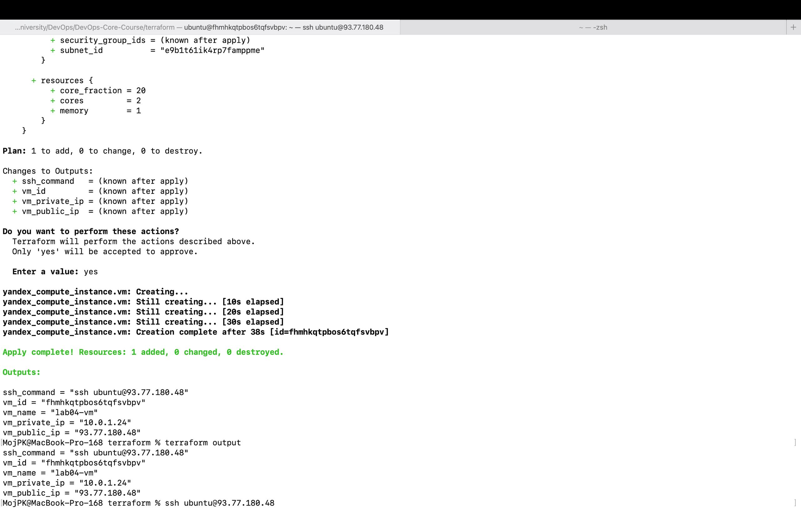
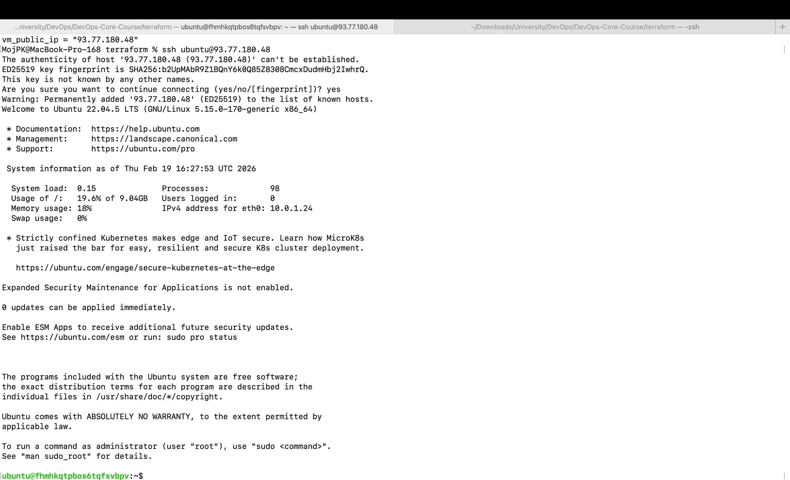
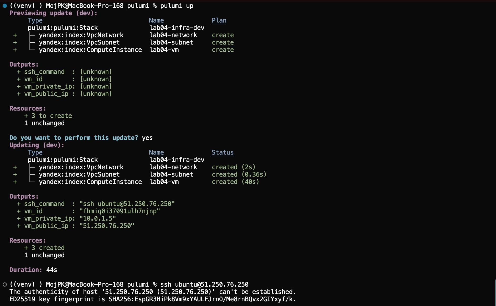
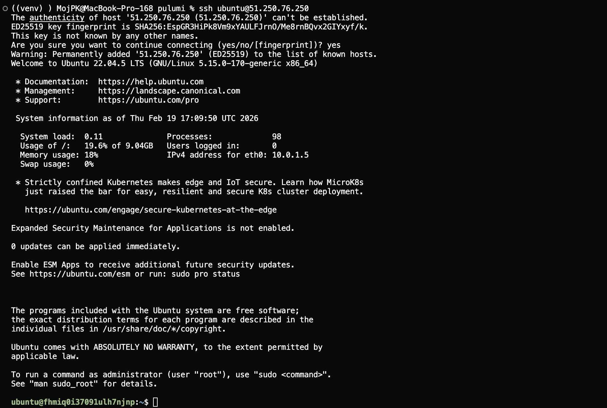

# Lab 4 — Infrastructure as Code (Terraform & Pulumi)

## 1. Cloud Provider & Infrastructure

**Cloud Provider:** Yandex Cloud  
**Folder:** `default` (`b1g742cqbcqhgvgl8qne`)  
**Zone:** `ru-central1-a`  
**Cloud ID:** `b1g00co0b00cu998pr7c`

**Instance Type:** `standard-v2` platform, 2 vCPU cores (20% core fraction), 1 GB RAM, 10 GB HDD boot disk. This configuration fits within Yandex Cloud free tier limits.

**Network Configuration:**
- VPC network: `lab04-network`
- Subnet: `lab04-subnet` (`10.0.1.0/24`)
- Security group: `lab04-security-group` with rules for ports 22 (SSH from my IP), 80 (HTTP), and 5000 (custom app port)

**VM Details:**
- Public IP: `93.77.180.48`
- Private IP: `10.0.1.24`
- OS: Ubuntu 22.04 LTS
- SSH access: `ubuntu` user via public key authentication

**Cost:** Free tier eligible. Expected cost is approximately 0 ₽ with proper resource management and cleanup after the lab.

**Resources Created:**
- 1 VPC network (`yandex_vpc_network.network`)
- 1 subnet (`yandex_vpc_subnet.subnet`)
- 1 security group (`yandex_vpc_security_group.sg`)
- 1 compute instance (`yandex_compute_instance.vm`)

## 2. Terraform Implementation

**Terraform Version:** `v1.5.7` (installed via Homebrew)

**Project Structure:**
```
terraform/
├── providers.tf      # Provider configuration
├── variables.tf      # Input variables
├── main.tf           # Resource definitions
├── outputs.tf        # Output values
├── terraform.tfvars  # Variable values (gitignored)
└── .gitignore        # Excludes state files and secrets
```

**Key Configuration Decisions:**
- Provider `yandex-cloud/yandex` v0.100.0 installed manually due to registry access issues
- Cloud values defined as variables
- VM image retrieved using `data "yandex_compute_image"` with family `ubuntu-2204-lts`
- Security group with ingress rules for ports 22, 80, 5000
- VM with public IP and SSH key via metadata

**Challenges Encountered:**

1. **Terraform Registry Access:** Provider downloaded manually from GitHub releases due to registry access issues.

2. **IAM Permissions:** Required roles assigned but VM creation failed until billing account was linked.

3. **Billing Account:** Billing account must be linked to folder before creating compute instances.

4. **VPC Network Quota:** Hit quota limit, resolved by deleting test networks.

5. **Token Expiration:** `YC_TOKEN` expires, regenerated before each apply.

**Terminal Output:**

**terraform init:**
```
Initializing provider plugins...
- Finding yandex-cloud/yandex versions matching "~> 0.100"...
- Installing yandex-cloud/yandex v0.100.0...
- Installed yandex-cloud/yandex v0.100.0 (unauthenticated)

Terraform has been successfully initialized!
```

**terraform plan (excerpt):**
```
Plan: 4 to add, 0 to change, 0 to destroy.

Changes to Outputs:
  + ssh_command   = (known after apply)
  + vm_id         = (known after apply)
  + vm_name       = "lab04-vm"
  + vm_private_ip = (known after apply)
  + vm_public_ip  = (known after apply)
```

**terraform apply (final output):**
```
yandex_vpc_network.network: Creating...
yandex_vpc_network.network: Creation complete after 2s [id=enpou2t340o694hj7r90]
yandex_vpc_subnet.subnet: Creating...
yandex_vpc_subnet.subnet: Creation complete after 0s [id=e9b1t61ik4rp7famppme]
yandex_vpc_security_group.sg: Creating...
yandex_vpc_security_group.sg: Creation complete after 1s [id=enp...]
yandex_compute_instance.vm: Creating...
yandex_compute_instance.vm: Still creating... [10s elapsed]
yandex_compute_instance.vm: Still creating... [20s elapsed]
yandex_compute_instance.vm: Still creating... [30s elapsed]
yandex_compute_instance.vm: Creation complete after 38s [id=fhmhkqtpbos6tqfsvbpv]

Apply complete! Resources: 4 added, 0 changed, 0 destroyed.

Outputs:

ssh_command = "ssh ubuntu@93.77.180.48"
vm_id = "fhmhkqtpbos6tqfsvbpv"
vm_name = "lab04-vm"
vm_private_ip = "10.0.1.24"
vm_public_ip = "93.77.180.48"
```



**SSH Connection:**
```bash
$ ssh ubuntu@93.77.180.48
Welcome to Ubuntu 22.04.5 LTS (GNU/Linux 5.15.0-170-generic x86_64)
...
ubuntu@fhmhkqtpbos6tqfsvbpv:~$
```



SSH connection successful. VM is accessible and operational.

## 3. Pulumi Implementation

**Pulumi Version:** `v3.222.0`  
**Language:** Python 3.12

**Terraform Cleanup:** Before creating Pulumi infrastructure, Terraform resources were destroyed using `terraform destroy` to ensure a clean state and demonstrate infrastructure lifecycle management.

**Project Structure:**
```
pulumi/
├── Pulumi.yaml          # Project metadata
├── __main__.py          # Infrastructure code
├── requirements.txt     # Python dependencies
├── Pulumi.dev.yaml      # Stack configuration (gitignored)
└── venv/                # Python virtual environment
```

**Key Configuration Decisions:**
- Provider `pulumi-yandex` v0.13.0
- Configuration via Pulumi config instead of `.tfvars`
- Same infrastructure: VPC network, subnet, VM
- VM image via `yandex.get_compute_image()` with family `ubuntu-2204-lts`
- Resources linked via Pulumi Outputs

**Code Differences from Terraform:**
- Python code instead of HCL
- `Config()` object instead of variables
- Function calls instead of resource blocks
- `pulumi.export()` instead of output blocks

**Challenges Encountered:**

1. **Python Version:** Python 3.13 incompatible with `pulumi-yandex` (missing `pkg_resources`). Used Python 3.12 with `setuptools<70.0.0`.

2. **Security Group API:** `VpcSecurityGroup` API mismatch - couldn't configure ingress/egress rules. Used default security group instead.

3. **Folder ID:** Required explicit `folder_id` in all resources.

4. **Image Lookup:** `get_compute_image()` works without `folder_id` parameter.

**Terminal Output:**

**pulumi preview:**
```
Previewing update (dev):
     Type                             Name             Plan       
 +   pulumi:pulumi:Stack              lab04-infra-dev  create     
 +   ├─ yandex:index:VpcNetwork       lab04-network    create     
 +   ├─ yandex:index:VpcSubnet        lab04-subnet     create     
 +   └─ yandex:index:ComputeInstance  lab04-vm         create     

Resources:
    + 4 to create
```

**pulumi up:**
```
Updating (dev):
     Type                             Name             Status              
     pulumi:pulumi:Stack              lab04-infra-dev                      
 +   ├─ yandex:index:VpcNetwork       lab04-network    created (2s)        
 +   ├─ yandex:index:VpcSubnet        lab04-subnet     created (0.36s)     
 +   └─ yandex:index:ComputeInstance  lab04-vm         created (40s)       

Outputs:
  + ssh_command  : "ssh ubuntu@51.250.76.250"
  + vm_id        : "fhmiq0i37091ulh7njnp"
  + vm_private_ip: "10.0.1.5"
  + vm_public_ip : "51.250.76.250"

Resources:
    + 3 created
    1 unchanged

Duration: 44s
```



**SSH Connection:**
```bash
$ ssh ubuntu@51.250.76.250
Welcome to Ubuntu 22.04.5 LTS (GNU/Linux 5.15.0-170-generic x86_64)
...
ubuntu@fhmiq0i37091ulh7njnp:~$
```



SSH connection successful. VM is accessible and operational.

## 4. Terraform vs Pulumi Comparison

**Ease of Learning:** Terraform's HCL is simpler for infrastructure. Pulumi requires Python knowledge and understanding of Output types.

**Code Readability:** HCL is purpose-built and clear. Pulumi reads like Python but can be verbose for simple resources.

**Debugging:** Terraform errors are clearer. Pulumi allows Python debugger but errors can be harder to trace.

**Documentation:** Terraform has more examples and better Yandex Cloud support. Pulumi documentation is less comprehensive.

**Use Case:** Terraform for simplicity and wide support. Pulumi for complex logic, code reuse, or Python-focused teams.

## 5. Lab 5 Preparation & Cleanup

**VM for Lab 5:**
- **Status:** Keeping Pulumi-created VM for Lab 5
- **VM Details:**
  - Public IP: `51.250.76.250`
  - Private IP: `10.0.1.5`
  - VM ID: `fhmiq0i37091ulh7njnp`
  - Created with: Pulumi
  - SSH: `ssh ubuntu@51.250.76.250`

**Cleanup Status:**
- Terraform infrastructure was destroyed before creating Pulumi infrastructure
- Pulumi VM is kept running for Lab 5 (Ansible)
- After Lab 5 completion, will run `pulumi destroy` to clean up resources
