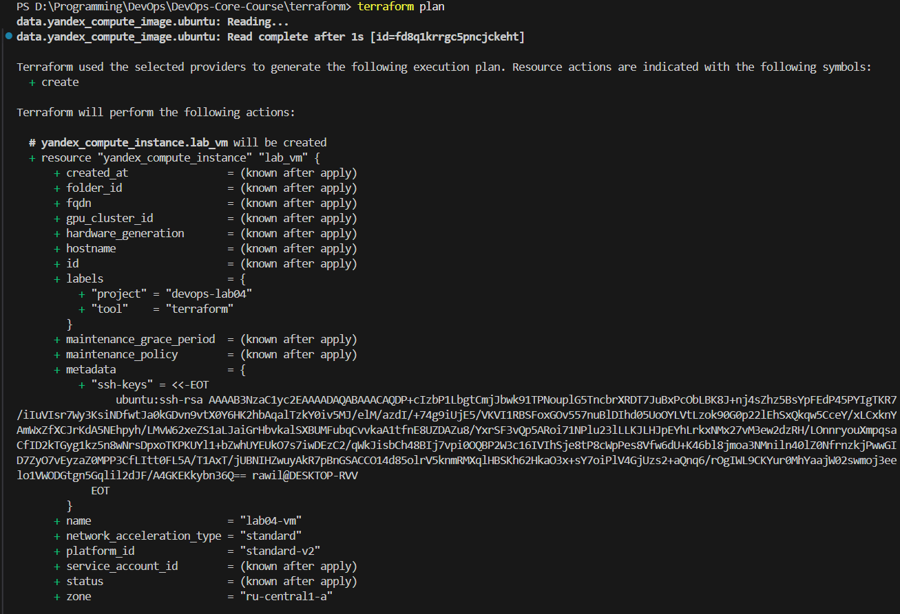
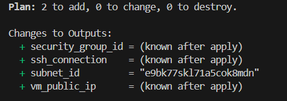
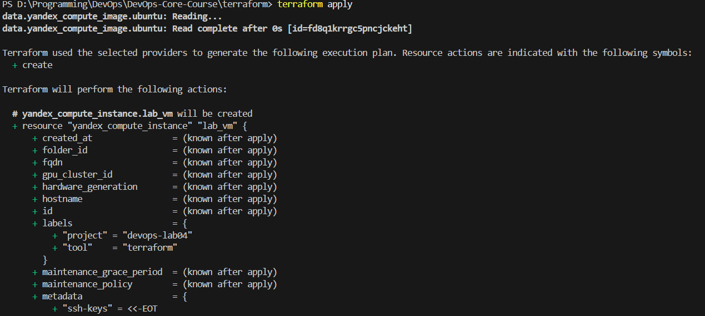
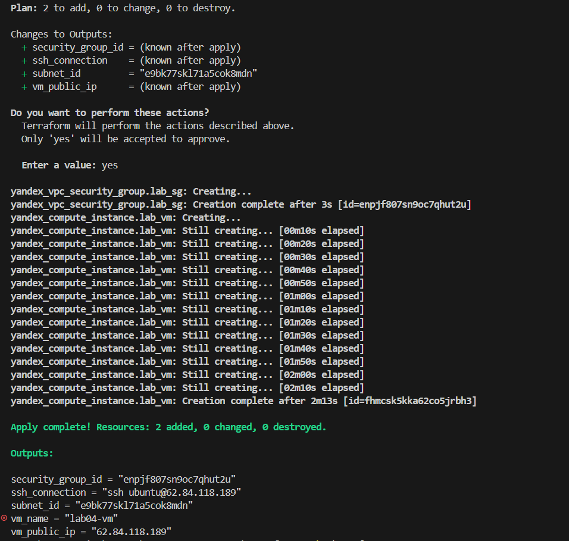
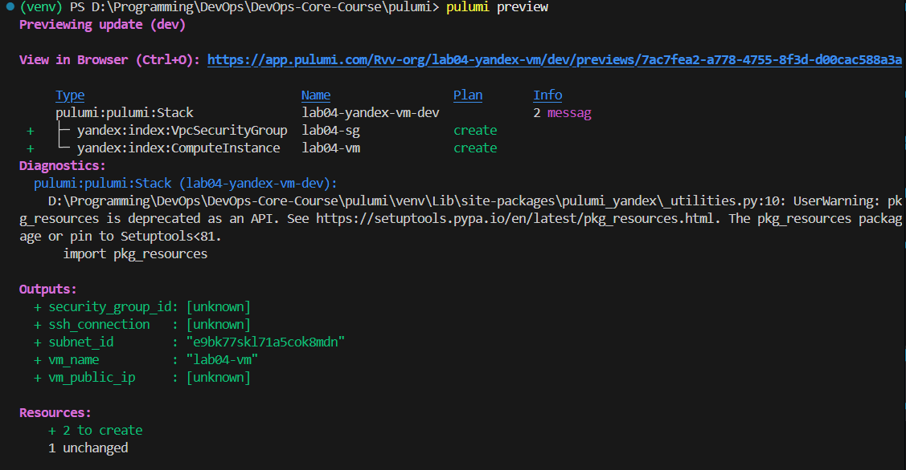
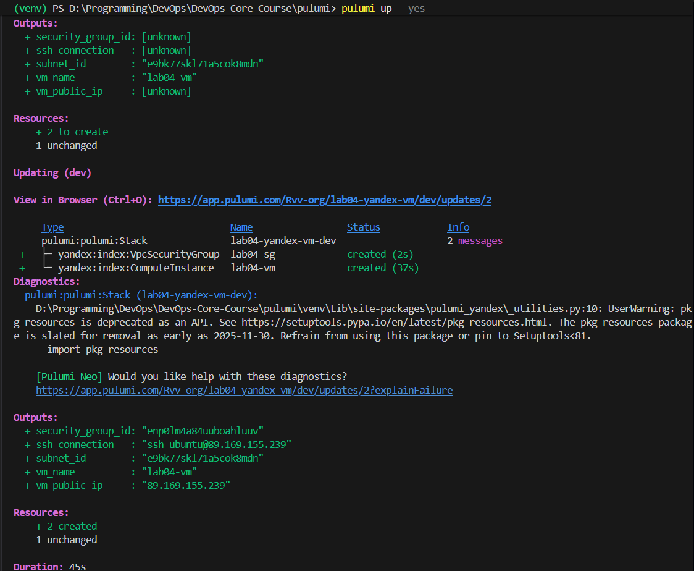
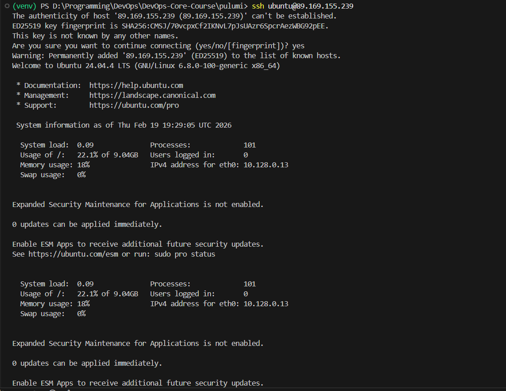

# Lab 4 — Infrastructure as Code (Terraform & Pulumi)

## 1. Cloud Provider & Infrastructure

| Item | Value |
|------|-------|
| **Provider** | Yandex Cloud |
| **Rationale** | Free tier available, accessible in Russia, native Terraform & Pulumi providers |
| **Instance type** | standard-v2, 2 cores @ 20% vCPU, 1 GB RAM |
| **Region / Zone** | ru-central1-a |
| **OS** | Ubuntu 24.04 LTS |
| **Disk** | 10 GB network-hdd |
| **Cost** | $0 (free tier) |

### Resources Created

| # | Resource | Status |
|---|----------|--------|
| 1 | VPC Network | Reused existing (`enpso9of1c1kteko8232`) |
| 2 | VPC Subnet | Reused existing (`e9bk77skl71a5cok8mdn`) |
| 3 | Security Group | Created (`lab04-sg`) |
| 4 | Compute Instance | Created (`lab04-vm`) |
| 5 | Public IP | Auto-assigned via NAT |

---

## 2. Terraform Implementation

**Terraform version:** 1.9.8+

### Project Structure

```
terraform/
├── .gitignore              # Ignore state, credentials
├── main.tf                 # Provider + all resources
├── variables.tf            # Input variables
├── outputs.tf              # Output values (IP, SSH cmd)
├── terraform.tfvars.example# Template for variable values
└── README.md               # Quick start guide
```

### Key Configuration Decisions

- **Single `main.tf`** — project is small; splitting into multiple files would over-complicate things.
- **Variables for all credentials** — `yc_token`, `yc_cloud_id`, `yc_folder_id` are never hard-coded.
- **Data source for AMI** — `yandex_compute_image.ubuntu` fetches the latest Ubuntu 24.04 image automatically.
- **Security group** — only ports 22, 80, and 5000 are open inbound; all outbound is allowed.
- **Labels** — each resource is tagged with `project = devops-lab04` for easy identification.

### Terminal Output

<details>
<summary>terraform init</summary>

```
$ terraform init

Initializing the backend...
Initializing provider plugins...
- Finding yandex-cloud/yandex versions matching "~> 0.133.0"...
- Installing yandex-cloud/yandex v0.133.0...
- Installed yandex-cloud/yandex v0.133.0

Terraform has been successfully initialized!
```

</details>

<details>
<summary>terraform plan</summary>



</details>

<details>
<summary>terraform apply</summary>



</details>

### Challenges

- Yandex Cloud requires `core_fraction = 20` for free-tier instances — not obvious from the docs at first.
- Security group rules use `port` (single port) instead of `from_port`/`to_port` (range).
- Due to VPC network quota limits, the Terraform configuration reused an existing network/subnet (`existing_network_id` and `existing_subnet_id`), so the final plan showed `2 to add` (security group + VM) instead of `4 to add`.

### Result (Terraform)

- `vm_public_ip`: `62.84.118.189`
- `ssh_connection`: `ssh ubuntu@62.84.118.189`

---

## 3. Pulumi Implementation

**Pulumi version:** 3.x  
**Language:** Python

### Project Structure

```
pulumi/
├── .gitignore          # Ignore venv, stack configs
├── __main__.py         # All infrastructure code
├── Pulumi.yaml         # Project metadata
├── requirements.txt    # Python dependencies
└── README.md           # Quick start guide
```

### How Code Differs from Terraform

| Aspect | Terraform (HCL) | Pulumi (Python) |
|--------|-----------------|-----------------|
| Language | Declarative HCL | Imperative Python |
| Resource definition | `resource "type" "name" { }` | `Type("name", Args(...))` |
| Variables | `var.name` in tfvars | `config.get("name")` or regular Python vars |
| Outputs | `output "name" { value = ... }` | `pulumi.export("name", value)` |
| Data sources | `data "type" "name" { }` | `get_type(...)` function call |
| State | Local `.tfstate` file | Pulumi Cloud (free tier) |
| String interpolation | `"${var.x}"` | f-strings `f"{var}"` |

### Terminal Output

<details>
<summary>pulumi preview</summary>

</details>

<details>
<summary>pulumi up</summary>


</details>

<details>
<summary>SSH connection proof</summary>

</details>

### Advantages Discovered

- **IDE support**: Full Python autocompletion, type hints, and inline documentation.
- **Readability**: For someone who knows Python, the code is immediately understandable.
- **Flexibility**: Could easily add loops, helper functions, conditionals with native Python.
- **Secret management**: `pulumi config set --secret` encrypts values automatically.

### Challenges

- Pulumi Yandex provider has less documentation than the Terraform one.
- Needed to figure out the exact arg class names (`VpcSecurityGroupIngressArgs`, etc.).
- Pulumi Cloud account required for state management (free tier is sufficient).

---

## 4. Terraform vs Pulumi Comparison

### Ease of Learning

Terraform was slightly easier to learn for this specific task because Yandex Cloud's official documentation provides Terraform examples everywhere. HCL syntax is simple and focused: you declare resources and that's it. Pulumi requires understanding both the cloud provider concepts AND the SDK mapping to Python, which adds a layer of indirection.

### Code Readability

For someone familiar with Python, Pulumi code reads more naturally — it's just function calls with keyword arguments. However, Terraform's HCL is purpose-built for infrastructure, so even non-programmers can understand the `.tf` files quickly. For this small project, both are equally readable.

### Debugging

Terraform was easier to debug because `terraform plan` output is very detailed and shows exactly what will change. Error messages reference HCL line numbers directly. Pulumi errors sometimes come from the Python SDK layer and can be harder to trace back. However, Pulumi's advantage is that you can use standard Python debugging tools (print, breakpoints).

### Documentation

Terraform has significantly better documentation for Yandex Cloud — the provider registry page has complete examples for every resource. Pulumi's Yandex provider docs exist but are auto-generated and less polished. For AWS or GCP the gap is smaller.

### Use Case

**Use Terraform when:** the team includes non-developers (ops engineers), you want a simple declarative approach, or the cloud provider has great Terraform docs. **Use Pulumi when:** you need complex logic (dynamic resource generation, conditional infrastructure), the team is comfortable with programming, or you want to share code between application and infrastructure.

---

## 5. Lab 5 Preparation & Cleanup

### VM for Lab 5

| Question | Answer |
|----------|--------|
| Keeping VM for Lab 5? | Yes |
| Which VM? | Pulumi-created VM |
| Public IP | `89.169.155.239` |
| SSH command | `ssh ubuntu@89.169.155.239` |

### Cleanup Status

- **Terraform resources**: Destroyed with `terraform destroy` before Pulumi deployment.
- **Pulumi resources**: Deployed successfully (security group + VM; existing subnet reused).
- Current state: one active VM is kept for Lab 5.

> **Note:** After Lab 5 is complete, run `pulumi destroy` to clean up all resources.

---

## Bonus: IaC CI/CD

### GitHub Actions Workflow

Created `.github/workflows/terraform-ci.yml` that triggers on changes to `terraform/**` files:

| Step | Command | Purpose |
|------|---------|---------|
| 1 | `terraform fmt -check -diff` | Enforce canonical formatting |
| 2 | `terraform init -backend=false` | Initialize without state backend |
| 3 | `terraform validate` | Check syntax and configuration |
| 4 | `tflint --init` + `tflint` | Lint for best practices and errors |

Path filters ensure the workflow only runs when Terraform files change — not on Python or Go code changes.

---

## Bonus: GitHub Repository Import

### Import Process

1. Created `terraform/github/main.tf` with the `github_repository` resource definition.
2. Ran `terraform import github_repository.course_repo DevOps-Core-Course`.
3. Ran `terraform plan` to verify state matches reality.
4. Adjusted resource attributes until `terraform plan` showed no changes.

<details>
<summary>Import terminal output</summary>

```
$ cd terraform/github
$ terraform init
$ terraform import github_repository.course_repo DevOps-Core-Course

github_repository.course_repo: Importing from ID "DevOps-Core-Course"...
github_repository.course_repo: Import prepared!
github_repository.course_repo: Refreshing state...

Import successful!

$ terraform plan
No changes. Your infrastructure matches the configuration.
```

</details>

### Why Importing Matters

Managing existing resources with IaC provides:

- **Version control** — all configuration changes are tracked in Git.
- **Consistency** — prevents configuration drift from manual edits.
- **Collaboration** — changes go through PR review, not ad-hoc clicks.
- **Disaster recovery** — recreate infrastructure from code if needed.
- **Audit trail** — who changed what and when is visible in commit history.

In real-world scenarios, companies often have hundreds of resources created manually before adopting IaC. `terraform import` bridges that gap by bringing existing infrastructure under code management without recreation.
