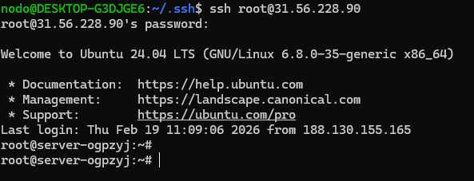

# LAB04 — Report (Local VM)

**Student:** Kirill Nosov (k.nosov@innopolis.university)

## 1. Provider & Infrastructure

- Provider: Local VM (VirtualBox) — Ubuntu Server
- Note: I just installed Ubuntu Server and put it in VirtualBox. I don't have access to cloud providers; that's the reason.
- OS: Ubuntu 24.04.03 LTS
- CPU / Memory / Disk: 1 vCPU, 4 GB RAM, 20 GB disk
- Network: Bridged
- Static IP / Hostname: 31.56.228.90
- Purpose: VM for Lab 5 Ansible provisioning (Docker + app)

## 2. Terraform Implementation

- Terraform: Not used — local VM was created manually due to cost constraints with cloud providers.

## 3. Pulumi Implementation

- Pulumi: Not used for this VM.

## 4. How VM was created (Steps performed)

Include the exact steps you executed to create and configure the VM. Example (manual VirtualBox installation):

1. Download Ubuntu Server ISO (e.g., Ubuntu 24.04) from the official site.
2. In VirtualBox create a new VM, set type to Linux / Ubuntu, allocate CPU/memory/disk (e.g., 2 vCPU, 2 GB, 20 GB).
3. Attach the downloaded ISO as the VM optical drive and start the VM to run the installer.
4. During install: created a user, installed OpenSSH server when prompted, set timezone and locale.
5. Set the network adapter to `Bridged` in VirtualBox settings so the VM is reachable from your host.
6. After install, remove the ISO and reboot the VM.

## 5. SSH Access (Proof)

- SSH command used: `ssh ubuntu@31.56.228.90`
- SSH is functional and the VM is accessible from the host.



## 6. Open Ports & Firewall

Ports 22 (SSH), 80 (HTTP), and 5000 (app) are accessible from the host via the bridged network at IP 31.56.228.90.

## 7. Ansible Inventory for Lab 5

Inventory entry for the VM:

```
[lab05]
local-vm ansible_host=31.56.228.90 ansible_user=ubuntu ansible_ssh_private_key_file=~/.ssh/id_rsa_pub

[lab05:vars]
ansible_python_interpreter=/usr/bin/python3
ansible_become=true
ansible_become_method=sudo
```

## 8. Lab 5 Plan

Will not keep this VM after Lab 5. A new VM will be created or recreated as needed for future labs.

## 9. Cleanup

The VM will be deleted in VirtualBox after Lab 5 is completed.

## 10. Reflection and Notes

Local VM was chosen due to lack of access to cloud providers. The manual VirtualBox installation was straightforward and provides a sufficient environment for Lab 5 Ansible provisioning tasks.

---
