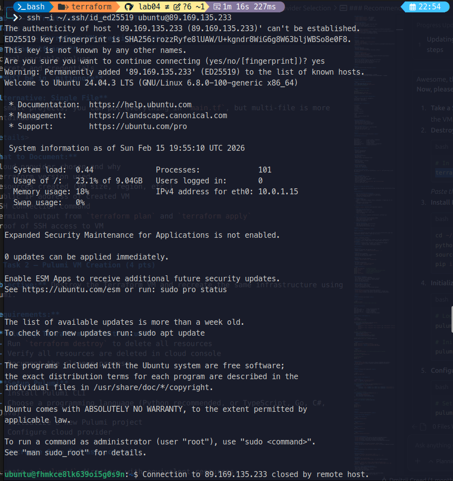
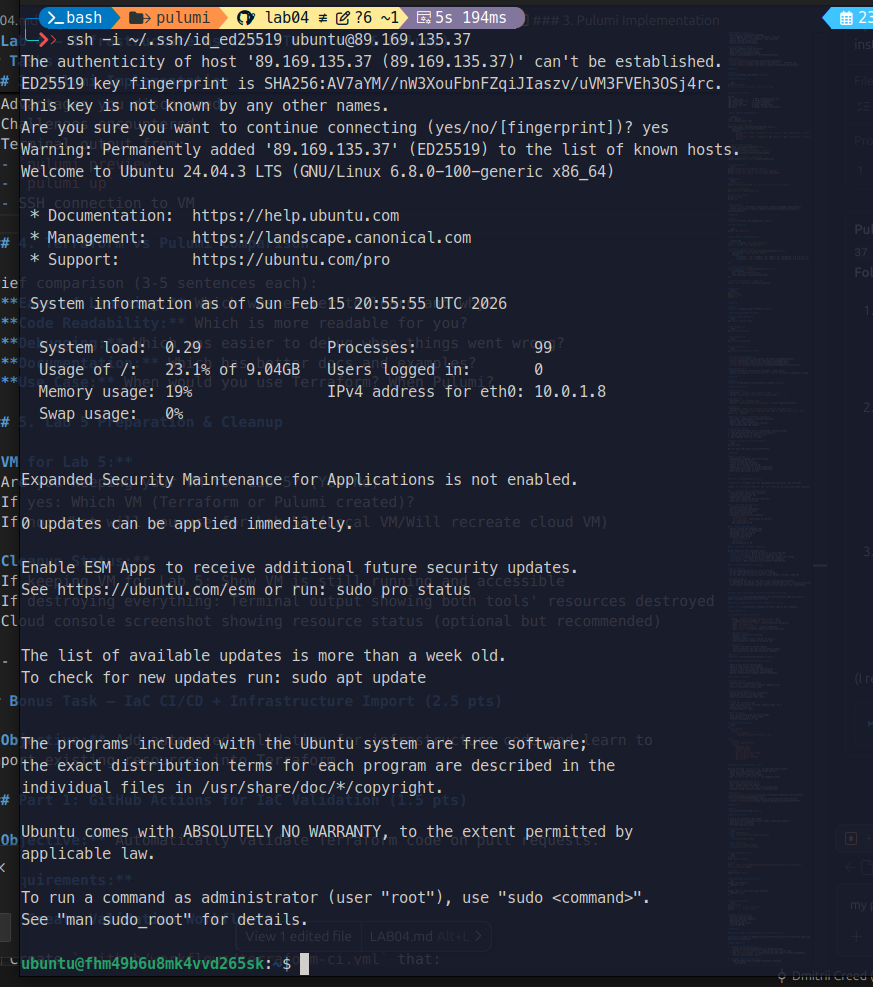

# Lab 04 — Infrastructure as Code (Terraform & Pulumi)

## 1. Cloud Provider & Infrastructure

**Cloud Provider:** Yandex Cloud

**Why:** Yandex Cloud is recommended by the course for Russia. It has a free trial grant, good Terraform/Pulumi support, and does not require VPN.

**Instance Configuration:**
- Platform: standard-v2
- vCPU: 2 (core fraction 20%)
- RAM: 1 GB
- Disk: 10 GB HDD
- OS: Ubuntu 24.04 LTS
- Zone: ru-central1-a

**Total cost:** 0₽ (free grant)

**Resources created:**
- VPC Network (`lab-network`)
- Subnet (`lab-subnet`, 10.0.1.0/24)
- Security Group (SSH port 22, HTTP port 80, app port 5000)
- Compute Instance (`lab-vm` with public IP)

---

## 2. Terraform Implementation

**Terraform version:** 1.9+

**Project structure:**
```
terraform/
├── .gitignore           # Ignores state, credentials, .terraform/
├── main.tf              # Provider, network, subnet, security group, VM
├── variables.tf         # Input variables (cloud_id, folder_id, zone, etc.)
├── outputs.tf           # VM public IP, VM ID, SSH command
└── terraform.tfvars     # Actual values (gitignored)
```

**Key decisions:**
- Used variables for all configurable values so nothing is hardcoded
- Used outputs to display public IP and SSH command after apply
- Used `.gitignore` to keep secrets and state out of git
- Used labels for resource identification
- Security group allows only required ports (22, 80, 5000)

**Challenges:**
- Had to find the correct Ubuntu 24.04 image ID for Yandex Cloud
- Needed to set up service account and authorized key for authentication

### Terminal Output

Initializing the backend...
Initializing provider plugins...
- Finding latest version of yandex-cloud/yandex...
- Installing yandex-cloud/yandex v0.186.0...
- Installed yandex-cloud/yandex v0.186.0 (unauthenticated)

Terraform has been successfully initialized!

Terraform used the selected providers to generate the following execution plan. Resource actions
are indicated with the following symbols:
  + create

Terraform will perform the following actions:

  # yandex_compute_instance.lab_vm will be created
  + resource "yandex_compute_instance" "lab_vm" {
      + created_at                = (known after apply)
      + folder_id                 = (known after apply)
      + fqdn                      = (known after apply)
      + gpu_cluster_id            = (known after apply)
      + hardware_generation       = (known after apply)
      + hostname                  = (known after apply)
      + id                        = (known after apply)
      + labels                    = {
          + "project" = "devops-lab04"
          + "task"    = "terraform"
        }
      + metadata                  = {
          + "ssh-keys" = <<-EOT
                ubuntu:ssh-ed25519 AAAAC3NzaC1lZDI1NTE5AAAAIKfBnyjaKsKyiGkHXoSmRrJW1zewQEhVJxjqrKrRT11r ramazanatzuf10@gmail.com
            EOT
        }
      + name                      = "lab-vm"
      + network_acceleration_type = "standard"
      + platform_id               = "standard-v2"
      + status                    = (known after apply)
      + zone                      = "ru-central1-a"

      + boot_disk {
          + auto_delete = true
          + device_name = (known after apply)
          + disk_id     = (known after apply)
          + mode        = (known after apply)

          + initialize_params {
              + block_size  = (known after apply)
              + description = (known after apply)
              + image_id    = "fd8p685sjqdraf7mpkuc"
              + name        = (known after apply)
              + size        = 10
              + snapshot_id = (known after apply)
              + type        = "network-hdd"
            }
        }

      + metadata_options (known after apply)

      + network_interface {
          + index              = (known after apply)
          + ip_address         = (known after apply)
          + ipv4               = true
          + ipv6               = (known after apply)
          + ipv6_address       = (known after apply)
          + mac_address        = (known after apply)
          + nat                = true
          + nat_ip_address     = (known after apply)
          + nat_ip_version     = (known after apply)
          + security_group_ids = (known after apply)
          + subnet_id          = (known after apply)
        }

      + resources {
          + core_fraction = 20
          + cores         = 2
          + memory        = 1
        }
    }

  # yandex_vpc_network.lab_network will be created
  + resource "yandex_vpc_network" "lab_network" {
      + created_at                = (known after apply)
      + default_security_group_id = (known after apply)
      + folder_id                 = (known after apply)
      + id                        = (known after apply)
      + labels                    = (known after apply)
      + name                      = "lab-network"
      + subnet_ids                = (known after apply)
    }

  # yandex_vpc_security_group.lab_sg will be created
  + resource "yandex_vpc_security_group" "lab_sg" {
      + created_at = (known after apply)
      + folder_id  = (known after apply)
      + id         = (known after apply)
      + labels     = (known after apply)
      + name       = "lab-security-group"
      + network_id = (known after apply)
      + status     = (known after apply)

      + egress {
          + description       = "Allow all outbound"
          + from_port         = -1
          + id                = (known after apply)
          + labels            = (known after apply)
          + port              = -1
          + protocol          = "ANY"
          + to_port           = -1
          + v4_cidr_blocks    = [
              + "0.0.0.0/0",
            ]
      }

      + ingress {
          + description       = "Allow HTTP"
          + from_port         = -1
          + id                = (known after apply)
          + labels            = (known after apply)
          + port              = 80
          + protocol          = "TCP"
          + to_port           = -1
          + v4_cidr_blocks    = [
              + "0.0.0.0/0",
            ]
      }
      + ingress {
          + description       = "Allow SSH"
          + from_port         = -1
          + id                = (known after apply)
          + labels            = (known after apply)
          + port              = 22
          + protocol          = "TCP"
          + to_port           = -1
          + v4_cidr_blocks    = [
              + "0.0.0.0/0",
            ]
      }
      + ingress {
          + description       = "Allow app port 5000"
          + from_port         = -1
          + id                = (known after apply)
          + labels            = (known after apply)
          + port              = 5000
          + protocol          = "TCP"
          + to_port           = -1
          + v4_cidr_blocks    = [
              + "0.0.0.0/0",
            ]
      }
    }

  # yandex_vpc_subnet.lab_subnet will be created
  + resource "yandex_vpc_subnet" "lab_subnet" {
      + created_at     = (known after apply)
      + folder_id      = (known after apply)
      + id             = (known after apply)
      + labels         = (known after apply)
      + name           = "lab-subnet"
      + network_id     = (known after apply)
      + v4_cidr_blocks = [
          + "10.0.1.0/24",
        ]
      + zone           = "ru-central1-a"
    }

Plan: 4 to add, 0 to change, 0 to destroy.

yandex_vpc_network.lab_network: Creating...
yandex_vpc_network.lab_network: Creation complete after 14s [id=enptvj5mcvlei7hrv83s]
yandex_vpc_subnet.lab_subnet: Creating...
yandex_vpc_security_group.lab_sg: Creating...
yandex_vpc_subnet.lab_subnet: Creation complete after 1s [id=e9b8rovrospd6deptkhc]
yandex_vpc_security_group.lab_sg: Creation complete after 4s [id=enp9sdve5bv9nuua560j]
yandex_compute_instance.lab_vm: Creating...
yandex_compute_instance.lab_vm: Creation complete after 45s [id=fhmkce8lk639oi5g0s9n]

Apply complete! Resources: 4 added, 0 changed, 0 destroyed.

Outputs:

ssh_connection = "ssh -i ~/.ssh/id_ed25519 ubuntu@89.169.135.233"
vm_id = "fhmkce8lk639oi5g0s9n"
vm_public_ip = "89.169.135.233"
```

**SSH connection proof:**


---

## 3. Pulumi Implementation

**Pulumi version:** 3.x
**Language:** Python

**Project structure:**
```
pulumi/
├── .gitignore           # Ignores venv/, stack configs, __pycache__/
├── __main__.py          # Main infrastructure code (same as Terraform)
├── Pulumi.yaml          # Project metadata
└── requirements.txt     # Python dependencies
```

**How code differs from Terraform:**
- Written in Python instead of HCL
- Resources are Python objects, not HCL blocks
- Configuration uses `pulumi.Config()` instead of `variable` blocks
- Outputs use `pulumi.export()` instead of `output` blocks
- Can use normal Python features (file reading, string formatting)

**Advantages discovered:**
- Familiar Python syntax, easier to read
- Can use regular Python code for logic (reading SSH key file, etc.)
- Better IDE support with autocomplete and type checking
- Secrets are encrypted by default

**Challenges:**
- Pulumi requires a backend for state (used `--local` for simplicity)
- Python virtual environment setup adds extra steps
- Smaller community, fewer examples online

### Terminal Output

**terraform destroy (cleanup before Pulumi):**
```
Plan: 0 to add, 0 to change, 4 to destroy.

Changes to Outputs:
  - ssh_connection = "ssh -i ~/.ssh/id_ed25519 ubuntu@89.169.135.233" -> null
  - vm_id          = "fhmkce8lk639oi5g0s9n" -> null
  - vm_public_ip   = "89.169.135.233" -> null
yandex_compute_instance.lab_vm: Destroying... [id=fhmkce8lk639oi5g0s9n]
yandex_compute_instance.lab_vm: Still destroying... [id=fhmkce8lk639oi5g0s9n, 00m10s elapsed]
yandex_compute_instance.lab_vm: Still destroying... [id=fhmkce8lk639oi5g0s9n, 00m20s elapsed]
yandex_compute_instance.lab_vm: Still destroying... [id=fhmkce8lk639oi5g0s9n, 00m30s elapsed]
yandex_compute_instance.lab_vm: Destruction complete after 37s
yandex_vpc_subnet.lab_subnet: Destroying... [id=e9b8rovrospd6deptkhc]
yandex_vpc_security_group.lab_sg: Destroying... [id=enp9sdve5bv9nuua560j]
yandex_vpc_security_group.lab_sg: Destruction complete after 1s
yandex_vpc_subnet.lab_subnet: Destruction complete after 5s
yandex_vpc_network.lab_network: Destroying... [id=enptvj5mcvlei7hrv83s]
yandex_vpc_network.lab_network: Destruction complete after 1s

Destroy complete! Resources: 4 destroyed.

```

**pulumi preview:**
```
Previewing update (dev):
     Type                 Name              Plan     Info
     pulumi:pulumi:Stack  lab04-pulumi-dev           1 message

Diagnostics:
  pulumi:pulumi:Stack (lab04-pulumi-dev):
    DEBUG: Using Python: /home/blxxdclxud/assignments/DevOps-Core-Course/pulumi/venv/bin/python3

Resources:
    5 unchanged

```

Current stack is dev:
    Managed by blxxdclxud-BOM-WXX9
    Last updated: 21 seconds ago (2026-02-15 23:54:56.071594762 +0300 MSK)
    Pulumi version used: v3.220.0

Current stack resources (6):
    TYPE                                               NAME
    pulumi:pulumi:Stack                                lab04-pulumi-dev
    ├─ yandex:index/vpcNetwork:VpcNetwork              lab-network
    ├─ yandex:index/vpcSubnet:VpcSubnet                lab-subnet
    ├─ yandex:index/vpcSecurityGroup:VpcSecurityGroup  lab-security-group
    ├─ yandex:index/computeInstance:ComputeInstance    lab-vm
    └─ pulumi:providers:yandex                         default_0_13_0

Current stack outputs (3):
    OUTPUT          VALUE
    ssh_connection  ssh -i ~/.ssh/id_ed25519 ubuntu@89.169.135.37
    vm_id           fhm49b6u8mk4vvd265sk
    vm_public_ip    89.169.135.37
```

**SSH connection proof:**


---

## 4. Terraform vs Pulumi Comparison

**Ease of Learning:** Terraform was easier to learn because HCL syntax is simple and there are many examples online. Pulumi requires you to know a programming language, but if you already know Python, it feels more natural.

**Code Readability:** I find Pulumi more readable because it is regular Python code. Terraform HCL is also readable but has its own special syntax that you need to learn. For simple infrastructure both look clean.

**Debugging:** Terraform was easier to debug because error messages are clear and `terraform plan` shows exactly what will happen. Pulumi errors sometimes mix Python errors with infrastructure errors which can be confusing.

**Documentation:** Terraform has better documentation because it has a bigger community. The Terraform Registry has detailed docs for every provider. Pulumi docs are good but have fewer examples.

**Use Case:** I would use Terraform for simple, standard infrastructure where I don't need complex logic. I would use Pulumi for projects where I need loops, conditions, or want to reuse code with functions and classes.

---

## 5. Lab 5 Preparation & Cleanup

**VM for Lab 5:** I will recreate the VM using Terraform code when needed for Lab 5. The code is ready in the repository.

**Cleanup Status:** All resources were destroyed after completing the lab.

```
Previewing destroy (dev):
     Type                              Name                Plan       
 -   pulumi:pulumi:Stack               lab04-pulumi-dev    delete     
 -   ├─ yandex:index:VpcSubnet         lab-subnet          delete     
 -   ├─ yandex:index:VpcSecurityGroup  lab-security-group  delete     
 -   ├─ yandex:index:VpcNetwork        lab-network         delete     
 -   └─ yandex:index:ComputeInstance   lab-vm              delete     

Outputs:
  - ssh_connection: "ssh -i ~/.ssh/id_ed25519 ubuntu@89.169.135.37"
  - vm_id         : "fhm49b6u8mk4vvd265sk"
  - vm_public_ip  : "89.169.135.37"

Resources:
    - 5 to delete

Destroying (dev):
     Type                              Name                Status              
 -   pulumi:pulumi:Stack               lab04-pulumi-dev    deleted (0.00s)     
 -   ├─ yandex:index:ComputeInstance   lab-vm              deleted (38s)       
 -   ├─ yandex:index:VpcSubnet         lab-subnet          deleted (5s)        
 -   ├─ yandex:index:VpcSecurityGroup  lab-security-group  deleted (1s)        
 -   └─ yandex:index:VpcNetwork        lab-network         deleted (0.56s)     

Outputs:
  - ssh_connection: "ssh -i ~/.ssh/id_ed25519 ubuntu@89.169.135.37"
  - vm_id         : "fhm49b6u8mk4vvd265sk"
  - vm_public_ip  : "89.169.135.37"

Resources:
    - 5 deleted

Duration: 46s

```

---

## Bonus: IaC CI/CD

Created `.github/workflows/terraform-ci.yml` that automatically validates Terraform code on pull requests.

**Path filters:** The workflow only triggers on changes to `terraform/**` files and the workflow file itself. This prevents unnecessary CI runs when other files change.

**Steps:**
1. `terraform fmt -check` — checks code formatting
2. `terraform init -backend=false` — initializes without backend (no credentials needed)
3. `terraform validate` — checks syntax and configuration
4. `tflint` — lints for best practices and common errors

**Workflow run proof:**
```
<PASTE SCREENSHOT OR LINK TO WORKFLOW RUN HERE>
```

---

## Bonus: GitHub Repository Import

### What is `terraform import`?

`terraform import` lets you bring existing infrastructure under Terraform management. This is useful when you have resources that were created manually (through web console or CLI) and you want to manage them with code now.

### Import Process

1. Created `terraform/github/main.tf` with GitHub provider and `github_repository` resource
2. Ran `terraform init` to install the GitHub provider
3. Ran `terraform import github_repository.course_repo DevOps-Core-Course`
4. Ran `terraform plan` to verify state matches reality

### Terminal Output

**terraform import:**
```
$ terraform import github_repository.course_repo DevOps-Core-Course

github_repository.course_repo: Importing from ID "DevOps-Core-Course"...
github_repository.course_repo: Import prepared!
  Prepared github_repository for import
github_repository.course_repo: Refreshing state... [id=DevOps-Core-Course]

Import successful!

The resources that were imported are shown above. These resources are now in
your Terraform state and will henceforth be managed by Terraform.
```

**terraform plan (after import):**
```
Terraform will perform the following actions:

  # github_repository.course_repo will be updated in-place
  ~ resource "github_repository" "course_repo" {
      ~ description                 = "🚀Production-grade DevOps course..." -> "DevOps Core Course lab assignments"
      - has_downloads               = true -> null
      ~ has_issues                  = false -> true
      ~ has_projects                = true -> false
      ~ has_wiki                    = true -> false
        id                          = "DevOps-Core-Course"
        name                        = "DevOps-Core-Course"
    }

Plan: 0 to add, 1 to change, 0 to destroy.
```

**Drift Analysis:** The plan shows that the actual repository state (with wiki/projects enabled) differs from our minimal Terraform configuration. To sync them, we would either update our `main.tf` to match reality or `apply` to enforce the new configuration. This demonstrates how Terraform detects configuration drift.

### Why Importing Matters

- **Version control:** Track all changes to infrastructure in Git
- **Consistency:** Prevent configuration drift — everyone sees the same config
- **Automation:** Changes go through code review before applying
- **Documentation:** Code is living documentation of your infrastructure
- **Disaster recovery:** Can recreate everything from code if something breaks
- **Team collaboration:** Multiple people can work on infrastructure without conflicts
