# Helm Chart Documentation

## 1. Chart Overview

This Helm chart packages a Kubernetes application and enables reusable deployments across environments.

### Chart Structure

```
./k8s/mychart/
├── Chart.yaml
├── charts
├── templates
│   ├── NOTES.txt
│   ├── _helpers.tpl
│   ├── deployment.yaml
│   ├── hooks
│   │   ├── post-install.yml
│   │   └── pre-install.yml
│   ├── hpa.yaml
│   ├── httproute.yaml
│   ├── ingress.yaml
│   ├── service.yaml
│   ├── serviceaccount.yaml
│   └── tests
│       └── test-connection.yaml
├── values-dev.yaml
├── values-prod.yaml
└── values.yaml
```

### Key Template Files

- **deployment.yaml**: defines application pods and replicas  
- **service.yaml**:  exposes the application  
- **_helpers.tpl**: reusable templates for naming and labels  
- **hooks/**: contains lifecycle jobs (pre-install and post-install)

### Values Organization

- `values.yaml` - default configuration  
- `values-dev.yaml` - development environment  
- `values-prod.yaml` - production environment  

All key parameters are configurable via values (replicas, image, service, resources).

---

## 2. Configuration Guide

##### values.yaml
```yml
replicaCount: 3
containerPort: 5000

image:
  repository: myapp
  tag: "1.0"

livenessProbe:
  httpGet:
    path: /health
    port: 5000

readinessProbe:
  httpGet:
    path: /health
    port: 5000
```

##### pre-install.yml
```yml
apiVersion: batch/v1
kind: Job
metadata:
  name: '{{ include "mychart.fullname" . }}-pre-install'
  annotations:
    "helm.sh/hook": pre-install
    "helm.sh/hook-weight": "-5"
    "helm.sh/hook-delete-policy": hook-succeeded
spec:
  template:
    metadata:
      name: '{{ include "mychart.fullname" . }}-pre-install'
    spec:
      restartPolicy: Never
      containers:
      - name: pre-install-job
        image: busybox
        command: ['sh', '-c', 'echo Pre-install task running && sleep 5 && echo Done']
```


##### post-intsall.yml
```yml
apiVersion: batch/v1
kind: Job
metadata:
  name: '{{ include "mychart.fullname" . }}-post-install'
  annotations:
    "helm.sh/hook": post-install
    "helm.sh/hook-weight": "5"
    "helm.sh/hook-delete-policy": hook-succeeded
spec:
  template:
    metadata:
      name: '{{ include "mychart.fullname" . }}-post-install'
    spec:
      restartPolicy: Never
      containers:
      - name: post-install-job
        image: busybox
        command: ['sh', '-c', 'echo Post-install checks && sleep 5 && echo Done']
```

## 3. Hook Implementation

### Implemented Hooks

**Pre-install Hook**

* Runs before deployment
* Used for initialization tasks
* Weight: -5

**Post-install Hook**

* Runs after deployment
* Used for validation (smoke tests)
* Weight: 5


### Hook Verification

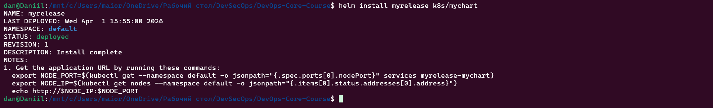

---

## 4. Installation Evidence

### Helm Installation

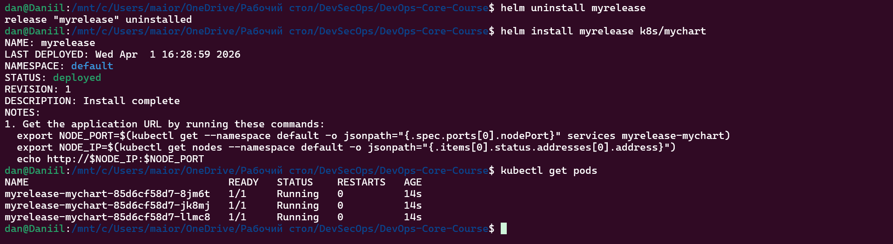

---

### Repository Setup

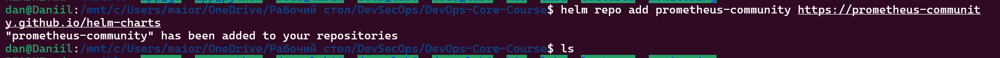
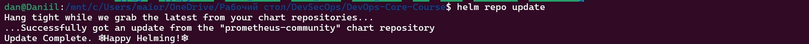

---

### Chart Exploration

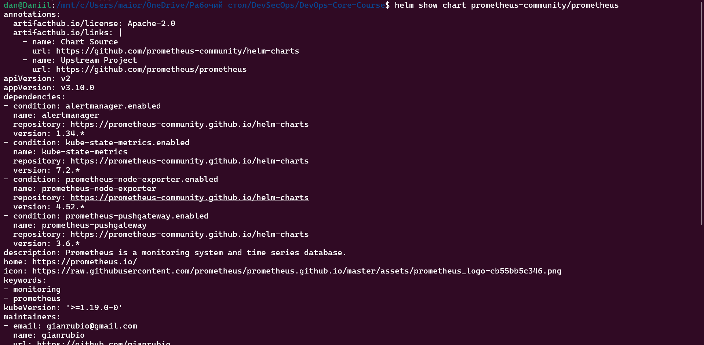

---

### Chart Validation

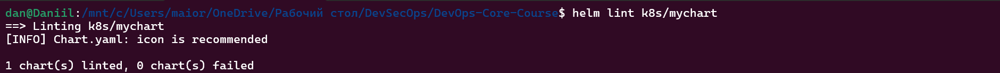
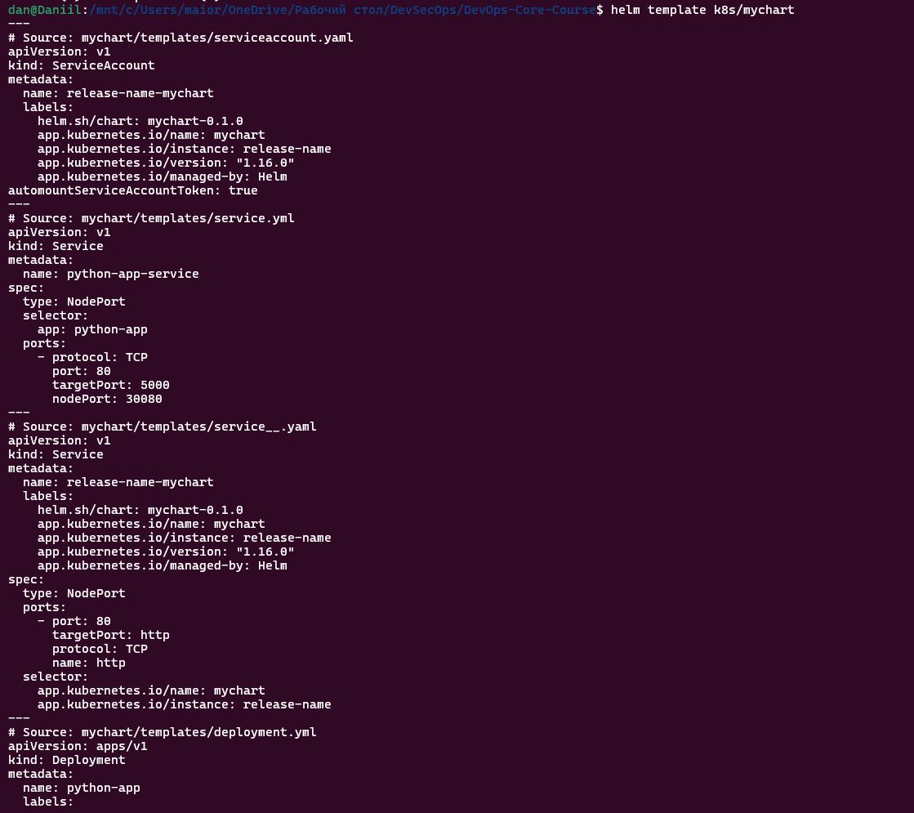
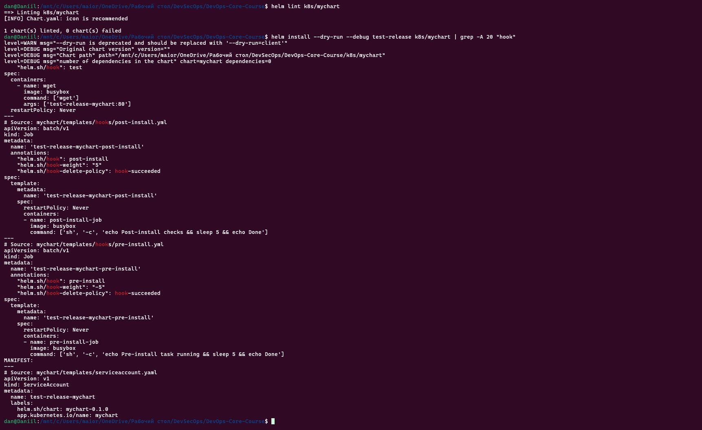

---

### Kubernetes Resources

```bash
kubectl get pods
```

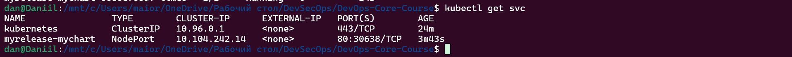

---

### Dev vs Prod Comparison

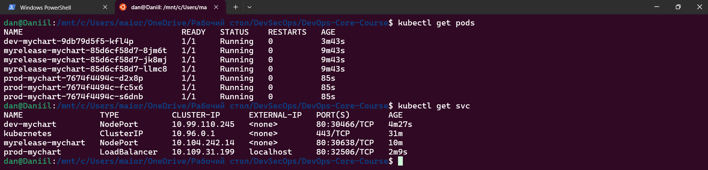

---

## 5. Operations

### Install

```bash
helm install myrelease k8s/mychart
```
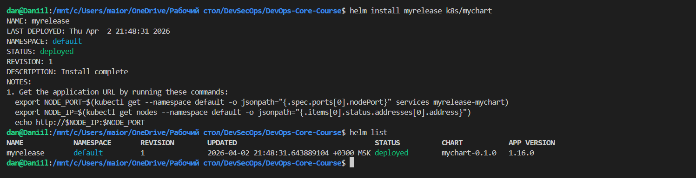

---

### Upgrade

```bash
helm upgrade myrelease k8s/mychart -f values-prod.yaml
```

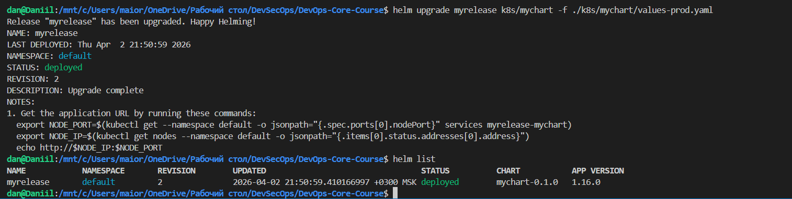

---

### Rollback

```bash
helm rollback myrelease 1
```

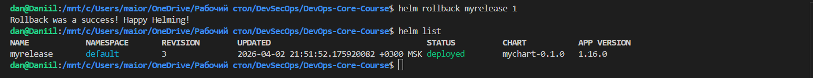

---

### Uninstall

```bash
helm uninstall myrelease
```
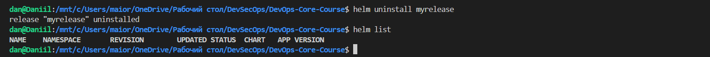

---

## 6. Testing & Validation

### Lint

```bash
helm lint k8s/mychart
```

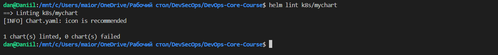

---

### Template Rendering

```bash
helm template k8s/mychart
```

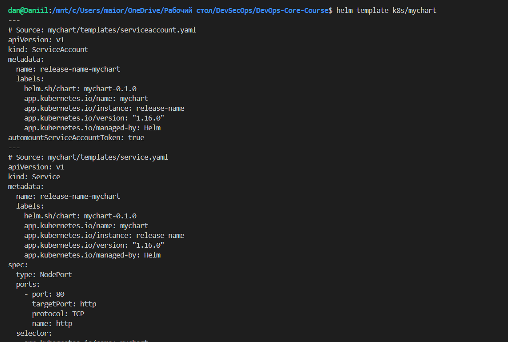

---

### Dry Run

```bash
helm install --dry-run --debug test k8s/mychart
```

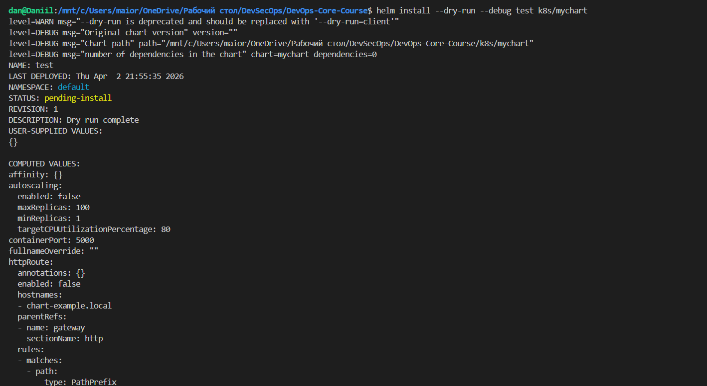

---

### Application Verification

```bash
kubectl get pods
kubectl get svc
```

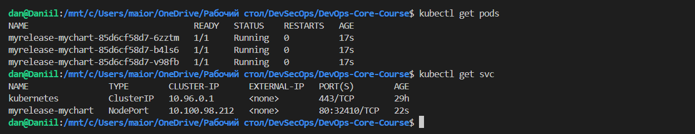

* Pods are running
* Service is accessible

---

## Conclusion

The Helm chart:

* Converts Kubernetes manifests into reusable templates
* Supports multiple environments (dev and prod)
* Implements lifecycle hooks
* Enables installation, upgrade, rollback, and validation

Helm improves flexibility, consistency, and maintainability of deployments.

```
