# Kubernetes Lab 9 - Python App Deployment Documentation

---

## 1. Architecture Overview
- **Deployment**: `python-app`
- **Replicas**: 3
- **Services**: `python-app-service` (NodePort)
- **Networking Flow**: External -> NodePort -> Pods -> Container ports
- **Resource Allocation**:
  - CPU requests: 100m, limits: 200m
  - Memory requests: 128Mi, limits: 256Mi

---

## 2. Manifest Files

### deployment.yml
- **Description**: Create `Deployment` with 3 replicas
- **Key Configurations**:
  - `replicas: 3`
  - `image: python-app:latest`
  - Liveness/Readiness probes
  - Resource requests/limits
- **Rationale**:  
  Ensure stable operation, container health, and proper resource allocation.

### service.yml
- **Description**: Creates a NodePort-type service for accessing the application
- **Key Configurations**:
  - `port: 80`, `targetPort: 5000`, `nodePort: 30080`
- **Rationale**:  
  Accessing the application from outside the cluster on a local machine.

---

## 3. Deployment Evidence
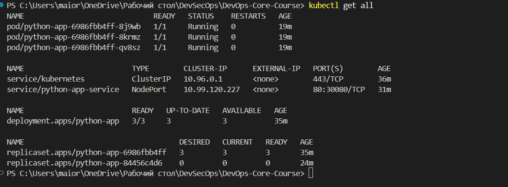
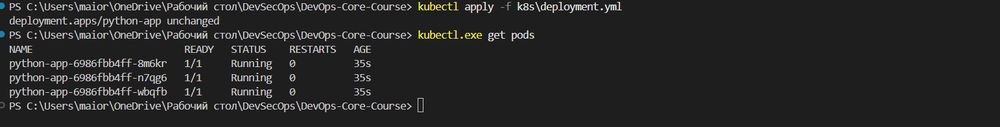
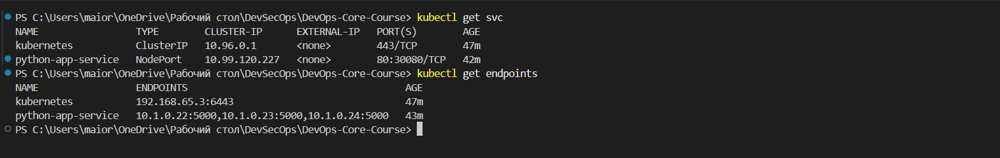
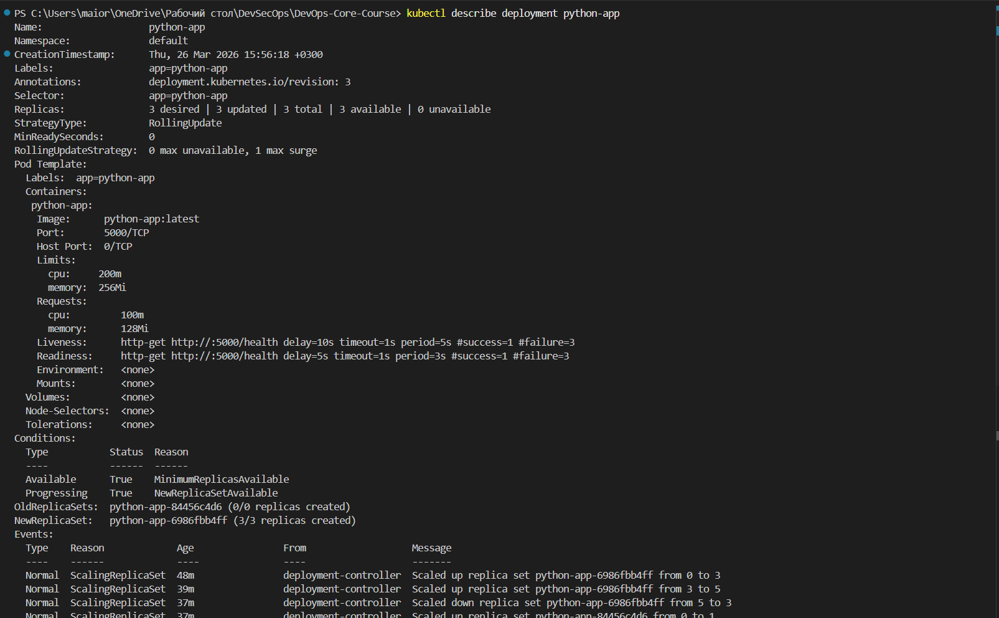
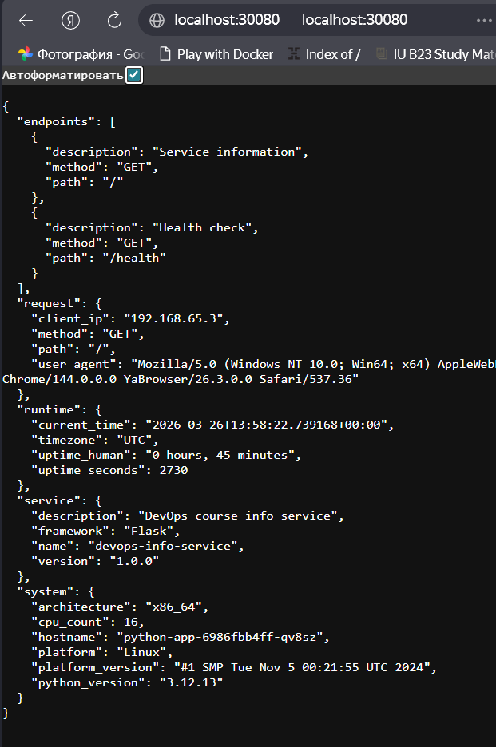

## 4. Operations Performed

### Deployment:

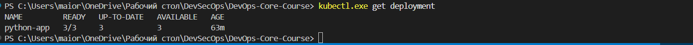

### Service
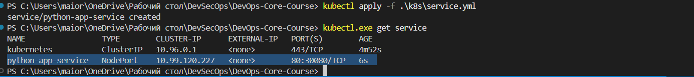

### Pods scaling
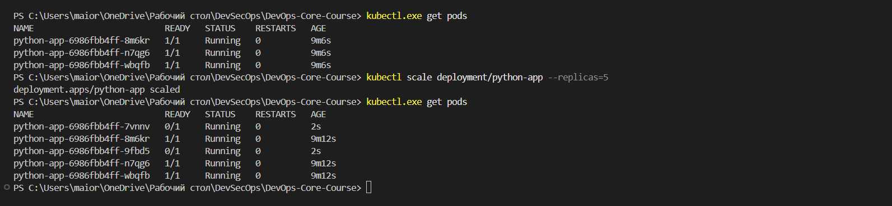

### Rollout
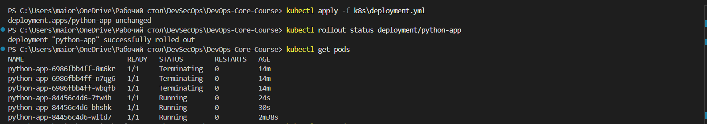

### Rollout Back
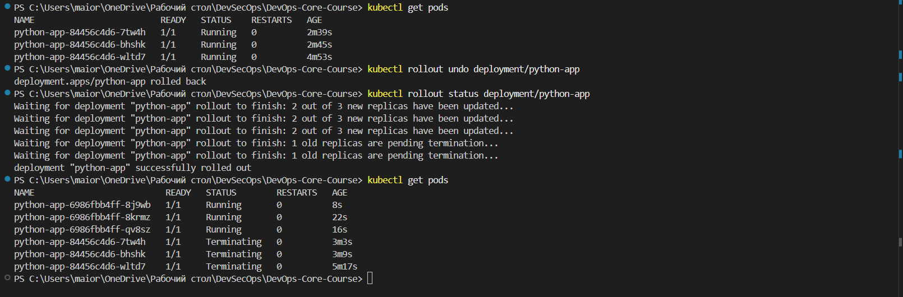

### Service Access Verification
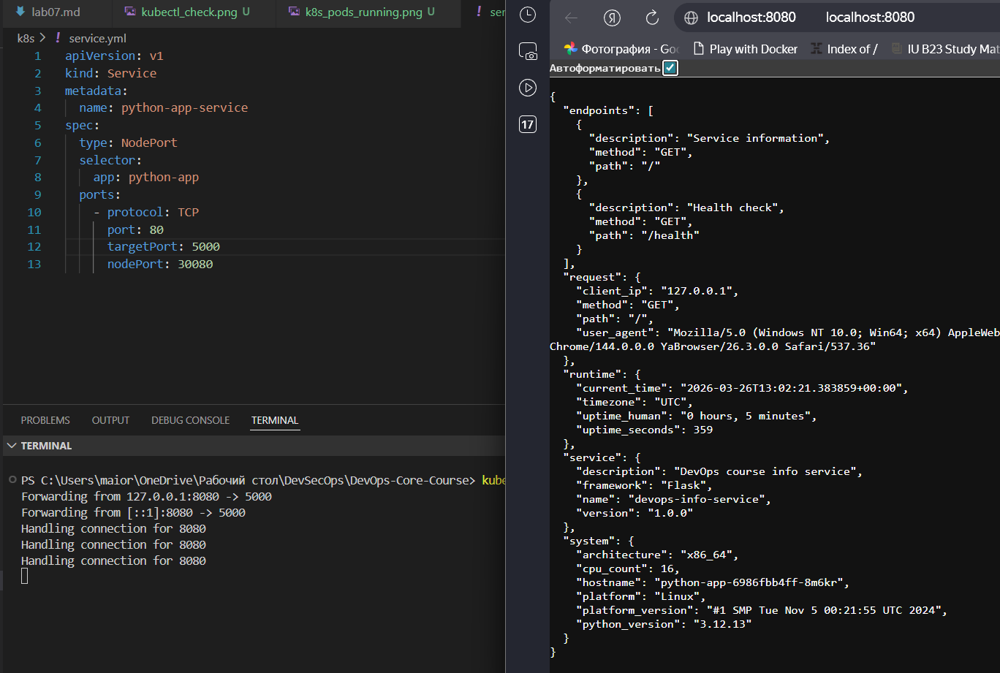

## 5. Production Considerations
- **Health Checks Implemented:** liveness + readiness for container self-checking
- **Resource Limits:** CPU and memory to prevent overload
- **Improvements for Production:**
    - Configure horizontal autoscaling
    - Monitoring via Prometheus/Grafana
    - Logs centralized in ELK or Loki
    - Observability: Container metrics, Kubernetes events

## 6. Challenges & Solutions
 - **Issue 1:** `ErrImageNeverPull`: Deleting old data and restarting the deployment
 - **Issue 2:** After rollout new pods was not running: check status of pods and fix errors in `yml`