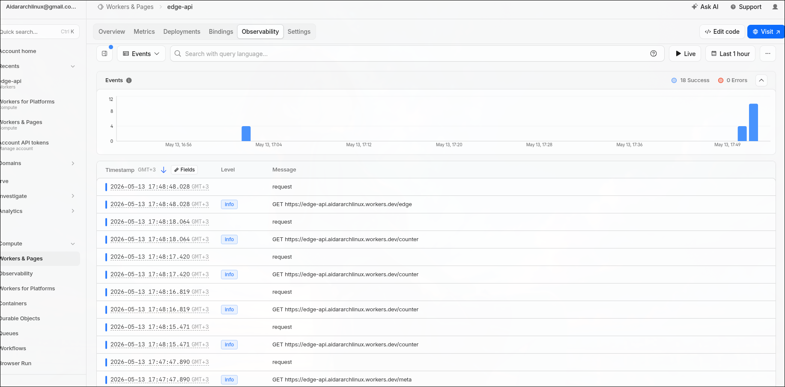
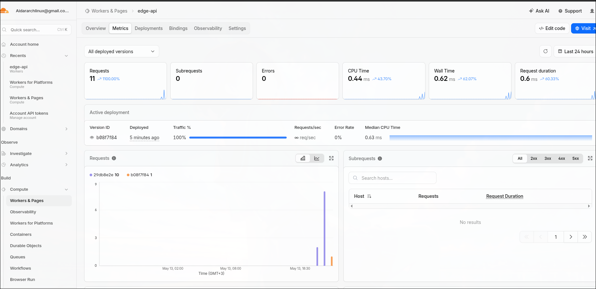

# Lab 17 — Cloudflare Workers deployment write-up


## 1. Deployment summary

| Item | Value |
|------|--------|
| **Worker URL** | `https://edge-api.aidararchlinux.workers.dev` |
| **Current `DEPLOYMENT_LABEL`** | `v2` (bump in `wrangler.jsonc` between deploys so `/` and `/meta` show which config revision is live) |
| **Configuration** | `wrangler.jsonc`: `vars`, `kv_namespaces` binding `SETTINGS` (`id` `c590beb716f140d384d9f7ca18637bf7`), secrets `API_TOKEN`, `ADMIN_EMAIL` |

### Routes

| Method | Path | Purpose |
|--------|------|---------|
| GET | `/` | App info (plaintext vars) |
| GET | `/health` | Health check |
| GET | `/meta` | Deployment JSON (`deploymentLabel`, worker name, course) |
| GET | `/edge` | Edge metadata: `colo`, `country`, `city`, `asn`, `httpProtocol`, `tlsVersion` |
| GET | `/counter` | KV-backed counter; key `visits` |
| GET | `/admin/whoami` | Returns `ADMIN_EMAIL` when `Authorization: Bearer <API_TOKEN>` matches |

---

## 2. Evidence

### 2.1 Dashboard

Worker **edge-api** in Cloudflare: **Workers & Pages → edge-api** (Overview / Observability / Metrics as needed).

### 2.2 Screenshots

Observability (requests, log-style events) 



Metrics (requests, errors, CPU / wall time) 
 

### 2.3 Example `/edge` JSON (Cloudflare `request.cf`)

`/edge` reflects the **PoP and client path** for that request, so values change when you curl from another network or region.

Example captured from the public URL (one request):

```json
{"colo":"DFW","country":"US","city":"Dallas","asn":396356,"httpProtocol":"HTTP/2","tlsVersion":"TLSv1.3"}
```

Reproduce:

```bash
curl -sS "https://edge-api.aidararchlinux.workers.dev/edge"
```

This shows Cloudflare exposes **colo**, **country**, and extra fields (**city**, **asn**, **httpProtocol**, **tlsVersion**) at the edge.

### 2.4 Example `/meta` (deployment metadata after second deploy)

```json
{"workerName":"edge-api","appName":"edge-api","courseName":"devops-core","deploymentLabel":"v2","compatibilityDate":"2026-05-10"}
```

### 2.5 Logs and metrics (Task 5)

- **Logs:** `console.log("request", { pathname, method, colo })` in `src/index.ts`. Live tail: `npx wrangler tail`. Dashboard evidence: [`screenshots/logs.png`](screenshots/logs.png) (Observability tab).
- **Metrics reviewed:** On the **Metrics** tab, **Requests** (traffic volume) and **Errors** (0) were checked; **median CPU time** and **wall time** illustrate isolate execution cost vs end-to-end latency. Screenshot: [`screenshots/metrics.png`](screenshots/metrics.png).

---

## 3. Deployments and rollback (Task 5)

### 3.1 Two application deploys

| When (UTC) | Version ID (100% traffic) | Notes |
|--------------|---------------------------|--------|
| 2026-05-13T14:02:03Z | `29db8e2e-2996-4f1c-9a4a-dcf646509540` | First Workers bundle deploy for this lab session |
| 2026-05-13T15:29:09Z | `b08f7f84-62c6-49ce-96f2-d155f3e93e0f` | Second deploy (`DEPLOYMENT_LABEL` → `v2`, `npx wrangler deploy`) |

Earlier rows from `npx wrangler deployments list` include **secret uploads** and failed/partial attempts from initial setup; they still count as deployment history on the account.

### 3.2 Full `npx wrangler deployments list` output (as provided)

```
Created:     2026-05-11T22:28:56.241Z
Author:      aidararchlinux@gmail.com
Source:      Upload
Message:     Automatic deployment on upload.
Version(s):  (100%) 5b321183-bdae-4ba7-aa00-43bd2776aac6

Created:     2026-05-11T22:28:57.435Z
Author:      aidararchlinux@gmail.com
Source:      Secret Change
Version(s):  (100%) c3839e8f-6630-4f99-9245-7e997b832220

Created:     2026-05-11T22:29:00.568Z
Author:      aidararchlinux@gmail.com
Source:      Secret Change
Version(s):  (100%) 0bdcff58-088b-43fe-bcaa-f0140e1b30b4

Created:     2026-05-11T22:29:17.129Z
Author:      aidararchlinux@gmail.com
Source:      Unknown (deployment)
Version(s):  (100%) c797cc85-2146-4b0a-8182-f99d542f9952

Created:     2026-05-11T22:29:47.013Z
Author:      aidararchlinux@gmail.com
Source:      Unknown (deployment)
Version(s):  (100%) 091f2b7d-1527-4708-828b-fe8c815cf285

Created:     2026-05-13T14:02:04.916Z
Author:      aidararchlinux@gmail.com
Source:      Unknown (deployment)
Version(s):  (100%) 29db8e2e-2996-4f1c-9a4a-dcf646509540

Created:     2026-05-13T15:29:11.002Z
Author:      aidararchlinux@gmail.com
Source:      Unknown (deployment)
Version(s):  (100%) b08f7f84-62c6-49ce-96f2-d155f3e93e0f
```

### 3.3 Rollback

To return traffic to a **previous Worker version**, run:

```bash
npx wrangler rollback
```

Wrangler prompts you to pick a deployment (or use non-interactive flags if your Wrangler version documents them). Alternatively, in the dashboard: **Deployments** → select an older version → **Rollback** / promote previous version per current UI.

---

## 4.1 Environment variables

**Plaintext `vars`** in `wrangler.jsonc` (`APP_NAME`, `COURSE_NAME`, `DEPLOYMENT_LABEL`) are shipped with the Worker bundle and visible in the dashboard; they are fine for non-sensitive labels. **Secrets** (`API_TOKEN`, `ADMIN_EMAIL` via `wrangler secret put`) are encrypted at rest and only injected at runtime—never committed to Git. Local development uses `.dev.vars` (gitignored).

## 4.2 Persistence

- **Stored value:** KV namespace `SETTINGS`, key **`visits`**, string integer.
- **Procedure:** `GET /counter` increments and returns `{ "visits": N }`. Run `npx wrangler deploy` again **without** deleting the KV namespace or changing its `id` in `wrangler.jsonc`.
- **Verification:** After the **2026-05-13** second deploy, calling `/counter` again continues from the previous count (KV is account-scoped storage, not the deployed bundle).

---

## 5. Global distribution

Workers runs in Cloudflare PoPs when a request arrives; the platform chooses where that request executes. You do **not** run a separate “deploy to three regions” step—the same script version is available on the edge network, and each request carries `request.cf` metadata from the handling location.

---

## 6. Routing: `workers.dev` vs Routes vs Custom Domains

| Mechanism | Role |
|-----------|------|
| **`workers.dev`** | Default public URL for this lab: `https://edge-api.<subdomain>.workers.dev`. |
| **Routes** | Map a Worker to paths on a **zone already on Cloudflare**. |
| **Custom Domains** | Worker as origin for your hostname (optional for this lab). |

---

## 7. Kubernetes vs Cloudflare Workers

| Aspect | Kubernetes | Cloudflare Workers |
|--------|------------|-------------------|
| **Setup complexity** | Cluster, nodes, networking, ingress, often GitOps. | Account + Wrangler + small script. |
| **Deployment speed** | Build image, push, rollout—often minutes. | Seconds; upload bundle. |
| **Global distribution** | You design regions, DNS, load balancing. | Automatic PoP execution. |
| **Cost (small apps)** | Cluster or platform minimums. | Free tier friendly for small HTTP APIs. |
| **State/persistence model** | PVCs, in-cluster DBs, StatefulSets. | Bindings (KV, D1, R2, …), not a container FS. |
| **Control/flexibility** | Full OS, any container. | V8 isolate + Workers APIs. |
| **Best use case** | Long-running services, heavy deps, batch. | Edge HTTP APIs, auth, redirects, light transforms. |

---

## 8. When to use each

- **Kubernetes:** Containers, kernel/OS needs, complex in-cluster dependencies, long-lived processes at scale you control.
- **Workers:** Globally distributed HTTPS handlers with minimal ops and predictable cost for lightweight logic.
- **Recommendation:** Workers for this lab’s API shape; Kubernetes when the workload is fundamentally container-centric.

---

## 9. Reflection

- **Easier than Kubernetes:** No cluster lifecycle; `workers.dev` URL immediately after deploy.
- **More constrained:** No Lab 2 Docker image; adapt to the Workers runtime and bindings.
- **Without Docker:** Ship a bundle to Cloudflare, not an image; persistence is explicit (KV here).

