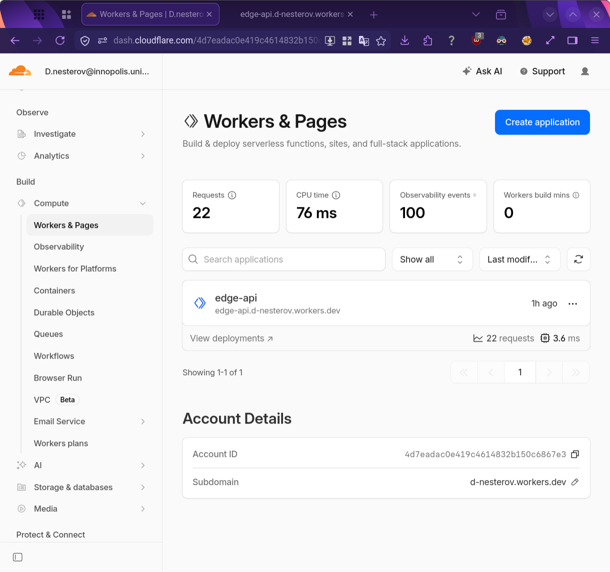
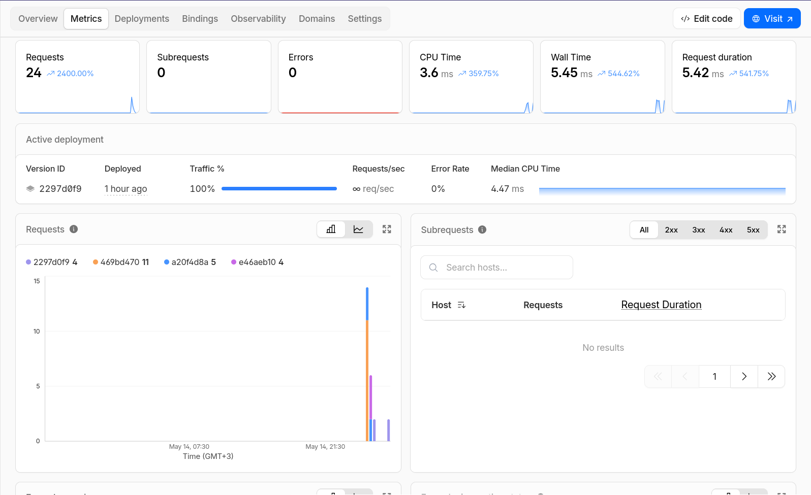
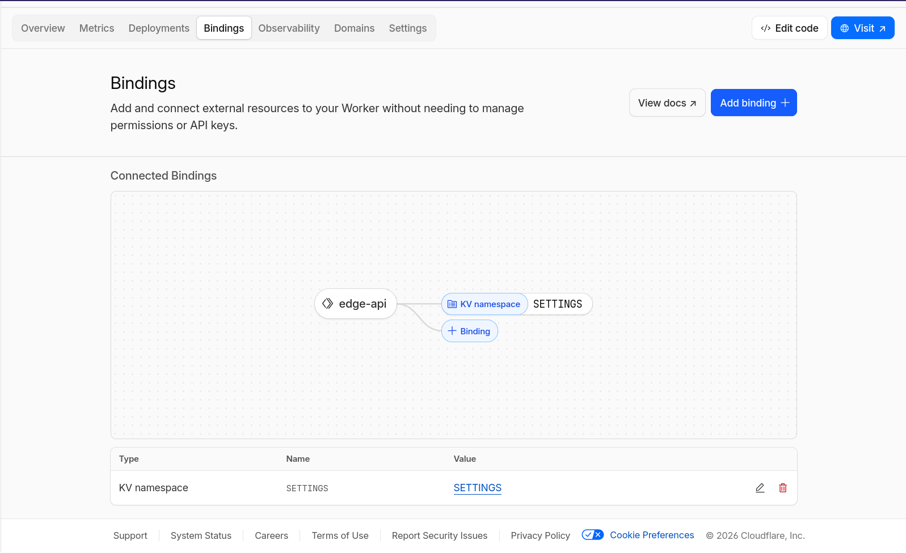
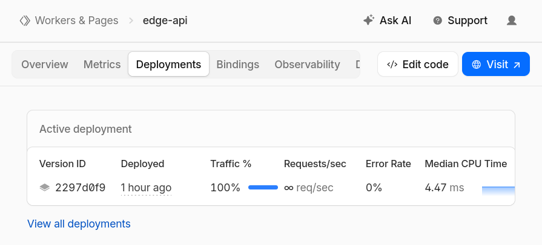

# Lab 17: Cloudflare Workers

This lab deploys a small TypeScript API to Cloudflare Workers at:

```text
https://edge-api.d-nesterov.workers.dev
```

The Worker source lives in this folder. It uses Hono for routing, Wrangler for local development and deployment, and Workers KV for state that survives code redeploys and rollback drills.

Official Cloudflare references used for this implementation:

- Wrangler configuration: https://developers.cloudflare.com/workers/wrangler/configuration/
- Workers KV setup: https://developers.cloudflare.com/kv/get-started/
- Request edge metadata: https://developers.cloudflare.com/workers/runtime-apis/request/
- Workers observability: https://developers.cloudflare.com/workers/observability/
- Versions, deployments, and rollback: https://developers.cloudflare.com/workers/configuration/versions-and-deployments/

## Implementation

The Worker exposes these routes:

| Method | Path | Purpose |
| --- | --- | --- |
| `GET` | `/` | Application metadata and route index |
| `GET` | `/health` | Health probe with timestamp |
| `GET` | `/edge` | Selected `request.cf` edge metadata |
| `GET` | `/config` | Plaintext config and redacted secret status |
| `GET` | `/counter` | Reads the KV-backed counter |
| `POST` | `/counter` | Increments the KV-backed counter |

The important config is in `wrangler.jsonc`:

- `workers_dev: true` publishes the app on the account `workers.dev` subdomain.
- `observability.enabled: true` enables Workers logs and metrics.
- `vars` stores non-sensitive app metadata.
- `secrets.required` declares `API_TOKEN` and `ADMIN_EMAIL` for type generation and local validation.
- `kv_namespaces` binds `SETTINGS` to the Worker.

Secrets are only reported by configured/not configured status from `/config`. The Worker never returns secret values.

## Screenshots

The dashboard screenshots were captured manually because Cloudflare's human verification blocked repeatable Playwright login during the final pass.

The report embeds these captures:









<details>
<summary>Cloudflare login and account check</summary>

```text
$ source ~/.sdk/nvm/nvm.sh

$ nvm use 24
Now using node v24.15.0 (npm v11.13.0)

$ npx wrangler whoami

 ⛅️ wrangler 4.90.0 (update available 4.91.0)
─────────────────────────────────────────────
Getting User settings...
👋 You are logged in with an OAuth Token, associated with the email d.nesterov@innopolis.university.
┌───────────────────────────────────────────┬──────────────────────────────────┐
│ Account Name                              │ Account ID                       │
├───────────────────────────────────────────┼──────────────────────────────────┤
│ D.nesterov@innopolis.university's Account │ 4d7eadac0e419c4614832b150c6867e3 │
└───────────────────────────────────────────┴──────────────────────────────────┘
```

</details>

<details>
<summary>KV namespace and secrets</summary>

```text
$ npx wrangler kv namespace create SETTINGS

 ⛅️ wrangler 4.90.0 (update available 4.91.0)
─────────────────────────────────────────────
Resource location: remote

🌀 Creating namespace with title "SETTINGS"
✨ Success!
To access your new KV Namespace in your Worker, add the following snippet to your configuration file:
{
  "kv_namespaces": [
    {
      "binding": "SETTINGS",
      "id": "a7dd06a571e7468d9906db5d52c32d12"
    }
  ]
}
? Would you like Wrangler to add it on your behalf?
🤖 Using fallback value in non-interactive context: no

$ npx wrangler secret put API_TOKEN

 ⛅️ wrangler 4.90.0 (update available 4.91.0)
─────────────────────────────────────────────
🌀 Creating the secret for the Worker "edge-api"
? There doesn't seem to be a Worker called "edge-api". Do you want to create a new Worker with that name and add secrets to it?
🤖 Using fallback value in non-interactive context: yes
🌀 Creating new Worker "edge-api"...
✨ Success! Uploaded secret API_TOKEN

$ npx wrangler secret put ADMIN_EMAIL

 ⛅️ wrangler 4.90.0 (update available 4.91.0)
─────────────────────────────────────────────
🌀 Creating the secret for the Worker "edge-api"
✨ Success! Uploaded secret ADMIN_EMAIL
```

Secret values were entered through stdin and intentionally omitted from the transcript.

</details>

<details>
<summary>Static checks</summary>

```text
$ npm install

added 1 package, removed 8 packages, and audited 40 packages in 1s

7 packages are looking for funding
  run `npm fund` for details

found 0 vulnerabilities

$ npx wrangler types

 ⛅️ wrangler 4.90.0 (update available 4.91.0)
─────────────────────────────────────────────
Generating project types...

declare namespace Cloudflare {
	interface GlobalProps {
		mainModule: typeof import("./src/index");
	}
	interface Env {
		SETTINGS: KVNamespace;
		APP_NAME: "edge-api";
		COURSE_NAME: "DevOps Core S26";
		APP_VERSION: "1.0.1";
		ENVIRONMENT: "production";
		API_TOKEN: string;
		ADMIN_EMAIL: string;
	}
}

✨ Types written to worker-configuration.d.ts

$ npm run typecheck

> edge-api@1.0.1 typecheck
> tsc --noEmit
```

</details>

<details>
<summary>Local Worker route checks</summary>

```text
$ npx wrangler dev --port 8787

 ⛅️ wrangler 4.90.0 (update available 4.91.0)
─────────────────────────────────────────────
Using secrets defined in .dev.vars
Your Worker has access to the following bindings:
Binding                                                 Resource                  Mode
env.SETTINGS (a7dd06a571e7468d9906db5d52c32d12)         KV Namespace              local
env.APP_NAME ("edge-api")                               Environment Variable      local
env.COURSE_NAME ("DevOps Core S26")                     Environment Variable      local
env.APP_VERSION ("1.0.0")                               Environment Variable      local
env.ENVIRONMENT ("production")                          Environment Variable      local
env.API_TOKEN ("(hidden)")                              Environment Variable      local
env.ADMIN_EMAIL ("(hidden)")                            Environment Variable      local

$ curl -fsS 127.0.0.1:8787/health | jq
{
  "status": "ok",
  "service": "edge-api",
  "version": "1.0.0",
  "timestamp": "2026-05-14T17:10:50.285Z"
}

$ curl -fsS 127.0.0.1:8787/config | jq
{
  "vars": {
    "APP_NAME": "edge-api",
    "COURSE_NAME": "DevOps Core S26",
    "APP_VERSION": "1.0.0",
    "ENVIRONMENT": "production"
  },
  "secrets": {
    "API_TOKEN": {
      "configured": true,
      "value": "[redacted]"
    },
    "ADMIN_EMAIL": {
      "configured": true,
      "value": "[redacted]"
    }
  },
  "kv": {
    "binding": "SETTINGS",
    "counterKey": "lab17-counter"
  }
}

$ curl -fsS -X POST 127.0.0.1:8787/counter | jq
{
  "key": "lab17-counter",
  "previous": 1,
  "value": 2,
  "persisted": true
}

$ curl -sS 127.0.0.1:8787/missing | jq
{
  "error": "not_found",
  "path": "/missing",
  "routes": [
    {
      "method": "GET",
      "path": "/",
      "description": "Application metadata and route index"
    },
    {
      "method": "GET",
      "path": "/health",
      "description": "Health probe for uptime checks"
    },
    {
      "method": "GET",
      "path": "/edge",
      "description": "Selected Cloudflare edge request metadata"
    },
    {
      "method": "GET",
      "path": "/config",
      "description": "Plaintext config and redacted secret status"
    },
    {
      "method": "GET",
      "path": "/counter",
      "description": "Read the KV-backed counter"
    },
    {
      "method": "POST",
      "path": "/counter",
      "description": "Increment the KV-backed counter"
    }
  ]
}
```

The full local transcript is in `/tmp/lab17/local-routes.txt`.

</details>

<details>
<summary>Deploy v1 and v2</summary>

```text
$ npx wrangler deploy

 ⛅️ wrangler 4.90.0 (update available 4.91.0)
─────────────────────────────────────────────
Total Upload: 64.96 KiB / gzip: 16.02 KiB
Worker Startup Time: 5 ms
Your Worker has access to the following bindings:
Binding                                                 Resource
env.SETTINGS (a7dd06a571e7468d9906db5d52c32d12)         KV Namespace
env.APP_NAME ("edge-api")                               Environment Variable
env.COURSE_NAME ("DevOps Core S26")                     Environment Variable
env.APP_VERSION ("1.0.0")                               Environment Variable
env.ENVIRONMENT ("production")                          Environment Variable

Deployed edge-api triggers (10.12 sec)
  https://edge-api.d-nesterov.workers.dev
Current Version ID: a20f4d8a-ccd7-4bb7-a040-f3be3f87a255

$ npx wrangler deploy

 ⛅️ wrangler 4.90.0 (update available 4.91.0)
─────────────────────────────────────────────
Total Upload: 64.96 KiB / gzip: 16.02 KiB
Worker Startup Time: 8 ms
Your Worker has access to the following bindings:
Binding                                                 Resource
env.SETTINGS (a7dd06a571e7468d9906db5d52c32d12)         KV Namespace
env.APP_NAME ("edge-api")                               Environment Variable
env.COURSE_NAME ("DevOps Core S26")                     Environment Variable
env.APP_VERSION ("1.0.1")                               Environment Variable
env.ENVIRONMENT ("production")                          Environment Variable

Deployed edge-api triggers (6.30 sec)
  https://edge-api.d-nesterov.workers.dev
Current Version ID: 469bd470-53b7-4b7d-b229-4ce161da0333
```

</details>

<details>
<summary>Public route checks</summary>

```text
$ WORKER_URL=https://edge-api.d-nesterov.workers.dev

$ curl -fsS "$WORKER_URL/health" | jq
{
  "status": "ok",
  "service": "edge-api",
  "version": "1.0.1",
  "timestamp": "2026-05-14T17:13:31.426Z"
}

$ curl -fsS "$WORKER_URL/edge" | jq
{
  "colo": "ARN",
  "country": "FI",
  "city": "Helsinki",
  "region": "Uusimaa",
  "postalCode": "00100",
  "timezone": "Europe/Helsinki",
  "asn": 56971,
  "asOrganization": "CGI GLOBAL LIMITED",
  "httpProtocol": "HTTP/2",
  "tlsVersion": "TLSv1.3"
}

$ curl -fsS "$WORKER_URL/config" | jq
{
  "vars": {
    "APP_NAME": "edge-api",
    "COURSE_NAME": "DevOps Core S26",
    "APP_VERSION": "1.0.1",
    "ENVIRONMENT": "production"
  },
  "secrets": {
    "API_TOKEN": {
      "configured": true,
      "value": "[redacted]"
    },
    "ADMIN_EMAIL": {
      "configured": true,
      "value": "[redacted]"
    }
  },
  "kv": {
    "binding": "SETTINGS",
    "counterKey": "lab17-counter"
  }
}

$ curl -fsS -X POST "$WORKER_URL/counter" | jq
{
  "key": "lab17-counter",
  "previous": 1,
  "value": 2,
  "persisted": true
}
```

The full route transcript is in `/tmp/lab17/public-routes.txt`.

</details>

<details>
<summary>KV persistence across redeploy</summary>

```text
$ curl -fsS "$WORKER_URL/config" | jq .vars
{
  "APP_NAME": "edge-api",
  "COURSE_NAME": "DevOps Core S26",
  "APP_VERSION": "1.0.0",
  "ENVIRONMENT": "production"
}

$ curl -fsS -X POST "$WORKER_URL/counter" | jq
{
  "key": "lab17-counter",
  "previous": 0,
  "value": 1,
  "persisted": true
}

$ curl -fsS "$WORKER_URL/config" | jq .vars
{
  "APP_NAME": "edge-api",
  "COURSE_NAME": "DevOps Core S26",
  "APP_VERSION": "1.0.1",
  "ENVIRONMENT": "production"
}

$ curl -fsS "$WORKER_URL/counter" | jq
{
  "key": "lab17-counter",
  "value": 2,
  "persisted": true
}
```

</details>

<details>
<summary>Observability with Wrangler tail</summary>

```text
$ npx wrangler tail --format json | jq '
{
  outcome,
  scriptName,
  scriptVersion: .scriptVersion.id,
  log: .logs[0].message[0],
  request: {
    method: .event.request.method,
    url: .event.request.url,
    colo: .event.request.cf.colo,
    country: .event.request.cf.country
  },
  status: .event.response.status
}'
{
  "outcome": "ok",
  "scriptName": "edge-api",
  "scriptVersion": "469bd470-53b7-4b7d-b229-4ce161da0333",
  "log": "{\"event\":\"request\",\"method\":\"GET\",\"path\":\"/health\",\"colo\":\"ARN\",\"country\":\"FI\"}",
  "request": {
    "method": "GET",
    "url": "https://edge-api.d-nesterov.workers.dev/health",
    "colo": "ARN",
    "country": "FI"
  },
  "status": 200
}
{
  "outcome": "ok",
  "scriptName": "edge-api",
  "scriptVersion": "469bd470-53b7-4b7d-b229-4ce161da0333",
  "log": "{\"event\":\"request\",\"method\":\"POST\",\"path\":\"/counter\",\"colo\":\"ARN\",\"country\":\"FI\"}",
  "request": {
    "method": "POST",
    "url": "https://edge-api.d-nesterov.workers.dev/counter",
    "colo": "ARN",
    "country": "FI"
  },
  "status": 200
}

$ curl -fsS "$WORKER_URL/health" | jq .status
"ok"

$ curl -fsS -X POST "$WORKER_URL/counter" | jq .value
3
```

</details>

<details>
<summary>Rollback drill</summary>

```text
$ npx wrangler rollback a20f4d8a-ccd7-4bb7-a040-f3be3f87a255 --message "Lab 17 rollback drill" --yes

 ⛅️ wrangler 4.90.0 (update available 4.91.0)
─────────────────────────────────────────────
├ Fetching latest deployment
│
├ Your current deployment has 1 version(s):
│
│ (100%) 469bd470-53b7-4b7d-b229-4ce161da0333
│       Created:  2026-05-14T17:13:05.782035Z
│           Tag:  -
│       Message:  -
│
├  WARNING  You are about to rollback to Worker Version a20f4d8a-ccd7-4bb7-a040-f3be3f87a255.
│ This will immediately replace the current deployment and become the active deployment across all your deployed triggers.
│ However, your local development environment will not be affected by this rollback.
│ Rolling back to a previous deployment will not rollback any of the bound resources (Durable Object, D1, R2, KV, etc).
│
╰  SUCCESS  Worker Version a20f4d8a-ccd7-4bb7-a040-f3be3f87a255 has been deployed to 100% of traffic.

Current Version ID: a20f4d8a-ccd7-4bb7-a040-f3be3f87a255

$ curl -fsS "$WORKER_URL/config" | jq .vars
{
  "APP_NAME": "edge-api",
  "COURSE_NAME": "DevOps Core S26",
  "APP_VERSION": "1.0.0",
  "ENVIRONMENT": "production"
}

$ npx wrangler deploy

Deployed edge-api triggers (5.76 sec)
  https://edge-api.d-nesterov.workers.dev
Current Version ID: e46aeb10-5fab-49df-a416-44d42bdc27f9

$ curl -fsS "$WORKER_URL/config" | jq .vars
{
  "APP_NAME": "edge-api",
  "COURSE_NAME": "DevOps Core S26",
  "APP_VERSION": "1.0.1",
  "ENVIRONMENT": "production"
}

$ curl -fsS "$WORKER_URL/counter" | jq
{
  "key": "lab17-counter",
  "value": 3,
  "persisted": true
}
```

The rollback test confirmed two things: traffic can be returned to an older Worker version, and KV data is not rolled back with code.

</details>

<details>
<summary>Final redeploy after source cleanup</summary>

```text
$ npm run typecheck

> edge-api@1.0.1 typecheck
> tsc --noEmit


$ npx wrangler deploy

 ⛅️ wrangler 4.90.0 (update available 4.91.0)
─────────────────────────────────────────────
Total Upload: 65.04 KiB / gzip: 16.02 KiB
Worker Startup Time: 4 ms
Your Worker has access to the following bindings:
Binding                                                 Resource
env.SETTINGS (a7dd06a571e7468d9906db5d52c32d12)         KV Namespace
env.APP_NAME ("edge-api")                               Environment Variable
env.COURSE_NAME ("DevOps Core S26")                     Environment Variable
env.APP_VERSION ("1.0.1")                               Environment Variable
env.ENVIRONMENT ("production")                          Environment Variable

Uploaded edge-api (12.21 sec)
Deployed edge-api triggers (6.00 sec)
  https://edge-api.d-nesterov.workers.dev
Current Version ID: 2297d0f9-493e-4de6-8745-b34f7c9c9f99

$ curl -fsS https://edge-api.d-nesterov.workers.dev/config | jq .vars
{
  "APP_NAME": "edge-api",
  "COURSE_NAME": "DevOps Core S26",
  "APP_VERSION": "1.0.1",
  "ENVIRONMENT": "production"
}

$ curl -fsS https://edge-api.d-nesterov.workers.dev/counter | jq
{
  "key": "lab17-counter",
  "value": 3,
  "persisted": true
}
```

</details>

<details>
<summary>Manual dashboard screenshot checklist</summary>

```text
$ ls -lh docs/img/lab17_cloudflare_*.png
-rw-r--r-- 1 t0ast t0ast  82K May 14 21:42 docs/img/lab17_cloudflare_bindings.png
-rw-r--r-- 1 t0ast t0ast  38K May 14 21:43 docs/img/lab17_cloudflare_deployments.png
-rw-r--r-- 1 t0ast t0ast  89K May 14 21:41 docs/img/lab17_cloudflare_metrics_or_logs.png
-rw-r--r-- 1 t0ast t0ast 177K May 14 21:38 docs/img/lab17_cloudflare_workers_pages.png

$ sha256sum docs/img/lab17_cloudflare_*.png
d92191268434e69a1d33d497c13ed9afaa2a75ceef1bdcbee2c49246d840efc5  docs/img/lab17_cloudflare_bindings.png
ace7f62e5bedca06b0d47183561fd9efde7309146b1ccd45158f1a76d2813afc  docs/img/lab17_cloudflare_deployments.png
9f1f892a15ba70d12fc5c5731f03a99250031244306e853a86795b145e5326df  docs/img/lab17_cloudflare_metrics_or_logs.png
1e8f16984c018e78ee20812a1d57da058d1e99a6311721056db78aa40b817978  docs/img/lab17_cloudflare_workers_pages.png

$ file docs/img/lab17_cloudflare_*.png
docs/img/lab17_cloudflare_bindings.png:        PNG image data, 1597 x 976, 8-bit/color RGBA, non-interlaced
docs/img/lab17_cloudflare_deployments.png:     PNG image data, 895 x 406, 8-bit/color RGBA, non-interlaced
docs/img/lab17_cloudflare_metrics_or_logs.png: PNG image data, 1596 x 975, 8-bit/color RGBA, non-interlaced
docs/img/lab17_cloudflare_workers_pages.png:   PNG image data, 1220 x 1145, 8-bit/color RGBA, non-interlaced
```

The four images cover the Workers & Pages list, Worker metrics, the `SETTINGS` KV binding, and the active deployment/version view.

</details>

## Kubernetes vs Workers

Kubernetes gives more control over runtime shape, deployment strategy, network policies, and cluster-level behavior. That control is valuable for long-running services and platform engineering, but it carries operational cost: nodes, controllers, ingress, image distribution, and rollout machinery all need care.

Cloudflare Workers removes most of that operational surface. Deployment is a source upload plus platform-managed global execution. Rollback is version based, logs are available through Wrangler and the dashboard, and KV can hold small global state without provisioning a database. The tradeoff is less control over runtime placement, request lifecycle, and local parity. It is a strong fit for edge APIs, request adapters, webhooks, and lightweight public APIs; it is not a direct replacement for every Kubernetes service.

## Final State

- Worker URL: `https://edge-api.d-nesterov.workers.dev`
- Final app version: `1.0.1`
- Current final deployment after rollback drill and final redeploy: `2297d0f9-493e-4de6-8745-b34f7c9c9f99`
- KV binding: `SETTINGS`
- KV counter after final redeploy: `3`
- Dashboard screenshots are stored under `docs/img/`
