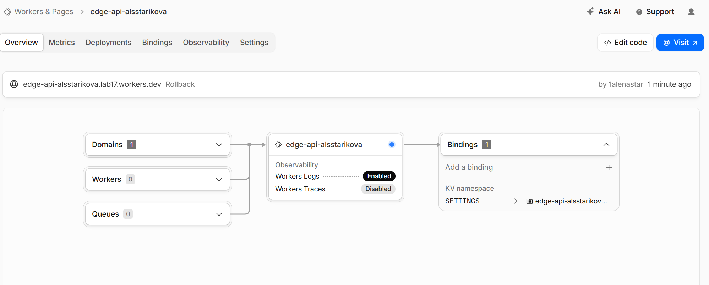
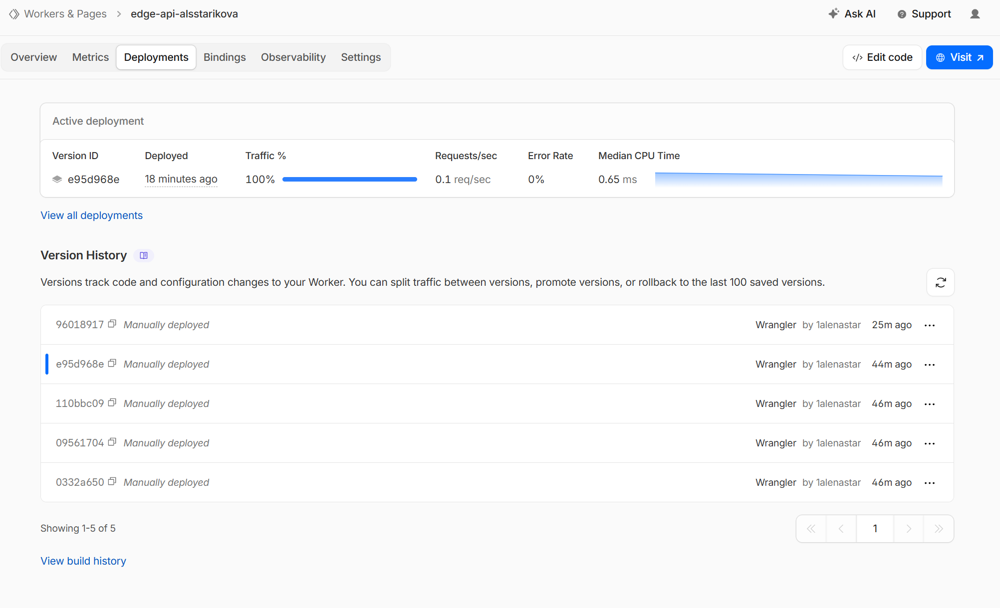
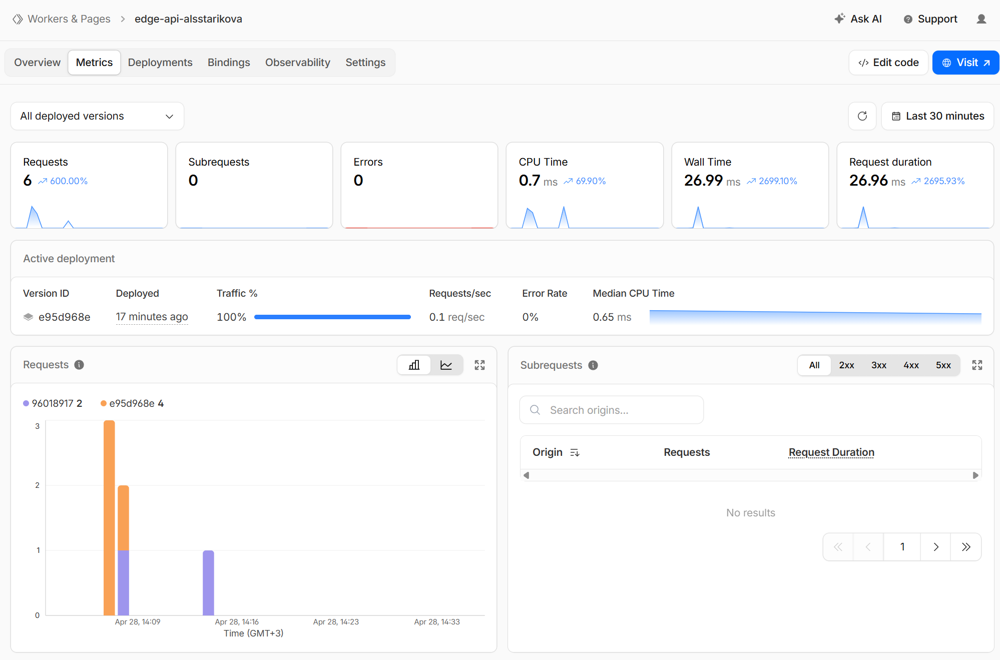
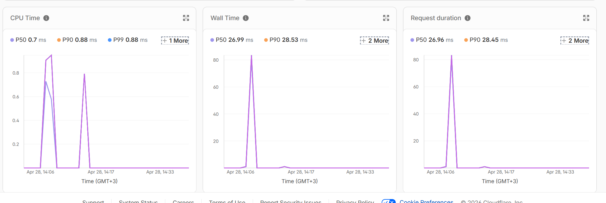
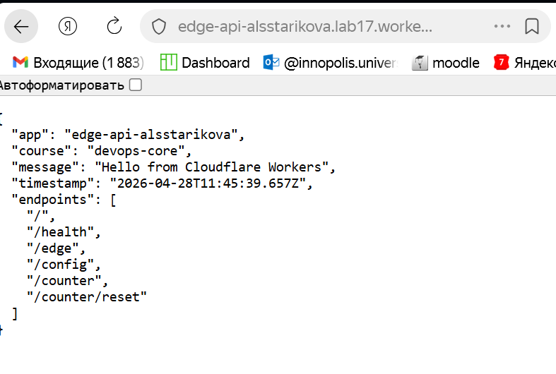
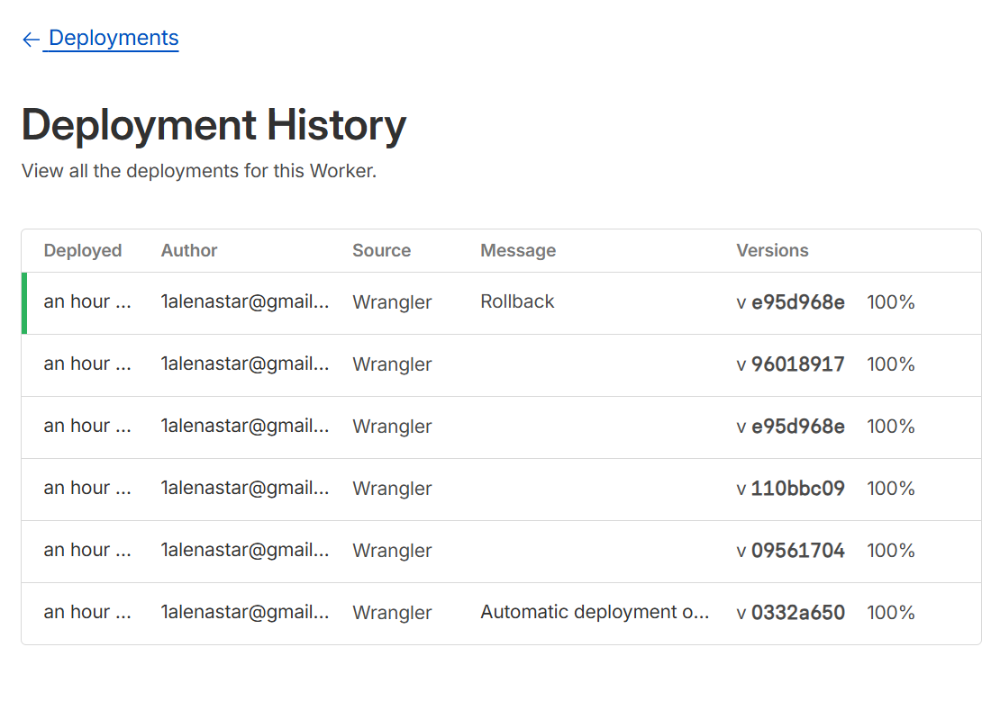

# Lab 17 — Cloudflare Workers Edge Deployment

## 1. Deployment Summary

This lab was completed using a Workers-native TypeScript project in `edge-api/`.

- Worker name: `edge-api-alsstarikova`
- Account ID: `5f3c382c1e242fb7cabc8223f8d8b42e`
- Public URL: `https://edge-api-alsstarikova.lab17.workers.dev`
- Latest observed deployed version IDs:
  - `e95d968e-f2fd-47e5-bd9b-9bb5c882516b`
  - `96018917-d9ae-43f3-abf2-cca37005011b`
- KV namespace binding:
  - `SETTINGS` -> `0a04a9cdac2d404ea875188665aec3bb`

Implemented routes:
- `GET /` - service metadata
- `GET /health` - health check
- `GET /edge` - edge metadata (`colo`, `country`, `city`, `asn`, `httpProtocol`, `tlsVersion`)
- `GET /config` - vars and secret-presence flags
- `GET /counter` - KV-backed persistent counter
- `POST /counter/reset` - reset counter in KV

---

## 2. Implementation Details

Main files:
- `edge-api/src/index.ts` - Worker logic and all endpoints
- `edge-api/wrangler.jsonc` - Worker config, vars, KV binding, observability
- `edge-api/package.json` - scripts for dev/deploy/tail/check

Key implementation points:
- Added `/health` and JSON status output
- Added edge metadata endpoint via `request.cf`
- Added `console.log(...)` for observability task
- Added plaintext vars (`APP_NAME`, `COURSE_NAME`)
- Added secrets usage through `env.API_TOKEN` and `env.ADMIN_EMAIL`
- Added KV persistence with `env.SETTINGS` on `/counter`

---

## 3. Evidence

### Task 1 — Cloudflare Setup

Completed commands and output:

```text
$ npx wrangler login
Successfully logged in.

$ npx wrangler whoami
Getting User settings...
👋 You are logged in with an OAuth Token, associated with the email 1alenastar@gmail.com.
┌────────────────────────────────┬──────────────────────────────────┐
│ Account Name                   │ Account ID                       │
├────────────────────────────────┼──────────────────────────────────┤
│ 1alenastar@gmail.com's Account │ 5f3c382c1e242fb7cabc8223f8d8b42e │
└────────────────────────────────┴──────────────────────────────────┘
```

---

### Task 2 — Build and Deploy Worker API

Local development and output:

```text
$ npm run dev
[wrangler:inf] Ready on http://localhost:8787
request { path: '/', method: 'GET', colo: 'ARN', country: 'LV' }
[wrangler:inf] GET / 200 OK
request { path: '/health', method: 'GET', colo: 'ARN', country: 'LV' }
[wrangler:inf] GET /health 200 OK

$ curl -s http://127.0.0.1:8787/ | jq
{
  "app": "edge-api-alsstarikova",
  "course": "devops-core",
  "message": "Hello from Cloudflare Workers",
  "timestamp": "2026-04-28T10:46:46.140Z",
  "endpoints": ["/", "/health", "/edge", "/config", "/counter", "/counter/reset"]
}

$ curl -s http://127.0.0.1:8787/health | jq
{
  "status": "ok",
  "service": "edge-api-alsstarikova",
  "timestamp": "2026-04-28T10:46:51.306Z"
}
```

Deployment and output:

```text
$ npm run deploy
Uploaded edge-api-alsstarikova
Deployed edge-api-alsstarikova triggers
  https://edge-api-alsstarikova.lab17.workers.dev
Current Version ID: e95d968e-f2fd-47e5-bd9b-9bb5c882516b
```

---

### Task 3 — Global Edge Behavior

Public edge execution command and output:

```text
$ curl -s "https://edge-api-alsstarikova.lab17.workers.dev/edge" | jq
{
  "colo": "ARN",
  "country": "LV",
  "city": "Riga",
  "asn": 9002,
  "httpProtocol": "HTTP/2",
  "tlsVersion": "TLSv1.3",
  "clientIp": "193.242.109.234",
  "timestamp": "2026-04-28T11:07:54.809Z"
}
```

Interpretation:
- Execution is edge-context aware (`request.cf` metadata is present).
- Worker runs on Cloudflare edge and is routed globally without manual region assignment.

Routing model summary:
- `workers.dev` provides immediate public hosting.
- Routes bind Workers to paths on Cloudflare-managed zones.
- Custom Domains bind Workers directly to owned hostnames.

Why no multi-region manual step:
- Workers deployment is global by design; no per-region VM provisioning like typical IaaS/PaaS flows.

---

### Task 4 — Configuration, Secrets & Persistence

Plaintext vars configured in `wrangler.jsonc`:
- `APP_NAME = edge-api-alsstarikova`
- `COURSE_NAME = devops-core`

Secrets, KV, and persistence commands with outputs:

```text
$ npx wrangler secret put API_TOKEN
✨ Success! Uploaded secret API_TOKEN

$ npx wrangler secret put ADMIN_EMAIL
✨ Success! Uploaded secret ADMIN_EMAIL

$ npx wrangler kv namespace create SETTINGS
🌀 Creating namespace with title "edge-api-alsstarikova-SETTINGS"
✨ Success!
...
"id": "0a04a9cdac2d404ea875188665aec3bb"

$ curl -s "https://edge-api-alsstarikova.lab17.workers.dev/config" | jq
{
  "app": "edge-api-alsstarikova",
  "course": "devops-core",
  "secret_presence": {
    "api_token_set": true,
    "admin_email_set": true
  }
}

$ curl -s "https://edge-api-alsstarikova.lab17.workers.dev/counter" | jq
{
  "visits": 1,
  "source": "workers-kv"
}

$ curl -s "https://edge-api-alsstarikova.lab17.workers.dev/counter" | jq
{
  "visits": 2,
  "source": "workers-kv"
}

$ npm run deploy
Current Version ID: 96018917-d9ae-43f3-abf2-cca37005011b

$ curl -s "https://edge-api-alsstarikova.lab17.workers.dev/counter" | jq
{
  "visits": 3,
  "source": "workers-kv"
}
```

Conclusion:
- KV data persisted across redeploy.

---

### Task 5 — Observability & Operations

Operations commands and outputs:

```text
$ npm run tail
Successfully created tail
Connected to edge-api-alsstarikova, waiting for logs...
GET https://edge-api-alsstarikova.lab17.workers.dev/edge - Ok
  (log) request { path: '/edge', method: 'GET', colo: 'ARN', country: 'LV' }

$ npx wrangler deployments list
... includes versions:
- e95d968e-f2fd-47e5-bd9b-9bb5c882516b
- 96018917-d9ae-43f3-abf2-cca37005011b

$ npx wrangler rollback
WARNING You are about to rollback to Worker Version e95d968e-f2fd-47e5-bd9b-9bb5c882516b.
SUCCESS Worker Version e95d968e-f2fd-47e5-bd9b-9bb5c882516b has been deployed to 100% of traffic.
Current Version ID: e95d968e-f2fd-47e5-bd9b-9bb5c882516b
```

Metrics:
- Metrics were reviewed in Cloudflare dashboard (requests/errors/execution panels).

---

### Screenshot Evidence

All screenshots are stored in `edge-api/screenshots/lab17/` and embedded below.

#### 1. Worker Dashboard Overview
Shows the Worker service page and confirms that the project is deployed and active in Cloudflare.



#### 2. Deployment Output / Trigger URL
Shows successful deployment details and the generated public `workers.dev` URL.



#### 3. Metrics View 1
Shows production metrics panel (request/execution observability) from Cloudflare dashboard.



#### 4. Metrics View 2
Additional metrics evidence confirming operational visibility in production.



#### 5. Public URL Availability
Shows that the Worker is reachable via public `workers.dev` endpoint.



#### 6. Deployment History
Shows version timeline/history, supporting deployment tracking and rollback evidence.



---

## 4. Kubernetes vs Cloudflare Workers Comparison

| Aspect | Kubernetes | Cloudflare Workers |
|--------|------------|--------------------|
| Setup complexity | High (cluster, networking, storage, controllers) | Low (Wrangler + config + deploy) |
| Deployment speed | Slower (manifest/chart + reconciliation) | Fast (single deploy command) |
| Global distribution | Usually explicit regional architecture | Native edge distribution by platform |
| Cost (small apps) | Higher baseline infra overhead | Lower entry cost for lightweight APIs |
| State/persistence model | PVC/DB/stateful workloads | External edge bindings (KV, D1, R2, Durable Objects) |
| Control/flexibility | Maximum infra control | Runtime constraints but simpler ops |
| Best use case | Complex long-running container platforms | Edge APIs and lightweight globally distributed logic |

---

## 5. When to Use Each

Use Kubernetes when:
- You need deep infrastructure/runtime control.
- You run complex multi-service container platforms.
- You need advanced orchestration/policy/networking patterns.

Use Cloudflare Workers when:
- You need rapid global API delivery.
- You want minimal operational overhead.
- Your workload fits request-driven serverless execution.

Recommendation:
- For this lab objective, Cloudflare Workers is the better fit.
- For complex stateful container platforms, Kubernetes remains the better long-term option.

---

## 6. Reflection

What was easier than Kubernetes:
- Faster setup and first public deployment.
- Global distribution without manual region operations.
- Built-in `workers.dev` endpoint and fast iteration cycle.

What felt more constrained:
- No Docker host workflow.
- State must be externalized to platform services.

What changed because Workers is not a Docker host:
- Architecture moved to a single edge request handler.
- Operational focus shifted from pods/volumes/nodes to bindings/deployments/edge metadata.
