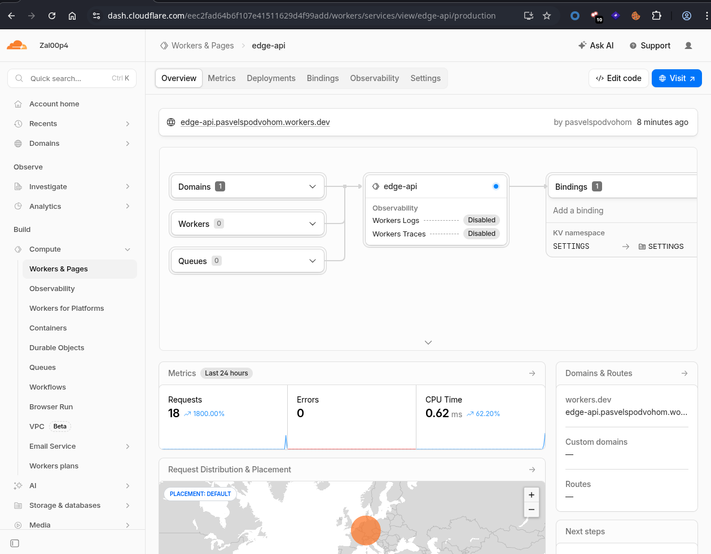
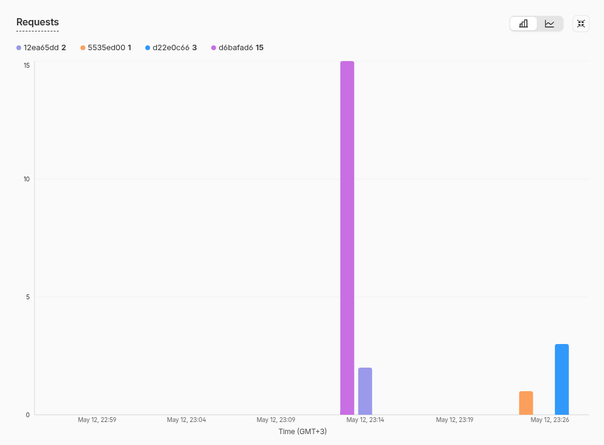
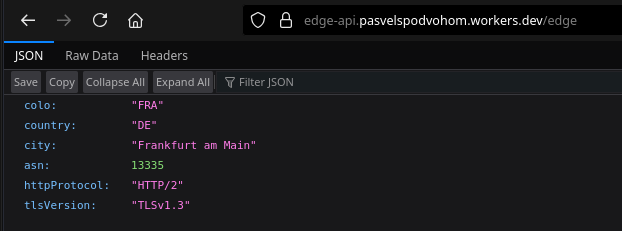
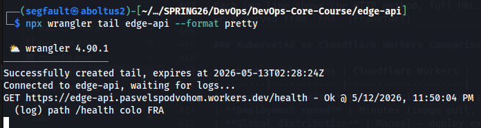

# Lab 17 — Cloudflare Workers Edge Deployment

## Task 1 — Cloudflare Setup

### Account & CLI

I signed up for a Cloudflare account at cloudflare.com (free, no credit card required) and installed Wrangler via npm:

```bash
$ npx wrangler --version
▲ [WARNING] Proxy environment variables detected. We'll use your proxy for fetch requests
4.90.1
```

I created the project manually, structuring it under `labs/lab17/edge-api/` with TypeScript source in `src/index.ts`, and a `wrangler.jsonc` configuration file

### Authentication

```bash
$ npx wrangler login
# (browser opened, authenticated with xxx)

$ npx wrangler whoami
▲ [WARNING] Proxy environment variables detected. We'll use your proxy for fetch requests

 ⛅️ wrangler 4.90.1
───────────────────
Getting User settings..
👋 You are logged in with an OAuth Token, associated with the email xxx
┌──────────────┬──────────────────────────────────┐
│ Account Name │ Account ID                       │
├──────────────┼──────────────────────────────────┤
│ Zal00p4      │ eec2fad64b6f107e41511629d4f99add │
└──────────────┴──────────────────────────────────┘
🔓 Token Permissions:
Scope (Access)
- account (read)
- workers (write)
- workers_kv (write)
- workers_scripts (write)
- workers_tail (read)
..
```

### Platform Concepts

- **Workers runtime** — a V8-based sandboxed JavaScript/TypeScript runtime running at the edge. Each Worker handles HTTP requests with extremely low latency (<1 ms cold start)
- **`workers.dev` subdomain** — every account gets `<subdomain>.workers.dev`. Workers deployed to it are publicly accessible globally with no DNS or CDN configuration
- **Bindings** — typed bridges between a Worker and platform resources. `vars` are plaintext environment variables; `secrets` are encrypted values not visible in source; `kv_namespaces` attach a KV store to the Worker as an object in `env`

---

## Task 2 — Build and Deploy a Worker API

### Worker Source (`src/index.ts`)

```ts
export interface Env {
  APP_NAME: string;
  COURSE_NAME: string;
  API_TOKEN: string;
  ADMIN_EMAIL: string;
  SETTINGS: KVNamespace;
}

export default {
  async fetch(request: Request, env: Env, ctx: ExecutionContext): Promise<Response> {
    const url = new URL(request.url);

    console.log("path", url.pathname, "colo", (request as any).cf?.colo);

    if (url.pathname === "/") {
      return Response.json({
        app: env.APP_NAME,
        course: env.COURSE_NAME,
        message: "DevOps Info Service running on Cloudflare Workers — v2",
        version: "2.0.0",
        timestamp: new Date().toISOString(),
        routes: ["/", "/health", "/edge", "/counter"],
      });
    }

    if (url.pathname === "/health") {
      return Response.json({ status: "ok", timestamp: new Date().toISOString() });
    }

    if (url.pathname === "/edge") {
      const cf = (request as any).cf ?? {};
      return Response.json({
        colo: cf.colo ?? null,
        country: cf.country ?? null,
        city: cf.city ?? null,
        asn: cf.asn ?? null,
        httpProtocol: cf.httpProtocol ?? null,
        tlsVersion: cf.tlsVersion ?? null,
      });
    }

    if (url.pathname === "/counter") {
      const raw = await env.SETTINGS.get("visits");
      const visits = Number(raw ?? "0") + 1;
      await env.SETTINGS.put("visits", String(visits));
      return Response.json({ visits });
    }

    return new Response(JSON.stringify({ error: "Not Found" }), {
      status: 404,
      headers: { "Content-Type": "application/json" },
    });
  },
};
```

### Endpoints

| Path | Description |
|------|-------------|
| `/` | App metadata, env var values |
| `/health` | Health check returning `{"status":"ok"}` |
| `/edge` | Edge request metadata from `request.cf` |
| `/counter` | KV-backed visit counter |

### First Deploy

```bash
$ npx wrangler deploy
 ⛅️ wrangler 4.90.1
───────────────────
Total Upload: 1.43 KiB / gzip: 0.62 KiB
Your Worker has access to the following bindings:
Binding                                                 Resource
env.SETTINGS (4a736228f3874c3399d8b227b7abbef2)         KV Namespace
env.APP_NAME ("edge-api")                               Environment Variable
env.COURSE_NAME ("devops-core")                         Environment Variable

Uploaded edge-api (10.76 sec)
Deployed edge-api triggers (5.74 sec)
  https://edge-api.pasvelspodvohom.workers.dev
Current Version ID: d6bafad6-0f9a-4668-94b2-8c9d08f723ba
```

### Endpoint Tests

```bash
$ curl -s https://edge-api.pasvelspodvohom.workers.dev/
{
    "app": "edge-api",
    "course": "devops-core",
    "message": "DevOps Info Service running on Cloudflare Workers",
    "timestamp": "2026-05-12T20:13:03.076Z",
    "routes": ["/", "/health", "/edge", "/counter"]
}

$ curl -s https://edge-api.pasvelspodvohom.workers.dev/health
{
    "status": "ok",
    "timestamp": "2026-05-12T20:13:05.704Z"
}

$ curl -s https://edge-api.pasvelspodvohom.workers.dev/notexist
{"error":"Not Found"}
```

**Worker URL:** https://edge-api.pasvelspodvohom.workers.dev

---

## Task 3 — Global Edge Behavior

### Edge Metadata Endpoint

```bash
$ curl -s https://edge-api.pasvelspodvohom.workers.dev/edge
{
    "colo": "FRA",
    "country": "DE",
    "city": "Frankfurt am Main",
    "asn": 13335,
    "httpProtocol": "HTTP/2",
    "tlsVersion": "TLSv1.3"
}
```

The response proves Cloudflare injects rich request metadata at the edge:
- `colo: "FRA"` — the request was handled in Cloudflare's Frankfurt data center
- `country: "DE"` — client-originating country (Germany)
- `city: "Frankfurt am Main"` — geolocation of the requesting IP
- `asn: 13335` — Cloudflare's own ASN (request routed within Cloudflare network)
- `httpProtocol: "HTTP/2"` — connection protocol used
- `tlsVersion: "TLSv1.3"` — TLS version negotiated

### How Workers Distributes Globally

Cloudflare Workers runs in 300+ data centers worldwide. When a request hits any Cloudflare anycast IP, it is routed via BGP to the nearest point of presence (PoP). The Worker runs there — there is no concept of "selecting a region."

This is fundamentally different from VM or PaaS platforms:
- **Kubernetes / VMs**: I pick a region (e.g., `ams`) and create infrastructure there. Traffic from Singapore still hits Amsterdam unless I deploy another cluster
- **Fly.io**: I explicitly add regions and each new region requires a new machine
- **Cloudflare Workers**: No `deploy to 3 regions` step exists. Deploying once means the Worker is available at every edge location simultaneously, and Cloudflare routes each request to the nearest PoP

### Routing Concepts

| Mechanism | Description |
|-----------|-------------|
| `workers.dev` | Free subdomain (`<worker>.<account>.workers.dev`). Enabled by default. No DNS configuration needed. |
| Routes | Pattern-based rules (`example.com/api/*`) that forward matching requests from a Cloudflare-proxied zone to a Worker. |
| Custom Domains | Makes a Worker the canonical origin for a subdomain, replacing any upstream server. |

I used `workers.dev` for this deployment

---

## Task 4 — Configuration, Secrets & Persistence

### Environment Variables (`wrangler.jsonc`)

```json
{
  "vars": {
    "APP_NAME": "edge-api",
    "COURSE_NAME": "devops-core"
  }
}
```

These values appear in the `/` response as `"app"` and `"course"` fields. Plaintext vars are not suitable for secrets because they are stored unencrypted in `wrangler.jsonc`, which is committed to Git and visible to anyone with repository access

### Secrets

```bash
$ echo "tok-devops-lab17-secret" | npx wrangler secret put API_TOKEN
🌀 Creating the secret for the Worker "edge-api"
✨ Success! Uploaded secret API_TOKEN

$ echo "admin@devops-course.local" | npx wrangler secret put ADMIN_EMAIL
🌀 Creating the secret for the Worker "edge-api"
✨ Success! Uploaded secret ADMIN_EMAIL

$ npx wrangler secret list
[
  { "name": "ADMIN_EMAIL", "type": "secret_text" },
  { "name": "API_TOKEN",   "type": "secret_text" }
]
```

Secrets are encrypted server-side, are injected into `env` at runtime, and their values are never returned by any API or visible in logs

### Workers KV — Persistent Counter

**Creating the namespace:**
```bash
$ npx wrangler kv namespace create SETTINGS
🌀 Creating namespace with title "SETTINGS"
✨ Success!
{
  "kv_namespaces": [
    { "binding": "SETTINGS", "id": "4a736228f3874c3399d8b227b7abbef2" }
  ]
}
```

**Binding added to `wrangler.jsonc`:**
```json
{
  "kv_namespaces": [
    { "binding": "SETTINGS", "id": "4a736228f3874c3399d8b227b7abbef2" }
  ]
}
```

**Counter increments across requests:**
```bash
$ curl -s https://edge-api.pasvelspodvohom.workers.dev/counter
{"visits": 1}
$ curl -s https://edge-api.pasvelspodvohom.workers.dev/counter
{"visits": 2}
$ curl -s https://edge-api.pasvelspodvohom.workers.dev/counter
{"visits": 3}
```

**Persistence verified after redeploy (v2):**
```bash
$ npx wrangler deploy   # deployed v2
$ curl -s https://edge-api.pasvelspodvohom.workers.dev/counter
{"visits": 4}
```

The counter continued from 3 → 4 after redeployment, proving KV data is decoupled from the Worker code lifecycle

---

## Task 5 — Observability & Operations

### Logging

A `console.log` is added at every request:

```ts
console.log("path", url.pathname, "colo", (request as any).cf?.colo);
```

Logs are streamed in real time with:

```bash
npx wrangler tail
# Output example:
# {"outcome":"ok","scriptName":"edge-api","logs":[{"message":["path","/health","colo","FRA"],"level":"log","timestamp":...}],...}
```


### Metrics

The Cloudflare dashboard at https://dash.cloudflare.com → Workers & Pages → `edge-api` → Metrics shows:
- **Requests** — total request count over time
- **Errors** — 4xx/5xx counts
- **CPU time** — per-request execution time in µs


### Deployment History

```bash
$ npx wrangler deployments list
Created:     2026-05-12T20:12:01.246Z
Author:      pasvelspodvohom@gmail.com
Source:      Upload
Version(s):  (100%) f6f16639-aa8c-4379-862b-7197b54f11eb

Created:     2026-05-12T20:12:03.780Z
Source:      Secret Change
Version(s):  (100%) 007c8a9e-cc26-4c33-b9b0-cbf23d89a34f

Created:     2026-05-12T20:12:24.517Z
Source:      Secret Change
Version(s):  (100%) bf88181d-5bf1-4924-92f4-c14ad43f6784

Created:     2026-05-12T20:12:43.063Z
Source:      Unknown (deployment)
Version(s):  (100%) d6bafad6-0f9a-4668-94b2-8c9d08f723ba

Created:     2026-05-12T20:13:50.165Z
Source:      Unknown (deployment)
Version(s):  (100%) 12ea65dd-b5a4-424f-bf19-816a42f8020e
```

5 deployment events: initial creation, two secret uploads, v1 code deploy, v2 code deploy

### Rollback

```bash
$ npx wrangler rollback --message "rollback demo"
├ Your current deployment has 1 version(s):
│ (100%) 12ea65dd-b5a4-424f-bf19-816a42f8020e
│
├ Rolling back to version d6bafad6-0f9a-4668-94b2-8c9d08f723ba
│
╰  SUCCESS  Worker Version d6bafad6-0f9a-4668-94b2-8c9d08f723ba has been
   deployed to 100% of traffic
```

Rollback is instant — no downtime, no rebuild. Cloudflare promotes the previous compiled version immediately

---

## Task 6 — Documentation & Comparison

### Deployment Summary

| Item | Value |
|------|-------|
| Worker URL | https://edge-api.pasvelspodvohom.workers.dev |
| Regions | All Cloudflare PoPs worldwide (automatic) |
| Primary PoP observed | FRA (Frankfurt) |
| KV Namespace | `SETTINGS` (id: `4a736228f3874c3399d8b227b7abbef2`) |
| Secrets | `API_TOKEN`, `ADMIN_EMAIL` |
| Env vars | `APP_NAME=edge-api`, `COURSE_NAME=devops-core` |

### Screenshots










Wrangler tail output:

```
$ npx wrangler tail --format pretty
 ⛅️ wrangler 4.90.1
───────────────────
Successfully created tail, expires at 2026-05-13T02:28:24Z
Connected to edge-api, waiting for logs...
GET https://edge-api.pasvelspodvohom.workers.dev/health - Ok @ 5/12/2026, 11:39:12 PM
  (log) path /health colo FRA
GET https://edge-api.pasvelspodvohom.workers.dev/edge - Ok @ 5/12/2026, 11:39:12 PM
  (log) path /edge colo FRA
GET https://edge-api.pasvelspodvohom.workers.dev/ - Ok @ 5/12/2026, 11:39:12 PM
  (log) path / colo FRA
```





Each log line shows the HTTP method, full URL, status, timestamp, and the `console.log` output from the Worker (`path <pathname> colo <datacenter>`). All three requests were served from `FRA` (Frankfurt)

### Kubernetes vs Cloudflare Workers Comparison

| Aspect | Kubernetes | Cloudflare Workers |
|--------|------------|--------------------|
| **Setup complexity** | High — cluster, nodes, namespaces, YAML manifests, ingress | Low — one config file, one CLI command |
| **Deployment speed** | Minutes (image pull, pod scheduling, rolling update) | Seconds (code upload, instant global propagation) |
| **Global distribution** | Manual — deploy extra clusters per region, configure routing | Automatic — one deploy reaches 300+ PoPs instantly |
| **Cost (small apps)** | Infrastructure cost even at idle (nodes always running) | Free tier: 100k req/day, 10ms CPU/req — $0 |
| **State/persistence model** | PersistentVolumes, StatefulSets, external databases | Workers KV (eventually consistent), D1, Durable Objects |
| **Control/flexibility** | Full — any language, any binary, full Linux environment | Constrained — V8 isolates, no filesystem, limited CPU time |
| **Best use case** | Long-running services, stateful workloads, complex microservices | Lightweight APIs, auth middleware, edge redirects, global fan-out |

### When to Use Each

**Kubernetes is better when:**
- The application is long-running (WebSocket server, background job processor)
- You need arbitrary binaries, shared filesystems, or GPU access
- Strong consistency across replicas is required (e.g., financial transactions)
- The team already manages a cluster and wants unified deployment tooling

**Cloudflare Workers is better when:**
- The workload is stateless or lightly stateful (API gateway, JWT validation, A/B routing)
- Global latency matters and you don't want to manage multi-region infra yourself
- Fast iteration cycle is important — deploys in seconds, instant rollback
- Cost efficiency at low-to-medium traffic is a priority

**My recommendation:** For this course's DevOps Info Service (a small JSON API with a visit counter), Workers is the right tool. It eliminates all infrastructure overhead, deploys globally in seconds, and the free tier covers the entire dev/test lifecycle. Kubernetes would make sense only if the app grew to include long-running workers, complex stateful logic, or required integration with an existing cluster-based platform

### Reflection

**What felt easier than Kubernetes:**
- No YAML manifests, no ingress controllers, no image registries to manage
- `npx wrangler deploy` in ~15 seconds vs multi-step `docker build → push → kubectl apply`
- Secrets via `wrangler secret put` are simpler than Kubernetes Secrets or external vaults
- Rollback is a single command with no state to reconcile

**What felt more constrained:**
- No persistent filesystem — I had to use KV for the visit counter instead of a file
- CPU time limit per request (10ms on free tier) would block CPU-intensive work
- No support for long-running connections (WebSockets require Durable Objects, a paid feature)
- TypeScript-only path for typed bindings; Python Workers are available but experimental

**What changed because Workers is not a Docker host:**
- I could not reuse the existing `Dockerfile` from Lab 2
- The app had to be rewritten as a Worker handler instead of a Flask server
- Port configuration, process management, and network bindings are all handled by the platform — not by me
- This is the core trade-off of PaaS/serverless: less control, less operational burden
