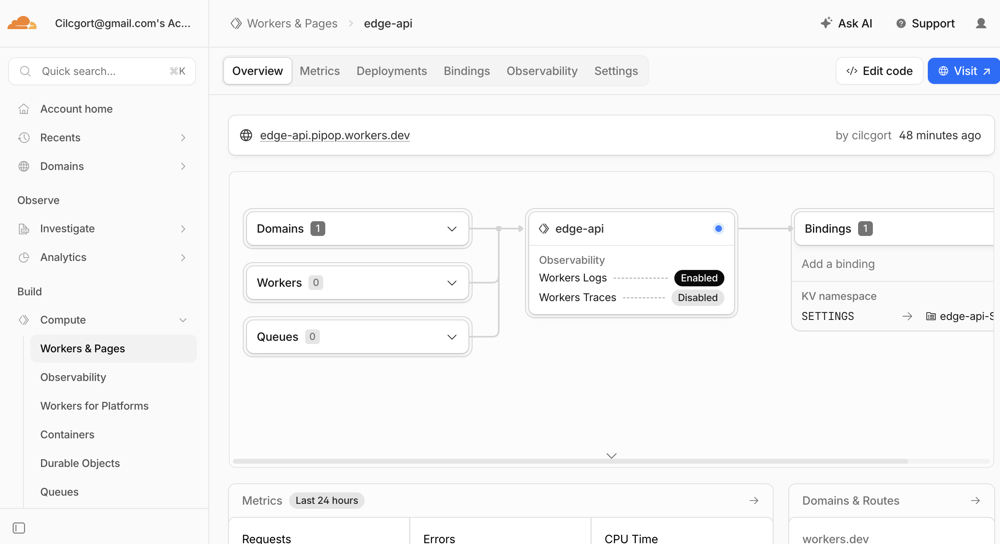

# Lab 17 — Cloudflare Workers Edge Deployment

## Deployment Summary

**Worker URL:** https://edge-api.pipop.workers.dev

### Routes

| Route | Description |
|-------|-------------|
| `GET /` | App info: name, course, timestamp, available routes |
| `GET /health` | Health check — returns `{ status: "ok" }` |
| `GET /edge` | Edge metadata from Cloudflare: colo, country, city, ASN, protocol |
| `GET /counter` | KV-backed visit counter — increments and persists across requests |

### Configuration

| Type | Name | Value |
|------|------|-------|
| Var | `APP_NAME` | `edge-api` |
| Var | `COURSE_NAME` | `devops-core` |
| Secret | `API_TOKEN` | *(stored as Wrangler secret, not committed)* |
| Secret | `ADMIN_EMAIL` | *(stored as Wrangler secret, not committed)* |
| KV Binding | `SETTINGS` | namespace id: `0b8545351dba4975b4ab1668a99a31f6` |

---

## Evidence

### /edge response

```json
{
  "colo": "AMS",
  "country": "NL",
  "city": "Amsterdam",
  "asn": 216071,
  "httpProtocol": "HTTP/3",
  "tlsVersion": "TLSv1.3"
}
```

### Cloudflare Dashboard



### Deployment History

```
2026-05-14T10:32:34Z  Upload         e79c31ab  — initial deploy
2026-05-14T10:32:36Z  Secret Change  548f22f3  — API_TOKEN secret added
2026-05-14T10:32:54Z  Secret Change  ec510932  — ADMIN_EMAIL secret added
2026-05-14T10:38:04Z  Deployment     4722c2ec  — Worker code update
2026-05-14T10:41:45Z  Deployment     5eaa98ca  — current (latest)
```

**Rollback command:**
```bash
npx wrangler rollback 4722c2ec-702d-46cc-96c7-94e80cfa8629
```

### Logs (wrangler tail)


---

## Kubernetes vs Cloudflare Workers Comparison

| Aspect | Kubernetes | Cloudflare Workers |
|--------|------------|--------------------|
| Setup complexity | High — cluster, nodes, deployments, services, ingress | Low — one CLI command, no infra to manage |
| Deployment speed | Minutes (image build + push + rollout) | Seconds (`wrangler deploy`) |
| Global distribution | Manual — choose regions, replicate across clusters | Automatic — 300+ PoPs worldwide, no config needed |
| Cost (for small apps) | High — paying for nodes 24/7 even at zero load | Free tier generous (100K req/day), pay per request |
| State/persistence model | Flexible — any DB, PVC, StatefulSet | Limited — KV (eventually consistent), Durable Objects |
| Control/flexibility | Full — any runtime, long-running processes, TCP | Limited — JS/WASM/Python only, 30s CPU limit, no Docker |
| Best use case | Long-running services, stateful apps, complex microservices | Edge APIs, low-latency routing, auth, lightweight APIs |

---

## When to Use Each

**Kubernetes is better when:**
- You have stateful workloads (databases, queues)
- You need long-running background processes
- You have complex microservice topologies requiring service mesh
- You need full control over the runtime environment (custom OS packages, GPU)
- You run on-premise or in a private cloud

**Cloudflare Workers is better when:**
- You need a globally distributed API with minimal latency
- You want zero infrastructure management
- Your workload is stateless or uses simple KV state
- You need instant deployment and automatic scaling
- Cost predictability at low traffic volumes matters

**Recommendation:** Use Workers for lightweight edge APIs, auth middleware, and latency-sensitive endpoints. Use Kubernetes for core backend services requiring full runtime control and complex state.

---

## Reflection

**What felt easier than Kubernetes:**
- No YAML manifests, no image builds, no container registry — just `wrangler deploy` and it's live globally in seconds
- No ingress controller setup — `workers.dev` URL is instant and free
- Secrets management is simpler: `wrangler secret put` without Kubernetes Secrets or external vaults
- Observability is built-in — `wrangler tail` and dashboard metrics without Prometheus/Grafana setup

**What felt more constrained:**
- No persistent TCP connections, no long-running processes — each request is fully isolated
- KV is eventually consistent and limited; no SQL, no transactions
- Can't run arbitrary Docker images — Workers-native code only (JS/TS/Python/WASM)
- 30-second CPU time limit makes it unsuitable for heavy computation

**What changed because Workers is not a Docker host:**
- No Dockerfile or image build step — the TypeScript source is bundled by Wrangler directly
- No port binding — the platform handles HTTP routing entirely
- No health check probes from a scheduler — `/health` is just a route for external monitoring tools
- Configuration is not environment files or ConfigMaps — it's `wrangler.jsonc` vars and platform secrets
