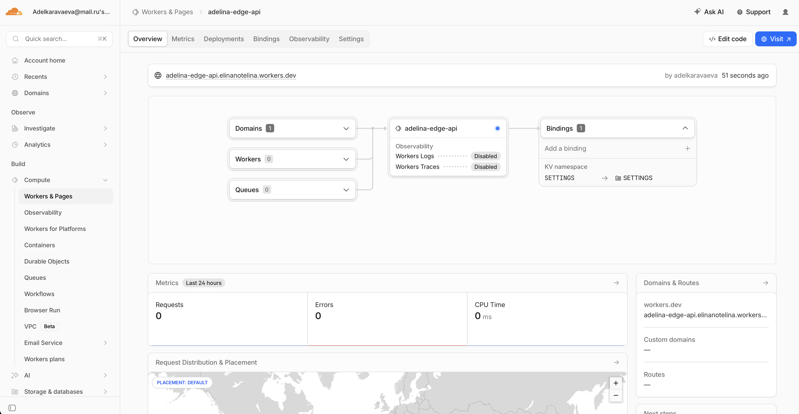
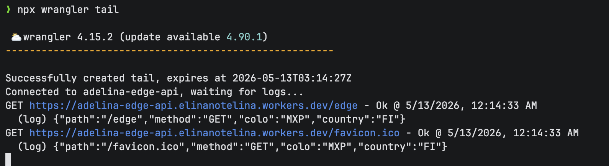
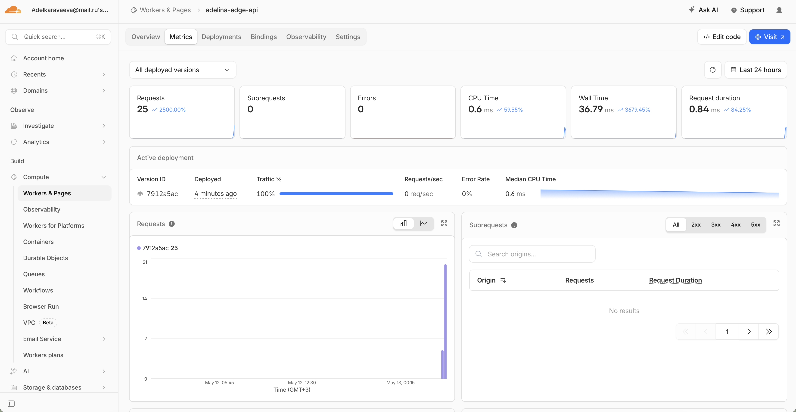

# Lab 17 Cloudflare Workers Deployment

## Deployment Summary

- Worker name: `adelina-edge-api`
- Worker URL after deployment: `https://adelina-edge-api.elinanotelina.workers.dev`
- Runtime: Cloudflare Workers TypeScript module Worker
- Public routing: `workers.dev` is enabled in `wrangler.jsonc`

Main routes:

| Route | Purpose |
| --- | --- |
| `/` | App metadata, route list, and deployment platform summary |
| `/health` | Health check with status and timestamp |
| `/edge` | Cloudflare request metadata such as `colo`, `country`, `asn`, protocol, and TLS version |
| `/config` | Plaintext variable names and non-sensitive secret configuration status |
| `/counter` | Workers KV-backed persistent visit counter |

Configuration used:

- Plaintext vars in `wrangler.jsonc`: `APP_NAME`, `COURSE_NAME`, `LAB_ID`
- Required secrets: `API_TOKEN`, `ADMIN_EMAIL`
- KV binding: `SETTINGS`
- Compatibility date: `2026-05-12`

Plaintext vars are safe only for non-sensitive values because they are committed with source code. Secret values must be created with Wrangler and are injected through the `env` object at runtime.

## Commands

Run these after authenticating with Cloudflare:

```bash
cd edge-api
npm install
npx wrangler login
npx wrangler whoami
npx wrangler kv namespace create SETTINGS
npx wrangler secret put API_TOKEN
npx wrangler secret put ADMIN_EMAIL
npx wrangler deploy
```

Validation commands:

```bash
curl https://adelina-edge-api.elinanotelina.workers.dev/
curl https://adelina-edge-api.elinanotelina.workers.dev/health
curl https://adelina-edge-api.elinanotelina.workers.dev/edge
curl https://adelina-edge-api.elinanotelina.workers.dev/config
curl https://adelina-edge-api.elinanotelina.workers.dev/counter
npx wrangler tail
npx wrangler deployments list
```

## Evidence

- Cloudflare dashboard screenshot:


- Worker logs screenshot:


- Worker metrics screenshot:



- `/edge` JSON response:

```json
{
  "colo": "FRA",
  "country": "SE",
  "city": "Stockholm",
  "asn": 210644,
  "httpProtocol": "HTTP/2",
  "tlsVersion": "TLSv1.3",
  "timezone": "Europe/Stockholm"
}
```

Example log shape from `npx wrangler tail`:

```json
GET https://adelina-edge-api.elinanotelina.workers.dev/edge - Ok @ 5/13/2026, 12:14:33 AM
  (log) {"path":"/edge","method":"GET","colo":"MXP","country":"FI"}
```

Persistence verification:

- Stored key: `visits`
- API route: `/counter`
- Expected behavior: the number increments on every request and remains after redeploy because it is stored in Workers KV, not in Worker memory.

## Global Distribution

Workers run on Cloudflare's global network. A deployment is propagated across Cloudflare's edge, and incoming requests execute near the requester without manually selecting VM regions. This differs from VM or PaaS deployments where the operator chooses regions, provisions capacity, and decides how many instances run in each place. For this lab there is no "deploy to 3 regions" step because global routing and edge placement are part of the Workers platform.

Routing concepts:

- `workers.dev`: Cloudflare-managed public hostname for quick Worker deployment.
- Routes: bind a Worker to URL patterns on a Cloudflare-managed zone.
- Custom Domains: attach a specific hostname directly to a Worker without using the default `workers.dev` hostname.

## Kubernetes vs Cloudflare Workers

| Aspect | Kubernetes | Cloudflare Workers |
| --- | --- | --- |
| Setup complexity | Requires cluster, nodes, networking, manifests, ingress, and operational tooling | Requires a Worker project, Wrangler config, and Cloudflare account |
| Deployment speed | Slower because images are built, pushed, pulled, and rolled through cluster controllers | Fast because source is bundled and deployed to the edge runtime |
| Global distribution | Manual region and cluster planning, or a managed multi-region setup | Built into the platform through Cloudflare's global network |
| Cost for small apps | Usually higher baseline because infrastructure must exist before traffic | Lower baseline for lightweight APIs and bursty traffic |
| State/persistence model | Many choices: databases, PVCs, object storage, operators | Bindings such as KV, Durable Objects, D1, R2, and external services |
| Control/flexibility | High control over runtime, networking, sidecars, jobs, and custom workloads | More constrained runtime with strong edge integration |
| Best use case | Complex services, long-running workloads, private networking, custom runtimes | Low-latency APIs, edge logic, request routing, lightweight serverless workloads |

## When to Use Each

Use Kubernetes when the workload needs container-native control, long-running processes, custom networking, heavyweight dependencies, or a platform for many internal services.

Use Cloudflare Workers when the workload is a lightweight HTTP API, request transformation layer, authentication gateway, webhook handler, or globally distributed edge function.

Recommendation for this lab: Workers is the better fit because the app is a small public HTTP API with simple configuration, secrets, edge metadata, and KV persistence.

## Reflection

Workers felt easier than Kubernetes for public access, TLS, deployment, and global distribution because those are platform defaults. The constrained part is that a Worker is not a Docker host, so the app must fit the Workers runtime and use platform bindings or external services for persistence. The implementation changed from packaging a container to writing a runtime-native TypeScript API.

