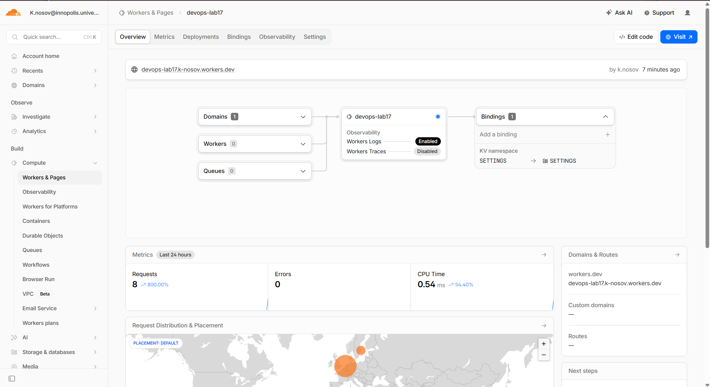
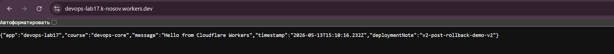

## Deployment summary

| Item | Value |
|------|-------|
| **Worker name** | `devops-lab17` |
| **Public URL** | `https://devops-lab17.k-nosov.workers.dev/` |
| **Repository path** | `edge-api/` in this monorepo |
| **Cloudflare account** | `k.nosov@innopolis.university` |
| **workers.dev subdomain** | `k-nosov.workers.dev` |
| **KV namespace** | `SETTINGS` (`1b8d36678fda4377a9727ba0ca304221`) |

### Main routes

| Method | Path | Purpose |
|--------|------|---------|
| GET | `/` | App metadata (`APP_NAME`, `COURSE_NAME`, timestamp, `DEPLOYMENT_NOTE`) |
| GET | `/health` | Liveness JSON `{ "status": "ok" }` |
| GET | `/edge` | Cloudflare request metadata: `colo`, `country`, `city`, `asn`, `httpProtocol`, `tlsVersion` |
| GET | `/counter` | Increments and returns KV-backed visit counter (`SETTINGS` binding, key `visits`) |
| GET | `/config` | Plaintext vars + booleans showing whether secrets are bound; secret values are never returned |

### Configuration

- **Plaintext vars** (`wrangler.jsonc` -> `vars`): `APP_NAME`, `COURSE_NAME`, `DEPLOYMENT_NOTE`
- **Secrets**: `API_TOKEN`, `ADMIN_EMAIL` - set with `npx wrangler secret put API_TOKEN` and `npx wrangler secret put ADMIN_EMAIL`
- **KV**: binding `SETTINGS`; namespace ID `1b8d36678fda4377a9727ba0ca304221`
- **Public route**: enabled through `workers_dev = true`, published as `devops-lab17.k-nosov.workers.dev`
- **Observability**: Workers Logs enabled in the Cloudflare dashboard

## Evidence

### Dashboard

The Cloudflare dashboard shows:

- Worker `devops-lab17` deployed under account `k.nosov@innopolis.university`.
- Active workers.dev route: `devops-lab17.k-nosov.workers.dev`.
- KV binding `SETTINGS -> SETTINGS`.
- Workers Logs enabled.
- Metrics with requests, zero errors, and CPU time recorded.



### Browser verification

The browser screenshot shows the public Worker URL returning the metadata JSON response.



The public URL returns the Worker metadata response:

```json
{
  "app": "devops-lab17",
  "course": "devops-core",
  "message": "Hello from Cloudflare Workers",
  "timestamp": "2026-05-13T15:10:16.232Z",
  "deploymentNote": "v2-post-rollback-demo-v2"
}
```

### Endpoint checks

```text
GET https://devops-lab17.k-nosov.workers.dev/health
HTTP 200
{"status":"ok"}

GET https://devops-lab17.k-nosov.workers.dev/edge
HTTP 200
{"colo":"AMS","country":"NL","city":"Amsterdam","asn":216071,"httpProtocol":"HTTP/2","tlsVersion":"TLSv1.3"}

GET https://devops-lab17.k-nosov.workers.dev/config
HTTP 200
{"appName":"devops-lab17","courseName":"devops-core","deploymentNote":"v2-post-rollback-demo-v2","secretsConfigured":{"API_TOKEN":true,"ADMIN_EMAIL":true}}

GET https://devops-lab17.k-nosov.workers.dev/counter
HTTP 200
{"visits":1,"key":"visits"}

GET https://devops-lab17.k-nosov.workers.dev/counter
HTTP 200
{"visits":2,"key":"visits"}
```

### Deployment history

```text
npx wrangler deployments list

Created:     2026-05-13T14:53:21.976Z
Author:      k.nosov@innopolis.university
Source:      Upload
Version(s):  (100%) f469e365-3d9a-44d6-933a-241db2a139b0

Created:     2026-05-13T14:53:52.187Z
Author:      k.nosov@innopolis.university
Source:      Secret Change
Version(s):  (100%) 990bb2b3-4a66-4e64-b64c-407067919275

Created:     2026-05-13T15:05:01.170Z
Author:      k.nosov@innopolis.university
Source:      Unknown (deployment)
Version(s):  (100%) ae5c773f-ea7c-45ed-8995-a677811edc9f
```

### Verification commands

```text
npm test -- --run

Test Files  1 passed (1)
Tests       3 passed (3)
```

```text
npx tsc --noEmit
exit code 0
```

---

## Kubernetes vs Cloudflare Workers

| Aspect | Kubernetes | Cloudflare Workers |
|--------|------------|--------------------|
| **Setup complexity** | Cluster control plane, networking, RBAC, manifests/Helm; steep learning curve | Account + Wrangler + small config file; minimal moving parts |
| **Deployment speed** | Image build, push, rollout, probes - often minutes | Push JS bundle to edge - often seconds |
| **Global distribution** | Multi-region clusters, ingress, DNS, and traffic engineering are mostly manual | Code runs in Cloudflare POPs near users by default |
| **Cost (small apps)** | Control-plane + nodes, even small clusters have base cost | Generous free tier; pay per requests/CPU time at scale |
| **State / persistence** | PVCs, operators, external DBs - first-class patterns | KV, Durable Objects, R2, etc.; not arbitrary POSIX disk |
| **Control / flexibility** | Full OS, any container, sysctl, sidecars, daemonsets | V8 isolate limits, CPU/time caps, restricted APIs |
| **Best use case** | Long-lived services, batch, stateful systems, anything that needs the Linux container model | HTTP APIs, auth at edge, routing, A/B, caching, lightweight transforms |

---

## When to use each

- **Prefer Kubernetes** when you need a standard container runtime, long-lived connections you fully control, heavy dependencies, or cluster-wide batch/cron beyond Workers limits.
- **Prefer Workers** when latency to users worldwide matters, traffic is mostly HTTP request/response, and state fits KV/DO/R2.
- **Recommendation:** Use Workers for global edge APIs and security/routing glue; use Kubernetes (or VMs) for core transactional backends and workloads that do not fit the Workers sandbox.

---

## Reflection

- **Easier than Kubernetes:** Single `wrangler deploy`, no cluster lifecycle, no image registry for this API shape.
- **More constrained:** No Docker image from Lab 2 here - the runtime is not a general Linux host; persistence is via platform bindings, not a local disk.
- **What changed without Docker:** The unit of deployment is the Worker script plus bindings, not a container image; observability is built into the dashboard and `wrangler tail` instead of pod logs by default.
