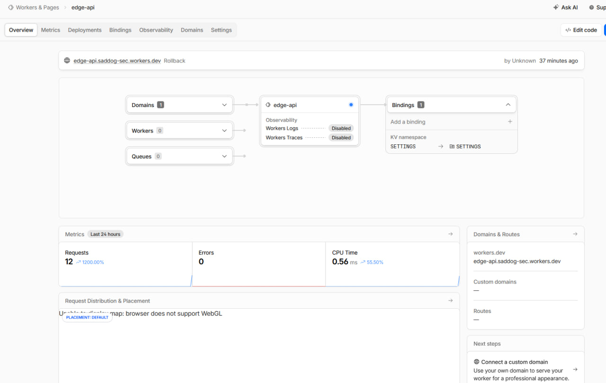
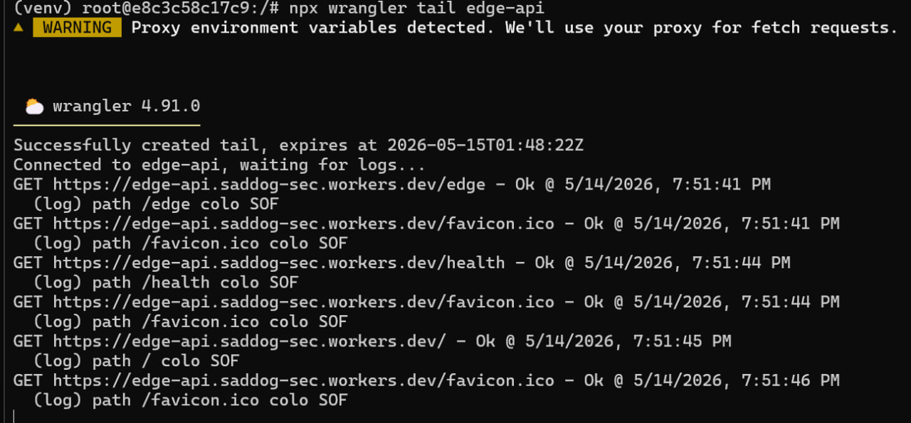

# Lab 17 — Cloudflare Workers Edge Deployment

## 1. Deployment Summary

- **Worker URL:** https://edge-api.saddog-sec.workers.dev
- **Main routes:**
  - `/` — general app information (app name, course, timestamp)
  - `/health` — health check returning `{"status":"ok"}`
  - `/edge` — edge metadata (colo, country, city, ASN, HTTP/TLS info)
  - `/counter` — KV-backed persistent visit counter
  - `/config` — configuration status (env vars, secrets, KV binding)
- **Configuration used:**
  - Plaintext vars: `APP_NAME=edge-api`, `COURSE_NAME=devops-core` (in `wrangler.jsonc`)
  - Secrets: `API_TOKEN`, `ADMIN_EMAIL` (set via `wrangler secret put`)
  - KV namespace: `SETTINGS` bound to ID `752d130be466412dbe878ebd93de69f9`

## 2. Evidence

### Cloudflare Dashboard



### `/edge` JSON Response

```json
{
    "colo": "SOF",
    "country": "BG",
    "city": "Sofia",
    "asn": 203380,
    "httpProtocol": "HTTP/2",
    "tlsVersion": "TLSv1.3"
}
```

### Log Output

The Worker includes `console.log()` statements. Example output viewed via `npx wrangler tail`:

```
path / colo SOF
path /health colo SOF
path /edge colo SOF
path /counter colo SOF
```



## 3. Kubernetes vs Cloudflare Workers Comparison

| Aspect | Kubernetes | Cloudflare Workers |
|--------|------------|--------------------|
| Setup complexity | High — cluster provisioning, networking, RBAC, container registries | Low — `npm create cloudflare` and `wrangler deploy` in minutes |
| Deployment speed | Minutes to hours (build image, push, roll out pods) | Seconds (single command, global propagation) |
| Global distribution | Manual — choose regions, set up multi-cluster or CDN | Automatic — code runs at nearest Cloudflare edge colo |
| Cost (for small apps) | Moderate-high — minimum node costs, load balancers, storage | Very low — 100K requests/day free, pay-per-request beyond |
| State/persistence model | Persistent volumes, databases, StatefulSets — full control | Ephemeral execution; external state via KV, D1, R2, Durable Objects |
| Control/flexibility | Full — any language, any workload, OS-level access | Limited — V8 isolate runtime, no filesystem, CPU time limits |
| Best use case | Complex microservices, long-running processes, stateful apps | Lightweight APIs, edge logic, request transformation, auth gateways |

## 4. When to Use Each

**Scenarios favoring Kubernetes:**
- Long-running services (databases, message queues, background workers)
- Applications requiring persistent filesystems or custom OS packages
- Multi-service architectures with complex internal networking and service mesh
- Teams needing full infrastructure control and on-premise deployment
- Workloads requiring GPUs, high memory, or custom hardware

**Scenarios favoring Cloudflare Workers:**
- Globally distributed APIs with low latency requirements
- Request/response transformation at the edge (redirects, header injection)
- Authentication and authorization gateways
- A/B testing and feature flags without code changes
- Lightweight scheduled tasks
- Rapid prototyping and MVPs where speed-to-market matters

**Recommendation:**
Use Cloudflare Workers when your workload is stateless, request-driven, and benefits from global edge distribution. Choose Kubernetes when you need persistent state, complex service topologies, custom runtimes, or full infrastructure control. A hybrid approach often works best: Workers handle edge routing and lightweight logic, while Kubernetes manages core services and the data layer.

## 5. Reflection

**What felt easier than Kubernetes?**
- Deployment speed: a single `wrangler deploy` pushed code globally in seconds — no Docker builds, image registries, or pod rollouts
- Global distribution: no need to select regions, configure multi-cluster networking, or set up a CDN — the Worker automatically ran at the nearest edge
- Zero server management: no nodes to provision, no OS patches, no kubeconfig, no Helm charts
- Built-in URL: instant `workers.dev` subdomain without configuring DNS or ingress controllers

**What felt more constrained?**
- No filesystem or long-running processes: Workers are request-scoped with CPU time limits (10ms free, 30s paid) — can't run a database or background job natively
- Limited runtime: only V8 isolate-compatible JavaScript/TypeScript/WASM — no Python, Go, or Rust binaries
- KV eventual consistency: Workers KV is eventually consistent, not suitable for real-time counters or strong consistency requirements
- Debugging constraints: no SSH into a pod; logs require `wrangler tail` or dashboard — no `kubectl exec` equivalent

**What changed because Workers is not a Docker host?**
- The Docker image from Lab 2 could not be deployed here — application logic was reimplemented as a Worker-native TypeScript API
- Configuration shifted from environment files and Docker Compose to `wrangler.jsonc` vars, Wrangler secrets, and KV bindings
- Persistence moved from container volumes or external databases to Workers KV, which has different consistency and performance characteristics
- The deployment model changed from container orchestration (pods, replicas, health probes) to versioned function deployments with instant rollback
