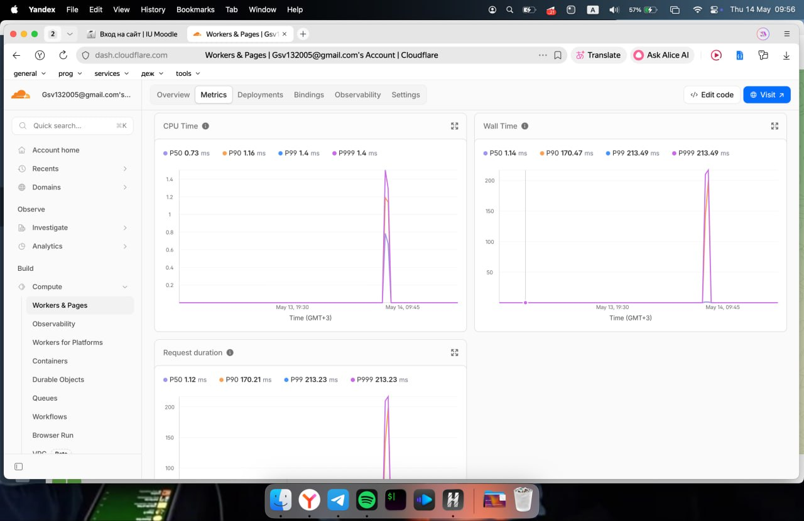

# Lab 17 — Cloudflare Workers Edge Deployment

`edge-api` — a TypeScript Worker deployed to `workers.dev` covering all six lab tasks: setup, HTTP API, edge metadata, vars + secrets + KV, observability with rollback, documentation.

## 1. Deployment

| Field | Value |
|---|---|
| Worker | `edge-api` |
| Public URL | <https://edge-api.gsv132005.workers.dev> |
| Account | `Gsv132005@gmail.com` (`6b2c8bcdf1941a71f1054b537dd5ab5d`) |
| Subdomain | `gsv132005.workers.dev` |
| Runtime | Workers (V8 isolates), TypeScript |
| Wrangler | `4.70.0` |
| Compatibility date | `2025-05-01` |

### Routes

| Method | Path | Purpose | Auth |
|---|---|---|---|
| GET | `/` | App info + masked admin email + version | — |
| GET | `/health` | Liveness probe | — |
| GET | `/edge` | `colo`, `country`, `city`, `asn`, `httpProtocol`, `tlsVersion` | — |
| GET | `/counter` | KV-backed visit counter (`SETTINGS` namespace) | — |
| GET | `/version` | `{version: "1.1.0"}` (added in v1.1) | — |
| GET | `/admin` | Returns admin info | Bearer `API_TOKEN` |
| `*` | `/*` | JSON 404 fallback | — |

### Configuration (`wrangler.jsonc`)

- `vars`: `APP_NAME=edge-api`, `COURSE_NAME=devops-core`
- `kv_namespaces`: `SETTINGS` → `0717bb1979f34755bbc158911b37901c`
- `observability.enabled: true` (Workers Logs)

Plaintext vars are read from `wrangler.jsonc` and are visible to anyone with repo access — unsuitable for credentials. Secrets are stored encrypted on Cloudflare and surfaced through `env` at runtime:

- `API_TOKEN` (gates `/admin`)
- `ADMIN_EMAIL` (returned masked on `/`)

Both were set with `npx wrangler secret put <NAME>`; values are never committed.

## 2. Evidence

### Endpoints

```bash
$ curl https://edge-api.gsv132005.workers.dev/health
{"status":"ok","app":"edge-api","timestamp":"2026-05-14T00:41:55.884Z"}

$ curl https://edge-api.gsv132005.workers.dev/edge
{"colo":"DME","country":"NL","city":"Rotterdam","asn":208398,
 "httpProtocol":"HTTP/2","tlsVersion":"TLSv1.3",
 "timestamp":"2026-05-14T00:43:14.220Z"}

$ curl https://edge-api.gsv132005.workers.dev/
{"app":"edge-api","version":"1.1.0","course":"devops-core",
 "message":"Hello from Cloudflare Workers","admin":"g***@gmail.com", ...}

$ curl -i .../admin                # no token → blocked
HTTP/2 401
{"error":"unauthorized"}

$ curl -H "Authorization: Bearer $API_TOKEN" .../admin
{"admin":"gsv132005@gmail.com","app":"edge-api"}
```

### KV persistence across redeploy + rollback

```bash
$ curl .../counter; curl .../counter; curl .../counter
{"visits":1,...}  {"visits":2,...}  {"visits":3,...}
# … redeploy v1.1, rollback to v1.0, redeploy v1.1 …
$ curl .../counter
{"visits":6,"app":"edge-api"}
```

The counter is the same `visits` key in the `SETTINGS` KV namespace; KV survives every version change because it is a binding, not part of the bundle.

### Logs (`wrangler tail`, real output)

```
 ⛅️ wrangler 4.70.0
Successfully created tail, expires at 2026-05-14T06:49:33Z
Connected to edge-api, waiting for logs...
GET https://edge-api.gsv132005.workers.dev/health - Ok @ 5/14/2026, 3:49:46 AM
  (log) path /health colo DME
GET https://edge-api.gsv132005.workers.dev/edge - Ok @ 5/14/2026, 3:49:46 AM
  (log) path /edge colo DME
GET https://edge-api.gsv132005.workers.dev/counter - Ok @ 5/14/2026, 3:49:46 AM
  (log) path /counter colo DME
```

Source: `console.log("path", url.pathname, "colo", request.cf?.colo)` in `src/index.ts`. With `observability.enabled = true`, the same entries are retained in the dashboard.

### Dashboard




## 3. Operations — deployments & rollback

```bash
$ npx wrangler deployments list
```

| # | Version ID | Source | Notes |
|---|---|---|---|
| 1 | `9f16be96` | Upload | v1.0.0, no `/version`, no secrets bound |
| 2 | `51aa1c3e` | Secret change | `API_TOKEN` added |
| 3 | `8e6d2195` | Secret change | `ADMIN_EMAIL` added |
| 4 | `405f7aea` | Deploy | v1.1.0 — adds `/version` and `version` field on `/` |
| 5 | `9f16be96` | **Rollback** | `wrangler rollback 9f16be96 --yes` |
| 6 | `ad554ac1` | Deploy | Re-deploy v1.1.0 (current) |

Rollback verification — `/version` returned `404` (route didn't exist in v1.0.0), then `/version` returned `1.1.0` again after redeploy. KV (`/counter`) survived all six transitions.

## 4. Edge analysis

`/edge` returns `colo=DME, country=NL` from a request originating in Russia. Two observations from this:

1. **No regions to configure.** A Worker is a code bundle uploaded once; Cloudflare replicates the bundle to every colo (300+) and runs it on the colo closest to each incoming request. There is no `regions = [...]` field in `wrangler.jsonc`, no scaling group, no rollout per region. The "deploy to 3 regions" step from the Fly.io brief is structurally absent because deployment and placement are decoupled.

2. **`colo` is observability, not a deploy target.** The colo only tells me *where this specific request was handled*. It can shift between calls based on routing, anycast topology, and outages — useful for tracing, useless as a placement knob. For data residency you bind to a regional KV/D1 with region hints; for code placement there is no knob.

**Routing layers:**

- `workers.dev` — fastest path to a public URL; `<worker>.<subdomain>.workers.dev` is the assigned hostname. Used here.
- **Routes** — attach a Worker to specific URL patterns inside an existing Cloudflare zone (e.g. `api.example.com/*`).
- **Custom Domains** — make the Worker the origin for a domain or subdomain managed by Cloudflare DNS, with automatic TLS. Skipped (no zone owned).

## 5. Kubernetes vs Cloudflare Workers

| Aspect | Kubernetes | Cloudflare Workers |
|---|---|---|
| Setup | Cluster, ingress, RBAC, registry, storage classes | `npm create cloudflare`, `wrangler login`, `wrangler deploy` |
| Deploy time | Minutes (build → push → rollout) | ~10–15 s end-to-end |
| Global distribution | Manual: clusters/regions + CDN/federation | Automatic on every request, all colos |
| Cost (small app) | Idle node ≈ \$5–\$15/mo + LB | Free up to 100k req/day; no idle cost |
| State model | Volumes, StatefulSets, external DBs, full FS | No FS; KV / R2 / D1 / Durable Objects / Queues |
| Runtime | Any binary, sidecars, GPUs | TS / JS / WASM / Py; 30 s CPU, ~128 MB isolate |
| Networking | Any TCP/UDP, sockets, ingress | HTTP request/response; outbound `fetch` |
| Best fit | Stateful, long-running, polyglot, regulated | Stateless HTTP, edge logic, global APIs |

## 6. When to use each

**Kubernetes when** the workload is stateful or long-running, needs custom binaries/GPUs, exceeds Workers' per-request CPU/memory budget, or requires explicit region/data-residency control. Also the right choice when you already operate a cluster and the operational gain of one more service is near zero.

**Workers when** the workload is a stateless HTTP API or thin edge layer, latency budget is sub-50 ms globally, persistence fits KV/D1/R2, and the team values minimum operational surface and cost predictability.

**For `edge-api`-style workloads → Workers.** ~100 lines of TS, counter-sized state, no idle cost, instant global. If the same service had to wrap Postgres, run a queue consumer, or host a long TCP server, the choice would flip to Kubernetes.

## 7. Reflection

**Easier than Kubernetes**
- One command (`wrangler deploy`) replaces the whole CI/CD chain: image build, registry push, manifests, rollout strategy, ingress, TLS, DNS.
- Public URL is free and instant via `workers.dev`; no `LoadBalancer` Service, no `cert-manager`, no DNS waits.
- Secrets are `wrangler secret put NAME` — no `kubectl create secret`, no Sealed/External Secrets.
- Rollback is one command targeting a version ID; no rollout history to babysit.
- Zero idle cost — relevant for a course project that doesn't run 24/7 against real traffic.

**More constrained**
- No filesystem and no long-running processes. `EXPOSE` and `CMD` from Lab 2's Dockerfile do not translate; state has to fit a KV-style API.
- Hard runtime limits: 30 s CPU per request, ~128 MB per isolate, no listening on arbitrary ports, no shelling out.
- No region-pinning. Acceptable for an edge API; a blocker if data must stay in a specific jurisdiction.
- Smaller ecosystem of supported libraries — many npm packages assume Node's full surface (`fs`, `child_process`, native modules) and won't run.

**What changed because Workers is not a Docker host**
- The Lab 2 Dockerfile is irrelevant — built a Workers-native API instead of repackaging FastAPI.
- The Fly.io brief's "deploy to 3 regions" step disappears (see §4): Workers distributes automatically; `colo` is observability.
- The Lab 9 health probe becomes just `GET /health` in the same Worker — no kubelet, no liveness/readiness split. If the Worker throws, the next request gets a fresh isolate.
- ConfigMaps + Secrets (Lab 12) collapse into `vars` + `secrets` bindings; the PVC for `/data/visits` becomes a KV namespace key.
