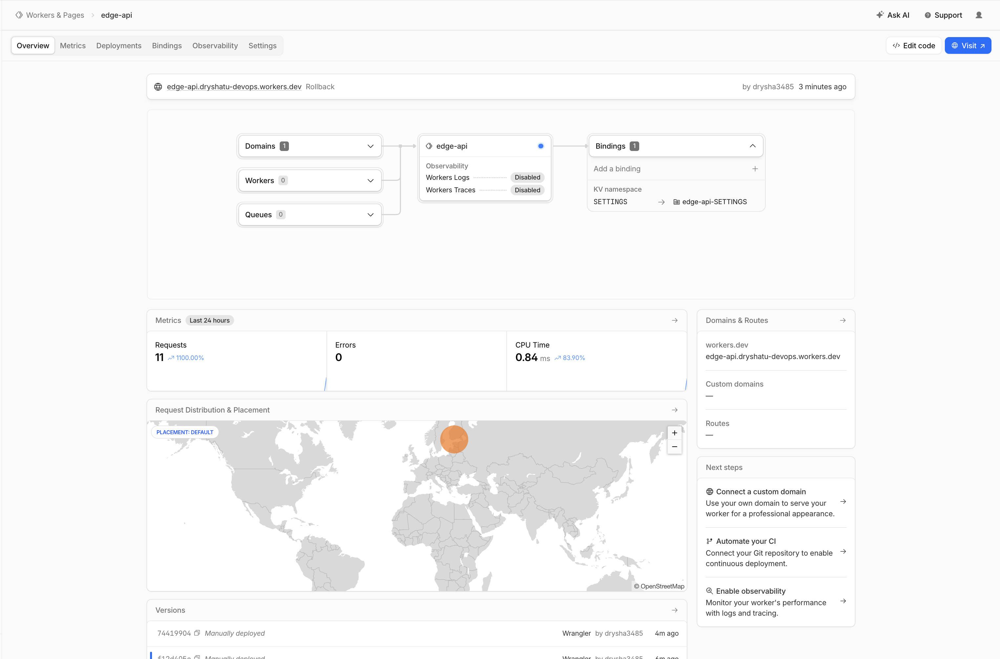
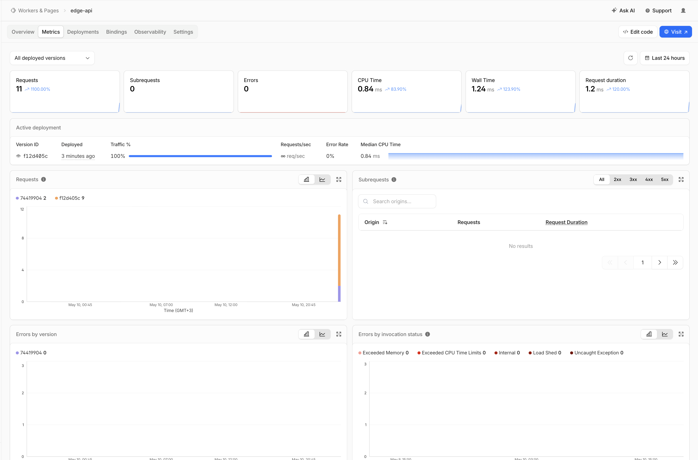

# Cloudflare Workers — Edge API Documentation

## Deployment Summary

| Field | Value |
|-------|-------|
| **Worker Name** | `edge-api` |
| **Public URL** | `https://edge-api.dryshatu-devops.workers.dev` |
| **Runtime** | Cloudflare Workers (V8 isolates) |
| **Language** | TypeScript |
| **Account ID** | `2acbf7522d471aa0c09bfa3ec191e323` |
| **KV Namespace ID** | `939d5ba95083492da53b9dcf76b01710` |

### Main Routes

| Route | Method | Description |
|-------|--------|-------------|
| `/` | GET | General app information (name, course, timestamp) |
| `/health` | GET | Health-check — returns `{ "status": "ok" }` |
| `/edge` | GET | Edge metadata: colo, country, city, ASN, HTTP protocol, TLS version |
| `/counter` | GET | KV-backed persistent visit counter |

### Configuration

- **Plaintext variables** (`wrangler.jsonc`): `APP_NAME=edge-api`, `COURSE_NAME=devops-core`
- **Secrets** (set via Wrangler CLI): `API_TOKEN`, `ADMIN_EMAIL`
- **KV namespace**: `SETTINGS` (ID: `939d5ba95083492da53b9dcf76b01710`) — stores the visit counter

---

## Evidence

### Example `/` Response

```json
{
    "app": "edge-api",
    "course": "devops-core",
    "message": "Hello from Cloudflare Workers edge network",
    "timestamp": "2026-05-10T17:49:09.421Z"
}
```

### Example `/health` Response

```json
{
    "status": "ok",
    "timestamp": "2026-05-10T17:49:09.575Z"
}
```

### Example `/edge` JSON Response

```json
{
    "colo": "FRA",
    "country": "RU",
    "city": "Moscow",
    "asn": 200350,
    "httpProtocol": "HTTP/2",
    "tlsVersion": "TLSv1.2"
}
```

This shows the Worker executing at the **FRA** (Frankfurt) Cloudflare data center, serving a request from **Moscow, Russia** (ASN 200350) over **HTTP/2** with **TLSv1.2**.

### Example `/counter` Response (after multiple visits)

```json
{
    "visits": 4
}
```

The counter persisted across redeployments — it was at 3 before the v2 deploy and incremented to 4 after the redeploy, confirming KV data survives Worker updates.

### Cloudflare Dashboard



The dashboard shows the `edge-api` Worker deployed at `edge-api.dryshatu-devops.workers.dev` with:
- 1 Domain, 0 Workers (sub-workers), 0 Queues
- KV namespace binding: `SETTINGS` → `edge-api-SETTINGS`
- Metrics: 11 requests, 0 errors, 0.84 ms CPU time
- Request distribution map showing traffic from Europe
- Versions list showing deployment history including rollback

### Worker Metrics



The Metrics tab shows:
- **11 total requests** (1100% increase from baseline)
- **0 subrequests**, **0 errors**
- **0.84 ms** average CPU time, **1.24 ms** wall time, **1.2 ms** request duration
- Active deployment: version `f12d405c` at 100% traffic (after rollback)
- Request breakdown by version: 2 requests on `74419904` (v2), 9 requests on `f12d405c` (v1/rollback)
- Zero errors across all categories (memory, CPU limits, internal, load shed, uncaught exceptions)

---

## Global Edge Behavior

### How Workers Distributes Execution Globally

Cloudflare Workers run on Cloudflare's global network of **300+ data centers** across the world. When a request arrives, it is handled by the nearest data center (PoP — Point of Presence) to the user. There is no concept of "deploying to a region" — the code is automatically distributed to every edge location upon `npx wrangler deploy`.

Our `/edge` endpoint demonstrates this: the request from a Moscow-based VM was routed to the **FRA** (Frankfurt) data center — the nearest Cloudflare PoP. A request from the US would be routed to a US data center instead.

This is fundamentally different from VM-based or PaaS platforms where you must:
1. Choose a region (e.g., `us-east-1`, `europe-west1`)
2. Optionally replicate to additional regions manually
3. Set up load balancing across regions

With Workers, **there is no "deploy to 3 regions" step** because every deployment is inherently global. The runtime uses V8 isolates (not containers or VMs), which start in under 5 ms and consume minimal memory, making it feasible to run code at every edge location simultaneously.

### Routing Concepts

| Concept | Description |
|---------|-------------|
| **`workers.dev`** | Free subdomain provided by Cloudflare. Gives you a public URL immediately (`<worker>.<subdomain>.workers.dev`). Used for this lab: `edge-api.dryshatu-devops.workers.dev`. |
| **Routes** | Attach a Worker to specific URL patterns on an existing Cloudflare-managed domain (zone). E.g., `example.com/api/*` triggers the Worker. |
| **Custom Domains** | Make the Worker the authoritative origin for a domain or subdomain. Requires the domain to be on Cloudflare. |

For this lab, we use the default `workers.dev` URL.

---

## Configuration, Secrets & Persistence

### Why Plaintext Variables Are Not Suitable for Secrets

Plaintext variables defined in `wrangler.jsonc` are:
- Committed to version control (visible in the repository)
- Visible in the Cloudflare dashboard settings
- Not encrypted at rest in the configuration file

Secrets, on the other hand, are:
- Set via `npx wrangler secret put <NAME>` (never written to files)
- Encrypted at rest by Cloudflare
- Not visible in `wrangler.jsonc` or in Git history
- Only accessible at runtime through the `env` object

### Secrets Created

```bash
echo 'my-secret-api-token-2026' | npx wrangler secret put API_TOKEN
# ✨ Success! Uploaded secret API_TOKEN

echo 'admin@devops-course.example' | npx wrangler secret put ADMIN_EMAIL
# ✨ Success! Uploaded secret ADMIN_EMAIL
```

### KV Persistence Verification

1. Created KV namespace: `npx wrangler kv namespace create SETTINGS` → ID `939d5ba95083492da53b9dcf76b01710`
2. Bound namespace in `wrangler.jsonc`
3. Deployed the Worker: `npx wrangler deploy`
4. Called `/counter` 3 times → received `{ "visits": 1 }`, `{ "visits": 2 }`, `{ "visits": 3 }`
5. Deployed v2 of the Worker: `npx wrangler deploy` (changed message text)
6. Called `/counter` again → received `{ "visits": 4 }` — **value persisted across redeploy** ✅

This confirms that KV data survives redeployments, as KV is an external data store independent of the Worker code.

---

## Observability & Operations

### Logging

A `console.log()` statement is included in the Worker to log every incoming request:

```ts
console.log("request", url.pathname, "method", request.method, "colo", (request as any).cf?.colo);
```

Logs are viewed with:

```bash
npx wrangler tail
```

Example log entry:

```
GET /edge - ok
  request /edge method GET colo FRA
```

### Metrics

The Cloudflare dashboard (Workers → edge-api → Metrics) shows:
- **Total requests** over time
- **Error rate** (4xx / 5xx)
- **CPU time** per invocation
- **Request duration** percentiles

### Deployment History

```bash
npx wrangler deployments list
```

Output showing 5+ deployments:

```
Created:     2026-05-10T17:46:10.180Z
Author:      drysha3485@gmail.com
Source:      Upload
Version(s):  (100%) a842a8f9-b44a-4d02-bb3d-7f7a3dd9fec4

Created:     2026-05-10T17:47:17.361Z
Author:      drysha3485@gmail.com
Source:      Unknown (deployment)
Version(s):  (100%) a302b1c9-3236-44f3-ad4f-2da0c15171e3

Created:     2026-05-10T17:47:35.581Z
Author:      drysha3485@gmail.com
Source:      Secret Change
Version(s):  (100%) e154b4dc-fe24-4cb0-82c9-6b99f4f017cd

Created:     2026-05-10T17:47:44.689Z
Author:      drysha3485@gmail.com
Source:      Secret Change
Version(s):  (100%) f12d405c-5713-4caa-ab03-65ecee23f9d6

Created:     2026-05-10T17:49:41.704Z
Author:      drysha3485@gmail.com
Source:      Unknown (deployment)
Version(s):  (100%) 74419904-39fd-4c95-bf23-af78863d9781
```

### Rollback

Performed a rollback to the previous version:

```bash
npx wrangler rollback
```

Output:
```
├ Your current deployment has 1 version(s):
│ (100%) 74419904-39fd-4c95-bf23-af78863d9781 (v2 with updated message)
│
├ Finding latest stable Worker Version to rollback to
│
╰  SUCCESS  Worker Version f12d405c-5713-4caa-ab03-65ecee23f9d6 has been deployed to 100% of traffic.
```

After rollback, the `/` endpoint returned the original message ("Hello from Cloudflare Workers edge network" without "v2"), confirming the rollback was successful.

---

## Kubernetes vs Cloudflare Workers Comparison

| Aspect | Kubernetes | Cloudflare Workers |
|--------|------------|--------------------|
| **Setup complexity** | High — requires cluster provisioning, kubectl, Helm, manifests, networking | Low — `npm create cloudflare`, `npx wrangler deploy` |
| **Deployment speed** | Minutes (image build, push, rollout) | Seconds (~6 sec for our deploy) |
| **Global distribution** | Manual — deploy to multiple clusters/regions, configure load balancing | Automatic — code runs at 300+ edge locations instantly |
| **Cost (for small apps)** | High — minimum cluster cost even at idle (nodes, control plane) | Free tier covers 100K requests/day; pay-per-request beyond |
| **State/persistence model** | Persistent Volumes, StatefulSets, external databases | Workers KV (eventually consistent), Durable Objects, D1 (SQLite) |
| **Control/flexibility** | Full — any language, any runtime, any binary, custom networking | Constrained — V8 isolate, no filesystem, limited CPU time, specific APIs |
| **Best use case** | Long-running services, complex microservices, stateful workloads | Lightweight APIs, edge logic, low-latency global endpoints |

### When to Use Kubernetes

- You need **full control** over the runtime environment (custom binaries, GPU, long-running processes)
- Your application is **stateful** and requires persistent volumes or complex storage
- You run **multiple interconnected microservices** with service mesh, sidecars, etc.
- You need **custom networking** (VPNs, private subnets, service discovery)
- Your workload requires **more than 30 seconds** of CPU time per request

### When to Use Cloudflare Workers

- You need **global low-latency** responses without managing infrastructure
- Your API is **lightweight** and stateless (or uses KV / Durable Objects for state)
- You want **zero-ops deployment** — no clusters, no nodes, no scaling configuration
- You're building **edge logic**: A/B testing, header manipulation, auth at the edge, redirects
- **Cost matters** — the free tier is generous for small-to-medium traffic

### Recommendation

For this course's app (a simple HTTP API showing timestamps), **Cloudflare Workers is the better fit** — it deploys in seconds, costs nothing on the free tier, and is globally distributed by default. Kubernetes would be overkill for this use case but becomes essential when you need container-level control, complex orchestration, or long-running stateful services.

---

## Reflection

### What Felt Easier Than Kubernetes?

- **Deployment**: `npx wrangler deploy` (~6 seconds) vs building Docker images, pushing to a registry, writing manifests, and running `kubectl apply`
- **Global availability**: Instant worldwide distribution vs. provisioning clusters in multiple regions
- **Configuration**: Simple `wrangler.jsonc` vs. ConfigMaps, Secrets, Helm values, and environment variable injection
- **No infrastructure management**: No nodes to provision, no cluster upgrades, no resource limits to tune
- **Rollback**: `npx wrangler rollback` instantly reverts to the previous version

### What Felt More Constrained?

- **No filesystem access**: Cannot read/write files, no `/tmp` directory
- **Limited runtime**: V8 isolates only — no arbitrary binaries, no Docker images, no system calls
- **CPU time limits**: 10 ms on free plan (50 ms on paid) per request — not suitable for heavy computation
- **Eventual consistency**: KV is eventually consistent globally, unlike a database with strong consistency
- **Debugging**: No SSH into a container, no `kubectl exec` — only `console.log` and `wrangler tail`
- **Network restrictions**: TLS 1.3 with ECH is blocked in some regions (Russia), requiring `--tlsv1.2` workaround

### What Changed Because Workers Is Not a Docker Host?

- The app was **rewritten from scratch** in TypeScript for the Workers runtime instead of reusing the Python Flask app from Lab 2
- **No Dockerfile**, no image registry, no container orchestration
- State management shifted from **volumes/databases** to **Workers KV** (a key-value store)
- Health checks are just HTTP routes, not Kubernetes liveness/readiness probes
- Secrets are managed via `wrangler secret put` instead of Kubernetes Secrets or sealed secrets
- The deployment artifact is a **JavaScript bundle** (~1.23 KiB), not a Docker image (~100+ MB)
