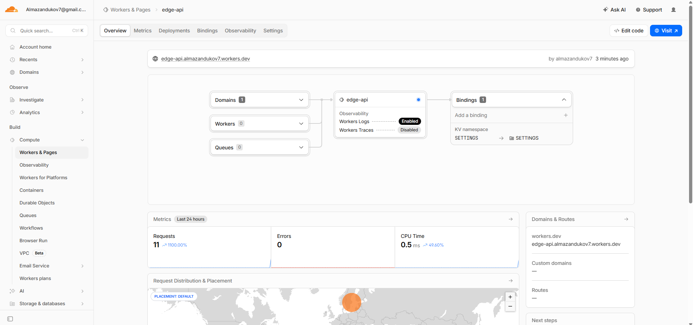

## Deployment summary

| Item                | Value                                         |
|---------------------|-----------------------------------------------|
| **Worker name**     | `edge-api` (see `wrangler.jsonc`)             |
| **Public URL**      | `https://edge-api.almazandukov7.workers.dev/` |
| **Repository path** | `edge-api/` in this monorepo                  |

### Main routes

| Method | Path       | Purpose                                                                                     |
|--------|------------|---------------------------------------------------------------------------------------------|
| GET    | `/`        | App metadata (`APP_NAME`, `COURSE_NAME`, timestamp, `DEPLOYMENT_NOTE`)                      |
| GET    | `/health`  | Liveness JSON `{ "status": "ok" }`                                                          |
| GET    | `/edge`    | Cloudflare request metadata: `colo`, `country`, `city`, `asn`, `httpProtocol`, `tlsVersion` |
| GET    | `/counter` | Increments and returns KV-backed visit counter (`SETTINGS` binding, key `visits`)           |
| GET    | `/config`  | Plaintext vars + booleans showing whether secrets are bound (values never returned)         |

### Configuration

- **Plaintext vars** (`wrangler.jsonc` -> `vars`): `APP_NAME`, `COURSE_NAME`, `DEPLOYMENT_NOTE`
- **Secrets**: `API_TOKEN`, `ADMIN_EMAIL` - set with `npx wrangler secret put <NAME>`
- **KV**: binding `SETTINGS`; namespace ID must be created and pasted into `wrangler.jsonc`

## Evidence

### Dashboard


### `/edge` response

```json
{
  "colo": "ARN",
  "country": "SE",
  "city": "Stockholm",
  "asn": 215439,
  "httpProtocol": "HTTP/2",
  "tlsVersion": "TLSv1.3"
}
```

### Logs

```text
GET https://edge-api.almazandukov7.workers.dev/edge - Ok @ 13.05.2026, 16:19:01
  (log) [edge-api] GET /edge colo= ARN
GET https://edge-api.almazandukov7.workers.dev/ - Ok @ 13.05.2026, 16:19:11
  (log) [edge-api] GET / colo= ARN
GET https://edge-api.almazandukov7.workers.dev/config - Ok @ 13.05.2026, 16:19:19
  (log) [edge-api] GET /config colo= ARN
GET https://edge-api.almazandukov7.workers.dev/counter - Ok @ 13.05.2026, 16:19:22
  (log) [edge-api] GET /counter colo= ARN
```

```text
npx wrangler deployments list

 ⛅️ wrangler 4.90.1
───────────────────
Created:     2026-05-13T13:07:02.483Z
Author:      almazandukov7@gmail.com
Source:      Upload
Message:     Automatic deployment on upload.
Version(s):  (100%) b350359e-f188-4e35-b970-70b4d6b95a7c
                 Created:  2026-05-13T13:07:02.483Z
                     Tag:  -
                 Message:  -

Created:     2026-05-13T13:07:05.340Z
Author:      almazandukov7@gmail.com
Source:      Secret Change
Message:     -
Version(s):  (100%) 6acf6826-de7a-4ff0-a6a2-7805f233a138
                 Created:  2026-05-13T13:07:05.340Z
                     Tag:  -
                 Message:  -

Created:     2026-05-13T13:07:30.731Z
Author:      almazandukov7@gmail.com
Source:      Secret Change
Message:     -
Version(s):  (100%) 55d1f04c-5066-4ecd-80e9-3c604d562588
                 Created:  2026-05-13T13:07:30.731Z
                     Tag:  -
                 Message:  -

Created:     2026-05-13T13:09:10.726Z
Author:      almazandukov7@gmail.com
Source:      Unknown (deployment)
Message:     -
Version(s):  (100%) f97f46eb-770d-4ac8-92ca-259ab0bdf329
                 Created:  2026-05-13T13:09:08.161Z
                     Tag:  -
                 Message:  -

Created:     2026-05-13T13:21:15.965Z
Author:      almazandukov7@gmail.com
Source:      Unknown (deployment)
Message:     -
Version(s):  (100%) b4b93e7d-ef15-4a74-b598-3c675e7c2997
                 Created:  2026-05-13T13:21:12.204Z
                     Tag:  -
                 Message:  -
```
---

## Kubernetes vs Cloudflare Workers

| Aspect                    | Kubernetes                                                                                  | Cloudflare Workers                                                     |
|---------------------------|---------------------------------------------------------------------------------------------|------------------------------------------------------------------------|
| **Setup complexity**      | Cluster control plane, networking, RBAC, manifests/Helm; steep learning curve               | Account + Wrangler + small config file; minimal moving parts           |
| **Deployment speed**      | Image build, push, rollout, probes - often minutes                                          | Push JS bundle to edge - often seconds                                 |
| **Global distribution**   | Multi-region clusters, ingress, DNS, and traffic engineering are mostly manual              | Code runs in Cloudflare POPs near users by default                     |
| **Cost (small apps)**     | Control-plane + nodes (even “small” clusters have base cost)                                | Generous free tier; pay per requests/CPU time at scale                 |
| **State / persistence**   | PVCs, operators, external DBs - first-class patterns                                        | KV, Durable Objects, R2, etc.; not arbitrary POSIX disk                |
| **Control / flexibility** | Full OS, any container, sysctl, sidecars, daemonsets                                        | V8 isolate limits, CPU/time caps, restricted APIs                      |
| **Best use case**         | Long-lived services, batch, stateful systems, anything that needs the Linux container model | HTTP APIs, auth at edge, routing, A/B, caching, lightweight transforms |

---

## When to use each

- **Prefer Kubernetes** when you need a standard container runtime, long-lived connections you fully control, heavy dependencies, or cluster-wide batch/cron beyond Workers limits.
- **Prefer Workers** when latency to users worldwide matters, traffic is mostly HTTP request/response, and state fits KV/DO/R2.
- **Recommendation:** Use Workers for global edge APIs and security/routing glue; use Kubernetes (or VMs) for core transactional backends and workloads that do not fit the Workers sandbox.

---

## Reflection

- **Easier than Kubernetes:** Single `wrangler deploy`, no cluster lifecycle, no image registry for this API shape.
- **More constrained:** No Docker image from Lab 2 here - the runtime is not a general Linux host; persistence is via platform bindings, not a local disk.
- **What changed without Docker:** The unit of deployment is the Worker script plus bindings, not a container image; observability is built into the dashboard and `wrangler tail` instead of pod logs by default.
