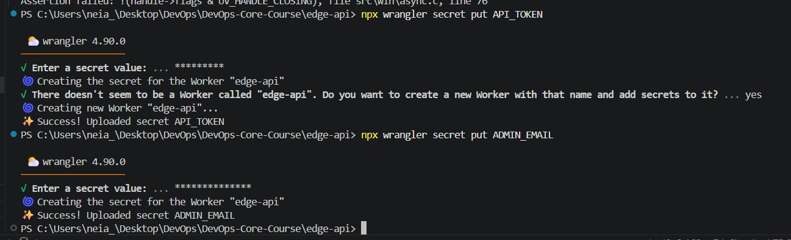
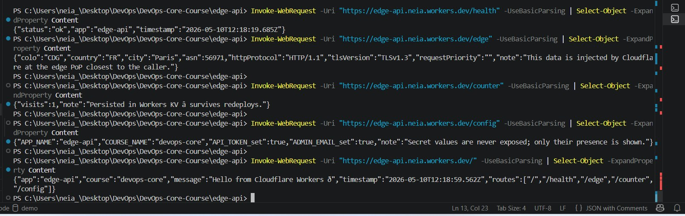
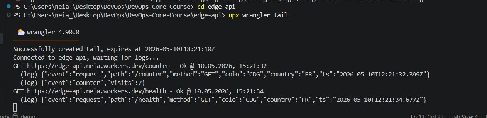
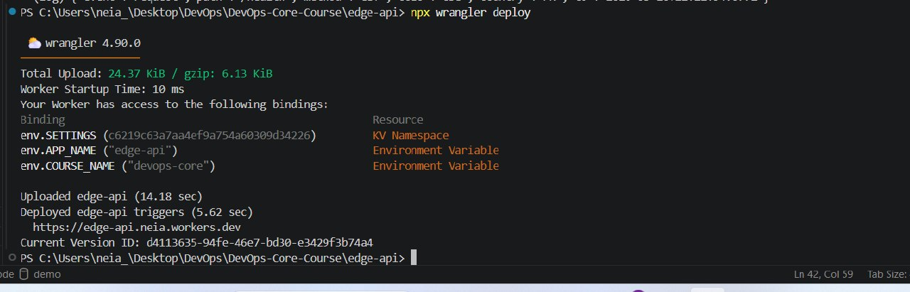
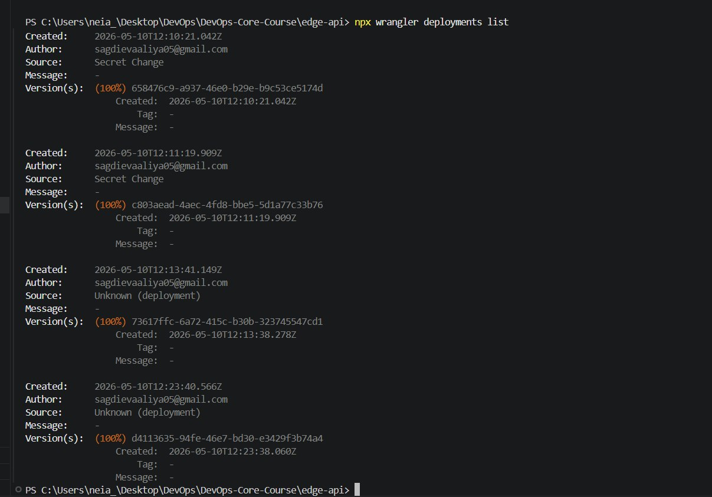
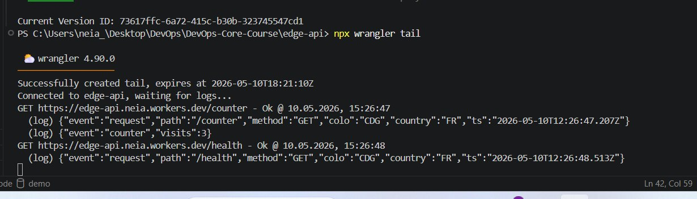

# WORKERS.md — Lab 17: Cloudflare Workers Edge Deployment

## 1. Deployment Summary

| Field | Value |
|---|---|
| **Worker name** | `edge-api` |
| **Public URL** | `https://edge-api.neia.workers.dev` |
| **Runtime** | Cloudflare Workers (V8 Isolates) |
| **Language** | TypeScript |
| **KV namespace** | `SETTINGS` (id: `c6219c63a7aa4ef9a754a60309d34226`) |
| **Deployed by** | sagdievaaliya05@gmail.com |

### Routes

| Method | Path | Description |
|---|---|---|
| GET | `/` | App info, env vars, route listing |
| GET | `/health` | Health check — always returns `{ "status": "ok" }` |
| GET | `/edge` | Cloudflare request metadata (colo, country, city, ASN, TLS) |
| GET | `/counter` | KV-backed persistent visit counter |
| GET | `/config` | Shows env vars and confirms secrets are set (values hidden) |

### Configuration used

- **Plaintext vars** (`wrangler.jsonc`): `APP_NAME=edge-api`, `COURSE_NAME=devops-core`
- **Secrets** (via `wrangler secret put`): `API_TOKEN`, `ADMIN_EMAIL` — stored encrypted, never committed to Git
- **KV namespace**: `SETTINGS` — stores visit counter under key `visits`

---

## 2. Evidence

### /health response

```json
{"status":"ok","app":"edge-api","timestamp":"2026-05-10T12:18:19.685Z"}
```

### /edge response (Task 3 — edge metadata)

```json
{
  "colo": "CDG",
  "country": "FR",
  "city": "Paris",
  "asn": 56971,
  "httpProtocol": "HTTP/1.1",
  "tlsVersion": "TLSv1.3",
  "requestPriority": "",
  "note": "This data is injected by Cloudflare at the edge PoP closest to the caller."
}
```

> `colo: "CDG"` is the IATA code for Paris Charles de Gaulle — the Cloudflare
> Point-of-Presence that handled this request. This proves the Worker executed
> at the edge node closest to the caller, with zero manual region configuration.

### /counter response (Task 4 — KV persistence)

```json
{"visits":1,"note":"Persisted in Workers KV — survives redeploys."}
```

### /config response (Task 4 — env vars + secrets)

```json
{
  "APP_NAME": "edge-api",
  "COURSE_NAME": "devops-core",
  "API_TOKEN_set": true,
  "ADMIN_EMAIL_set": true,
  "note": "Secret values are never exposed; only their presence is shown."
}
```

### / response

```json
{
  "app": "edge-api",
  "course": "devops-core",
  "message": "Hello from Cloudflare Workers 🌍",
  "timestamp": "2026-05-10T12:18:59.562Z",
  "routes": ["/", "/health", "/edge", "/counter", "/config"]
}
```


### Screenshot








---

## 3. Deployment History (Task 5)

```
Version 1 — 2026-05-10T12:10:18Z  — Initial upload
             2ee79f97-7a72-433c-97c5-6af626b1c9af

Version 2 — 2026-05-10T12:10:21Z  — Secret change (API_TOKEN)
             658476c9-a937-46e0-b29e-b9c53ce5174d

Version 3 — 2026-05-10T12:11:19Z  — Secret change (ADMIN_EMAIL)
             c803aead-4aec-4fd8-bbe5-5d1a77c33b76

Version 4 — 2026-05-10T12:13:41Z  — Production deploy v1
             73617ffc-6a72-415c-b30b-323745547cd1

Version 5 — 2026-05-10T12:23:40Z  — Production deploy v2 (message updated)
             d4113635-94fe-46e7-bd30-e3429f3b74a4
```

**Rollback performed:** rolled back from `d4113635` (v2) to `73617ffc` (v1)  
Command used: `npx wrangler rollback`

---

## 4. Kubernetes vs Cloudflare Workers Comparison

| Aspect | Kubernetes | Cloudflare Workers |
|---|---|---|
| **Setup complexity** | High — cluster provisioning, YAML manifests, networking, Ingress, RBAC | Low — one CLI command, single config file |
| **Deployment speed** | Minutes (image build → push → rollout) | Seconds (JS/TS bundle upload) |
| **Global distribution** | Manual — deploy per region or use federation | Automatic — 300+ PoPs, zero extra config |
| **Cost (small apps)** | Non-trivial — at least one node running 24/7 | Free tier covers 100k req/day; paid from $5/mo |
| **State / persistence** | StatefulSets, PVCs, external databases, Redis | Workers KV, Durable Objects, D1, R2 |
| **Control / flexibility** | Full OS-level control, any runtime, long-running processes | Sandboxed V8 isolate; CPU time limit; no arbitrary binaries |
| **Best use case** | Long-running services, stateful workloads, microservice meshes | Globally distributed APIs, auth at edge, lightweight middleware |

### When to use Kubernetes

- Workloads that need a full Linux environment or custom binaries (ffmpeg, ML inference, compiled daemons)
- Long-running jobs or stateful services with complex persistence requirements
- Organisations already invested in container-based CI/CD with Helm charts and GitOps
- Multi-team platforms where namespace isolation and RBAC are required

### When to use Cloudflare Workers

- Globally low-latency APIs with simple business logic
- Edge authentication, header manipulation, or request routing
- Rapid prototyping where zero cold-start and instant deploy matter
- Cost-sensitive projects — the free tier is generous

### Recommendation

Use **Cloudflare Workers** when the goal is a globally fast, operationally simple HTTP API
with no long-running processes. Use **Kubernetes** when fine-grained control, custom runtimes,
complex inter-service communication, or workloads that exceed Workers CPU/memory limits are needed.

---

## 5. Reflection

### What felt easier than Kubernetes?

- **Zero infrastructure setup** — no nodes, no namespaces, no Ingress YAML.
  `wrangler deploy` is the entire deployment pipeline.
- **Instant global distribution** — there is no "deploy to 3 regions" step because
  Cloudflare handles placement automatically. The `/edge` response showed `colo: CDG`
  (Paris) without any region configuration — the platform routed the request to the
  nearest PoP automatically.
- **Built-in public URL** — `workers.dev` gives a live HTTPS endpoint immediately,
  replacing the need for LoadBalancer services or external DNS.
- **Secrets management** — `wrangler secret put` stores encrypted secrets server-side;
  no Kubernetes Secrets manifests or Vault integration needed.

### What felt more constrained?

- **CPU time limit** — Workers allow only ~10 ms CPU time per request,
  making compute-heavy tasks impossible.
- **No persistent connections** — Workers are stateless isolates; no connection
  pooling to external databases without additional bindings.
- **KV eventual consistency** — Workers KV is optimised for reads and is eventually
  consistent, unsuitable for strong-consistency requirements.

### What changed because Workers is not a Docker host?

In Lab 2 a Docker image was built from a `Dockerfile`, pushed to a registry, and
Kubernetes pulled it to schedule containers. In Workers there is no image, no container,
no registry, and no scheduler. The deployment artifact is a compiled JavaScript bundle.

- No `Dockerfile` or base image concerns
- No port mapping — the runtime handles HTTP automatically
- State cannot live in the filesystem — KV is required instead
- Dependencies are bundled at build time by Wrangler's esbuild step

The operational concerns remain the same (routing, health checks, config, secrets,
persistence, logging, rollback), but the implementation layer is entirely different.

---

## 6. Commands Reference

```bash
# Initial setup
npm create cloudflare@latest -- edge-api
cd edge-api
npx wrangler login
npx wrangler whoami

# KV namespace
npx wrangler kv namespace create SETTINGS

# Secrets
npx wrangler secret put API_TOKEN
npx wrangler secret put ADMIN_EMAIL

# Local dev
npx wrangler dev

# Deploy
npx wrangler deploy

# Tail logs
npx wrangler tail

# Deployment history
npx wrangler deployments list

# Rollback
npx wrangler rollback
```