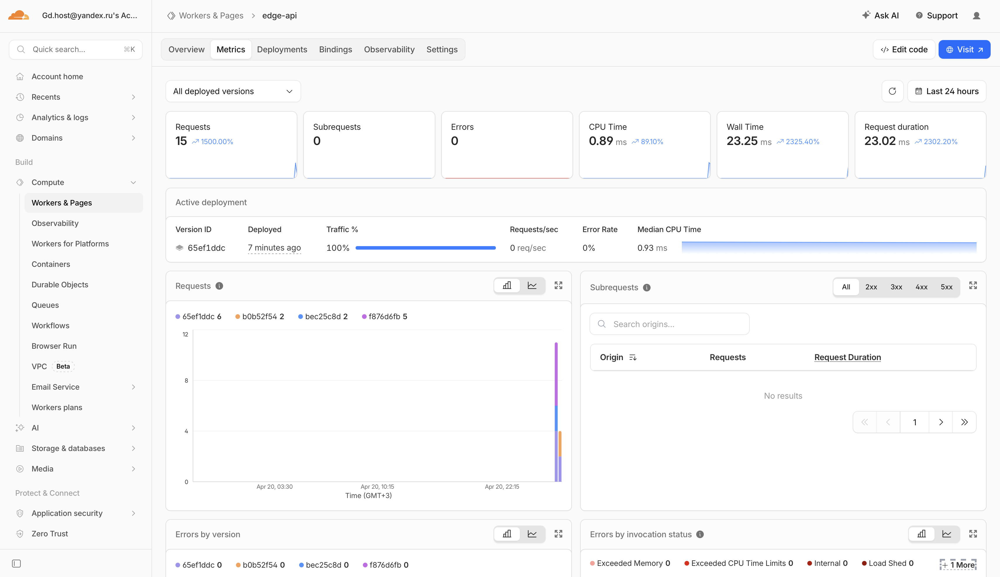

# Cloudflare Workers Edge Deployment (Lab 17)

## 1. Setup

### Account and CLI authentication

`wrangler whoami` confirmed authenticated account and Workers permissions.

Evidence:

```bash
npx wrangler whoami
```

Result:

```
Getting User settings...
👋 You are logged in with an OAuth Token, associated with the email gd.host@yandex.ru.
┌─────────────────────────────┬──────────────────────────────────┐
│ Account Name                │ Account ID                       │
├─────────────────────────────┼──────────────────────────────────┤
│ Gd.host@yandex.ru's Account │ 63d51c36ef628b75751d2f76aa119d3f │
└─────────────────────────────┴──────────────────────────────────┘
🔓 Token Permissions:
Scope (Access)
- account (read)
- user (read)
- workers (write)
- workers_kv (write)
...
```

### Project structure

Worker project was prepared in `edge-api/`:

- `edge-api/src/index.ts`
- `edge-api/wrangler.jsonc`
- `edge-api/package.json`

`workers.dev` subdomain used for public deployment:

- `https://edge-api.gdhost-devops.workers.dev`

---

## 2. Worker API Implementation

Implemented routes:

- `/` - app info and timestamp
- `/health` - health JSON
- `/meta` - deployment metadata from env + checksum
- `/edge` - Cloudflare edge metadata (`colo`, `country`, `city`, `asn`, `httpProtocol`, `tlsVersion`)
- `/counter` - KV-backed persistent counter

Local validation:

```bash
npm run dev
curl -sS http://127.0.0.1:8787/health
curl -sS http://127.0.0.1:8787/
curl -sS http://127.0.0.1:8787/edge
curl -sS http://127.0.0.1:8787/meta
curl -sS http://127.0.0.1:8787/counter
```

Result sample:

```
{"status":"ok","timestamp":"2026-04-20T19:00:33.904Z"}
{"app":"edge-api","course":"devops-core","message":"Hello from Cloudflare Workers","timestamp":"2026-04-20T19:00:33.917Z"}
{"colo":"FRA","country":"DE","city":"Frankfurt am Main","asn":213896,"httpProtocol":"HTTP/1.1","tlsVersion":"TLSv1.3"}
{"worker":"edge-api","appName":"edge-api","course":"devops-core","deploymentLabel":"v3","secretsConfigured":false,"deploymentChecksum":"c7174f175a37152a","timestamp":"2026-04-20T19:00:44.729Z"}
{"visits":2,"key":"visits"}
```

---

## 3. Global Edge Behavior

Public edge execution check:

```bash
curl -sS https://edge-api.gdhost-devops.workers.dev/edge
```

Result:

```json
{"colo":"FRA","country":"DE","city":"Frankfurt am Main","asn":213896,"httpProtocol":"HTTP/2","tlsVersion":"TLSv1.3"}
```

Interpretation:

- Worker executes on Cloudflare edge PoP closest to request path.
- No manual "deploy to regions" step is required.
- Cloudflare routes requests globally and runs code near users automatically.

Routing model:

- `workers.dev`: instant public URL for Worker testing/hosting.
- Routes: attach Worker to traffic of an existing Cloudflare zone.
- Custom Domains: Worker acts as origin for specific domain/subdomain.

---

## 4. Config, Secrets, and KV Persistence

### Plaintext vars (`wrangler.jsonc`)

Used vars:

- `APP_NAME`
- `COURSE_NAME`
- `DEPLOYMENT_LABEL`

Reason plaintext vars are not secrets:

- Stored in project config.
- Safe for non-sensitive values only.

### Secrets

Created with Wrangler:

```bash
printf "***" | npx wrangler secret put API_TOKEN
printf "***" | npx wrangler secret put ADMIN_EMAIL
```

Result:

```
Success! Uploaded secret API_TOKEN
Success! Uploaded secret ADMIN_EMAIL
```

### KV namespace binding

Configured in `wrangler.jsonc`:

```json
"kv_namespaces": [
  {
    "binding": "SETTINGS",
    "id": "bf4922aac976472eb257a0316461444a"
  }
]
```

### Persistence verification across redeploy

Before redeploy:

```bash
curl -sS https://edge-api.gdhost-devops.workers.dev/counter
```

Result:

```
{"visits":6,"key":"visits"}
```

After redeploy:

```bash
npx wrangler deploy
curl -sS https://edge-api.gdhost-devops.workers.dev/counter
```

Result:

```
 ⛅️ wrangler 4.84.0
───────────────────
Total Upload: 2.40 KiB / gzip: 0.98 KiB
Your Worker has access to the following bindings:
Binding                                                      Resource                  
env.SETTINGS (bf4922aac976472eb257a0316461444a)              KV Namespace              
env.APP_NAME ("edge-api")                                    Environment Variable      
env.COURSE_NAME ("devops-core")                              Environment Variable      
env.DEPLOYMENT_LABEL ("v4")                                  Environment Variable      

Uploaded edge-api (11.52 sec)
Deployed edge-api triggers (5.97 sec)
  https://edge-api.gdhost-devops.workers.dev
Current Version ID: b0b52f54-a253-4f68-bbca-b57da791fad5
{"visits":7,"key":"visits"}
```

Conclusion: KV value persisted after redeploy.

---

## 5. Observability and Operations

### Logs (`wrangler tail`)

```bash
npx wrangler tail --format pretty
```

Captured log sample:

```
GET https://edge-api.gdhost-devops.workers.dev/edge - Ok
  (log) request { path: '/edge', method: 'GET', colo: 'FRA' }
GET https://edge-api.gdhost-devops.workers.dev/health - Ok
  (log) request { path: '/health', method: 'GET', colo: 'FRA' }
```

### Deployments history

```bash
npx wrangler deployments list
```

Recent versions included:

- `f876d6fb-fac7-45e9-a46e-8c999850ca37`
- `bec25c8d-538e-4951-b8f8-55b35904b09d`
- `65ef1ddc-c27d-4728-8736-0bb373e60c7d`

```
Created:     2026-04-20T19:01:45.603Z
Author:      gd.host@yandex.ru
Source:      Unknown (deployment)
Message:     -
Version(s):  (100%) f876d6fb-fac7-45e9-a46e-8c999850ca37
                 Created:  2026-04-20T19:01:43.094Z
                     Tag:  -
                 Message:  -

Created:     2026-04-20T19:02:19.079Z
Author:      gd.host@yandex.ru
Source:      Unknown (deployment)
Message:     lab17-rollback-2026
Version(s):  (100%) bec25c8d-538e-4951-b8f8-55b35904b09d
                 Created:  2026-04-20T19:01:13.427Z
                     Tag:  -
                 Message:  -

Created:     2026-04-20T19:02:35.687Z
Author:      gd.host@yandex.ru
Source:      Unknown (deployment)
Message:     -
Version(s):  (100%) 65ef1ddc-c27d-4728-8736-0bb373e60c7d
                 Created:  2026-04-20T19:02:33.409Z
                     Tag:  -
                 Message:  -
```

### Rollback demonstration

```bash
npx wrangler rollback --message "lab17-rollback-2026"
```

Result:

```
 ⛅️ wrangler 4.84.0
───────────────────
├ Your current deployment has 1 version(s):
│
│ (100%) b0b52f54-a253-4f68-bbca-b57da791fad5
│       Created:  2026-04-20T19:17:14.899954Z
│           Tag:  -
│       Message:  -
│
✔ Please provide an optional message for this rollback (120 characters max) … lab17-rollback-2026
│
├  WARNING  You are about to rollback to Worker Version 65ef1ddc-c27d-4728-8736-0bb373e60c7d.
│ This will immediately replace the current deployment and become the active deployment across all your deployed triggers.
│ However, your local development environment will not be affected by this rollback.
│ Rolling back to a previous deployment will not rollback any of the bound resources (Durable Object, D1, R2, KV, etc).
│
│ (100%) 65ef1ddc-c27d-4728-8736-0bb373e60c7d
│       Created:  2026-04-20T19:02:33.409359Z
│           Tag:  -
│       Message:  -
│
✔ Are you sure you want to deploy this Worker Version to 100% of traffic? … yes
Performing rollback...
│
╰  SUCCESS  Worker Version 65ef1ddc-c27d-4728-8736-0bb373e60c7d has been deployed to 100% of traffic.

Current Version ID: 65ef1ddc-c27d-4728-8736-0bb373e60c7d
```

Then redeployed latest (`v4`) successfully.

### Metrics checked

In Cloudflare Worker dashboard, request and deployment activity were verified for `edge-api` after public endpoint calls and redeploy sequence.


---

## 6. Required Evidence

### Screenshot of Cloudflare dashboard:


### Example /edge JSON response:

```
curl https://edge-api.gdhost-devops.workers.dev/edge
```

```
{
  "colo": "FRA",
  "country": "DE",
  "city": "Frankfurt am Main",
  "asn": 213896,
  "httpProtocol": "HTTP/2",
  "tlsVersion": "TLSv1.3"
}
```

### Example of metrics screenshot



---

## 7. Kubernetes vs Cloudflare Workers


| Aspect                  | Kubernetes                                        | Cloudflare Workers                                |
| ----------------------- | ------------------------------------------------- | ------------------------------------------------- |
| Setup complexity        | High: cluster, manifests, networking, controllers | Low: Worker code + wrangler config                |
| Deployment speed        | Slower (image build/push, rollout)                | Fast (code upload + instant global edge)          |
| Global distribution     | Manual multi-region architecture                  | Built-in global edge routing/execution            |
| Cost (small apps)       | Often higher baseline cost                        | Usually lower for low/medium traffic              |
| State/persistence model | StatefulSets, PV/PVC, external DB/cache           | External services/bindings (KV, D1, R2, DO)       |
| Control/flexibility     | Maximum control over runtime/infrastructure       | Managed runtime, less low-level control           |
| Best use case           | Complex microservices/platform workloads          | Edge APIs, lightweight globally distributed logic |


---

## 8. When to Use Each

Use Kubernetes when:

- You need containers, custom runtimes, advanced orchestration.
- You run many tightly integrated services with custom networking/security.
- You need deep platform-level control.

Use Cloudflare Workers when:

- You need fast global API delivery.
- You want minimal ops overhead.
- Workload is stateless or uses managed edge bindings for state.

Recommendation:

- For this lab-style edge API: Workers is faster and simpler.
- For larger multi-service backend platforms: Kubernetes remains the better fit.

---

## 9. Reflection

- Easier than Kubernetes: setup, deployment speed, public exposure, global delivery.
- More constrained: runtime limits, no Docker image deployment, no full cluster control.
- Main mindset shift: build for managed serverless edge runtime, not host-level/container-level operations.
