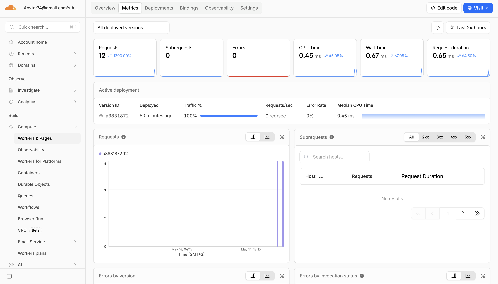
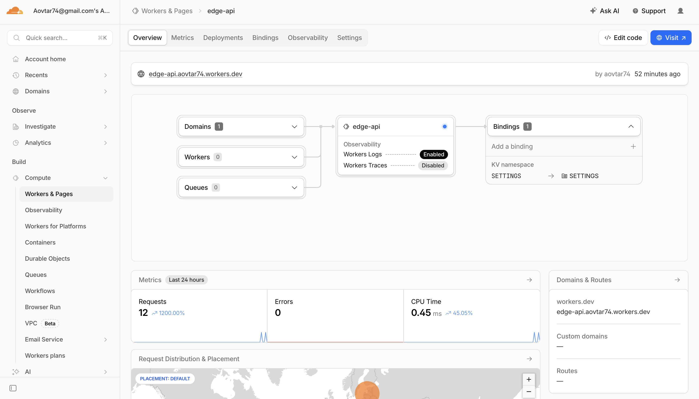
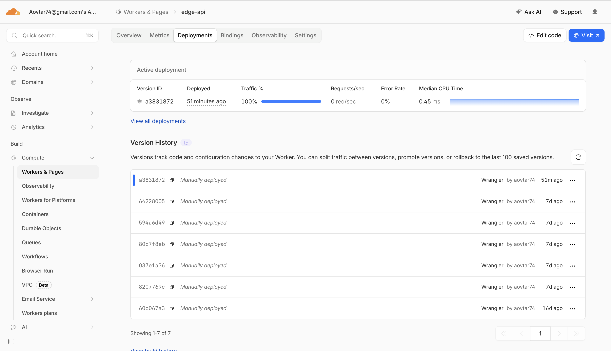
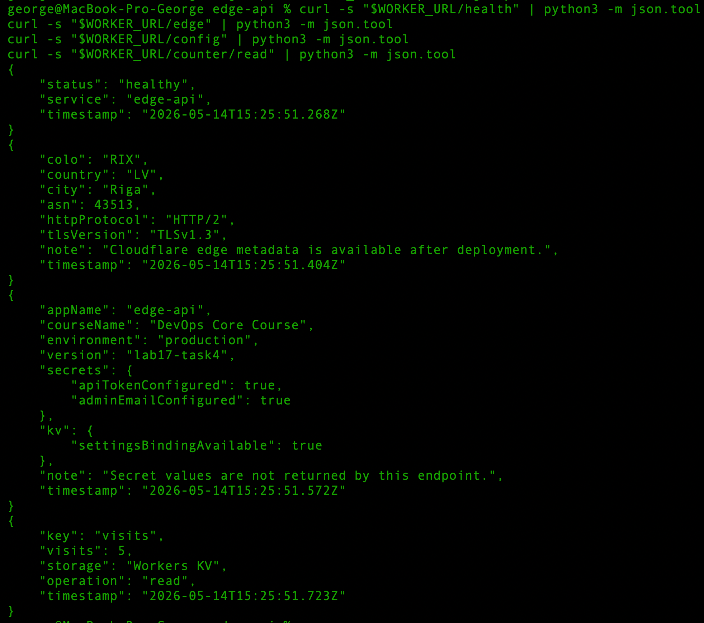
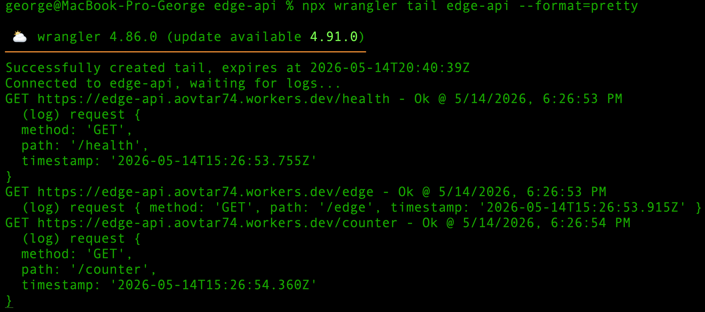

# Lab 17 — Cloudflare Workers Edge Deployment

# Task 1 — Cloudflare Setup

## 1.1 Objective

The goal of this task was to set up a Cloudflare Workers project, authenticate Wrangler CLI, and understand the basic Workers platform concepts.

## 1.2 Local Tooling

The local environment was checked before creating the Worker project.

Commands:

```bash
node --version
npm --version
git --version
npx wrangler --version
```

Output:

```text
v23.11.0
10.9.2
git version 2.48.1

wrangler 4.86.0
```

Node.js, npm, Git, and Wrangler were available locally.

## 1.3 Cloudflare Account and Dashboard

A Cloudflare account was used for this lab.

Wrangler authentication was completed successfully with:

```bash
npx wrangler login
```

Output:

```text
Successfully logged in.
```

The Workers & Pages dashboard is used to manage Workers, view deployments, inspect metrics, configure bindings, and review logs.

## 1.4 workers.dev Subdomain

A `workers.dev` subdomain provides a public URL for Cloudflare Workers without requiring a custom domain.

General `workers.dev` URL format:

```text
https://<worker-name>.<your-subdomain>.workers.dev
```

Actual Worker URL used in this lab:
```text
https://edge-api.aovtar74.workers.dev
```

This lab uses the `workers.dev` URL for the required public deployment.

## 1.5 Project Creation

The Worker project was created with C3:

```bash
npm create cloudflare@latest -- edge-api
```

Selected setup:

```text
Worker name: edge-api
Template: Hello World
Type: Worker only
Language: TypeScript
Deploy now: No
```

Project creation completed successfully:

```text
SUCCESS Application created successfully!
```

The project directory is:

```text
edge-api
```

Important generated files:

```text
edge-api/src/index.ts
edge-api/wrangler.jsonc
edge-api/package.json
edge-api/tsconfig.json
edge-api/package-lock.json
```

## 1.6 Project Structure

The generated project was checked with:

```bash
ls -la
find . -maxdepth 2 -type f | sort
```

Important files:

```text
./package.json
./src/index.ts
./tsconfig.json
./wrangler.jsonc
./package-lock.json
./test/index.spec.ts
```

## 1.7 package.json Scripts

The generated `package.json` contains Wrangler scripts:

```json
{
  "scripts": {
    "deploy": "wrangler deploy",
    "dev": "wrangler dev",
    "start": "wrangler dev",
    "test": "vitest",
    "cf-typegen": "wrangler types"
  }
}
```

These scripts are used for local development, deployment, testing, and Cloudflare type generation.

## 1.8 Wrangler Authentication Verification

Wrangler account verification command:

```bash
npx wrangler whoami
```

Output:

```bash
Getting User settings...
You are logged in with an OAuth Token.

Email: masked for privacy
Account Name: masked for privacy
Account ID: 2a703...aaa

Token Permissions:
- account (read)
- user (read)
- workers (write)
- workers_kv (write)
- workers_routes (write)
- workers_scripts (write)
- workers_tail (read)
- offline_access
```

This confirms that the local Wrangler CLI is authenticated with the Cloudflare account.


## 1.9 wrangler.jsonc

The `wrangler.jsonc` file is the main configuration file for the Worker.

Current important fields:

```jsonc
{
  "name": "edge-api",
  "main": "src/index.ts",
  "compatibility_date": "2026-04-28",
  "observability": {
    "enabled": true
  },
  "upload_source_maps": true,
  "compatibility_flags": [
    "nodejs_compat"
  ]
}
```

The role of `wrangler.jsonc`:

* defines the Worker name
* defines the source entrypoint
* sets the compatibility date
* enables observability options
* later stores plaintext variables
* later stores bindings such as KV namespaces

Secret values should not be committed to `wrangler.jsonc`. Secrets are managed separately with Wrangler.

## 1.10 Local Development Test

The Worker was started locally with:

```bash
npm run dev
```

Output:

```text
Ready on http://localhost:8787
GET / 200 OK
```

The local endpoint was tested with:

```bash
curl -i http://localhost:8787
```

Output:

```text
HTTP/1.1 200 OK
Content-Type: text/plain;charset=UTF-8

Hello World!
```

This confirms that the generated Worker runs locally.

## 1.11 Platform Concepts

Cloudflare Workers run code on Cloudflare's serverless edge runtime instead of a traditional server, VM, container, or Kubernetes cluster.

Important concepts:

* Workers runtime: lightweight serverless runtime for handling HTTP requests
* `workers.dev`: built-in public domain for deployed Workers
* vars: plaintext environment variables configured in `wrangler.jsonc`
* secrets: sensitive values created with Wrangler and exposed through `env`
* KV namespaces: globally available key-value storage that can be bound to a Worker

---

# Task 2 — Build and Deploy a Worker API

## 2.1 Objective

The goal of this task was to build a small HTTP JSON API with Cloudflare Workers, run it locally, deploy it to Cloudflare, and verify the public `workers.dev` URL.

## 2.2 Implemented Routes

The default Hello World Worker was replaced with a TypeScript API in:

```text
edge-api/src/index.ts
```

Implemented endpoints:

* `/` — general service information
* `/health` — health check endpoint
* `/deployment` — deployment metadata endpoint
* `/edge` — edge metadata endpoint
* `/config` — configuration and bindings status endpoint
* `/counter` — KV-backed counter increment endpoint
* `/counter/read` — read-only KV counter endpoint

Error handling was also added:

* unknown routes return `404 Not Found`
* unsupported methods return `405 Method Not Allowed`

## 2.3 Local Development Verification

The Worker was started locally with:

```bash
npm run dev
```

Output:

```text
Ready on http://localhost:8787
```

Local routes were tested with `curl`.

Health endpoint:

```bash
curl -i http://localhost:8787/health
```

Output:

```text
HTTP/1.1 200 OK
Content-Type: application/json; charset=utf-8

{"status":"healthy","service":"edge-api","timestamp":"2026-04-28T13:35:26.566Z"}
```

Deployment metadata endpoint:

```bash
curl -i http://localhost:8787/deployment
```

Output:

```text
HTTP/1.1 200 OK
Content-Type: application/json; charset=utf-8

{"application":"edge-api","platform":"Cloudflare Workers","language":"TypeScript","environment":"workers.dev","version":"lab17-task2","deployedWith":"Wrangler","publicUrlFormat":"https://<worker-name>.<subdomain>.workers.dev","timestamp":"2026-04-28T13:35:30.264Z"}
```

Edge endpoint:

```bash
curl -s http://localhost:8787/edge | python3 -m json.tool
```

Output:

```json
{
    "colo": "RIX",
    "country": "LV",
    "city": "Riga",
    "asn": 43513,
    "httpProtocol": "HTTP/1.1",
    "tlsVersion": "TLSv1.3",
    "note": "Cloudflare edge metadata is available after deployment.",
    "timestamp": "2026-04-28T13:35:56.376Z"
}
```

Error responses were verified:

```bash
curl -i http://localhost:8787/not-found
curl -i -X POST http://localhost:8787/health
```

Results:

```text
/not-found       -> 404 Not Found
POST /health     -> 405 Method Not Allowed
```

## 2.4 Tests

The tests were updated to match the new JSON API.

Command:

```bash
npm test -- --run
```

Output:

```text
✓ test/index.spec.ts (5 tests) 39ms

Test Files  1 passed (1)
Tests       5 passed (5)
```

## 2.5 Deployment

The Worker was deployed with Wrangler:

```bash
npx wrangler deploy
```

Output:

```text
Uploaded edge-api
Deployed edge-api triggers
https://edge-api.aovtar74.workers.dev
Current Version ID: 60c067a3-3760-45dd-a583-eaf71e3ff60f
```

Public Worker URL:

```text
https://edge-api.aovtar74.workers.dev
```

## 2.6 Public URL Verification

The deployed Worker was tested through the public `workers.dev` URL:

```bash
WORKER_URL="https://edge-api.aovtar74.workers.dev"

curl -i "$WORKER_URL/"
curl -i "$WORKER_URL/health"
curl -i "$WORKER_URL/deployment"
curl -i "$WORKER_URL/edge"
curl -i "$WORKER_URL/not-found"
```

Results:

```text
/              -> HTTP/2 200
/health        -> HTTP/2 200
/deployment    -> HTTP/2 200
/edge          -> HTTP/2 200
/not-found     -> HTTP/2 404
```

Example deployed `/edge` response:

```json
{
    "colo": "RIX",
    "country": "LV",
    "city": "Riga",
    "asn": 43513,
    "httpProtocol": "HTTP/2",
    "tlsVersion": "TLSv1.3",
    "note": "Cloudflare edge metadata is available after deployment.",
    "timestamp": "2026-04-28T13:38:29.382Z"
}
```

## 2.7 Source Control

The Worker project was committed to Git:

```bash
git add edge-api/.
git commit -m "feat: add Cloudflare Workers API"
```

Output:

```text
[lab17 906c207] feat: add Cloudflare Workers API
```

---


# Task 3 — Global Edge Behavior

## 3.1 Objective

The goal of this task was to inspect how the deployed Worker behaves on Cloudflare's global edge network and verify that Cloudflare provides request metadata at runtime.

## 3.2 Edge Metadata Endpoint

The Worker includes an `/edge` endpoint that reads metadata from the incoming request context.

Implemented fields:

- `colo`
- `country`
- `city`
- `asn`
- `httpProtocol`
- `tlsVersion`

Code check:

```bash
grep -A15 'url.pathname === "/edge"' src/index.ts
```

Important implementation:

```ts
if (url.pathname === "/edge") {
	return jsonResponse({
		colo: request.cf?.colo ?? "local-dev",
		country: request.cf?.country ?? "local-dev",
		city: request.cf?.city ?? "local-dev",
		asn: request.cf?.asn ?? "local-dev",
		httpProtocol: request.cf?.httpProtocol ?? "local-dev",
		tlsVersion: request.cf?.tlsVersion ?? "local-dev",
		note: "Cloudflare edge metadata is available after deployment.",
		timestamp,
	});
}
```

## 3.3 Public Edge Verification

The deployed Worker was called through the public `workers.dev` URL:

```bash
WORKER_URL="https://edge-api.aovtar74.workers.dev"

curl -s "$WORKER_URL/edge" | python3 -m json.tool
```

Output:

```json
{
    "colo": "HEL",
    "country": "FI",
    "city": "Helsinki",
    "asn": 215730,
    "httpProtocol": "HTTP/2",
    "tlsVersion": "TLSv1.3",
    "note": "Cloudflare edge metadata is available after deployment.",
    "timestamp": "2026-04-28T17:33:03.176Z"
}
```

This confirms that the Worker executed on Cloudflare's edge network and received Cloudflare-provided request metadata.

## 3.4 Header Verification

The deployed endpoint was also checked with response headers:

```bash
curl -i "$WORKER_URL/edge"
```

Important output:

```text
HTTP/2 200
server: cloudflare
cf-ray: 9f37cf7feec38ddb-HEL
```

The `server: cloudflare` header confirms that the response was served through Cloudflare. The `cf-ray` suffix `HEL` matches the Cloudflare edge location.

## 3.5 Global Distribution Explanation

Cloudflare Workers run on Cloudflare's global edge network. After deployment, the Worker is available globally without manually choosing VM regions or provisioning regional infrastructure.

In a VM, Kubernetes, or traditional PaaS setup, global deployment usually requires:

* choosing target regions
* deploying infrastructure in each region
* configuring load balancing
* managing regional failover

With Cloudflare Workers, there is no separate `deploy to 3 regions` step. The Worker is deployed to Cloudflare's platform, and Cloudflare automatically routes requests to an appropriate nearby edge location.

## 3.6 Routing Concepts

Cloudflare Workers can be exposed in several ways.

### workers.dev

`workers.dev` provides a built-in public URL for a Worker without requiring a custom domain.

Used in this lab:

```text
https://edge-api.aovtar74.workers.dev
```

### Routes

Routes attach a Worker to traffic for an existing Cloudflare-managed zone.

Example:

```text
example.com/api/*
```

This is useful when only specific paths on an existing domain should be handled by a Worker.

### Custom Domains

Custom Domains expose a Worker directly on a custom hostname.

Example:

```text
api.example.com
```

This is useful for production APIs, but it was not required for this lab.

---


# Task 4 — Configuration, Secrets and Persistence

## 4.1 Objective

The goal of this task was to configure the Worker with plaintext variables, secrets, and persistent state using Workers KV.

## 4.2 Environment Variables

Plaintext variables were added to `wrangler.jsonc`:

```jsonc
"vars": {
  "APP_NAME": "edge-api",
  "COURSE_NAME": "DevOps Core Course",
  "ENVIRONMENT": "production",
  "APP_VERSION": "lab17-task4"
}
```

These values are used in Worker responses such as `/`, `/health`, `/deployment`, and `/config`.

Plaintext variables are not suitable for secrets because they are stored directly in the configuration file and committed to Git.

## 4.3 Secrets

Two secrets were created with Wrangler:

```bash
npx wrangler secret put API_TOKEN
npx wrangler secret put ADMIN_EMAIL
```

The secret values were not committed to Git.

The Worker uses these values through the `env` object and exposes only whether they are configured:

```json
"secrets": {
  "apiTokenConfigured": true,
  "adminEmailConfigured": true
}
```

## 4.4 Workers KV

A KV namespace was created and bound to the Worker as `SETTINGS`:

```bash
npx wrangler kv namespace create SETTINGS
```

The binding was added to `wrangler.jsonc`:

```jsonc
"kv_namespaces": [
  {
    "binding": "SETTINGS",
    "id": "bb5424b69bb84e0cafe3c5884814c065"
  }
]
```

The Worker uses KV to store a persistent `visits` counter.

Implemented endpoints:

* `/counter` — reads, increments, and stores the counter
* `/counter/read` — reads the counter without changing it

## 4.5 Public Verification

The deployed Worker was checked with:

```bash
WORKER_URL="https://edge-api.aovtar74.workers.dev"

curl -s "$WORKER_URL/config" | python3 -m json.tool
curl -s "$WORKER_URL/counter" | python3 -m json.tool
curl -s "$WORKER_URL/counter/read" | python3 -m json.tool
```

`/config` confirmed that vars, secrets, and KV binding were available:

```json
{
    "appName": "edge-api",
    "courseName": "DevOps Core Course",
    "environment": "production",
    "version": "lab17-task4",
    "secrets": {
        "apiTokenConfigured": true,
        "adminEmailConfigured": true
    },
    "kv": {
        "settingsBindingAvailable": true
    },
    "note": "Secret values are not returned by this endpoint.",
    "timestamp": "2026-05-07T09:11:51.680Z"
}
```

The counter was incremented and read from KV:

```json
{
    "key": "visits",
    "visits": 2,
    "storage": "Workers KV",
    "operation": "read-increment-write",
    "timestamp": "2026-05-07T09:12:18.117Z"
}
```

Read-only verification:

```json
{
    "key": "visits",
    "visits": 2,
    "storage": "Workers KV",
    "operation": "read",
    "timestamp": "2026-05-07T09:12:18.365Z"
}
```

## 4.6 Persistence After Redeploy

Before redeploy, the counter reached:

```json
{
    "key": "visits",
    "visits": 3,
    "storage": "Workers KV",
    "operation": "read-increment-write",
    "timestamp": "2026-05-07T09:12:53.515Z"
}
```

The Worker was redeployed:

```bash
npx wrangler deploy
```

After redeploy, the value was still present:

```bash
curl -s "$WORKER_URL/counter/read" | python3 -m json.tool
```

Output:

```json
{
    "key": "visits",
    "visits": 3,
    "storage": "Workers KV",
    "operation": "read",
    "timestamp": "2026-05-07T09:13:47.566Z"
}
```

After another increment, the value became:

```json
{
    "key": "visits",
    "visits": 4,
    "storage": "Workers KV",
    "operation": "read-increment-write",
    "timestamp": "2026-05-07T09:14:01.479Z"
}
```

This confirms that the counter is stored in Workers KV and survives Worker redeployments.

---

# Task 5 — Observability & Operations

## 5.1 Objective

The goal of this task was to observe the deployed Worker in production, inspect logs and metrics, and review deployment management.

---

## 5.2 Logs

A `console.log()` statement was added to `src/index.ts` inside the `fetch` handler:

```ts
console.log("request", {
	method: request.method,
	path: url.pathname,
	timestamp,
});
```

Production logs were inspected with:

```bash
npx wrangler tail edge-api --format=pretty
```

After that, test requests were sent:

```bash
WORKER_URL="https://edge-api.aovtar74.workers.dev"

curl "$WORKER_URL/health"
curl "$WORKER_URL/edge"
curl "$WORKER_URL/counter"
```

Example log output:

```text
GET https://edge-api.aovtar74.workers.dev/health - Ok @ 5/14/2026, 5:40:58 PM
  (log) request {
  method: 'GET',
  path: '/health',
  timestamp: '2026-05-14T14:40:58.530Z'
}

GET https://edge-api.aovtar74.workers.dev/edge - Ok @ 5/14/2026, 5:40:58 PM
  (log) request { method: 'GET', path: '/edge', timestamp: '2026-05-14T14:40:58.654Z' }

GET https://edge-api.aovtar74.workers.dev/counter - Ok @ 5/14/2026, 5:40:58 PM
  (log) request {
  method: 'GET',
  path: '/counter',
  timestamp: '2026-05-14T14:40:58.795Z'
}
```

This confirms that production logs are available and that the Worker writes runtime log entries successfully.

---

## 5.3 Metrics

Worker metrics were inspected in the Cloudflare dashboard:

```text
Cloudflare Dashboard → Workers & Pages → edge-api → Metrics
```

The reviewed metrics were:

* request count;
* errors;
* successful invocations;
* CPU time.

The most important metric was **request count**, because it confirms that the deployed `workers.dev` URL receives production traffic. The **errors** metric was also checked to make sure that requests to `/health`, `/edge`, and `/counter` did not produce runtime failures.

Evidence:



---

## 5.4 Deployments

The Worker was deployed multiple times during the lab.

Final deployment:

```bash
npx wrangler deploy
```

Output:

```text
Uploaded edge-api
Deployed edge-api triggers
  https://edge-api.aovtar74.workers.dev
Current Version ID: a3831872-ef43-43ec-a3b5-7840dc36dc0c
```

Deployment history was viewed with:

```bash
npx wrangler deployments list
```

The output showed several versions, including:

```text
2026-04-28T13:37:06.396Z — 60c067a3-3760-45dd-a583-eaf71e3ff60f
2026-05-07T09:13:44.415Z — 64228005-5121-4772-a032-f9462737d37e
2026-05-14T14:39:25.001Z — a3831872-ef43-43ec-a3b5-7840dc36dc0c
```

Current production version:

```text
a3831872-ef43-43ec-a3b5-7840dc36dc0c
```

This confirms that more than two Worker versions were deployed and that deployment history is available.

---

## 5.5 Rollback

Rollback can be performed with Wrangler:

```bash
npx wrangler rollback
```

Rollback to a specific version can be performed with:

```bash
npx wrangler rollback <VERSION_ID>
```

A real rollback was not executed because the current production version was working correctly. If the latest version broke the Worker, one of the previous version IDs from deployment history could be restored.

Rollback can also be performed from the Cloudflare dashboard:

```text
Workers & Pages → edge-api → Deployments → choose previous deployment → Rollback
```

---

# Task 6 — Documentation & Comparison

## 6.1 Deployment Summary

The Worker was deployed to Cloudflare Workers using Wrangler.

| Parameter | Value |
|---|---|
| Worker name | `edge-api` |
| Public Worker URL | `https://edge-api.aovtar74.workers.dev` |
| Runtime | `Cloudflare Workers` |
| Language | `TypeScript` |
| Deployment tool | `Wrangler CLI` |
| State storage | `Workers KV` |
| KV binding | `SETTINGS` |
| Current production version | `a3831872-ef43-43ec-a3b5-7840dc36dc0c` |

## 6.2 Main Routes

| Route           | Purpose                                                      |
| --------------- | ------------------------------------------------------------ |
| `/`             | Returns general service information                          |
| `/health`       | Health check endpoint                                        |
| `/deployment`   | Returns deployment metadata                                  |
| `/edge`         | Returns Cloudflare edge request metadata                     |
| `/config`       | Shows configured vars, secrets status, and KV binding status |
| `/counter`      | Reads and increments the KV-backed counter                   |
| `/counter/read` | Reads the current KV counter value without incrementing it   |

The Worker also handles errors:

| Case               | Response                 |
| ------------------ | ------------------------ |
| Unknown route      | `404 Not Found`          |
| Unsupported method | `405 Method Not Allowed` |

## 6.3 Configuration Used

Plaintext environment variables were configured in `wrangler.jsonc`:

```jsonc
"vars": {
  "APP_NAME": "edge-api",
  "COURSE_NAME": "DevOps Core Course",
  "ENVIRONMENT": "production",
  "APP_VERSION": "lab17-task4"
}
```

These variables are used in API responses such as `/`, `/health`, `/deployment`, and `/config`.

Two secrets were created with Wrangler:

```bash
npx wrangler secret put API_TOKEN
npx wrangler secret put ADMIN_EMAIL
```

Secret values are not stored in `wrangler.jsonc` and are not committed to Git.

Workers KV was configured with the `SETTINGS` binding:

```jsonc
"kv_namespaces": [
  {
    "binding": "SETTINGS",
    "id": "bb5424b69bb84e0cafe3c5884814c065"
  }
]
```

The KV namespace stores the persistent `visits` counter.

## 6.4 Evidence

### Cloudflare Dashboard Evidence

Cloudflare Worker overview:



Cloudflare metrics page:


Cloudflare deployments page:



### API Response Evidence

Terminal verification of `/health`, `/edge`, `/config`, and `/counter/read`:



### Logs Evidence

Production logs from `npx wrangler tail`:



### Successful Deployment

Final deployment command:

```bash
npx wrangler deploy
```

Output:

```text
Uploaded edge-api
Deployed edge-api triggers
  https://edge-api.aovtar74.workers.dev
Current Version ID: a3831872-ef43-43ec-a3b5-7840dc36dc0c
```

### Example `/edge` JSON Response

Command:

```bash
curl -s "$WORKER_URL/edge" | python3 -m json.tool
```

Output:

```json
{
    "colo": "RIX",
    "country": "LV",
    "city": "Riga",
    "asn": 43513,
    "httpProtocol": "HTTP/2",
    "tlsVersion": "TLSv1.3",
    "note": "Cloudflare edge metadata is available after deployment.",
    "timestamp": "2026-05-14T14:39:42.164Z"
}
```

This confirms that the Worker receives Cloudflare-provided edge metadata.

### Example Log Entry

Production logs were viewed with:

```bash
npx wrangler tail edge-api --format=pretty
```

Example log output:

```text
GET https://edge-api.aovtar74.workers.dev/health - Ok @ 5/14/2026, 5:40:58 PM
  (log) request {
  method: 'GET',
  path: '/health',
  timestamp: '2026-05-14T14:40:58.530Z'
}
```

This confirms that runtime logs are available for the deployed Worker.

### Example Metrics Evidence

Metrics were inspected in the Cloudflare dashboard:

```text
Cloudflare Dashboard → Workers & Pages → edge-api → Metrics
```

The reviewed metrics were:

* request count;
* errors;
* successful invocations;
* CPU time.

The request count confirmed that the public Worker URL received traffic. The errors metric was checked to confirm that normal API requests did not produce runtime failures.

### KV Persistence Evidence

The counter was stored in Workers KV.

Read-only counter value after redeploy:

```json
{
    "key": "visits",
    "visits": 4,
    "storage": "Workers KV",
    "operation": "read",
    "timestamp": "2026-05-14T14:39:42.283Z"
}
```

After calling `/counter`, the counter increased:

```json
{
    "key": "visits",
    "visits": 5,
    "storage": "Workers KV",
    "operation": "read-increment-write",
    "timestamp": "2026-05-14T14:40:58.795Z"
}
```

This confirms that the value is persisted in KV and survives redeployments.

## 6.5 Kubernetes vs Cloudflare Workers Comparison

| Aspect                  | Kubernetes                                                                           | Cloudflare Workers                                                                         |
| ----------------------- | ------------------------------------------------------------------------------------ | ------------------------------------------------------------------------------------------ |
| Setup complexity        | High. Requires cluster, nodes, manifests, services, ingress, and container registry. | Low. Requires Worker project, Wrangler config, and deploy command.                         |
| Deployment speed        | Slower because Docker images must be built, pushed, and deployed to a cluster.       | Faster because Worker code is uploaded directly to Cloudflare.                             |
| Global distribution     | Requires multi-region clusters or external global load balancing.                    | Built into Cloudflare's global edge network.                                               |
| Cost for small apps     | Usually higher because infrastructure may run continuously.                          | Usually lower for small APIs because the platform is serverless.                           |
| State/persistence model | Uses databases, persistent volumes, StatefulSets, or external managed services.      | Uses platform bindings such as KV, D1, R2, Durable Objects, or external APIs.              |
| Control/flexibility     | Very high. Can run almost any containerized workload.                                | More limited. Code must run inside the Workers runtime.                                    |
| Best use case           | Complex backend platforms, microservices, internal systems, long-running workloads.  | Lightweight APIs, edge logic, webhooks, redirects, and globally distributed HTTP handlers. |

## 6.6 When to Use Kubernetes

Kubernetes is a better choice when the application needs:

* long-running services;
* many backend microservices;
* Docker containers;
* custom networking;
* background workers;
* persistent volumes;
* internal service discovery;
* full control over runtime and infrastructure.

Example use case:

```text
A large backend platform with several services, PostgreSQL, Redis, background queues, internal APIs, and custom deployment rules.
```

## 6.7 When to Use Cloudflare Workers

Cloudflare Workers is a better choice when the application needs:

* fast public HTTP endpoints;
* global low-latency execution;
* lightweight serverless APIs;
* webhooks;
* request routing;
* redirects;
* edge metadata;
* simple persistence through KV or other Cloudflare bindings.

Example use case:

```text
A small globally available API with health checks, metadata endpoints, configuration, secrets, and a simple persisted counter.
```

## 6.8 Recommendation

For this lab, Cloudflare Workers is the better deployment model because the application is a small HTTP API.

The application does not require:

* a Docker image;
* a Kubernetes cluster;
* long-running containers;
* persistent volumes;
* manual region selection.

Cloudflare Workers made it possible to deploy the API with one command:

```bash
npx wrangler deploy
```

For a larger system with many services, databases, background jobs, and custom infrastructure requirements, Kubernetes would be more appropriate.

## 6.9 Reflection

Compared with Kubernetes, Cloudflare Workers felt easier because there was no need to create Docker images, configure Kubernetes manifests, set up ingress, manage cluster nodes, or deploy to multiple regions manually.

The more constrained part was the runtime model. Workers is not a normal VM or Docker host. The application must be written for the Workers runtime and must use Cloudflare bindings or external services for persistence.

The biggest change was the state model. In Kubernetes, an application can use containers, volumes, databases, and internal services. In Cloudflare Workers, the Worker itself is stateless, so persistent data must be stored outside the code. In this lab, Workers KV was used to store the `visits` counter.

Another important change is deployment architecture. In Kubernetes, global deployment usually requires several clusters or regions. In Cloudflare Workers, the Worker is deployed once and Cloudflare automatically runs it on the global edge network.
