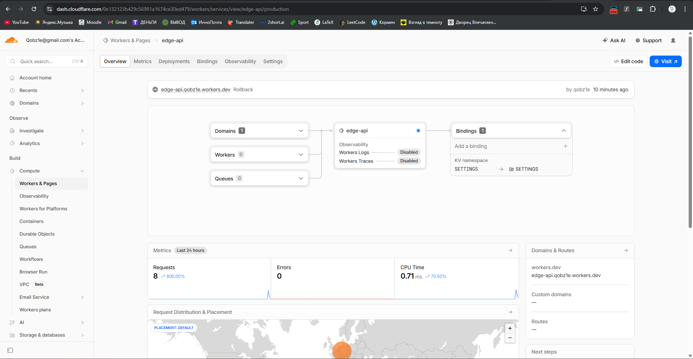
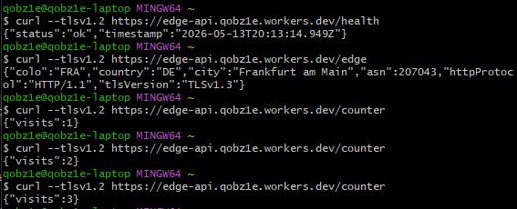
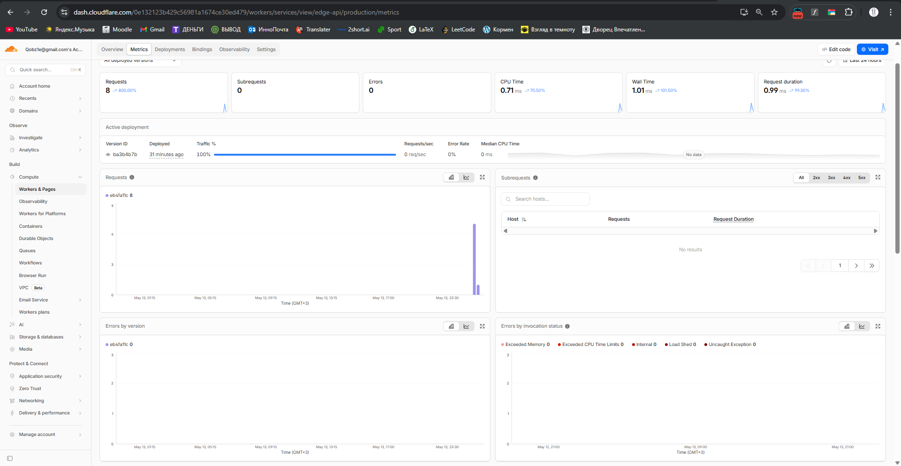

# WORKERS.md — Cloudflare Workers Deployment

## 1. Deployment Summary

**Worker name:** edge-api  
**Public URL:** https://edge-api.qobz1e.workers.dev  

### Routes implemented
- `/` — application info endpoint (app + course metadata)
- `/health` — health check endpoint returning status
- `/edge` — Cloudflare edge metadata (colo, country, city, ASN, protocol)
- `/secret-check` — verifies environment variables and secrets
- `/counter` — KV-backed persistent counter

### Configuration
- Environment variables:
  - APP_NAME
  - COURSE_NAME
- Secrets:
  - API_TOKEN
  - ADMIN_EMAIL
- KV namespace:
  - SETTINGS (used for persistent counter storage)

---

## 2. Evidence

### Dashboard overview

### API responses (/health, /edge, /counter)

### Metrics

---

## 3. Kubernetes vs Cloudflare Workers

| Aspect | Kubernetes | Cloudflare Workers |
|--------|------------|--------------------|
| Setup complexity | High | Low |
| Deployment speed | Slower (cluster + images) | Fast (instant deploy) |
| Global distribution | Manual multi-region setup | Automatic edge network |
| Cost (small apps) | Higher | Very low / free tier |
| State/persistence model | Volumes, DBs, PVCs | KV / D1 / external storage |
| Control/flexibility | Full control over infra | Limited runtime control |
| Best use case | Microservices, heavy workloads | Lightweight APIs, edge logic |

---

## 4. When to Use Each

### Kubernetes is better for:
- Long-running services
- Stateful applications with complex storage
- Microservices architectures
- Full infrastructure control

### Workers is better for:
- Lightweight HTTP APIs
- Edge-optimized latency-sensitive logic
- Simple backend services
- Global distribution without infra management

### Recommendation:
Use Kubernetes for system-level backend infrastructure, and Workers for edge-facing lightweight APIs and routing logic.

---

## 5. Reflection

- Workers deployment was significantly faster than Kubernetes deployment.
- No need to manage containers, pods, or cluster configuration.
- Global distribution is automatic and requires no region configuration.
- KV provides simple persistence but is more limited than Kubernetes storage solutions.
- Main limitation is lack of full runtime and infrastructure control compared to Kubernetes.