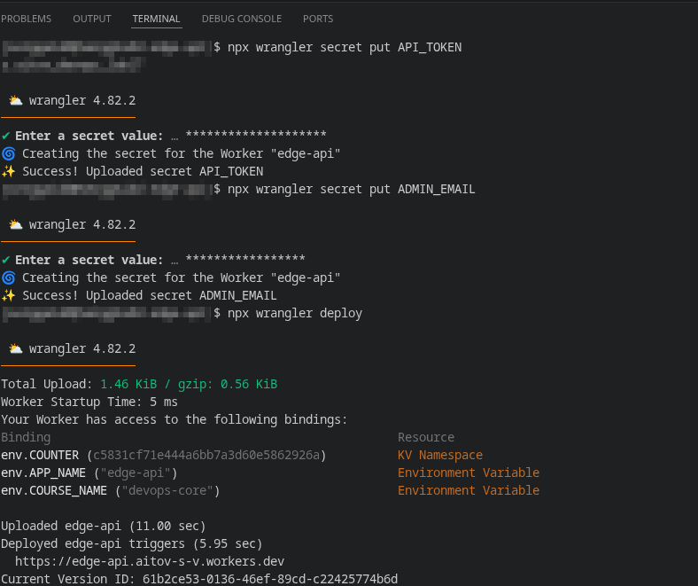
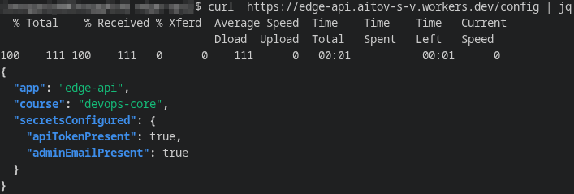
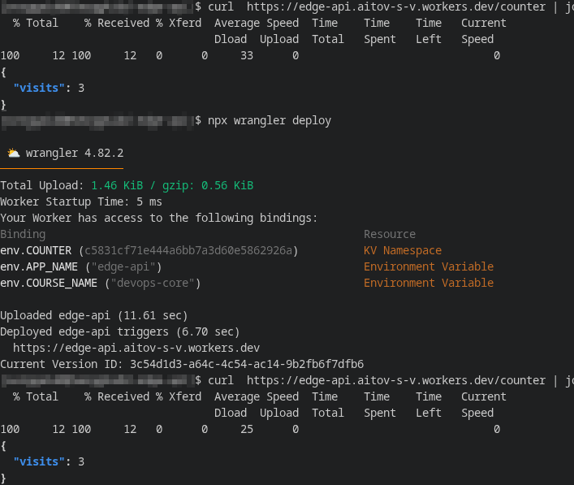
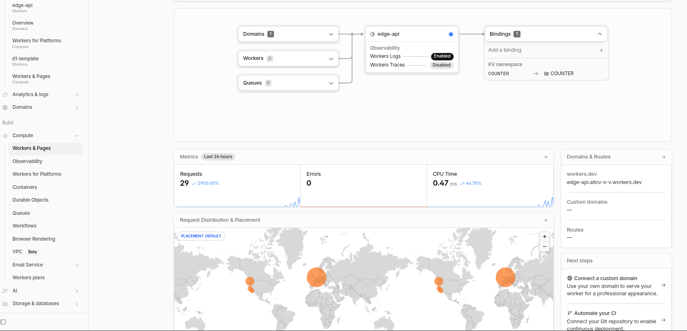
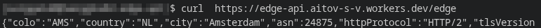
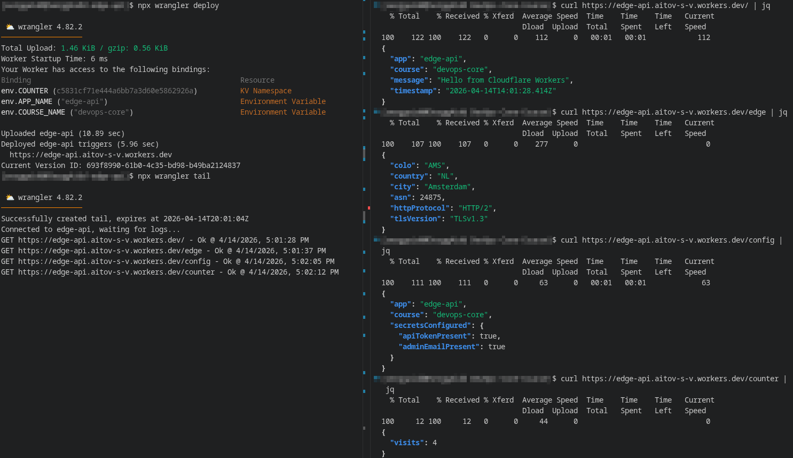
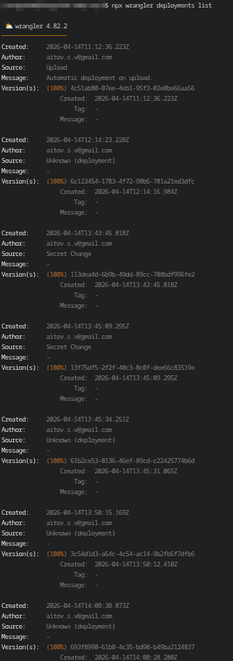
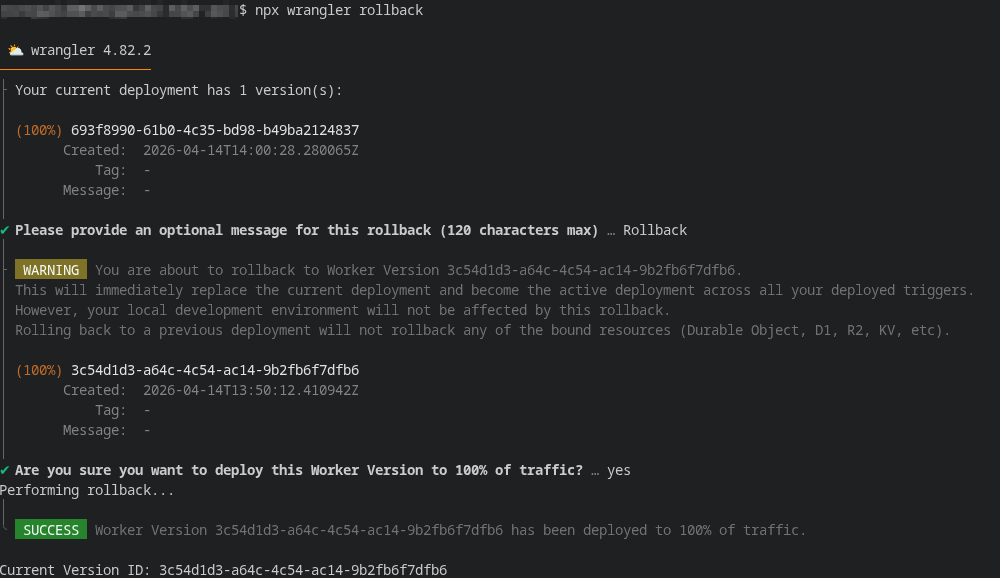
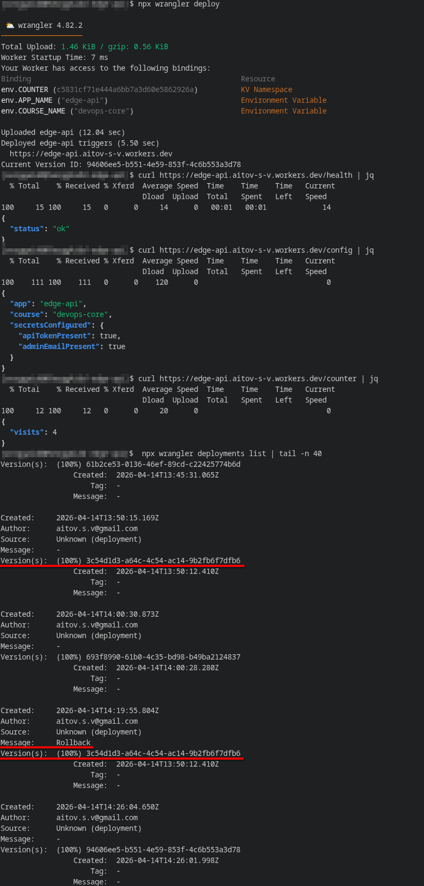

# Lab 17 — Cloudflare Workers Edge Deployment

## 1. Deployment Summary

### Worker URL
`https://edge-api.aitov-s-v.workers.dev`

### Main routes
| Route | Method | Purpose |
|---|---|---|
| `/` | GET | The main endpoint that returns basic information about the Worker and increments the visit counter in KV. |
| `/health` | GET | API availability check, returning JSON with status `ok`. |
| `/edge` | GET | Returns edge metadata of the request from `request.cf`: `colo`, `country`, `city`, `asn`, `httpProtocol`, `tlsVersion`. |
| `/counter` | GET | Returns the current value of the visitor counter stored in the Workers KV. |
| `/config` | GET | Returns the plaintext variables used and the presence of secrets via boolean flags, without revealing the values ​​themselves. |

### Configuration used
We used a minimal TypeScript worker created via `create-cloudflare` with the **Worker only** template. The `wrangler.jsonc` file was used as configuration, which specified:
- Worker name: `edge-api`;
- entry point: `src/index.ts`;
- `compatibility_date: "2026-04-14"`;
- `observability.enabled: true`;
- `compatibility_flags: ["nodejs_compat"]`;
- plaintext variables: `APP_NAME=edge-api`, `COURSE_NAME=devops-core`;
- KV binding: `COUNTER`.

Additionally, the `API_TOKEN` and `ADMIN_EMAIL` secrets were created with Wrangler and accessed in the Worker through the `env` object. The **Workers KV** was used to store the state, storing the value of the `visits` key. Testing showed that the counter value persists after redeploying the Worker.

## 2. Evidence
### Cloudflare dashboard

### Example `/edge` JSON response

### Example log or metrics screenshot

### Additional deployment evidence

## 3. Kubernetes vs Cloudflare Workers Comparison

| Aspect | Kubernetes | Cloudflare Workers |
|--------|------------|--------------------|
| Setup complexity | Requires a cluster, network model, manifests, ingress, service, storage, and separate platform support. | It's much easier to get started: just create a Worker, configure `wrangler.jsonc`, bindings and deploy. |
| Deployment speed | Deployment is usually more complex in terms of steps: image build, registry push, rollout, resource verification. | Deployment is very fast and short in process: change code, `wrangler deploy`, get public URL. |
| Global distribution | Multi-regionality typically requires separate design of regions, load balancing, DNS, and placement strategy. | Global execution is provided by the platform out of the box, without a separate step like "deploy to multiple regions". |
| Cost (for small apps) | For small APIs, it can be excessive in terms of resources and operational costs. | For small HTTP APIs and edge logic, it is usually more cost-effective and simpler, since there is no need to maintain a cluster. |
| State/persistence model | You can use PVCs, databases, StatefulSet, external managed services, and a more familiar state model. | The Worker itself is stateless, and the state is moved to external bindings, such as KV, D1, R2, Durable Objects. |
| Control/flexibility | Provides maximum flexibility: containers, sidecar approach, custom runtime, background processes, complex topologies. | The model is more limited: it is not a Docker host or a general-purpose server, but a managed serverless runtime. |
| Best use case | Complex platforms, microservices, containerized applications, stateful workloads, integrations with rich infrastructure. | Lightweight APIs, edge request processing, fast global endpoints, simple public services, and lightweight backend logic. |

## 4. When to Use Each
### Scenarios favoring Kubernetes
Kubernetes is preferable when an application requires a full-fledged container runtime, multiple services, complex internal networking, background processes, fine-grained resource control, and an advanced state model. It's also better suited for scenarios where a mature container platform already exists and the need to integrate into an existing DevOps process with Helm, ingress, stack monitoring, and rollouts is needed.

### Scenarios favoring Workers
Cloudflare Workers are best suited for small HTTP APIs, edge endpoints, public services with global access, and scenarios where quick startup, simple publishing, and minimal operational overhead are important. They are especially convenient for simple backend code, configuration endpoints, counters, lightweight metadata APIs, and logic that needs to be executed closer to the user.

### Your recommendation
For the project that unfolded throughout the course, Cloudflare Workers proved to be a more suitable option, as the goal was to quickly create and publish a small API with a public `workers.dev` URL, edge metadata, secret bindings, and simple persistent state via KV. If the goal had been to deploy a full-fledged containerized application with a complex architecture and a high level of runtime customization, I would have chosen Kubernetes.

## 5. Reflection
### What felt easier than Kubernetes?
Project creation, local launch, and deployment were the simplest compared to Kubernetes. No container image, registry, Helm chart, Service, Ingress, or separate load balancing settings were required. Quick public access via workers.dev was also convenient, allowing me to test the remote API almost immediately.

### What felt more constrained?
The execution model itself turned out to be more limited. Worker runs in a managed serverless runtime, so it lacks the usual freedom of a container environment, lacks a full-fledged background process, and can't be treated like a regular Linux service. State storage is also not local, but externalized to bindings, requiring careful consideration of where and how to store data.

### What changed because Workers is not a Docker host?
The main change was that the application had to be treated not as a container, but as an HTTP request handler. You couldn't simply port a Docker image and expect the same operational model. Instead, the API had to be adapted to the Worker runtime, using env for vars and secrets, and implementing persistence via Worker KV. This shifted the focus from container packaging and orchestration to binding configuration and edge-platform execution features.
