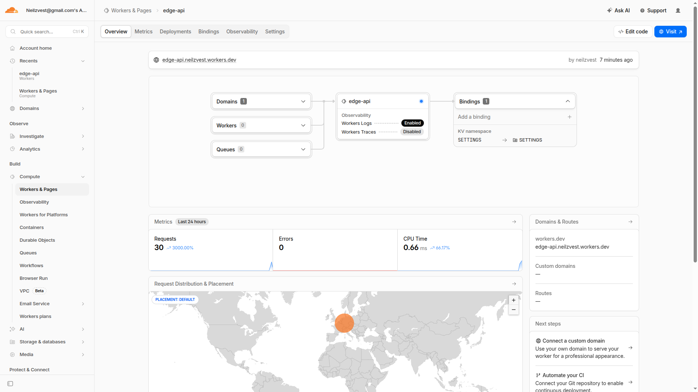

# Lab 17 - Cloudflare Workers Edge Deployment

## Deployment Summary

Worker name: `edge-api`

Public URL: `https://edge-api.neilzvest.workers.dev`

Runtime: Cloudflare Workers

Language: TypeScript

Main entrypoint: `src/index.ts`

Configuration file: `wrangler.jsonc`

Current deployed version observed during Task 5:

```text
79e95d9d-1c63-4c98-aeef-9c1ab1069548
```

Main routes:

| Route | Purpose |
| --- | --- |
| `/` | General application metadata and route list |
| `/health` | Health check endpoint |
| `/edge` | Cloudflare edge metadata from `request.cf` |
| `/metadata` | Deployment/runtime metadata and safe configuration status |
| `/config` | Plaintext variable and secret-configuration status |
| `/counter` | Workers KV-backed persisted visit counter |

Configuration used:

| Configuration | Value |
| --- | --- |
| Plaintext vars | `APP_NAME=edge-api`, `COURSE_NAME=devops-core` |
| Secrets | `API_TOKEN`, `ADMIN_EMAIL` |
| KV namespace binding | `SETTINGS` |
| Observability | Enabled in `wrangler.jsonc` |
| Public routing | `workers.dev` |

Source control history:

```text
5d42653 Complete lab 17 task 2 worker API
4873860 Complete lab 17 task 3 edge behavior
9d59d9a Complete lab 17 task 4 config and persistence
bae5513 Complete lab 17 task 5 operations
```

## Evidence

Dashboard screenshot:



Expected screenshot content: Cloudflare Dashboard -> Workers & Pages -> `edge-api`, showing the Worker exists and is deployed.

Edge metadata response:

```bash
curl -sS https://edge-api.neilzvest.workers.dev/edge
```

```json
{
  "app": "edge-api",
  "colo": "FRA",
  "country": "DE",
  "city": "Frankfurt am Main",
  "asn": 213877,
  "httpProtocol": "HTTP/2",
  "tlsVersion": "TLSv1.3",
  "timestamp": "2026-05-14T13:22:00.637Z"
}
```

Log or metrics screenshot:

```text
TODO: add screenshot at screenshots/cloudflare-metrics-or-logs.png
```

Expected screenshot content: Cloudflare Dashboard -> Workers & Pages -> `edge-api` -> Metrics or Observability/Logs, showing request counts, errors, or a log entry.

CLI log evidence is also recorded in the Task 5 section below.

## Task 3 - Global Edge Behavior

Worker URL: `https://edge-api.neilzvest.workers.dev`

The Worker exposes `/edge` to return Cloudflare request metadata from the incoming request context. The endpoint includes the required `colo` and `country` fields plus additional fields: `city`, `asn`, `httpProtocol`, and `tlsVersion`.

Public verification captured on 2026-05-14:

```bash
curl -sS -w "\nHTTP %{http_code}\n" https://edge-api.neilzvest.workers.dev/edge
```

```json
{
  "app": "edge-api",
  "colo": "FRA",
  "country": "DE",
  "city": "Frankfurt am Main",
  "asn": 213877,
  "httpProtocol": "HTTP/2",
  "tlsVersion": "TLSv1.3",
  "timestamp": "2026-05-14T13:02:35.891Z"
}
```

HTTP status:

```text
HTTP 200
```

This response shows that Cloudflare executed the Worker on its edge network and attached request metadata to `request.cf`. In this request, Cloudflare handled the request through the `FRA` colo and provided network/protocol details such as ASN, HTTP protocol, and TLS version.

### Global Distribution

Cloudflare Workers are deployed to Cloudflare's global edge network. A single deployment makes the Worker available globally, and Cloudflare routes each incoming request to an appropriate nearby data center. The application code does not need region-specific replicas.

This is different from VM, Kubernetes, or many PaaS deployments where you usually choose one or more regions manually, deploy infrastructure into each region, configure load balancing, and manage regional capacity. With Workers, Cloudflare owns the regional placement and routing layer.

There is no separate "deploy to 3 regions" step because `wrangler deploy` publishes the Worker to Cloudflare's edge platform as a globally available service. Global request routing is part of the platform behavior.

### Routing Concepts

`workers.dev` is Cloudflare's default public URL for Workers. It is useful for this lab because it gives the Worker a reachable HTTPS URL without buying or configuring a custom domain.

Routes attach a Worker to matching traffic for an existing Cloudflare zone. For example, a route can make a Worker handle selected paths under a domain already managed by Cloudflare.

Custom Domains bind a Worker directly to a domain or subdomain so the Worker can serve traffic from that hostname. This lab uses `workers.dev`; custom domains are optional.

References:

- Cloudflare Workers Overview: https://developers.cloudflare.com/workers/
- Request API and `request.cf`: https://developers.cloudflare.com/workers/runtime-apis/request/
- `workers.dev` routing: https://developers.cloudflare.com/workers/configuration/routing/workers-dev/
- Routes and domains: https://developers.cloudflare.com/workers/configuration/routing/

## Task 4 - Configuration, Secrets, and Persistence

Plaintext variables are configured in `wrangler.jsonc`:

```json
{
  "vars": {
    "APP_NAME": "edge-api",
    "COURSE_NAME": "devops-core"
  }
}
```

The Worker uses these values through `env.APP_NAME` and `env.COURSE_NAME` in `/`, `/health`, `/metadata`, and `/config`.

Plaintext vars are not suitable for secrets because they are committed to source control in `wrangler.jsonc`. They are appropriate for non-sensitive configuration such as app names, feature flags, or course labels. Secret values should be stored with Wrangler secrets because Cloudflare stores them outside the repository and injects them into the Worker environment at runtime.

Two secrets were configured with Wrangler:

```bash
npx wrangler secret put API_TOKEN
npx wrangler secret put ADMIN_EMAIL
```

The Worker reads these through `env.API_TOKEN` and `env.ADMIN_EMAIL`, but it does not return the raw secret values. `/config` only returns whether each secret is configured and the email domain:

```json
{
  "app": "edge-api",
  "course": "devops-core",
  "plaintextVars": ["APP_NAME", "COURSE_NAME"],
  "secrets": {
    "apiTokenConfigured": true,
    "adminEmailConfigured": true,
    "adminEmailDomain": "gmail.com"
  },
  "note": "Secret values are read from env but are not returned."
}
```

Workers KV persistence is configured with a namespace bound as `SETTINGS`:

```json
{
  "kv_namespaces": [
    {
      "binding": "SETTINGS",
      "id": "f4c891b632f746e791d55f1a6fe80c1f"
    }
  ]
}
```

The `/counter` endpoint reads the `visits` key from `env.SETTINGS`, increments it, writes it back, and returns the new value.

Persistence verification:

```bash
curl -sS -w "\nHTTP %{http_code}\n" https://edge-api.neilzvest.workers.dev/counter
```

Before redeploy:

```json
{
  "key": "visits",
  "visits": 1,
  "persistedIn": "Workers KV"
}
```

After redeploy:

```json
{
  "key": "visits",
  "visits": 2,
  "persistedIn": "Workers KV"
}
```

The value increased after redeploy, which confirms the counter state is stored in Workers KV rather than in Worker memory.

## Task 5 - Observability and Operations

The Worker includes a production log statement at the start of `fetch()`:

```ts
console.log("request", {
  method: request.method,
  path: url.pathname,
  colo: request.cf?.colo ?? "local",
  country: request.cf?.country ?? "local",
  version: API_VERSION,
});
```

Log tailing was verified with Wrangler:

```bash
npx wrangler tail --format pretty
curl -sS -w "\nHTTP %{http_code}\n" https://edge-api.neilzvest.workers.dev/health
```

Captured log entry:

```text
GET https://edge-api.neilzvest.workers.dev/health - Ok @ 5/14/2026, 4:16:42 PM
  (log) request {
  method: 'GET',
  path: '/health',
  colo: 'FRA',
  country: 'DE',
  version: 'task-5'
}
```

The request returned:

```json
{
  "status": "ok",
  "service": "edge-api",
  "timestamp": "2026-05-14T13:16:42.108Z"
}
```

HTTP status:

```text
HTTP 200
```

### Metrics

Metrics were inspected for the Worker request/error counts. For the 2026-05-14T12:00:00Z to 2026-05-14T13:30:00Z window, Cloudflare reported:

```json
{
  "requests": 26,
  "errors": 0,
  "subrequests": 0
}
```

The key metric reviewed was the request/error count. It confirms the Worker received traffic during the lab and had zero reported Worker invocation errors in that time window.

### Deployments

Deployment history was viewed with:

```bash
npx wrangler deployments list
```

Recent deployments include:

```text
2026-05-14T13:11:10.914Z  1ebe297f-8e76-41a0-b62b-2f20b2bb42b7
2026-05-14T13:11:43.350Z  5e3f7167-b871-4c73-b7dc-960b33f45a1d
2026-05-14T13:16:06.961Z  79e95d9d-1c63-4c98-aeef-9c1ab1069548
```

Current production deployment:

```text
Created:     2026-05-14T13:16:06.961Z
Version(s):  (100%) 79e95d9d-1c63-4c98-aeef-9c1ab1069548
```

Rollback was documented rather than performed so the latest Task 5 version stays active. To roll back to the previous Task 4 version, the command would be:

```bash
npx wrangler rollback 5e3f7167-b871-4c73-b7dc-960b33f45a1d --message "Rollback to Task 4 version"
```

After a real rollback, `npx wrangler deployments status` would confirm which version is receiving 100% of production traffic.

## Kubernetes vs Cloudflare Workers Comparison

| Aspect | Kubernetes | Cloudflare Workers |
| --- | --- | --- |
| Setup complexity | Requires a cluster, manifests, images, registry, ingress, networking, and operational configuration. | Requires a Worker project, `wrangler.jsonc`, and Cloudflare account authentication. No cluster is managed by the application owner. |
| Deployment speed | Deployment speed depends on image build/push, scheduler placement, rollout settings, and cluster health. | Deployment is usually fast because Wrangler uploads code/config directly to the Workers platform. |
| Global distribution | Multi-region deployment must be designed explicitly with clusters or nodes in each region plus global load balancing. | Global availability is built into the platform. A single deploy is served from Cloudflare's edge network. |
| Cost for small apps | A cluster can be expensive or operationally heavy for small APIs, especially when always-on nodes are required. | Workers are well suited for small APIs because there is no always-on server to manage and usage can scale with requests. |
| State/persistence model | Kubernetes workloads are normally stateless pods plus external databases, volumes, object stores, or operators for stateful systems. | Worker code is stateless between requests; persistence comes from bindings such as KV, D1, R2, Durable Objects, or external services. |
| Control/flexibility | High control over runtime, networking, sidecars, scheduling, containers, and long-running services. | More constrained runtime with platform-specific APIs, request limits, and no arbitrary Docker container execution. |
| Best use case | Complex services, containerized workloads, internal platforms, background processing, and systems needing fine infrastructure control. | Lightweight APIs, edge logic, request routing, personalization, webhooks, static-adjacent backends, and globally distributed low-latency handlers. |

## When to Use Each

Use Kubernetes when the application needs custom containers, long-running processes, service meshes, internal networking, specialized runtime dependencies, or a mix of services that require strong infrastructure control. It is also a better fit when the team already operates a cluster and the workload benefits from standard Kubernetes abstractions.

Use Cloudflare Workers when the application is HTTP/request-driven, benefits from global low-latency execution, and can use platform bindings for configuration, secrets, and state. Workers are a strong fit for small public APIs, edge metadata/routing logic, request validation, lightweight persistence, and fast deployments.

My recommendation for this lab API is Cloudflare Workers. The service is small, HTTP-only, stateless except for a KV counter, and does not need Docker or Kubernetes scheduling. Workers gave public HTTPS, global routing, config/secrets, KV, logs, metrics, and rollback history with much less infrastructure setup.

## Reflection

What felt easier than Kubernetes:

Cloudflare Workers removed the need to build and push a container image, write Kubernetes Deployment/Service/Ingress manifests, configure an ingress controller, or choose cluster regions. Local development and production deployment both used Wrangler, and the public `workers.dev` URL was available immediately after deployment.

What felt more constrained:

The Worker is not a general Linux container. It runs inside the Workers runtime, so the application must fit the request/response execution model and use supported runtime APIs. State cannot be kept reliably in process memory, and platform services such as KV must be accessed through bindings.

What changed because Workers is not a Docker host:

The lab API was implemented as Workers-native TypeScript instead of deploying a Docker image from an earlier lab. Configuration moved into `wrangler.jsonc`, secrets moved into Wrangler-managed Cloudflare secrets, persistence moved into Workers KV, and operational commands moved from Kubernetes tools to Wrangler commands.

## Final Checklist

- Cloudflare account created: done
- Workers project initialized: done
- Wrangler authenticated: done
- Worker deployed to `workers.dev`: done
- `/health` endpoint working: done
- Edge metadata endpoint implemented: done
- At least 1 plaintext variable configured: done
- At least 2 secrets configured: done
- KV namespace created and bound: done
- Persistence verified after redeploy: done
- Logs or metrics reviewed: done
- Deployment history viewed: done
- `WORKERS.md` documentation complete: done except adding dashboard screenshots
- Kubernetes comparison documented: done
