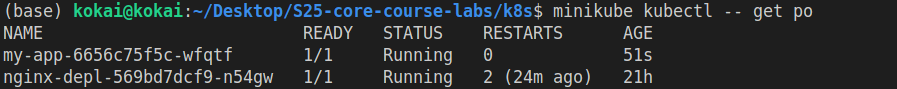
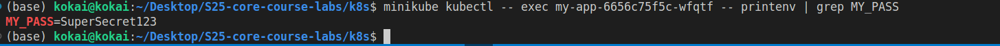
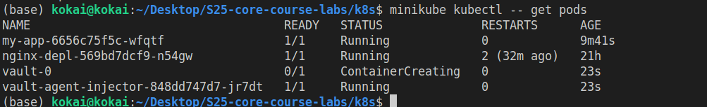
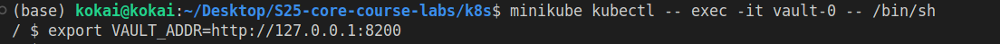
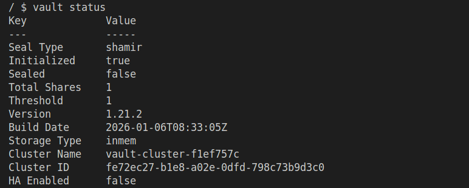
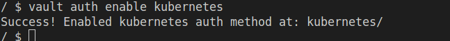
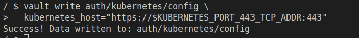
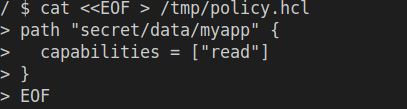
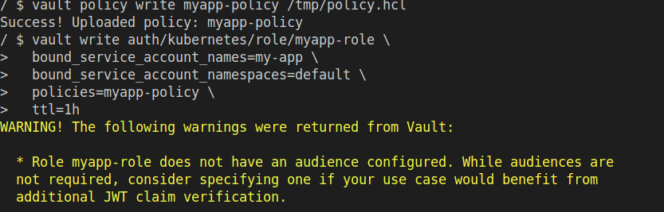

# Lab 11: Kubernetes Secrets and Hashicorp Vault


## Create a Secret Using `kubectl`

I can ran the following command 

```
 kokai@kokai:~/Desktop/S25-core-course-labs/k8s$ minikube kubectl -- create secret generic my-secret   --from-literal=MY_PASS=SuperSecret123
secret/my-secret created
```

To verfy the secret existinse
```
 kokai@kokai:~/Desktop/S25-core-course-labs/k8s$ minikube kubectl -- get secrets
NAME                           TYPE                 DATA   AGE
my-secret                      Opaque               1      50s
sh.helm.release.v1.my-app.v1   helm.sh/release.v1   1      51m
```

To get the secret
```
(base) kokai@kokai:~/Desktop/S25-core-course-labs/k8s$ minikube kubectl -- get secret my-secret -o yaml
apiVersion: v1
data:
  MY_PASS: U3VwZXJTZWNyZXQxMjM=
kind: Secret
metadata:
  creationTimestamp: "2026-02-16T10:42:03Z"
  name: my-secret
  namespace: default
  resourceVersion: "17558"
  uid: 20aacc2b-1d15-44a0-a412-8c0e8a675754
type: Opaque
```

To decode the secret

```
 kokai@kokai:~/Desktop/S25-core-course-labs/k8s$ echo "U3VwZXJTZWNyZXQxMjM=" | base64 --decode
SuperSecret123
```


### Add an env field to your Deployment
After adding the env and uninsalling and reinstalling the webapp with helm I got the running pods by this command 

command `minikube kubectl -- get po`


and then we get the secret by running the command 
command `minikube kubectl -- exec my-app-6656c75f5c-wfqtf -- printenv | grep MY_PASS`




### Instulling Valut
We can verify vault installation by running `minikube kubectl -- get pods`




After this I entered the valut-0 pod console ` minikube kubectl -- exec -it vault-0 -- /bin/sh`

I ran the following commands
`export VAULT_ADDR=http://127.0.0.1:8200`


`vault status`


` vault kv put secret/myapp MY_PASS=VaultSecret123`


### Enable auth methid in kubernetes




### Create a vault policy


