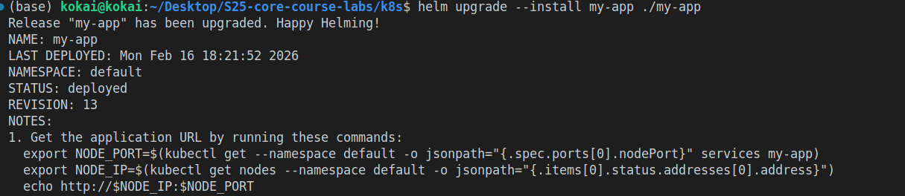
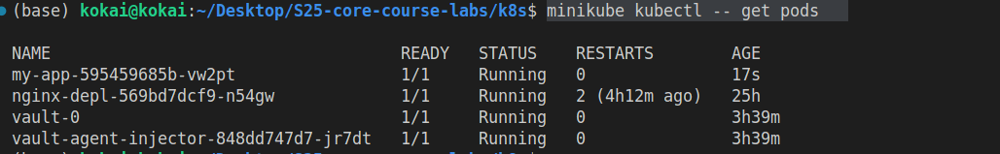
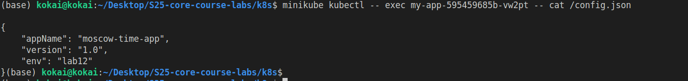

# Task 2: ConfigMap Implementation in Kubernetes 

note the first task was done inside the app_python folder

## Overview 

In this task, we implemented a Kubernetes ConfigMap to manage application configuration outside the container image. The key steps included:

Creating a config.json file containing application-specific settings in JSON format.

Adding a ConfigMap template in Helm (templates/config.yaml) to load the JSON file into Kubernetes.

Updating the deployment (templates/deployment.yaml) to mount the ConfigMap as a file inside the pod.

Configuring volumes and volume mounts via Helm values (values.yaml) to make the configuration accessible to the container.

Verifying that the ConfigMap was successfully mounted in the running pods.

### Files Added / Modied 

files/config.json – JSON configuration for the application:
```
{
    "appName": "moscow-time-app",
    "version": "1.0",
    "env": "lab12"
}
```

templates/config.yaml – Helm template for ConfigMap:
```
apiVersion: v1
kind: ConfigMap
metadata:
  name: my-app-config
data:
  config.json: |-
{{ .Files.Get "files/config.json" | indent 4 }}
```

templates/deployment.yaml – Added:

```
envFrom:
  - configMapRef:
      name: my-app-config

volumeMounts:
  - name: config-volume
    mountPath: /config/config.json
    subPath: config.json

volumes:
  - name: config-volume
    configMap:
      name: my-app-config
```

values.yaml – Configured volumes and volumeMounts:
```
volumes:
  - name: config-volume
    configMap:
      name: my-app-config

volumeMounts:
  - name: config-volume
    mountPath: /config.json
    subPath: config.json

```

## Deployment and Verification

### Install / upgrade Helm chart `helm upgrade --install my-app ./my-app`: 


### `minikube kubectl -- get pods`


### ` minikube kubectl -- exec my-app-595459685b-vw2pt -- cat /config.json`
