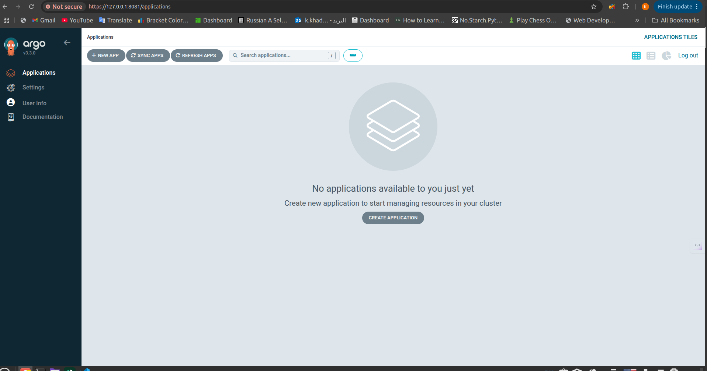
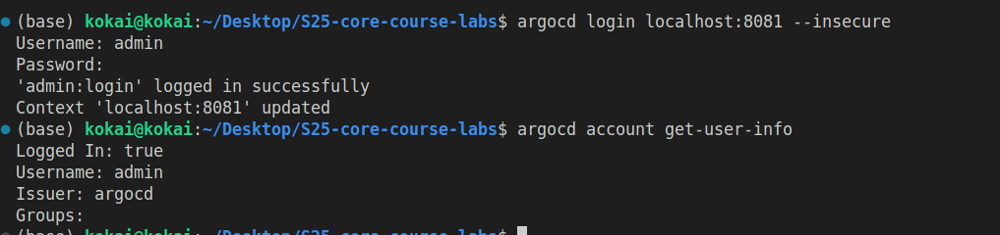
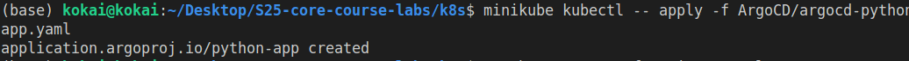

# ArgoCD for GitOps Deployment

## Installing ArgoCD via Helm 

Running the following command ` helm repo add argo https://argoproj.github.io/argo-helm`

```
(base) kokai@kokai:~/Desktop/S25-core-course-labs/k8s$ helm repo add argo https://argoproj.github.io/argo-helm
"argo" has been added to your repositories
```

Verfing the Argo repo was added by rnuning this command `helm repo list`

```
(base) kokai@kokai:~/Desktop/S25-core-course-labs/k8s$ helm repo list
NAME            URL                                 
hashicorp       https://helm.releases.hashicorp.com 
argo            https://argoproj.github.io/argo-helm
```

Installing Argo-cd by running this command `helm install argo argo/argo-cd --namespace argocd --create-namespace`

```
(base) kokai@kokai:~/Desktop/S25-core-course-labs/k8s$ helm install argo argo/argo-cd --namespace argocd --create-namespace
NAME: argo
LAST DEPLOYED: Mon Feb 16 20:05:29 2026
NAMESPACE: argocd
STATUS: deployed
REVISION: 1
TEST SUITE: None
NOTES:
In order to access the server UI you have the following options:

1. kubectl port-forward service/argo-argocd-server -n argocd 8080:443

    and then open the browser on http://localhost:8080 and accept the certificate

2. enable ingress in the values file `server.ingress.enabled` and either
      - Add the annotation for ssl passthrough: https://argo-cd.readthedocs.io/en/stable/operator-manual/ingress/#option-1-ssl-passthrough
      - Set the `configs.params."server.insecure"` in the values file and terminate SSL at your ingress: https://argo-cd.readthedocs.io/en/stable/operator-manual/ingress/#option-2-multiple-ingress-objects-and-hosts


After reaching the UI the first time you can login with username: admin and the random password generated during the installation. You can find the password by running:

kubectl -n argocd get secret argocd-initial-admin-secret -o jsonpath="{.data.password}" | base64 -d

(You should delete the initial secret afterwards as suggested by the Getting Started Guide: https://argo-cd.readthedocs.io/en/stable/getting_started/#4-login-using-the-cli)
```

Getting the pods running in the argocd nampscpace by running the following comand  ` minikube kubectl -- get pods -n argocd`

```
 kokai@kokai:~/Desktop/S25-core-course-labs/k8s$ minikube kubectl -- get pods -n argocd
NAME                                                     READY   STATUS            RESTARTS   AGE
argo-argocd-application-controller-0                     1/1     Running           0          46s
argo-argocd-applicationset-controller-799879ff78-qg4gd   1/1     Running           0          46s
argo-argocd-dex-server-fcd4b66f6-nlrtz                   0/1     PodInitializing   0          46s
argo-argocd-notifications-controller-789cb777f4-txzdd    1/1     Running           0          46s
argo-argocd-redis-74875bfd56-gdw9k                       1/1     Running           0          46s
argo-argocd-redis-secret-init-lvmfs                      0/1     Completed         0          69s
argo-argocd-repo-server-7ddcc596cd-rz6db                 1/1     Running           0          46s
argo-argocd-server-7f646659bd-jpfvm                      1/1     Running           0          46s
```

Installing ArgoCD CLi using the following command 

```
(base) kokai@kokai:~/Desktop/S25-core-course-labs/k8s$ curl -sSL -o argocd https://github.com/argoproj/argo-cd/releases/latest/download/argocd-linux-amd64
chmod +x argocd
sudo mv argocd /usr/local/bin/
```

Verifying the argocd version 
```
 kokai@kokai:~/Desktop/S25-core-course-labs/k8s$ argocd version
argocd: v3.3.0+fd6b7d5
  BuildDate: 2026-02-02T07:53:15Z
  GitCommit: fd6b7d5b3cba5e7aa7ad400b0fb905a81018a77b
  GitTreeState: clean
  GoVersion: go1.25.5
  Compiler: gc
  Platform: linux/amd64
{"level":"fatal","msg":"Argo CD server address unspecified","time":"2026-02-16T20:09:14+03:00"}
```

Forward the ArgoCD server port:

```
(base) kokai@kokai:~/Desktop/S25-core-course-labs/k8s$ minikube kubectl -- port-forward svc/argo-argocd-server -n argocd 8081:443 
Forwarding from 127.0.0.1:8081 -> 8080
Handling connection for 8081
Handling connection for 8081
Handling connection for 8081
Handling connection for 8081
Handling connection for 8081
Handling connection for 8081
Handling connection for 8081
Handling connection for 8081
Handling connection for 8081
Handling connection for 8081
```

Getting the passward and accessing the ui



An example for CLI login 



## Creating ArgoCD Application mainfest

I created the `argocd-python-app.yaml`

```
apiVersion: argoproj.io/v1alpha1
kind: Application
metadata:
  name: python-app
  namespace: argocd
spec:
  project: default
  source:
    repoURL: https://github.com/KaramKhaddour/S25-core-course-labs.git
    targetRevision: lab13
    path: <k8s/my-app>
    helm:
      valueFiles:
        - values.yaml
  destination:
    server: https://kubernetes.default.svc
    namespace: default
  syncPolicy:
    automated: {}
```

Running the following command `minikube kubectl -- apply -f ArgoCD/argocd-python-app.yaml`



