# Kubernetes StatefulSet

- First step: rename `deplyment.yaml` and making it `statefulset.yaml` inside the Helm chart 

- Second step : editing the new file. I added some parts to `statefulset.yaml` like volumeClaimTemplates

- Third step:  testing the htlm chart 
  I ran the following command `(base) kokai@kokai:~/Desktop/S25-core-course-labs/k8s$ helm install --dry-run my-app ./my-app`

 the output showed a fully rendered Helmchart 

- Fourth Step : after deploying the helm chart I ran all the listed commands 

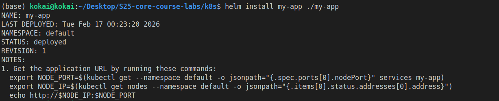
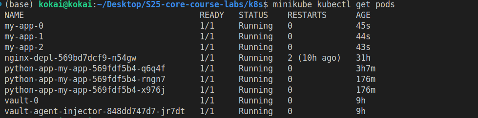
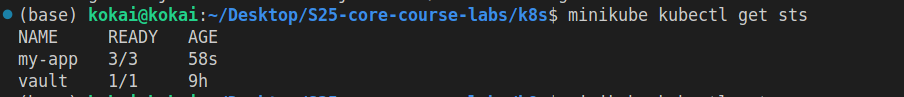
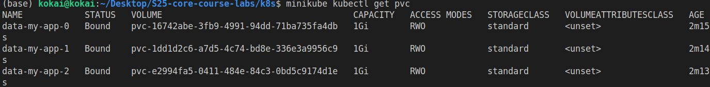
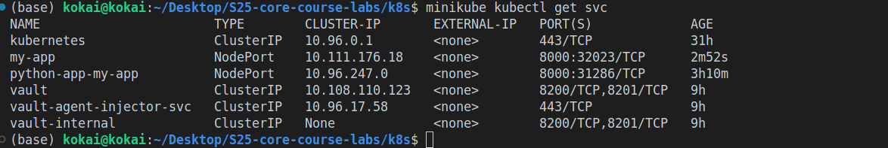
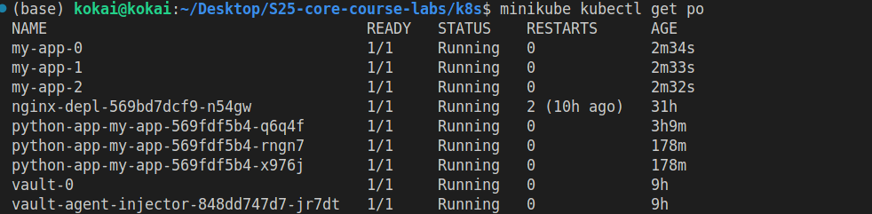

- Fifth step: accessing the service 
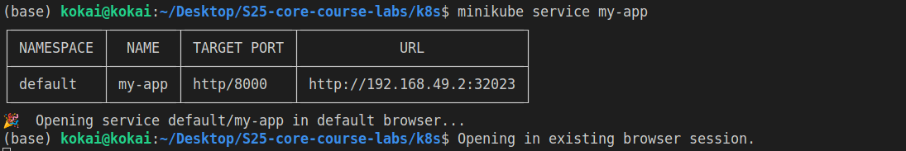
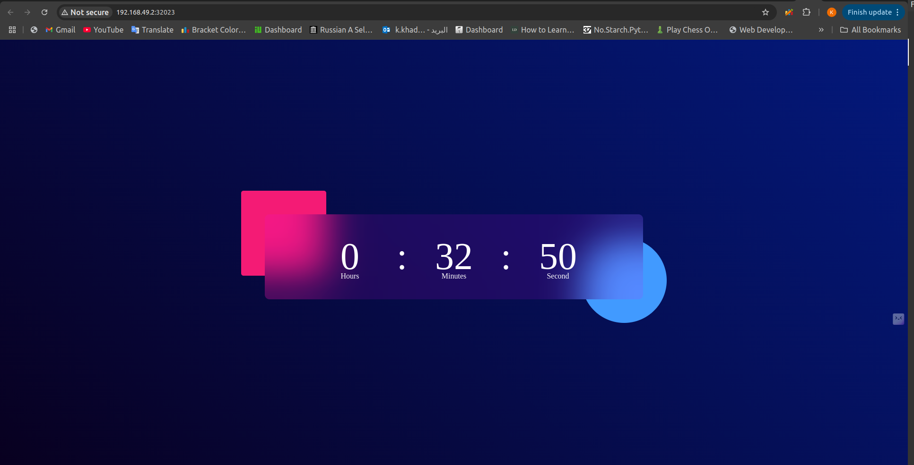

- Sixth step: I opened muliple tabs and windows to access the root path of my app
- 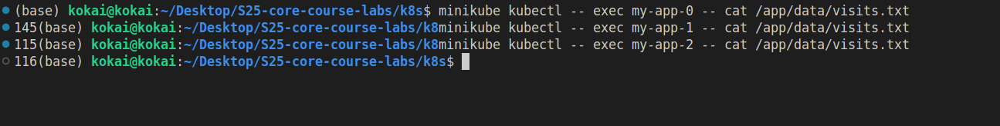
  

  the explaination : The visit count differs between pods because incoming requests are spread across multiple replicas, and each pod updates its own visits.txt file on its persistent volume. Since each pod maintains an independent counter, the total number of visits can vary from one pod to another.

- Seventh step: Persistent Storage Validation
  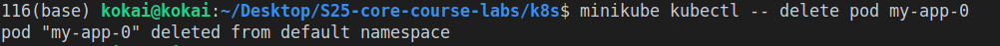
  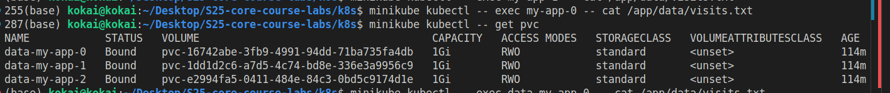

- Eigth Step: Headless Service Access

### Monitoring & Alerts
 How probes ensure pod health.

- Liveness probe periodically checks if the application is running (by sending an HTTP GET request to /). If the probe fails, Kubernetes considers the pod unhealthy and restarts the container. This ensures that crashed or deadlocked processes are automatically recovered.

- Readiness probe determines if the pod is ready to accept traffic. If the probe fails, the pod is removed from the Service’s endpoints, so no requests are routed to it. This prevents users from experiencing errors while the pod is starting up or temporarily overloaded.

Why they’re critical for stateful apps.

- Stateful apps keep persistent data (e.g., in PVCs) and unique identities. Liveness probes restart unhealthy pods while preserving their data and identity. Readiness probes prevent traffic from reaching a pod until it’s fully ready, ensuring consistent and correct responses. This is crucial for maintaining data integrity and availability in stateful services.

### Ordering Guarantee and Parallel Operations

Explain why ordering guarantees are unnecessary for your app.

By default, a StatefulSet uses the OrderedReady policy, creating and terminating pods sequentially (0, 1, 2…). This matters for apps that need a specific startup order, like databases with primary/replica roles.

However, my FastAPI service stores a visit counter in a local PersistentVolume per pod. Pods are independent:

No inter-pod communication or coordination

No leader/follower roles

Data is isolated per pod

Pod creation or termination order doesn’t affect correctness.

#### Implementing parallel pod management
To instruct the StatefulSet controller to launch or terminate all pods in parallel, I set the podManagementPolicy field to Parallel.