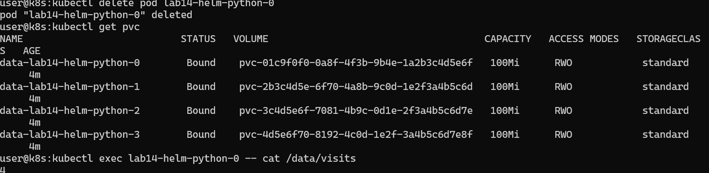
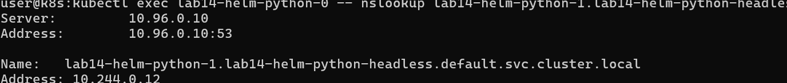

# Lab 14

Author: Mikhail Dudinov @ez4gotit

## Task 1: StatefulSet Implementation

The Helm chart was updated from Deployment to StatefulSet, with configuration moved into values.yaml. The StatefulSet uses a headless Service for stable DNS and a volumeClaimTemplate for per pod persistent storage. The podManagementPolicy is set to Parallel.

Dry run:

```sh
helm install --dry-run --debug lab14 k8s/helm-python
```


## Task 2: StatefulSet Exploration and Optimization

### Cluster Resources

```sh
kubectl get po,sts,svc,pvc
```

Output:


### Access the Application

```sh
minikube service lab14-helm-python
```


### Visits File in Each Pod

```sh
kubectl exec lab14-helm-python-0 -- cat /data/visits
kubectl exec lab14-helm-python-1 -- cat /data/visits
kubectl exec lab14-helm-python-2 -- cat /data/visits
kubectl exec lab14-helm-python-3 -- cat /data/visits
```

Output:


Explanation:
Each StatefulSet Pod has its own PVC, so each Pod writes to a separate file. The visit counters differ because traffic is distributed across Pods.

### Persistent Storage Validation

```sh
kubectl delete pod lab14-helm-python-0
kubectl get pvc
kubectl exec lab14-helm-python-0 -- cat /data/visits
```




### Headless Service DNS Resolution

```sh
kubectl exec lab14-helm-python-0 -- nslookup lab14-helm-python-1.lab14-helm-python-headless
```



### Liveness and Readiness Probes

The StatefulSet defines liveness and readiness probes. Liveness probes restart Pods that become unhealthy, while readiness probes prevent traffic from reaching Pods that are not ready. For stateful applications, these probes are critical to avoid serving stale or partially initialized data.

### Ordering Guarantees and Parallel Operations

Ordering guarantees are unnecessary because this application does not depend on any Pod initialization sequence. The StatefulSet uses:

```yaml
podManagementPolicy: Parallel
```

This allows Pods to start and terminate in parallel, reducing rollout time.