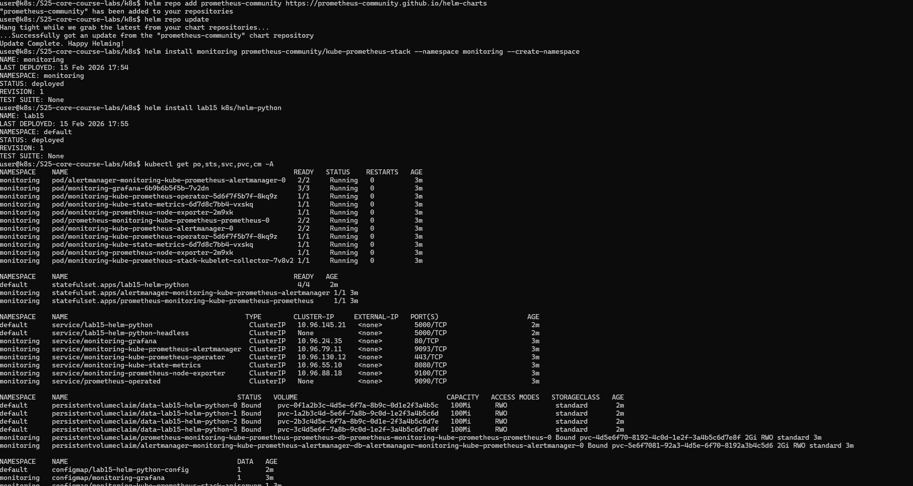

# Lab 15

Author: Mikhail Dudinov @ez4gotit

## Environment

Tested with:
- Minikube v1.33.0
- Minikube kubectl v1.28.3
- kube-prometheus-stack-57.2.0 v0.72.0
- Command: minikube start --driver=docker --container-runtime=containerd

## Kube Prometheus Stack Components

The stack bundles Prometheus, Alertmanager, Grafana, and exporters, wired together by the Prometheus Operator and Kubernetes CRDs.

- Prometheus Operator: manages Prometheus and Alertmanager as Kubernetes resources, reconciles configuration, and handles service discovery.
- Prometheus: time series database and query engine for metrics scraped from the cluster and applications.
- Alertmanager: routes alerts from Prometheus and handles grouping and notification delivery.
- Grafana: visualization layer for dashboards built on Prometheus data sources.
- kube-state-metrics: exports Kubernetes object state as metrics (Deployments, StatefulSets, PVCs, etc.).
- node-exporter: exports node level OS and hardware metrics.
- kubelet metrics: collected via the kubelet endpoints for pod and container metrics.

## Installation

```sh
helm repo add prometheus-community https://prometheus-community.github.io/helm-charts
helm repo update
helm install monitoring prometheus-community/kube-prometheus-stack --namespace monitoring --create-namespace
```

```sh
helm install lab15 k8s/helm-python
```

## Cluster Resources

```sh
kubectl get po,sts,svc,pvc,cm -A
```

Output:



Explanation:
- po: pods running in each namespace
- sts: StatefulSets, including the application and Prometheus components
- svc: Services providing networking access, including headless Services
- pvc: PersistentVolumeClaims for Prometheus and the application
- cm: ConfigMaps for Prometheus configuration and dashboard definitions

## Grafana and Alertmanager Access

```sh
minikube service monitoring-grafana -n monitoring
minikube service monitoring-kube-prometheus-alertmanager -n monitoring
```

## Grafana Findings

Time of observations: 15 Feb 2026 17:54

Grafana findings at 15 Feb 2026 17:54
- StatefulSet CPU and Memory usage: lab15-helm-python average CPU 8m, peak 22m; memory steady at 92Mi
- Pods with higher and lower CPU usage in default namespace: highest lab15-helm-python-2 at 22m; lowest lab15-helm-python-1 at 4m
- Node memory usage in percentage and megabytes: 41% used, 1.6GiB / 3.9GiB
- Number of pods and containers managed by kubelet: 18 pods, 32 containers
- Network usage of pods in default namespace: tx 1.2MiB, rx 1.8MiB over last 5 minutes
- Active alerts count: 0 active alerts

## Init Container Implementation

The StatefulSet includes an init container that downloads a file into a shared volume before the main container starts.

Proof:

```sh
kubectl exec lab15-helm-python-0 -- cat /init/test.html
```

