# Kubernetes Monitoring and Init Containers

## Kube Promethusd stack components explaination 
   - Prometheus: it's the main monitoring and alerting tool. it collects metrics and store them and trigger alerts if needed based on its configuration.
  
   - Alertmanager: recive alerts from Prometheus and handle them and direct them to specfic notification routes

   - Grafana: creates dashboards to visalize and interact with Prometheus. 
  
   - kube-state-metrics:create metrics about Kubernetes objects (e.g., Deployments, Pods, Nodes) by querying the Kubernetes API server.
  
   - Node Exporter: collect metrics about system level Kubernetes node like CPU load or memory usage. 

   - Prometheus Operator: makes deploying and managing of Prometheus and alertmanager smipler.
  
    - ServiceMonitor and PodMonitor (Custom Resources): ServiceMonitor and PodMonitor are custom resources that define how Prometheus discovers and scrapes metrics from specific Kubernetes services and pods, respectively.
  
   - PrometheusRule (Custom Resource):Defines rules that Prometheus uses to create alerts and summarize metrics. 
---
I installed Kube Promethusd stack and inslaled my app helm app chart after that. 
In addition I created a monitoring namespace to have all the Kube Prometheus stack realted pods. 

After running `minikube kubectl -- get pods -n monitoring -w`

I got the following 

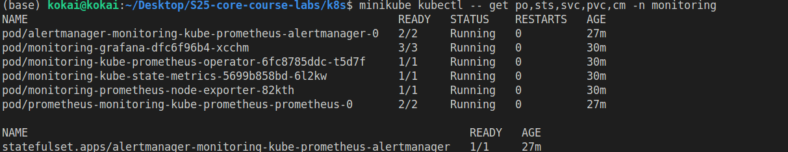
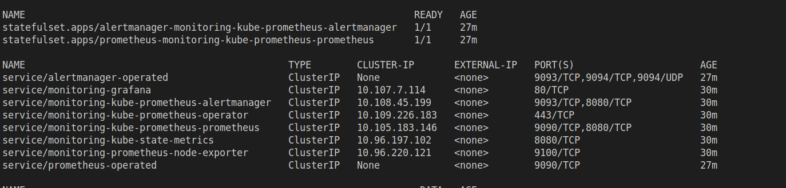
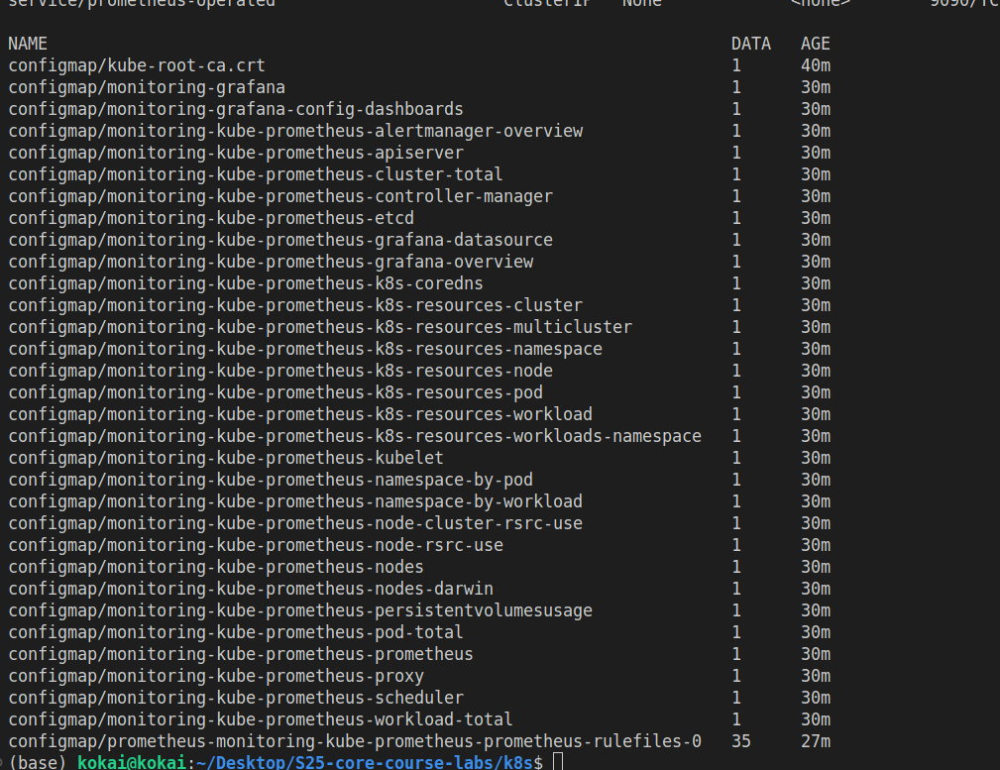;

Pods : 
- Alertmanager handles alert routing and notification.

- Grafana provides visualization dashboards.

- Prometheus Operator manages Prometheus/Alertmanager instances.

- kube-state-metrics and node-exporter expose cluster/node metrics; Prometheus scrapes and stores them.

StatefulSets: 
- Two StatefulSets manage Prometheus and Alertmanager, giving them stable identities and persistent storage. They ensure each instance retains data across restarts.

Services: 
  - Internal ClusterIP services expose Grafana (port 80), Prometheus (9090), Alertmanager (9093), and exporters for metric scraping. Headless services (*-operated) enable peer discovery for clustered components.

ConfigMaps: 
- Many ConfigMaps store pre-configured Grafana dashboards and Prometheus alerting rules. They are dynamically loaded by sidecar containers. The kube-root-ca.crt is the cluster's CA certificate.

### Utilize Grafana Dashboards:
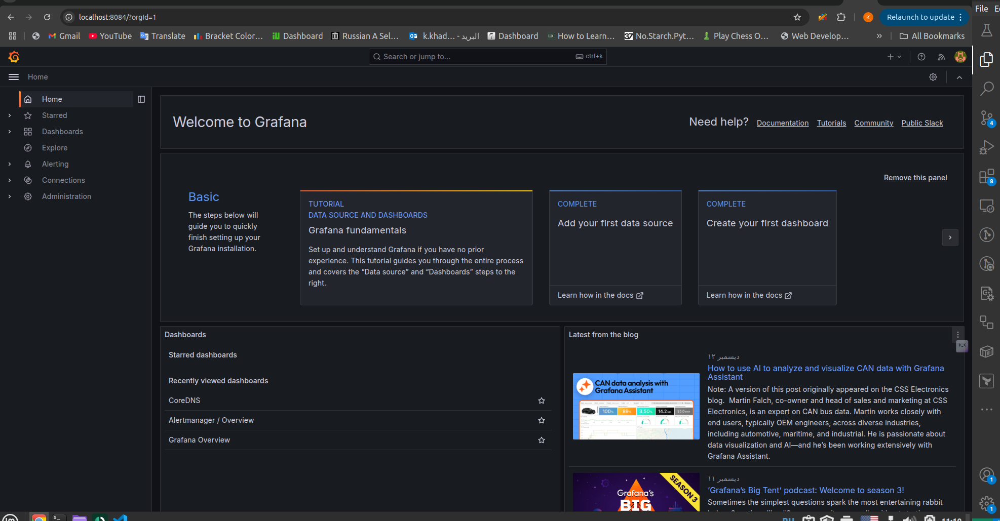
I accessed Grafana after getting the password and login as an admin. 

- Check CPU and Memory consumption of your StatefulSet.
  the cpu usage : 
    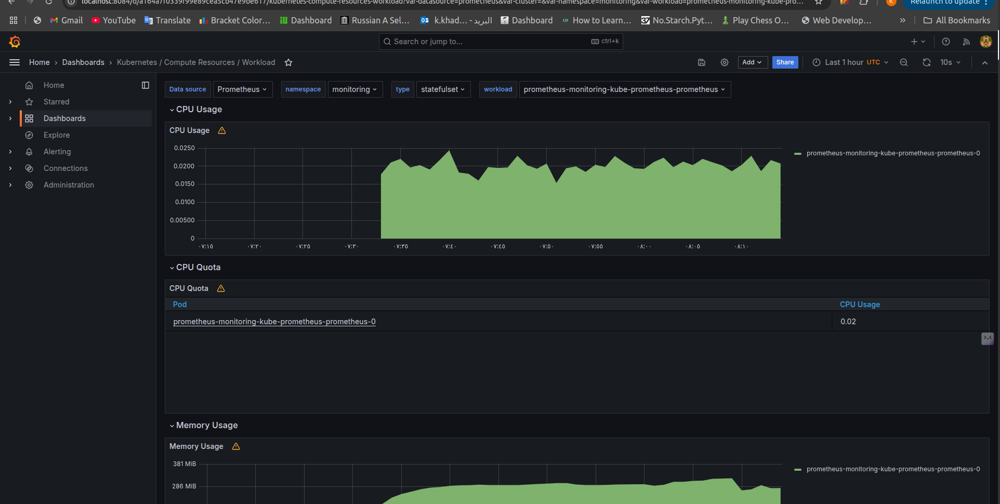
    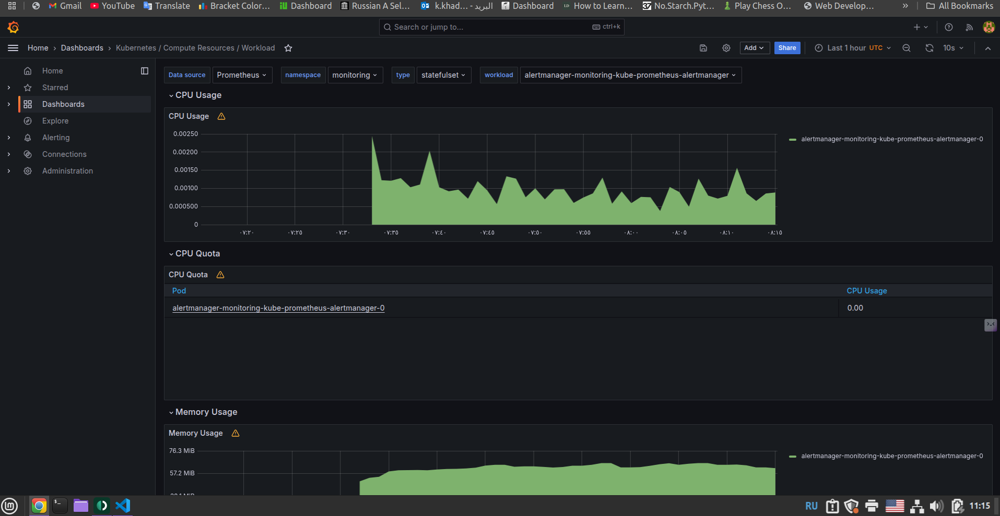
  the memory usage:
    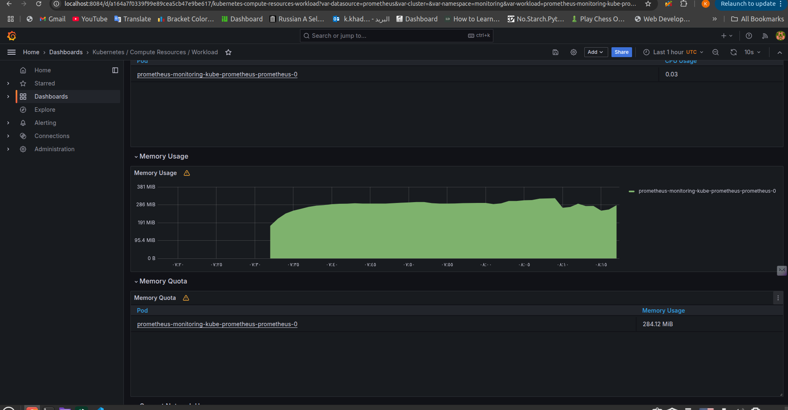
    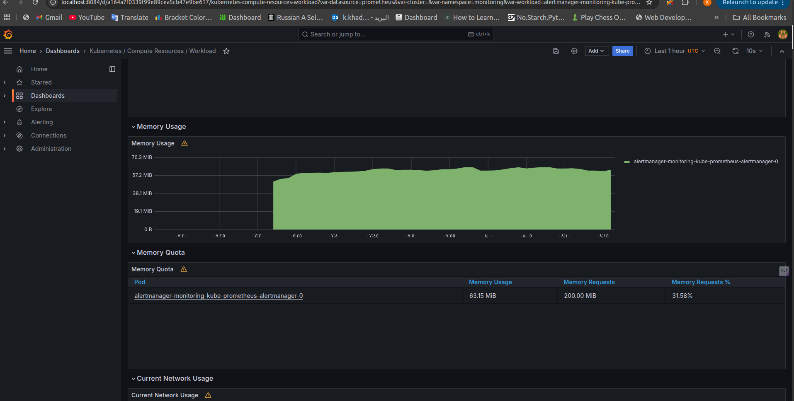

- Identify Pods with higher and lower CPU usage in the default namespace. 
- 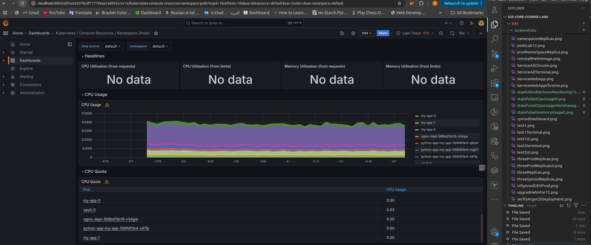
  the highest cpuu usage is from valut0 pod the lowest money pods are similar like my-app0 my-app1 etc

- Monitor node memory usage in percentage and megabytes.
  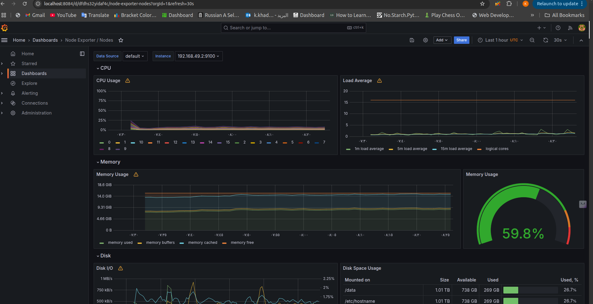
  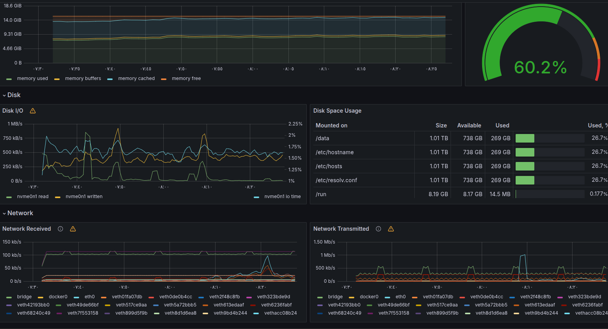

- Count the number of pods and containers managed by the Kubelet service. 
- the number of Running pods is 34 and running containers is 44
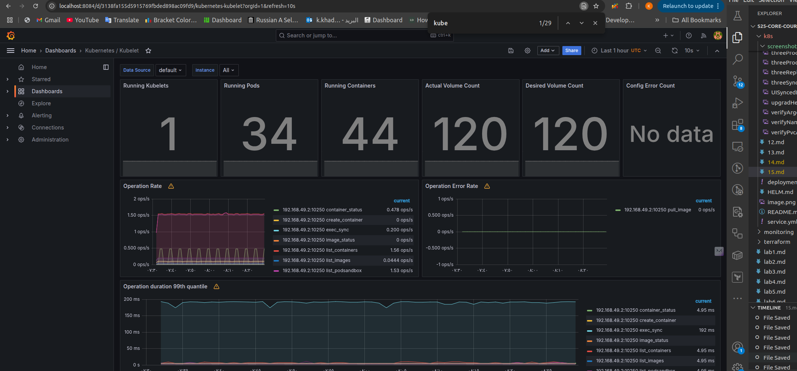

- Evaluate network usage of Pods in the default namespace.
  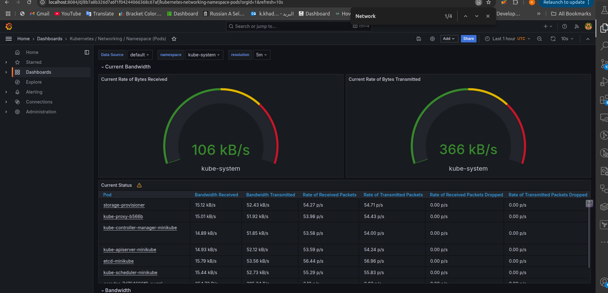

- Determine the number of active alerts; also check the Web UI with minikube service monitoring-kube-prometheus-alertmanager.
the number of alerts are 8 I got this number after running the following command `minikube kubectl -- port-forward -n monitoring service/monitoring-kube-prometheus-alertmanager 9093:9093`and analyzing rhe alertmanager UI I got
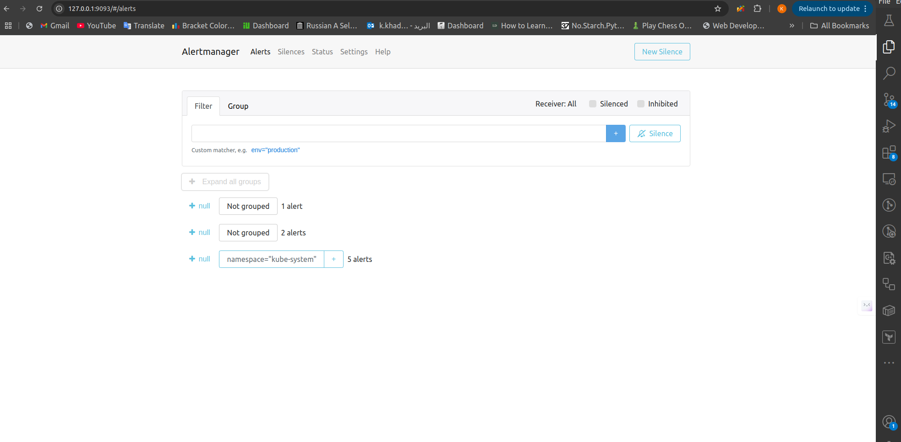
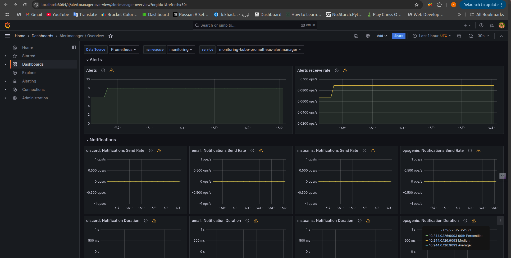

### Init Containers
 Provide proof of success, e.g., kubectl exec pod/demo-0 -- cat /test.html.
I used the following command `minikube kubectl -- exec my-app-0 -- cat /static-directory/index.html` changed the given command a little to suit my code 

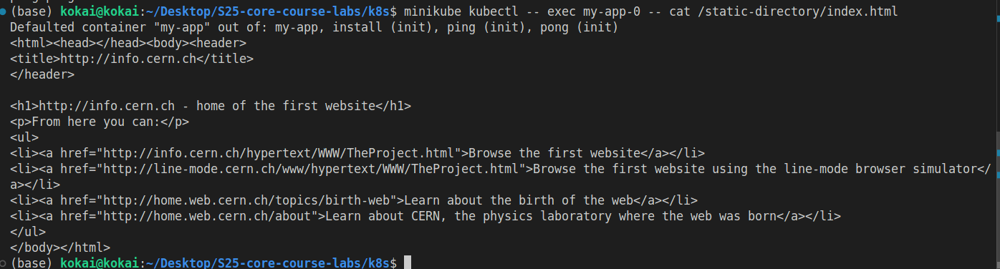