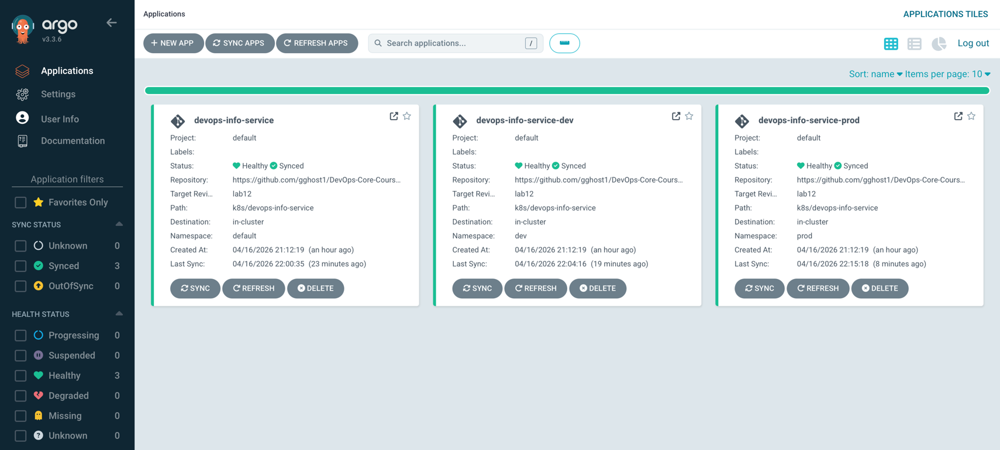
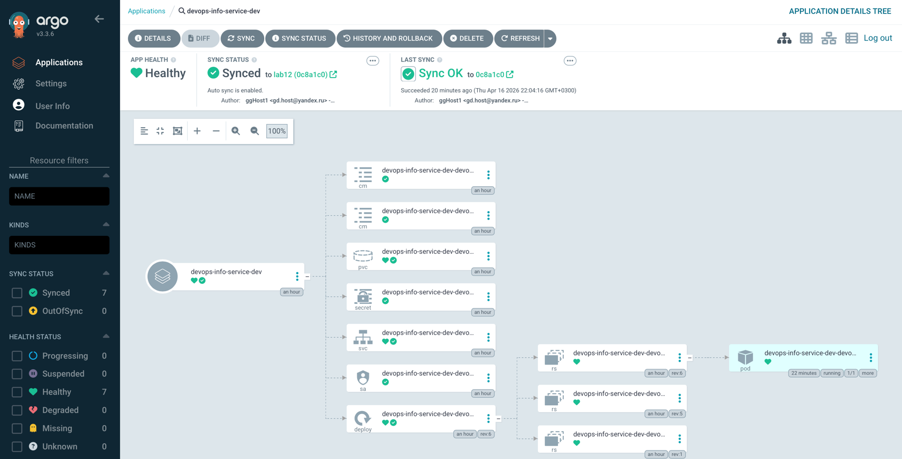
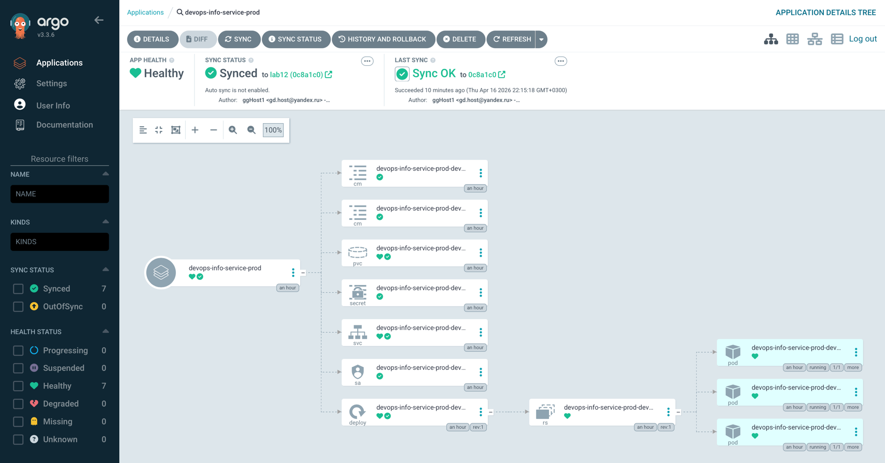
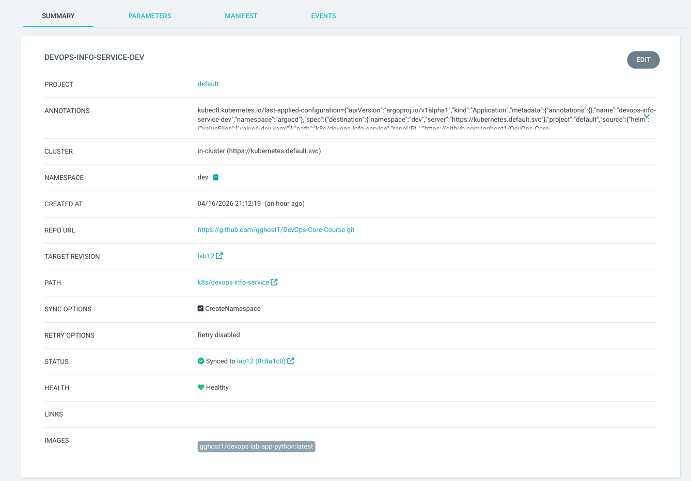
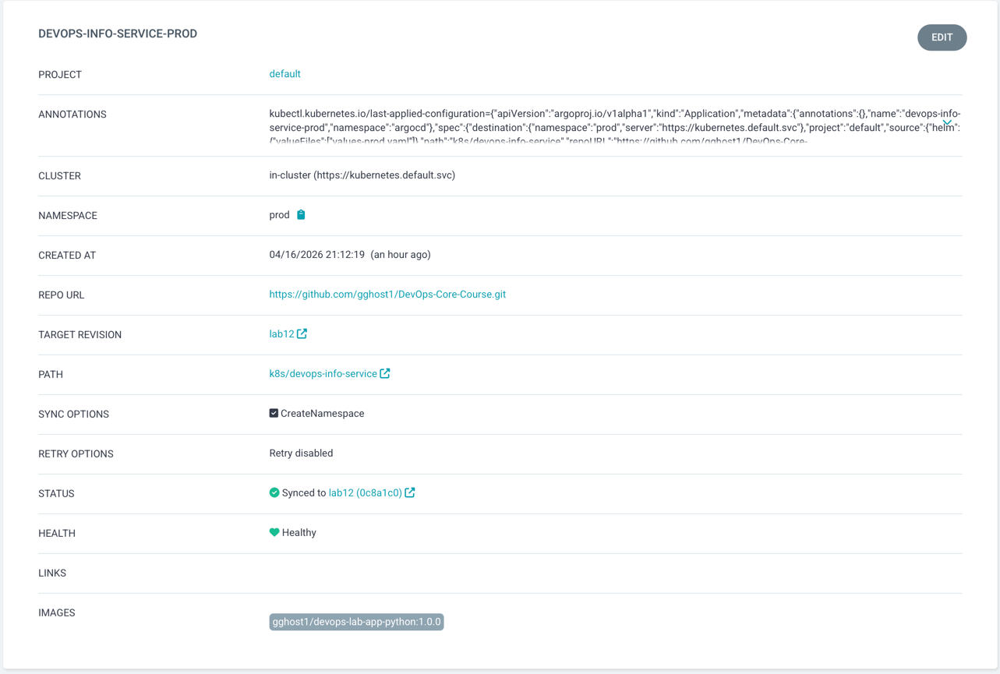

# ArgoCD GitOps Deployment (Lab 13)

## 1. ArgoCD Setup

### Installation

ArgoCD was installed with Helm in a dedicated `argocd` namespace.

```bash
kubectl create namespace argocd
helm repo add argo https://argoproj.github.io/argo-helm
helm repo update
helm upgrade --install argocd argo/argo-cd --namespace argocd
kubectl wait --for=condition=ready pod -l app.kubernetes.io/name=argocd-server -n argocd --timeout=180s
```

### Verification Evidence

```bash
kubectl get pods -n argocd
```

Result:

```
NAME                                                READY   STATUS            RESTARTS   AGE
argocd-application-controller-0                     1/1     Running           0          17s
argocd-applicationset-controller-786b6544db-smp7q   1/1     Running           0          18s
argocd-dex-server-c6c8cc76-ncjh4                    0/1     PodInitializing   0          18s
argocd-notifications-controller-578f467c9d-v6tq4    1/1     Running           0          18s
argocd-redis-5b4fdd94cf-4d497                       1/1     Running           0          18s
argocd-redis-secret-init-nl66w                      0/1     Completed         0          35s
argocd-repo-server-64d96669db-4tsp5                 0/1     Running           0          17s
argocd-server-588bcb99bd-2vjg6                      1/1     Running           0          18s
```

### UI Access

```bash
kubectl port-forward svc/argocd-server -n argocd 8080:443
```

- UI URL: `https://localhost:8080`
- Username: `admin`
- Password command:
    ```bash
    kubectl -n argocd get secret argocd-initial-admin-secret -o jsonpath="{.data.password}" | base64 -d
    ```

### CLI Setup

```bash
brew install argocd
argocd login localhost:8080 --insecure --username admin --password '0C3KcfmlVBbs1P2O'
argocd account get-user-info
```

Evidence:

```
Logged In: true
Username: admin
Issuer: argocd
Groups: 
```

---

## 2. Application Configuration

Created manifests:

- `k8s/argocd/application.yaml` (base, manual sync)
- `k8s/argocd/application-dev.yaml` (dev, auto-sync + prune + selfHeal)
- `k8s/argocd/application-prod.yaml` (prod, manual sync)
- `k8s/argocd/applicationset.yaml` (bonus template)

Source/destination settings:

- `repoURL`: `https://github.com/gghost1/DevOps-Core-Course.git`
- `targetRevision`: `lab12` (remote branch that currently contains `k8s/devops-info-service`)
- `path`: `k8s/devops-info-service`
- destinations: `default`, `dev`, `prod`

Apply:

```bash
kubectl apply -f k8s/argocd/application.yaml
kubectl apply -f k8s/argocd/application-dev.yaml
kubectl apply -f k8s/argocd/application-prod.yaml
```

Result

```
application.argoproj.io/devops-info-service configured
application.argoproj.io/devops-info-service-dev configured
application.argoproj.io/devops-info-service-prod configured
TIMESTAMP  GROUP        KIND   NAMESPACE                  NAME    STATUS   HEALTH        HOOK  MESSAGE

Name:               argocd/devops-info-service
Project:            default
Server:             https://kubernetes.default.svc
Namespace:          default
URL:                https://argocd.example.com/applications/devops-info-service
Source:
- Repo:             https://github.com/gghost1/DevOps-Core-Course.git
  Target:           master
  Path:             k8s/devops-info-service
  Helm Values:      values.yaml
SyncWindow:         Sync Allowed
Sync Policy:        Manual
Sync Status:        Unknown
Health Status:      Healthy

Operation:          Sync
Sync Revision:      0c8a1c0fd095b8f5d9417a3596e0e3318599a456
Phase:              Succeeded
Start:              2026-04-16 21:14:16 +0300 MSK
Finished:           2026-04-16 21:14:26 +0300 MSK
Duration:           10s
Message:            successfully synced (no more tasks)
```

Sync:

```bash
argocd app sync devops-info-service
argocd app sync devops-info-service-prod
```

Result

```
TIMESTAMP                  GROUP        KIND              NAMESPACE                  NAME                                   STATUS   HEALTH        HOOK  MESSAGE
2026-04-16T21:50:49+03:00         PersistentVolumeClaim     default  devops-info-service-devops-info-service-data           Synced  Healthy              
2026-04-16T21:50:49+03:00             Secret                default  devops-info-service-devops-info-service-secret         Synced                       
2026-04-16T21:50:49+03:00            Service                default  devops-info-service-devops-info-service                Synced  Healthy              
2026-04-16T21:50:49+03:00         ServiceAccount            default  devops-info-service-devops-info-service                Synced                       
2026-04-16T21:50:49+03:00   apps  Deployment                default  devops-info-service-devops-info-service                Synced  Healthy              
2026-04-16T21:50:49+03:00          ConfigMap                default  devops-info-service-devops-info-service-config-env     Synced                       
2026-04-16T21:50:49+03:00          ConfigMap                default  devops-info-service-devops-info-service-config-file    Synced                       
2026-04-16T21:50:49+03:00  batch         Job     default  devops-info-service-devops-info-service-pre-install            Progressing              
2026-04-16T21:50:51+03:00  batch         Job     default  devops-info-service-devops-info-service-pre-install   Running   Synced     PreSync  job.batch/devops-info-service-devops-info-service-pre-install created
2026-04-16T21:50:57+03:00          ConfigMap                default  devops-info-service-devops-info-service-config-file    Synced                        configmap/devops-info-service-devops-info-service-config-file unchanged
2026-04-16T21:50:57+03:00         PersistentVolumeClaim     default  devops-info-service-devops-info-service-data           Synced   Healthy              persistentvolumeclaim/devops-info-service-devops-info-service-data unchanged
2026-04-16T21:50:57+03:00            Service                default  devops-info-service-devops-info-service                Synced   Healthy              service/devops-info-service-devops-info-service unchanged
2026-04-16T21:50:57+03:00   apps  Deployment                default  devops-info-service-devops-info-service                Synced   Healthy              deployment.apps/devops-info-service-devops-info-service unchanged
2026-04-16T21:50:57+03:00  batch         Job                default  devops-info-service-devops-info-service-pre-install  Succeeded   Synced     PreSync  Reached expected number of succeeded pods
2026-04-16T21:50:57+03:00         ServiceAccount            default  devops-info-service-devops-info-service                Synced                        serviceaccount/devops-info-service-devops-info-service unchanged
2026-04-16T21:50:57+03:00             Secret                default  devops-info-service-devops-info-service-secret         Synced                        secret/devops-info-service-devops-info-service-secret configured
2026-04-16T21:50:57+03:00          ConfigMap                default  devops-info-service-devops-info-service-config-env     Synced                        configmap/devops-info-service-devops-info-service-config-env unchanged
2026-04-16T21:50:57+03:00  batch         Job     default  devops-info-service-devops-info-service-post-install   Running   Synced    PostSync  job.batch/devops-info-service-devops-info-service-post-install created
2026-04-16T21:51:02+03:00  batch         Job     default  devops-info-service-devops-info-service-post-install  Succeeded   Synced    PostSync  Reached expected number of succeeded pods

Name:               argocd/devops-info-service
Project:            default
Server:             https://kubernetes.default.svc
Namespace:          default
URL:                https://argocd.example.com/applications/devops-info-service
Source:
- Repo:             https://github.com/gghost1/DevOps-Core-Course.git
  Target:           lab12
  Path:             k8s/devops-info-service
  Helm Values:      values.yaml
SyncWindow:         Sync Allowed
Sync Policy:        Manual
Sync Status:        Synced to lab12 (0c8a1c0)
Health Status:      Healthy

Operation:          Sync
Sync Revision:      0c8a1c0fd095b8f5d9417a3596e0e3318599a456
Phase:              Succeeded
Start:              2026-04-16 21:50:49 +0300 MSK
Finished:           2026-04-16 21:51:02 +0300 MSK
Duration:           13s
Message:            successfully synced (no more tasks)

GROUP  KIND                   NAMESPACE  NAME                                                  STATUS     HEALTH   HOOK      MESSAGE
batch  Job                    default    devops-info-service-devops-info-service-pre-install   Succeeded           PreSync   Reached expected number of succeeded pods
       ServiceAccount         default    devops-info-service-devops-info-service               Synced                        serviceaccount/devops-info-service-devops-info-service unchanged
       Secret                 default    devops-info-service-devops-info-service-secret        Synced                        secret/devops-info-service-devops-info-service-secret configured
       ConfigMap              default    devops-info-service-devops-info-service-config-env    Synced                        configmap/devops-info-service-devops-info-service-config-env unchanged
       ConfigMap              default    devops-info-service-devops-info-service-config-file   Synced                        configmap/devops-info-service-devops-info-service-config-file unchanged
       PersistentVolumeClaim  default    devops-info-service-devops-info-service-data          Synced     Healthy            persistentvolumeclaim/devops-info-service-devops-info-service-data unchanged
       Service                default    devops-info-service-devops-info-service               Synced     Healthy            service/devops-info-service-devops-info-service unchanged
apps   Deployment             default    devops-info-service-devops-info-service               Synced     Healthy            deployment.apps/devops-info-service-devops-info-service unchanged
batch  Job                    default    devops-info-service-devops-info-service-post-install  Succeeded           PostSync  Reached expected number of succeeded pods
```

Evidence:

```bash
argocd app list
```

Result:

```
NAME                             CLUSTER                         NAMESPACE  PROJECT  STATUS  HEALTH       SYNCPOLICY  CONDITIONS  REPO                                               PATH                     TARGET
argocd/devops-info-service       https://kubernetes.default.svc  default    default  Synced  Healthy      Manual      <none>      https://github.com/gghost1/DevOps-Core-Course.git  k8s/devops-info-service  lab12
argocd/devops-info-service-dev   https://kubernetes.default.svc  dev        default  Synced  Healthy      Auto-Prune  <none>      https://github.com/gghost1/DevOps-Core-Course.git  k8s/devops-info-service  lab12
argocd/devops-info-service-prod  https://kubernetes.default.svc  prod       default  Synced  Progressing  Manual      <none>      https://github.com/gghost1/DevOps-Core-Course.git  k8s/devops-info-service  lab12
```

---

## 3. Multi-Environment Deployment

Namespaces:

```bash
kubectl create namespace dev
kubectl create namespace prod
```

Environment split:

- `dev` uses `values-dev.yaml`
  - `replicaCount: 1`
  - lower resource limits
  - `NodePort` service (`30082`)
  - auto-sync enabled
- `prod` uses `values-prod.yaml`
  - `replicaCount: 3`
  - stricter resource profile
  - `LoadBalancer` service
  - manual sync

Verification:

```bash
kubectl get pods -n dev
kubectl get pods -n prod
kubectl get deploy -n dev devops-info-service-dev-devops-info-service -o jsonpath='{.spec.replicas}'
kubectl get deploy -n prod devops-info-service-prod-devops-info-service -o jsonpath='{.spec.replicas}'
```

Evidence:

```
NAME                                                           READY   STATUS    RESTARTS   AGE
devops-info-service-dev-devops-info-service-57c4b9c9cd-lpkzf   1/1     Running   0          31m
NAME                                                             READY   STATUS      RESTARTS   AGE
devops-info-service-prod-devops-info-service-766fd5ddbc-29xgv    1/1     Running     0          39m
devops-info-service-prod-devops-info-service-766fd5ddbc-8c8ld    1/1     Running     0          39m
devops-info-service-prod-devops-info-service-766fd5ddbc-s7qgl    1/1     Running     0          39m
devops-info-service-prod-devops-info-service-pre-install-kmgw5   0/1     Completed   0          39m
1
3
```

Rationale for manual prod sync:

- controlled release timing
- human review gate before production deployment
- safer rollback planning

---

## 4. Self-Healing and Drift Tests (Dev)

Dev app has:

```yaml
syncPolicy:
  automated:
    prune: true
    selfHeal: true
```

### 4.1 Scale Drift Test

Commands:

```bash
kubectl scale deployment devops-info-service-dev-devops-info-service -n dev --replicas=5
kubectl get deploy -n dev devops-info-service-dev-devops-info-service -o jsonpath='{.spec.replicas}'
sleep 10
kubectl get deploy -n dev devops-info-service-dev-devops-info-service -o jsonpath='{.spec.replicas}'
```

Evidence:

```
deployment.apps/devops-info-service-dev-devops-info-service scaled
5
1
```

Conclusion:

- ArgoCD detected configuration drift and self-healed deployment spec.

### 4.2 Pod Deletion Test

Commands:

```bash
kubectl delete pod -n dev -l app.kubernetes.io/instance=devops-info-service-dev --wait=false
kubectl get pods -n dev -l app.kubernetes.io/instance=devops-info-service-dev -o wide
sleep 60
kubectl get pods -n dev -l app.kubernetes.io/instance=devops-info-service-dev -o wide
```

Evidence:

```
pod "devops-info-service-dev-devops-info-service-57c4b9c9cd-lpkzf" deleted
NAME                                                           READY   STATUS        RESTARTS   AGE   IP            NODE       NOMINATED NODE   READINESS GATES
devops-info-service-dev-devops-info-service-57c4b9c9cd-45zrw   0/1     Pending       0          0s    <none>        minikube   <none>           <none>
devops-info-service-dev-devops-info-service-57c4b9c9cd-lpkzf   1/1     Terminating   0          40m   10.244.0.39   minikube   <none>           <none>
NAME                                                           READY   STATUS    RESTARTS   AGE   IP            NODE       NOMINATED NODE   READINESS GATES
devops-info-service-dev-devops-info-service-57c4b9c9cd-45zrw   1/1     Running   0          70s   10.244.0.56   minikube   <none>           <none>
```

Conclusion:

- this is Kubernetes ReplicaSet healing (pod-level), not ArgoCD sync behavior.

### 4.3 Configuration Drift Test

Commands:

```bash
kubectl set image deployment/devops-info-service-dev-devops-info-service -n dev devops-info-service=gghost1/devops-lab-app-python:1.0.0
kubectl get deployment -n dev devops-info-service-dev-devops-info-service -o jsonpath='{.spec.template.spec.containers[0].image}'
sleep 45
kubectl get deployment -n dev devops-info-service-dev-devops-info-service -o jsonpath='{.spec.template.spec.containers[0].image}'
```

Evidence:

```
deployment.apps/devops-info-service-dev-devops-info-service image updated
gghost1/devops-lab-app-python:1.0.0

gghost1/devops-lab-app-python:lates
```

Conclusion:

- ArgoCD self-heal reconciles workload spec back to Git-defined desired state.

### Sync Behavior Notes

- ArgoCD sync is triggered by:
  - Git change detection on polling cycle
  - manual sync action (UI/CLI)
  - self-heal detection for automated apps
- Default repo polling interval is approximately 3 minutes.
- Kubernetes healing and ArgoCD healing are different:
  - Kubernetes: recreates missing pods for desired replica count
  - ArgoCD: restores declarative config drift to Git state

---

## 5. Screenshots


Dev node sync status:

Prod node sync status:

Dev application details:

Prod application details:


### Application accessibility

Validated by local port-forward:

```bash
kubectl port-forward svc/devops-info-service-devops-info-service -n default 18080:80
curl -s http://127.0.0.1:18080/health

kubectl port-forward svc/devops-info-service-dev-devops-info-service -n dev 18082:80
curl -s http://127.0.0.1:18082/health
```

Result
```
{"status":"healthy","timestamp":"2026-04-16T19:06:53.412Z","uptime_seconds":3171}
{"status":"healthy","timestamp":"2026-04-16T19:07:27.753Z","uptime_seconds":292}
```

Both endpoints returned healthy JSON responses.

---

## 6. Bonus: ApplicationSet

Implemented manifest:

- `k8s/argocd/applicationset.yaml`

Pattern:

- uses List generator with env parameters (`dev`/`prod`)
- generates ArgoCD `Application` objects from one template

Benefits:

- centralized app-template management
- less duplication than separate `Application` manifests
- easier scaling to more environments

When to use:

- list generator: fixed known environments
- git generator: dynamic app discovery from repo structure
- matrix/merge generators: larger multi-dimensional platform setups
