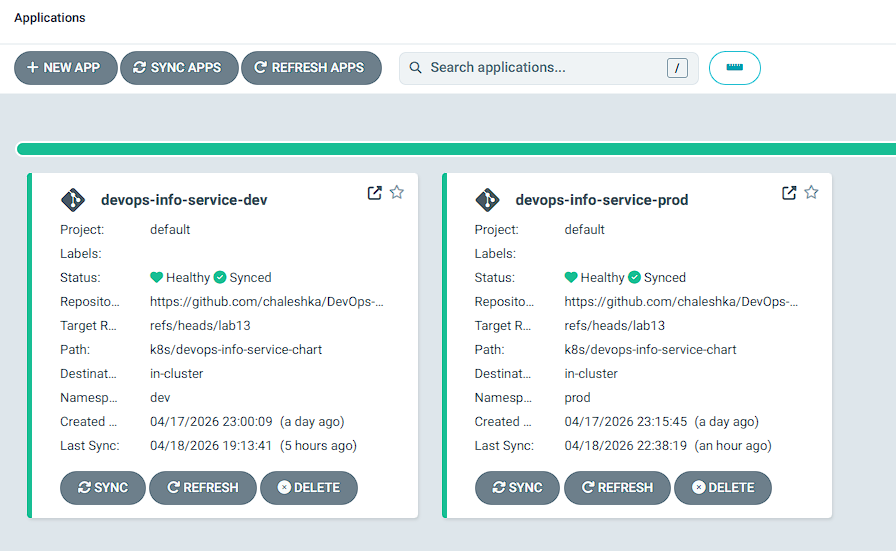
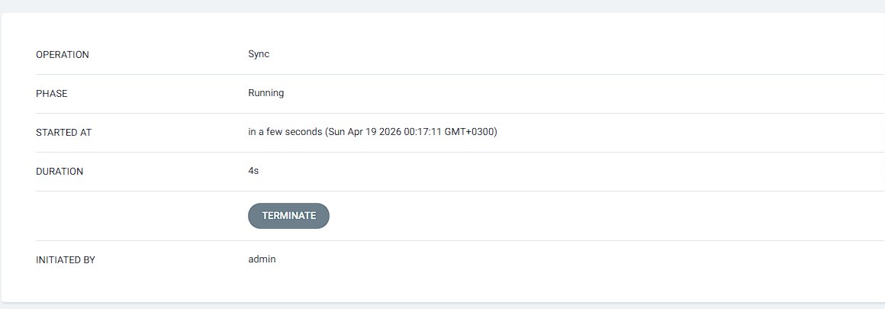
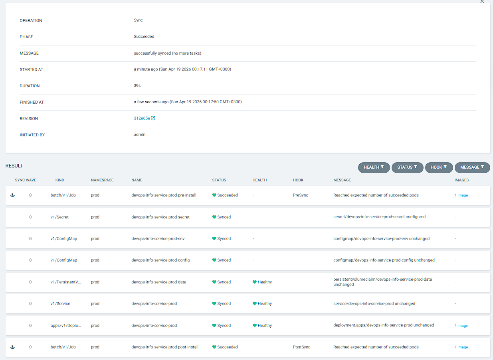
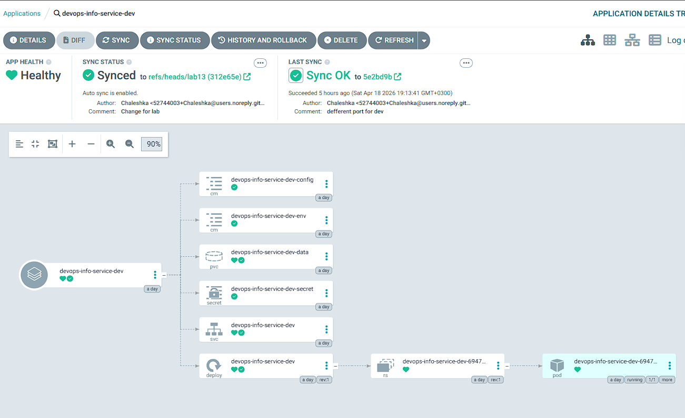
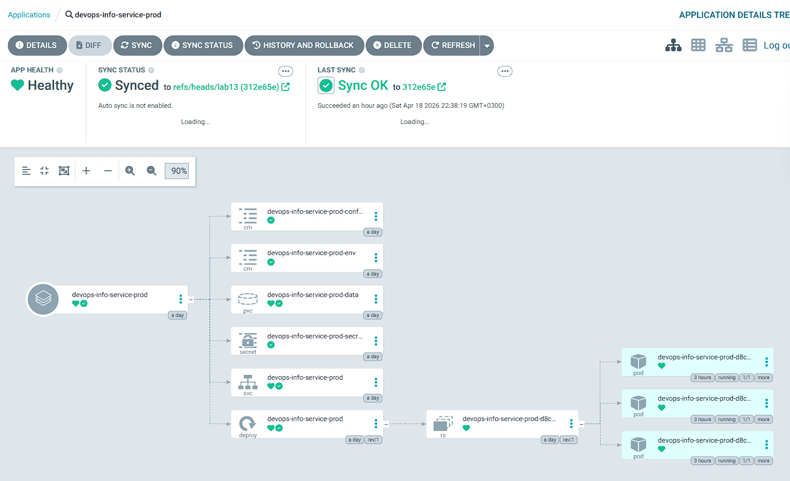

# Lab 13 — GitOps with ArgoCD

## ArgoCD Setup

### Installation verification

```bash
andpe@chale:/mnt/g/DevOps/DevOps-Core-Course/app_python$ helm repo add argo https://argoproj.github.io/argo-helm
"argo" has been added to your repositories


andpe@chale:/mnt/g/DevOps/DevOps-Core-Course/app_python$ helm repo update
Hang tight while we grab the latest from your chart repositories...
...Successfully got an update from the "hashicorp" chart repository
...Successfully got an update from the "argo" chart repository
...Successfully got an update from the "prometheus-community" chart repository
Update Complete. ⎈Happy Helming!⎈


andpe@chale:/mnt/g/DevOps/DevOps-Core-Course/app_python$ kubectl create namespace argocd
namespace/argocd created


andpe@chale:/mnt/g/DevOps/DevOps-Core-Course/app_python$ helm install argocd argo/argo-cd --namespace argocd
level=WARN msg="unable to find exact version; falling back to closest available version" chart=argo-cd requested="" selected=9.5.0
NAME: argocd
LAST DEPLOYED: Sat Apr 11 20:53:09 2026
NAMESPACE: argocd
STATUS: deployed
REVISION: 1
DESCRIPTION: Install complete
TEST SUITE: None
NOTES:
In order to access the server UI you have the following options:

1. kubectl port-forward service/argocd-server -n argocd 8080:443

    and then open the browser on http://localhost:8080 and accept the certificate

2. enable ingress in the values file `server.ingress.enabled` and either
      - Add the annotation for ssl passthrough: https://argo-cd.readthedocs.io/en/stable/operator-manual/ingress/#option-1-ssl-passthrough
      - Set the `configs.params."server.insecure"` in the values file and terminate SSL at your ingress: https://argo-cd.readthedocs.io/en/stable/operator-manual/ingress/#option-2-multiple-ingress-objects-and-hosts


After reaching the UI the first time you can login with username: admin and the random password generated during the installation. You can find the password by running:

kubectl -n argocd get secret argocd-initial-admin-secret -o jsonpath="{.data.password}" | base64 -d

(You should delete the initial secret afterwards as suggested by the Getting Started Guide: https://argo-cd.readthedocs.io/en/stable/getting_started/#4-login-using-the-cli)


andpe@chale:/mnt/g/DevOps/DevOps-Core-Course/app_python$ kubectl wait --for=condition=ready pod -l app.kubernetes.io/name=argocd-server -n argocd --timeout=120s
pod/argocd-server-5964cdf9fb-xchb4 condition met
```

### UI access method

Run UI:
```bash
andpe@chale:/mnt/g/DevOps/DevOps-Core-Course$ kubectl port-forward svc/argocd-server -n argocd 8080:443
Forwarding from 127.0.0.1:8080 -> 8080
Forwarding from [::1]:8080 -> 8080
```

Default login: admin
Password:
```bash
andpe@chale:/mnt/g/DevOps/DevOps-Core-Course$ kubectl -n argocd get secret argocd-initial-admin-secret -o jsonpath="{.data.password}" | base64 -d
SoMeP4ssW0RdTherE
```

### CLI configuration

Login:
```bash
andpe@chale:/mnt/g/DevOps/DevOps-Core-Course$ argocd login localhost:8080 --insecure
Username: admin
Password: SoMeP4ssW0RdTherE
```

Get user info:
```bash
andpe@chale:/mnt/g/DevOps/DevOps-Core-Course$ argocd account get-user-info
Logged In: true
Username: admin
Issuer: argocd
Groups: 
```

## Application Configuration

### Application manifests

k8s/argocd/
├── application-prod.yaml
├── application-dev.yaml
└── application.yaml

Manifest apply:
```bash
kubectl apply -f k8s/argocd/application.yaml
```

### Source and destination configuration

- `source` configuration:
    ```yaml
    repoURL: https://github.com/chaleshka/DevOps-Core-Course.git
    targetRevision: refs/heads/lab13
    path: k8s/devops-info-service-chart
    helm:
        valueFiles:
          - values.yaml
        releaseName: devops-info-service
    ```
    - **repoURL*: Link to the repository to be viewed
    - **targetRevision**: Specific branch
    - **path**: Path to local folder from root
    - **helm**:
        - **valueFiles**: Value file name, that will be used for this app
        - **releaseName**: Name of app

- `destination` configuration:
    ```yaml
    destination:
        server: https://kubernetes.default.svc
        namespace: default
    ```
    - **server**: Target cluster
    - **namespace**: Namespace, that will be used for installation

### Values file selection

For every application configuration using different `values`.
For `application.yaml` - `values.yaml`
For `application-dev.yaml` - `values-dev.yaml`
For `application-prod.yaml` - `values-prod.yaml`

## Multi-Environment

### Dev vs Prod configuration differences

|  | `application-dev.yaml` | `application-prod.yaml` |
| ---- | ---- | ---- |
| `metadata.name` | `devops-info-service-dev` | `devops-info-service-prod` |
| `spec.source.helm.releaseName` | `devops-info-service-dev` | `devops-info-service-prod` |
| `spec.source.helm.valueFiles` | `- values-dev.yaml` | `- values-prod.yaml` |
| `spec.syncPolicy.automated` | Exist | Missed |
| `spec.destination.namespace` | `dev` | `prod` |

All other defference depends on values.

### Sync policy differences and rationale

For production we don't use auto update of configuration. If there will be problems then app can fail.

### Namespace separation

Applications are deployed into separate namespaces to isolate environments:

- dev application: namespace dev
- prod application: namespace prod

Verification commands:

```bash
argocd app list
kubectl get deploy,svc,pods -n dev
kubectl get deploy,svc,pods -n prod
```

## Self-Healing Evidence

### Manual scale test with before/after

```bash
andpe@chale:/mnt/g/DevOps/DevOps-Core-Course$ APP=devops-info-service-prod
andpe@chale:/mnt/g/DevOps/DevOps-Core-Course$ NS=prod
```

Before manual change:
```bash
andpe@chale:/mnt/g/DevOps/DevOps-Core-Course$ kubectl -n $NS get deploy $APP -o jsonpath='{.spec.replicas}{"\n"}'
3


andpe@chale:/mnt/g/DevOps/DevOps-Core-Course$ argocd app get $APP | egrep "Sync Policy|Sync Status|Health Status"
Sync Policy:        Manual
Sync Status:        Synced to refs/heads/lab13 (5e2bd9b)
Health Status:      Progressing
```

Manual change:
```bash
andpe@chale:/mnt/g/DevOps/DevOps-Core-Course$ kubectl -n $NS scale deploy $APP --replicas=5
deployment.apps/devops-info-service-prod scaled
```

After manual change:
```bash
andpe@chale:/mnt/g/DevOps/DevOps-Core-Course$ kubectl -n $NS get deploy $APP -o jsonpath='{.spec.replicas}{"\n"}'
5


andpe@chale:/mnt/g/DevOps/DevOps-Core-Course$ argocd app get $APP | egrep "Sync Policy|Sync Status|Health Status"
Sync Policy:        Manual
Sync Status:        OutOfSync from refs/heads/lab13 (5e2bd9b)
Health Status:      Progressing
```

### Pod deletion test

```bash
andpe@chale:/mnt/g/DevOps/DevOps-Core-Course$ kubectl get pods -n prod -l app.kubernetes.io/instance=devops-info-service-prod
NAME                                       READY   STATUS    RESTARTS   AGE
devops-info-service-prod-d8cd64949-c8cn4   1/1     Running   0          89m
devops-info-service-prod-d8cd64949-d68nn   1/1     Running   0          89m
devops-info-service-prod-d8cd64949-lrg8s   1/1     Running   0          89m
devops-info-service-prod-d8cd64949-sxcpd   1/1     Running   0          89m
devops-info-service-prod-d8cd64949-vh4ql   1/1     Running   0          89m


andpe@chale:/mnt/g/DevOps/DevOps-Core-Course$ kubectl delete pod -n prod -l app.kubernetes.io/instance=devops-info-service-prod --field-selector=status.phase=Running
pod "devops-info-service-prod-d8cd64949-c8cn4" deleted from prod namespace
pod "devops-info-service-prod-d8cd64949-d68nn" deleted from prod namespace
pod "devops-info-service-prod-d8cd64949-lrg8s" deleted from prod namespace
pod "devops-info-service-prod-d8cd64949-sxcpd" deleted from prod namespace
pod "devops-info-service-prod-d8cd64949-vh4ql" deleted from prod namespace


andpe@chale:/mnt/g/DevOps/DevOps-Core-Course$ kubectl get pods -n prod -w
NAME                                       READY   STATUS    RESTARTS   AGE
devops-info-service-prod-d8cd64949-8xkzj   1/1     Running   0          44s
devops-info-service-prod-d8cd64949-hzlrm   1/1     Running   0          38s
devops-info-service-prod-d8cd64949-p27q6   1/1     Running   0          44s
devops-info-service-prod-d8cd64949-rffb4   1/1     Running   0          44s
devops-info-service-prod-d8cd64949-sd4k8   1/1     Running   0          44s
```

### Configuration drift test

```bash
andpe@chale:/mnt/g/DevOps/DevOps-Core-Course$ kubectl label deployment devops-info-service-prod -n prod drift=test --overwrite
deployment.apps/devops-info-service-prod labeled


andpe@chale:/mnt/g/DevOps/DevOps-Core-Course$ argocd app diff devops-info-service-prod


andpe@chale:/mnt/g/DevOps/DevOps-Core-Course$ kubectl get deploy devops-info-service-prod -n prod --show-labels
NAME                       READY   UP-TO-DATE   AVAILABLE   AGE   LABELS
devops-info-service-prod   3/3     3            3           23h   app.kubernetes.io/instance=devops-info-service-prod,app.kubernetes.io/managed-by=Helm,app.kubernetes.io/name=devops-info-service,app.kubernetes.io/version=1.0.0,drift=test,helm.sh/chart=devops-info-service-0.1.0
```

### Explanation of behaviors

- `Kubernetes self-healing` automaticly restarts or recreates failed or delated pods. It triggers by runtime failures or pod deletion.
- `ArgoCD self-healing` reverts live cluster conf differents to match Git manifest. Triggers when auto-sync and selfHeal enabled.
- `Pulling`: By default checks about every 3 minutes. Can be called by webhooks/manual sync.

## Screenshots

### ArgoCD UI showing both applications



### Sync status





### Application details view



