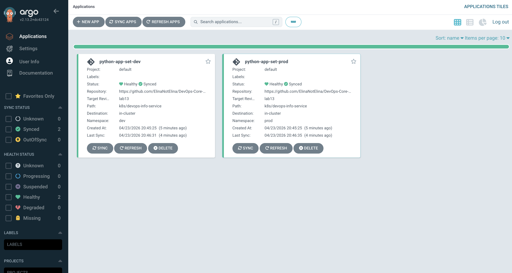
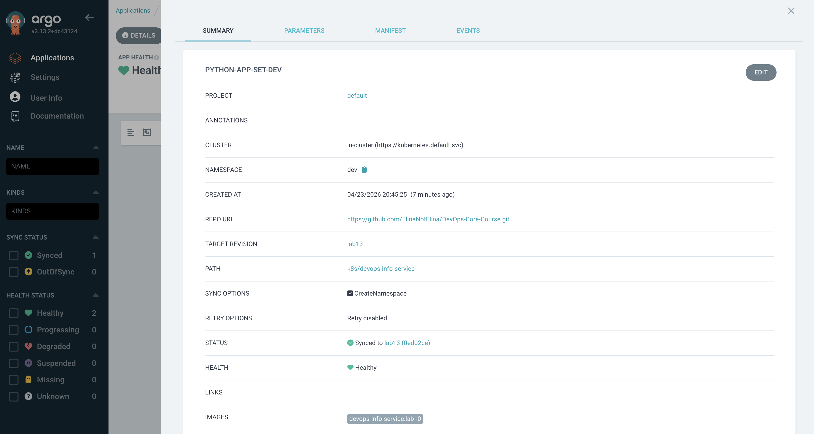

# Lab 13 — GitOps with ArgoCD

This document describes the ArgoCD setup that deploys the `devops-info-service`
Helm chart (from Labs 10–12) to a local `minikube` cluster using GitOps.

Git is the single source of truth — the `lab13` branch of this repository
(`https://github.com/ElinaNotElina/DevOps-Core-Course.git`) contains the Helm
chart under `k8s/devops-info-service/` and the ArgoCD manifests under
`k8s/argocd/`.

---

## 1. ArgoCD Setup

### 1.1 Cluster prerequisites

```bash
minikube start --driver=docker --cpus=4 --memory=6144
# Build images into minikube's Docker daemon (values.yaml pins lab10, values-prod.yaml pins 1.0.0)
eval $(minikube docker-env)
docker build -t devops-info-service:lab10 ../app_python/
docker build -t go-devops-info-service:lab10 ../app_go/
docker tag  devops-info-service:lab10 devops-info-service:1.0.0
```

### 1.2 Installation via Helm

```bash
helm repo add argo https://argoproj.github.io/argo-helm
helm repo update
kubectl create namespace argocd
helm install argocd argo/argo-cd --namespace argocd --version 7.7.11 \
  --set configs.params."server\.insecure"=true
kubectl -n argocd wait --for=condition=available --timeout=240s \
  deploy/argocd-server deploy/argocd-repo-server \
  deploy/argocd-applicationset-controller \
  deploy/argocd-notifications-controller \
  deploy/argocd-redis deploy/argocd-dex-server
```

All pods verified running:

| Pod | Status |
|-----|--------|
| argocd-application-controller-0 | Running |
| argocd-applicationset-controller | Running |
| argocd-dex-server | Running |
| argocd-notifications-controller | Running |
| argocd-redis | Running |
| argocd-repo-server | Running |
| argocd-server | Running |

ArgoCD API version reported by `/api/version`: **`v2.13.2+dc43124`**.

### 1.3 UI access

```bash
kubectl port-forward svc/argocd-server -n argocd 8080:443
# Initial admin password:
kubectl -n argocd get secret argocd-initial-admin-secret \
  -o jsonpath="{.data.password}" | base64 -d
# Then open http://localhost:8080  (HTTP because server.insecure=true)
# Username: admin
```


The `configs.params."server.insecure"=true` setting disables TLS inside the
`argocd-server` container. Because the service's port 443 forwards to the
container's HTTP port, the UI is reached over **HTTP** on `localhost:8080`, not
HTTPS — this avoids a TLS handshake failure during local development.

### 1.4 CLI access

```bash
brew install argocd
argocd login localhost:8080 --username admin --password <pwd> --insecure --plaintext
argocd cluster list --plaintext     # verifies in-cluster endpoint
argocd app list    --plaintext
```

CLI version installed: `argocd v3.3.8`.

---

## 2. Application Configuration

Three individual `Application` manifests live in `k8s/argocd/`:

| File | App name | Namespace | Values files | Sync |
|------|----------|-----------|--------------|------|
| `application.yaml` | `python-app` | `default` | `values.yaml` | Manual |
| `application-dev.yaml` | `python-app-dev` | `dev` | `values.yaml`, `values-dev.yaml` | Automated (prune + selfHeal) |
| `application-prod.yaml` | `python-app-prod` | `prod` | `values.yaml`, `values-prod.yaml` | Manual |

Each Application overrides `vault.enabled=false` via Helm parameters — the
chart's vault annotations (from Lab 12) are disabled here so pods don't block
waiting for a Vault agent that isn't installed in the lab environment.

### 2.1 Source & destination

```yaml
source:
  repoURL: https://github.com/ElinaNotElina/DevOps-Core-Course.git
  targetRevision: lab13
  path: k8s/devops-info-service
  helm:
    valueFiles: [values.yaml, values-<env>.yaml]
    parameters:
      - { name: vault.enabled, value: "false" }
destination:
  server: https://kubernetes.default.svc
  namespace: <env>
syncPolicy:
  syncOptions: [CreateNamespace=true]
```

**Note:** `ServerSideApply=true` was removed from `syncOptions`. Kubernetes
1.35.1 (shipped with this minikube version) added the field
`.status.terminatingReplicas` to the Deployment schema, which the ArgoCD
2.13.2 structured-merge-diff library doesn't know about — it fails with
`field not declared in schema`. Client-side apply works fine.

### 2.2 Initial sync (Task 2)

```bash
kubectl apply -f k8s/argocd/application.yaml
argocd app sync python-app --plaintext
```

Result: Sync Status `Synced`, Health `Healthy`, 3 replicas running on the
`default` namespace NodePort service.



### 2.3 GitOps workflow test

1. Edit `k8s/devops-info-service/values.yaml`: `replicaCount: 3 → 2`.
2. `git commit` and `git push` to `lab13`.
3. `argocd app get python-app --refresh --plaintext` ⇒ **OutOfSync from lab13**.
4. `argocd app diff python-app --plaintext` shows the exact change:

   ```
   ===== apps/Deployment default/python-app-devops-info-service ======
   189c189
   <   replicas: 3
   ---
   >   replicas: 2
   ```

5. `argocd app sync python-app --plaintext` reconciles the cluster back to Git.

---

## 3. Multi-Environment Deployment

```bash
kubectl apply -f k8s/argocd/application-dev.yaml \
              -f k8s/argocd/application-prod.yaml
```

Observed state after initial apply (captured from `argocd app list`):

```
NAME             NAMESPACE  STATUS     HEALTH       SYNCPOLICY
python-app-dev   dev        Synced     Progressing  Auto-Prune
python-app-prod  prod       OutOfSync  Missing      Manual
```

- **Dev** is immediately auto-synced by ArgoCD (no human action).
- **Prod** remains `OutOfSync` until an operator explicitly runs
  `argocd app sync python-app-prod`.

After the manual prod sync:

| Env | Replicas | Resource limits | Image tag | Service | Sync |
|-----|----------|-----------------|-----------|---------|------|
| dev | 1 | 50m / 64Mi req, 100m / 128Mi lim | `lab10` | NodePort | Automated (prune + selfHeal) |
| prod | 5 | 200m / 256Mi req, 500m / 512Mi lim | `1.0.0` | NodePort (overridden from LoadBalancer via Application parameters, since minikube has no LB) | Manual |

The per-env config comes from `values-dev.yaml` / `values-prod.yaml` layered
on top of `values.yaml`.

### Why manual for prod?

- **Change review** — someone eyeballs the diff before it touches prod.
- **Release timing** — deploys happen in maintenance windows, not whenever a
  commit lands.
- **Compliance / audit** — an explicit human action creates an audit record
  ("who pressed sync").
- **Rollback planning** — the operator chooses the version to roll back to
  instead of ArgoCD auto-reverting and potentially hiding the rollback.

Deployment workflow difference:

- **Dev:** `git push` → within ~3 min (or instantly on webhook) ArgoCD
  reconciles. No manual step.
- **Prod:** `git push` → PR review → merge → operator explicitly runs
  `argocd app sync python-app-prod` (or clicks Sync in UI).

---

## 4. Self-Healing & Sync Policies

All three experiments below were run against `python-app-dev`
(`syncPolicy.automated.selfHeal: true`).

### 4.1 Manual scale → ArgoCD self-heals

```
Before:                  replicas=1, readyReplicas=1
$ kubectl scale deploy python-app-dev-devops-info-service -n dev --replicas=5
$ kubectl get ... -o jsonpath='{.spec.replicas}'  → 5
... ArgoCD detects drift ...
$ kubectl get ... -o jsonpath='{.spec.replicas}'  → 1
Timestamp: 2026-04-23T17:37:09Z
```

Within a few seconds ArgoCD reverted the `.spec.replicas` change back to the
Git value (`1` from `values-dev.yaml`). Pods above the desired count were
terminated by Kubernetes once the Deployment object was rewritten.

### 4.2 Managed-field tampering (image tag) → ArgoCD self-heals

```
$ kubectl get ... -o jsonpath='{.spec.template.spec.containers[0].image}'
  devops-info-service:lab10
$ kubectl set image deployment/python-app-dev-devops-info-service \
    -n dev devops-info-service=devops-info-service:tampered   (17:45:02)
$ kubectl get ... -o jsonpath='{.spec.template.spec.containers[0].image}'
  devops-info-service:tampered
... ArgoCD reconciles ...
  devops-info-service:lab10                                   (17:45:04)
```

ArgoCD reverted the tag within ~2 seconds.

### 4.3 Pod deletion → Kubernetes (not ArgoCD) heals

```
$ kubectl delete pod/python-app-dev-devops-info-service-6d6d46cdbc-cjrbb -n dev
pod "..." deleted
... 5 seconds later ...
NAME                                                  READY   STATUS    RESTARTS   AGE
python-app-dev-devops-info-service-6d6d46cdbc-dw2ff   1/1     Running   0          6m
```

This is **not** ArgoCD self-healing. The Deployment's ReplicaSet controller
noticed the pod disappear and created a replacement to keep `replicas=1`.
ArgoCD was never involved because the Deployment spec never changed.

### 4.4 Unmanaged fields are not tracked

Adding a label that isn't in the chart (`manual-test=drift`) does **not**
cause drift:

```
$ kubectl label deploy python-app-dev-devops-info-service -n dev manual-test=drift
$ kubectl get deploy ... -o jsonpath='{.metadata.labels.manual-test}'
drift
$ argocd app get python-app-dev --plaintext | grep 'Sync Status:'
Sync Status:        Synced to lab13 (5b9f3f5)
```

ArgoCD only tracks fields that appear in the Git manifest. Fields added
out-of-band (by controllers, admission webhooks, humans) that aren't in the
source are left alone. This is why `selfHeal` reverted the image tag (a
managed field) but not the manual label.

### 4.5 Kubernetes vs ArgoCD self-healing

| | Kubernetes ReplicaSet | ArgoCD self-heal |
|---|---|---|
| What it watches | Pod count vs `.spec.replicas` | Live cluster vs Git manifest |
| What it reverts | Missing pods | Any field declared in Git |
| Fires on | Pod deletion, node failure | Any out-of-band manifest edit |
| Typical latency | <5 s | seconds to ~3 min (sync interval) |

### 4.6 What triggers an ArgoCD sync?

- **Polling:** `repo-server` polls the Git repo every **3 minutes** by
  default (configurable via `timeout.reconciliation` on the
  `argocd-cm` ConfigMap).
- **Webhook:** GitHub/GitLab push webhook — instant sync.
- **Manual:** `argocd app sync <name>` or the Sync button in the UI.
- **Cluster watch:** ArgoCD watches the destination cluster; if a tracked
  field drifts and `selfHeal: true`, it syncs immediately.

---

## 5. Bonus — ApplicationSet

`k8s/argocd/applicationset.yaml` replaces the two per-env Applications with a
single ApplicationSet that uses the **List generator** to produce one
Application per environment from one template.



### 5.1 Generator configuration

```yaml
generators:
  - list:
      elements:
        - { env: dev,  namespace: dev,  valuesFile: values-dev.yaml,  autoSync: "true"  }
        - { env: prod, namespace: prod, valuesFile: values-prod.yaml, autoSync: "false" }
```

Each element becomes a Go-template context that's rendered into one generated
Application named `python-app-set-{{.env}}`.

### 5.2 Conditional sync policy via `templatePatch`

The ApplicationSet spec allows only a single `spec.template` — the same for
every generated Application. To give **dev** an automated policy but keep
**prod** manual, we use `goTemplate: true` together with `templatePatch`:

```yaml
templatePatch: |
  spec:
    syncPolicy:
      syncOptions:
        - CreateNamespace=true
      {{- if eq .autoSync "true" }}
      automated:
        prune: true
        selfHeal: true
      {{- end }}
```

`templatePatch` is a post-render Go-template patch, so the generated
Application for dev ends up with an `automated` block while prod does not.

### 5.3 Generated Applications

```
$ kubectl get applicationset -n argocd
NAME             AGE
python-app-set   5s

$ argocd app list --plaintext
NAME                        NAMESPACE  STATUS  HEALTH   SYNCPOLICY
argocd/python-app-set-dev   dev        Synced  Healthy  Auto-Prune
argocd/python-app-set-prod  prod       Synced  Healthy  Manual
```

Pod counts match the per-env values files:

```
python-app-set-dev-...      1 pod  (values-dev.yaml → replicaCount: 1)
python-app-set-prod-...     5 pods (values-prod.yaml → replicaCount: 5)
```

### 5.4 Available generators

| Generator | Use case |
|-----------|----------|
| **List** | Explicit set of environments/tenants; what we used here. |
| **Cluster** | Multi-cluster fleets — one app per registered cluster. |
| **Git (directories)** | Monorepos — one app per subdirectory. |
| **Git (files)** | Config-per-file (e.g., one JSON per tenant). |
| **Matrix** | Cross-product of two generators (e.g., cluster × env). |
| **Merge** | Combine two generators by key (enrich cluster list with extra per-cluster config). |

### 5.5 ApplicationSet vs individual Applications

- **DRY** — one template, per-env parameters. No need to copy-paste an
  Application manifest for each environment.
- **Scales** — adding a new environment is one list entry (or automatic, if
  you switch to the Cluster generator).
- **Single source object** — `kubectl get applicationset` is one line, not
  N lines; bulk operations (pause, refresh) work on the whole set.
- **Trade-offs** — the template is less readable than a flat Application
  manifest; `templatePatch` is needed for per-env policy differences;
  debugging generator output is an extra step (`argocd appset list`,
  generated-apps view).

When to use which:

- **Individual Applications** — few environments, per-env differences are
  large enough that templating hurts readability, operators want to edit each
  env manifest independently.
- **ApplicationSet** — many environments / clusters / tenants, differences
  are narrow and parameterizable, you want new environments to appear
  automatically (Cluster/Git generators).

---

