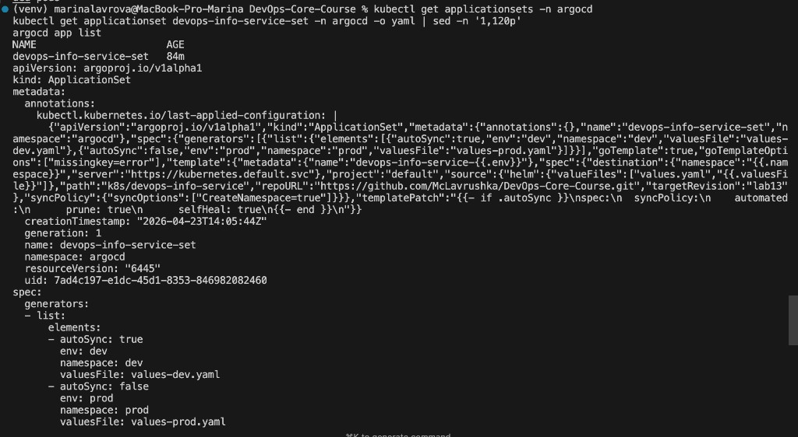

# Lab 13 — GitOps with ArgoCD (ArgoCD 2.13+)


## Task 1 — ArgoCD installation & setup

### 1.1 Install ArgoCD (Helm)

```bash
helm repo add argo https://argoproj.github.io/argo-helm
helm repo update

kubectl create namespace argocd
helm install argocd argo/argo-cd --namespace argocd

kubectl get pods -n argocd
kubectl wait --for=condition=available deploy/argocd-server -n argocd --timeout=180s
```

**My run (evidence):**

```bash
kubectl create namespace argocd
# Error from server (AlreadyExists): namespaces "argocd" already exists

helm install argocd argo/argo-cd --namespace argocd
# STATUS: deployed

kubectl wait --for=condition=available deploy/argocd-server -n argocd --timeout=180s
# deployment.apps/argocd-server condition met
```

**Verification (optional):**

```bash
kubectl get all -n argocd
```

### 1.2 Access ArgoCD UI

```bash
kubectl port-forward svc/argocd-server -n argocd 8080:443
```

Get initial admin password:

```bash
kubectl -n argocd get secret argocd-initial-admin-secret -o jsonpath="{.data.password}" | base64 -d && echo
```

Open UI: `https://localhost:8080`  
User: `admin`

**My run (evidence, password redacted):**

```bash
kubectl -n argocd get secret argocd-initial-admin-secret -o jsonpath="{.data.password}" | base64 -d && echo
********(redacted)********
```

**Screenshots (UI evidence):**
- apps list + app details screenshots are stored in `k8s/argocd/screenshots/` (see Task 3)

### 1.3 Install & login via ArgoCD CLI

Install:

```bash
brew install argocd
```

Login (port-forward must be running):

```bash
argocd login localhost:8080 --insecure
argocd account get-user-info
argocd version
```

**My run (evidence):**

```bash
argocd login localhost:8080 --insecure
# 'admin:login' logged in successfully

argocd version
# argocd: v3.3.8
# argocd-server: v3.3.8
```

---

## Task 2 — Application deployment (manual sync + GitOps workflow)

This lab requires a declarative ArgoCD **Application** resource with **manual sync** initially.

In this run, Applications are created **declaratively** via `k8s/argocd/applicationset.yaml` (Bonus).  
ArgoCD still manages regular **Application** CRs (`devops-info-service-dev`, `devops-info-service-prod`), so Task 2 is demonstrated using **prod** (manual sync).

### 2.3 Test GitOps workflow (drift from Git)

Example change (replica count) in Helm values:
- dev auto-sync: `k8s/devops-info-service/values-dev.yaml`
- prod manual sync: `k8s/devops-info-service/values-prod.yaml`

Then:

```bash
git status
git add -A
git commit -m "lab13: change replica count for GitOps test"
git push
```

**My run (evidence):**

```bash
git commit -m "lab13: gitops change test"
# changed k8s/devops-info-service/values-dev.yaml: replicaCount 1 -> 2
git push

argocd app get devops-info-service-dev --refresh
# Sync Status: OutOfSync from lab13 (93632ae)
# apps/Deployment devops-info-service: OutOfSync (rollout pending)

# after ~1-2 min (auto-sync applied):
argocd app get devops-info-service-dev --refresh
# Sync Status: Synced to lab13 (93632ae)
# Health Status: Healthy

kubectl get deploy -n dev devops-info-service -o jsonpath='{.spec.replicas}{"\n"}'
# 2
```

**Where to observe it (dev vs prod):**
- **Dev (auto-sync)**: in UI or `argocd app get devops-info-service-dev` you may see `OutOfSync` briefly after push, then it becomes `Synced` automatically.
- **Prod (manual)**: `argocd app get devops-info-service-prod` stays `OutOfSync` until you run `argocd app sync devops-info-service-prod`.

**My run (evidence: prod manual sync workflow):**

```bash
git commit -m "lab13: prod change for manual sync proof"
git push

argocd app get devops-info-service-prod --refresh
# Sync Policy: Manual
# Sync Status: OutOfSync from lab13 (5f35bdc)

argocd app sync devops-info-service-prod
argocd app wait devops-info-service-prod --health --timeout 180
# Sync Status: Synced to lab13 (5f35bdc)
# Health Status: Healthy
#
# Operation: Sync
# Phase: Succeeded
# Duration: ~14s
```

---

## Task 3 — Multi-environment deployment (dev/prod)

### 3.1 Create namespaces

```bash
kubectl apply -f k8s/argocd/namespaces.yaml
kubectl get ns | grep -E "dev|prod"
```

**My run (evidence):**

```bash
kubectl apply -f k8s/argocd/namespaces.yaml
# namespace/dev created
# namespace/prod created
```

### 3.2 Create ArgoCD Applications for dev/prod

Apps created via **ApplicationSet** (Bonus), which generates:
- `devops-info-service-dev` (auto-sync enabled)
- `devops-info-service-prod` (manual sync)

**My run (evidence):**

```bash
kubectl apply -f k8s/argocd/applicationset.yaml
# applicationset.argoproj.io/devops-info-service-set created

argocd app list
# devops-info-service-dev  (Auto-Prune)
# devops-info-service-prod (Manual)
```

Sync prod manually (dev should sync automatically after creation):

```bash
argocd app sync devops-info-service-prod
argocd app wait devops-info-service-prod --health --timeout 180
```

Verify both namespaces:

```bash
kubectl get deploy,svc -n dev
kubectl get deploy,svc -n prod
```

**My run (evidence):**

```bash
kubectl get deploy,svc -n dev
# deployment.apps/devops-info-service   1/1 ... (replicaCount=1)
# service/devops-info-service          NodePort ... 80:30756/TCP

kubectl get deploy,svc -n prod
# deployment.apps/devops-info-service   3/3 ... (replicaCount=3)
# service/devops-info-service           LoadBalancer ... EXTERNAL-IP <pending>
```

**Note (minikube):** `EXTERNAL-IP <pending>` for `LoadBalancer` is expected without `minikube tunnel`.

**Notes:**
- If apps show `OutOfSync` + `Missing`, it only means resources are not created yet (run sync / wait for auto-sync in dev).

**My run (evidence: final states):**

```bash
argocd app get devops-info-service-dev --refresh
# Sync Status: Synced to lab13 (...)
# Health Status: Healthy

argocd app sync devops-info-service-prod
# Deployment ... Healthy
```

### 3.3 Dev vs Prod differences (from values)

- **Dev (`values-dev.yaml`)**:
  - `replicaCount: 1`
  - persistence enabled
  - lower resource requests/limits
  - NodePort service
  - `config.checksumAnnotation: true` (rollout on ConfigMap changes)
- **Prod (`values-prod.yaml`)**:
  - `replicaCount: 3`
  - higher resource requests/limits
  - `service.type: LoadBalancer` (cloud-ready)

### 3.4 Why prod stays manual

Manual sync in prod is a common best practice because it gives:
- controlled release timing (no “instant deploy” on every push)
- opportunity for review/approvals (change management)
- safer rollbacks and planned maintenance windows
- better compliance story (auditability + explicit promotion)

**Screenshots:**
- `ui-apps-dev-prod.png` — list showing both applications
- `ui-app-dev.png` — dev details (auto-sync enabled)
- `ui-app-prod.png` — prod details (manual)

**My run (evidence):**
- [Open folder](./argocd/screenshots/)

- `k8s/argocd/screenshots/ui-apps-dev-prod.png`
- `k8s/argocd/screenshots/ui-app-dev.png`
- `k8s/argocd/screenshots/ui-app-prod.png`
- `k8s/argocd/screenshots/ui-app-prod-outofsync.png` (prod OutOfSync)
- `k8s/argocd/screenshots/ui-app-prod-syncing.png` (prod syncing)
- `k8s/argocd/screenshots/ui-app-prod-synced.png` (prod synced/healthy)
- `k8s/argocd/screenshots/ui-apps-dev-prod-synced.png` (both apps synced)

---

## Task 4 — Self-healing & drift tests (dev)

> Important: Kubernetes “heals” pods (keeps replica count) via controllers.  
> ArgoCD “heals” **configuration drift** (keeps desired state equal to Git).

### 4.1 Self-healing test: manual scale

Record timestamps.

```bash
date
kubectl scale deployment devops-info-service -n dev --replicas=5

kubectl get deploy -n dev devops-info-service -w
```

Expected behavior (dev has `selfHeal: true`):
- ArgoCD marks app **OutOfSync** briefly
- ArgoCD reverts replicas back to Git-defined value (from `values-dev.yaml`: `1`)

Evidence:

```bash
argocd app get devops-info-service-dev
argocd app diff devops-info-service-dev
```

**My run (evidence):**

```bash
date
# Thu Apr 23 17:30:02 MSK 2026

kubectl scale deployment devops-info-service -n dev --replicas=5
# deployment.apps/devops-info-service scaled

argocd app diff devops-info-service-dev
# replicas: 5 (cluster) vs replicas: 1 (git)

argocd app get devops-info-service-dev
# Sync Status: Synced ...
# Health Status: Healthy
```

### 4.2 Pod deletion test (Kubernetes behavior)

```bash
kubectl get pods -n dev -l app.kubernetes.io/instance=devops-info-service
kubectl delete pod -n dev -l app.kubernetes.io/instance=devops-info-service
kubectl get pods -n dev -w
```

**My run (evidence):**

```bash
kubectl delete pod -n dev -l app.kubernetes.io/instance=devops-info-service
# (watch) pods go Terminating and new pods appear again due to Deployment/ReplicaSet
```

**Clean run (evidence, single pod):**

```bash
kubectl get pods -n dev -l app.kubernetes.io/instance=devops-info-service-dev
# devops-info-service-...-w4b45  Running
# devops-info-service-...-z5zr9  Running

kubectl delete pod -n dev devops-info-service-689c6d66c7-w4b45
# pod "...-w4b45" deleted

kubectl get pods -n dev -w
# devops-info-service-...-92zhs  0/1 Running   AGE 6s
# devops-info-service-...-92zhs  1/1 Running   AGE 13s
```

Expected:
- Deployment/ReplicaSet recreates pods to maintain replica count
- This happens even without ArgoCD

### 4.3 Configuration drift test (ArgoCD behavior)

Example: manually add a label to the Deployment (drift), then ArgoCD should revert it.

```bash
kubectl label deploy -n dev devops-info-service drift-test=true --overwrite
argocd app diff devops-info-service-dev
```

**My run (evidence):**

```bash
kubectl annotate deploy -n dev devops-info-service drift-ts="$(date +%s)" --overwrite
# deployment.apps/devops-info-service annotated

# Observation: in this cluster/ArgoCD setup, changing top-level Deployment metadata annotations
# did not flip the app to OutOfSync and did not get reverted automatically:
kubectl get deploy -n dev devops-info-service -o jsonpath='{.metadata.annotations.drift-ts}{"\n"}'
# 1776956971
argocd app get devops-info-service-dev --refresh | grep -E "Sync Status|Health Status" || true
# Sync Status: Synced ...
# Health Status: Healthy
sleep 8
kubectl get deploy -n dev devops-info-service -o jsonpath='{.metadata.annotations.drift-ts}{"\n"}' || true
# 1776956971

# Reliable drift for evidence (replicas change):
kubectl patch deployment devops-info-service -n dev --type merge -p '{"spec":{"replicas":5}}'

# Immediately after patch (before self-heal):
kubectl get deploy -n dev devops-info-service -o jsonpath='{.spec.replicas}{"\n"}'

# ArgoCD detects drift and (with self-heal enabled) reverts it quickly:
argocd app diff devops-info-service-dev || true
sleep 10
argocd app get devops-info-service-dev --refresh | grep -E "Sync Status|Health Status" || true
kubectl get deploy -n dev devops-info-service -o jsonpath='{.spec.replicas}{"\n"}'
```

**Clean before/after evidence (replicas):**

```bash
kubectl patch deployment devops-info-service -n dev --type merge -p '{"spec":{"replicas":5}}'
# deployment.apps/devops-info-service patched

kubectl get deploy -n dev devops-info-service -o jsonpath='{.spec.replicas}{"\n"}'
# 5

sleep 10
kubectl get deploy -n dev devops-info-service -o jsonpath='{.spec.replicas}{"\n"}'
# 2
```

Expected:
- ArgoCD shows diff
- with self-heal, it reverts the label back to Git state

### 4.4 When does ArgoCD sync and how often it checks Git?

- **ArgoCD sync triggers**:
  - manual sync (UI/CLI)
  - automated sync (when `spec.syncPolicy.automated` is enabled)
  - webhook events (if configured)
- **Default polling**: ArgoCD checks Git periodically; commonly referenced default is ~3 minutes.
  - For immediate reactions in real setups, webhooks are preferred.

---

## Bonus — ApplicationSet (2.5 pts)

Manifest: `k8s/argocd/applicationset.yaml`

This ApplicationSet uses the **List generator** to produce:
- `devops-info-service-dev` (auto-sync on)
- `devops-info-service-prod` (auto-sync off)

Apply:

```bash
kubectl apply -f k8s/argocd/applicationset.yaml
kubectl get applicationsets -n argocd
argocd app list
```

**My run (evidence):**

```bash
kubectl get applicationsets -n argocd
# NAME                    AGE
# devops-info-service-set  ...

kubectl get applicationset devops-info-service-set -n argocd -o yaml | sed -n '1,120p'
# (shows list generator + goTemplate + templatePatch)

argocd app list
# devops-info-service-dev  (Synced/Healthy)
# devops-info-service-prod (Synced/Healthy)
```

Notes:
- ApplicationSet is useful when you have many environments/clusters and want one template.
- List generator is simple/explicit; Git/Cluster/Matrix generators scale better for large fleets.

**Screenshot (evidence):**
-  (CLI output showing ApplicationSet + generated apps)

## Checklist

### Task 1 — ArgoCD Installation & Setup
- [x] ArgoCD installed via Helm
- [x] UI accessible via port-forward
- [x] Admin password retrieved (redacted in report)
- [x] `argocd` CLI installed and logged in

### Task 2 — Application Deployment
- [x] `k8s/argocd/` directory created and manifests present
- [x] Application resources created declaratively (via ApplicationSet) and visible in UI
- [x] Initial manual sync demonstrated for prod
- [x] GitOps workflow tested (dev auto-sync + prod manual sync)

### Task 3 — Multi-Environment Deployment
- [x] `dev` and `prod` namespaces created
- [x] Dev auto-sync with `selfHeal` + `prune`
- [x] Prod manual sync
- [x] Different configs per environment verified

### Task 4 — Self-Healing & Documentation
- [x] Manual scale drift test performed (with timestamps)
- [x] Pod deletion test performed (Kubernetes behavior)
- [x] Configuration drift test performed (replicas patch, reverted to Git state)
- [x] UI screenshots attached (apps list + dev/prod details + prod state transitions)

### Bonus — ApplicationSet
- [x] ApplicationSet manifest created
- [x] Generates multiple apps (dev/prod)
- [x] Evidence captured (CLI screenshot + YAML output)


