# Lab 13 — GitOps with ArgoCD

## Task 1 — ArgoCD Installation & Setup

ArgoCD was installed into a dedicated `argocd` namespace using Helm.

### Installation

```bash
helm repo add argo https://argoproj.github.io/argo-helm
helm repo update
kubectl create namespace argocd
helm upgrade --install argocd argo/argo-cd -n argocd
kubectl wait --for=condition=Ready pod --all -n argocd --timeout=300s
kubectl get pods -n argocd
helm list -n argocd
```

### Installation Result

Main ArgoCD components became available in the `argocd` namespace.

Shortened output:

```text
NAME                                                READY   STATUS    RESTARTS   AGE
argocd-application-controller-0                     1/1     Running   0          9m
argocd-applicationset-controller-559566846f-j79kc   1/1     Running   0          9m
argocd-dex-server-8f5687997-96btn                   1/1     Running   0          9m
argocd-notifications-controller-56c7d65875-rbcbt    1/1     Running   0          9m
argocd-redis-fcd76bcfb-v5q8d                        1/1     Running   0          9m
argocd-repo-server-7b8447858f-gs2hl                 1/1     Running   0          9m
argocd-server-7f857f54f-72wzz                       1/1     Running   0          9m
```

Helm release verification:

```text
NAME    NAMESPACE  REVISION  STATUS    CHART         APP VERSION
argocd  argocd     1         deployed  argo-cd-9.5.4 v3.3.8
```

### UI Access

The ArgoCD UI was accessed via port forwarding:

```bash
kubectl port-forward svc/argocd-server -n argocd 8080:443
```

The UI was opened at:

```text
https://localhost:8080
```

### Initial Password

The initial admin password was retrieved with:

```bash
argocd admin initial-password -n argocd
```

Example output:

```text
P6KD5HSOR-nny7s1
```

### CLI Installation and Login

The ArgoCD CLI was installed and verified:

```bash
brew install argocd
argocd version --client
argocd login localhost:8080 --insecure
argocd account get-user-info
argocd cluster list
```

Shortened output:

```text
argocd: v3.3.8
Logged In: true
Username: admin
Issuer: argocd
```

Cluster availability:

```text
SERVER                          NAME        STATUS
https://kubernetes.default.svc  in-cluster  Unknown
```

At this stage, no applications had been created yet.

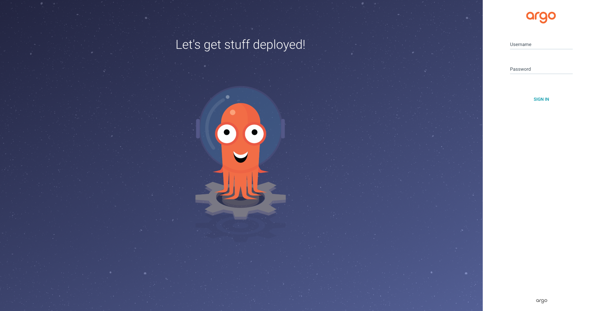

---

## Task 2 — Application Deployment

A declarative ArgoCD `Application` manifest was created in `k8s/argocd/application.yaml`.

### Application Manifest

```yaml
apiVersion: argoproj.io/v1alpha1
kind: Application
metadata:
  name: devops-info-service
  namespace: argocd
spec:
  project: default
  source:
    repoURL: https://github.com/Boogyy/DevOps-Core-Course.git
    targetRevision: lab13
    path: k8s/devops-info-service
    helm:
      valueFiles:
        - values.yaml
  destination:
    server: https://kubernetes.default.svc
    namespace: default
  syncPolicy:
    syncOptions:
      - CreateNamespace=true
```

### Deployment Steps

```bash
kubectl apply -f k8s/argocd/application.yaml
argocd app list
argocd app get devops-info-service
argocd app sync devops-info-service
```

### Before Initial Sync

After creating the Application, ArgoCD detected it but the resources were not yet deployed.

Shortened output:

```text
NAME                        CLUSTER                         NAMESPACE  PROJECT  SYNCPOLICY
argocd/devops-info-service  https://kubernetes.default.svc  default    default  Manual
```

### Initial Sync Result

After manual synchronization, the application became `Synced` and `Healthy`.

Shortened output:

```text
Sync Status:   Synced to lab13 (5db1f89)
Health Status: Healthy
Phase:         Succeeded
Message:       successfully synced (no more tasks)
```

Created resources:

```text
ServiceAccount         default   devops-info-service
Secret                 default   devops-info-service-devops-info-service-secret
ConfigMap              default   devops-info-service-devops-info-service-config
ConfigMap              default   devops-info-service-devops-info-service-env
PersistentVolumeClaim  default   devops-info-service-devops-info-service-data
Service                default   devops-info-service-devops-info-service
Deployment             default   devops-info-service-devops-info-service
```

Helm hooks also executed successfully:

```text
Job  devops-info-service-devops-info-service-pre-install   Succeeded   PreSync
Job  devops-info-service-devops-info-service-post-install  Succeeded   PostSync
```

### Verification

```bash
argocd app get devops-info-service
kubectl get all -n default
kubectl get pvc -n default
kubectl get configmap -n default
kubectl get secret -n default
```

Shortened output:

```text
deployment.apps/devops-info-service-devops-info-service   1/1
service/devops-info-service-devops-info-service           80:30080/TCP
pvc/devops-info-service-devops-info-service-data          Bound
```

The application was successfully accessed through Minikube:

```bash
minikube service devops-info-service-devops-info-service -n default --url
```

Example output:

```text
http://127.0.0.1:65501
```

### GitOps Workflow Note

The GitOps workflow was validated by committing ArgoCD manifests and environment-specific changes to the Git repository and observing ArgoCD reconcile the cluster state from Git.
Subsequent updates to the repository were reflected in ArgoCD application status and synchronization behavior during later tasks.

### Application before initial sync
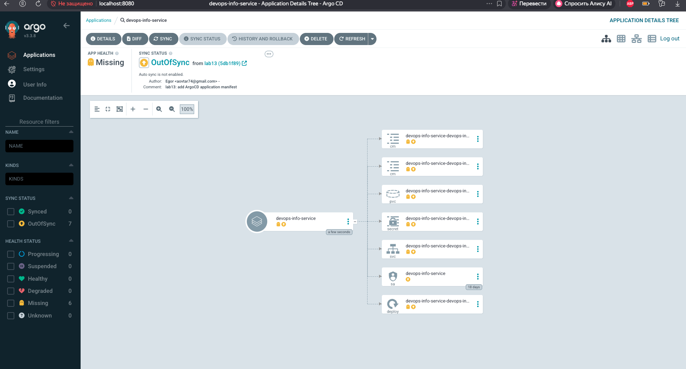


### Application after successful sync
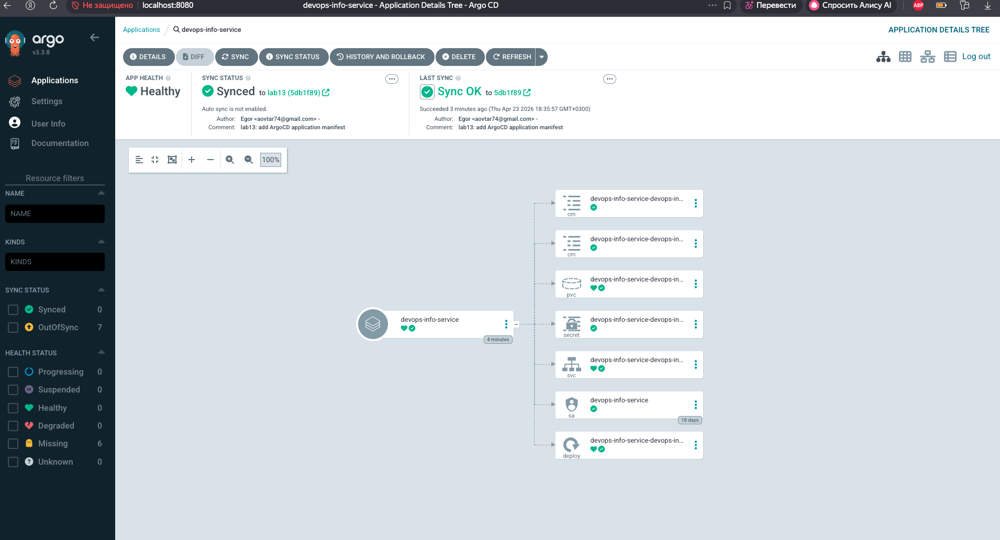

---

## Task 3 — Multi-Environment Deployment

### Namespaces

Separate namespaces were used to isolate the environments:

File: `k8s/argocd/namespaces.yaml`

```yaml
apiVersion: v1
kind: Namespace
metadata:
  name: dev
---
apiVersion: v1
kind: Namespace
metadata:
  name: prod
```

Two separate ArgoCD Applications were created for the `dev` and `prod` environments.

### Environment Differences

`dev` and `prod` were deployed with different values files:

* `dev` uses `values-dev.yaml`
* `prod` uses `values-prod.yaml`

Configuration differences:

* `dev` has `replicaCount: 1`
* `prod` has `replicaCount: 3`
* `dev` uses `NodePort 30083`
* `prod` uses `NodePort 30082`
* `dev` enables `DEBUG=true`
* `prod` uses `DEBUG=false`

Sync policy differences:

* `dev` uses automated sync with `prune` and `selfHeal`
* `prod` remains on manual sync

### Verification

```bash
argocd app list
argocd app get dev
argocd app get prod
kubectl get deploy -n dev
kubectl get deploy -n prod
kubectl get svc -n dev
kubectl get svc -n prod
kubectl get pods -n dev
kubectl get pods -n prod
```

Observed application states:

```text
argocd/dev   ... NAMESPACE dev   STATUS Synced   HEALTH Healthy   SYNCPOLICY Auto-Prune
argocd/prod  ... NAMESPACE prod  STATUS Synced   HEALTH Healthy   SYNCPOLICY Manual
```

Deployment verification:

```text
NAME                      READY   UP-TO-DATE   AVAILABLE
dev-devops-info-service   1/1     1            1

NAME                       READY   UP-TO-DATE   AVAILABLE
prod-devops-info-service   3/3     3            3
```

Service verification:

```text
dev-devops-info-service    NodePort   80:30083/TCP
prod-devops-info-service   NodePort   80:30082/TCP
```

Pod verification:

```text
dev-devops-info-service-79676c97b-7gtml                    Running
prod-devops-info-service-669c8cb846-hkbfq                  Running
prod-devops-info-service-669c8cb846-lnd8f                  Running
prod-devops-info-service-669c8cb846-spdz2                  Running
```

### Access Verification

Both environments were reachable through Minikube services.

For `dev`:

```bash
minikube service dev-devops-info-service -n dev --url
```

Example output:

```text
http://127.0.0.1:50964
```

The response confirmed:

* `version: lab12-dev`
* `app_env: dev`
* `log_level: debug`

For `prod`:

```bash
minikube service prod-devops-info-service -n prod --url
```

Example output:

```text
http://127.0.0.1:51057
```

The response confirmed:

* `version: lab12-prod`
* `app_env: prod`
* `log_level: info`

### Applications list with dev and prod
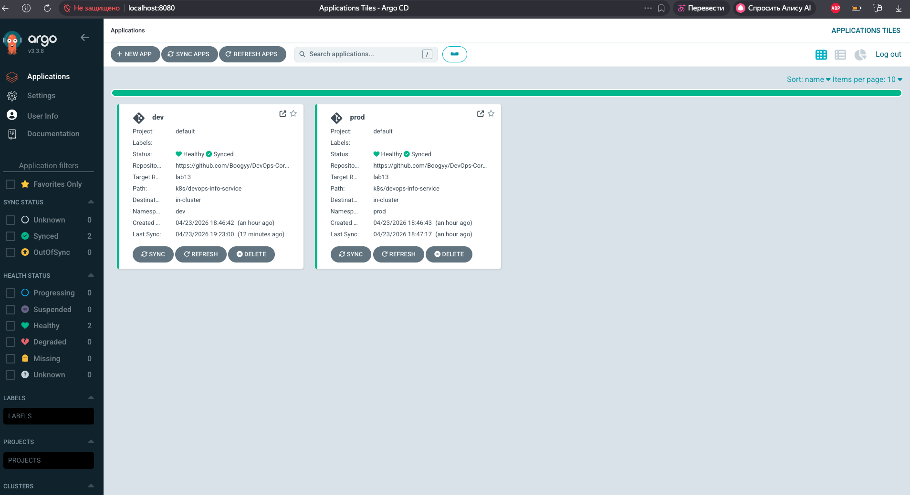

### Dev application details
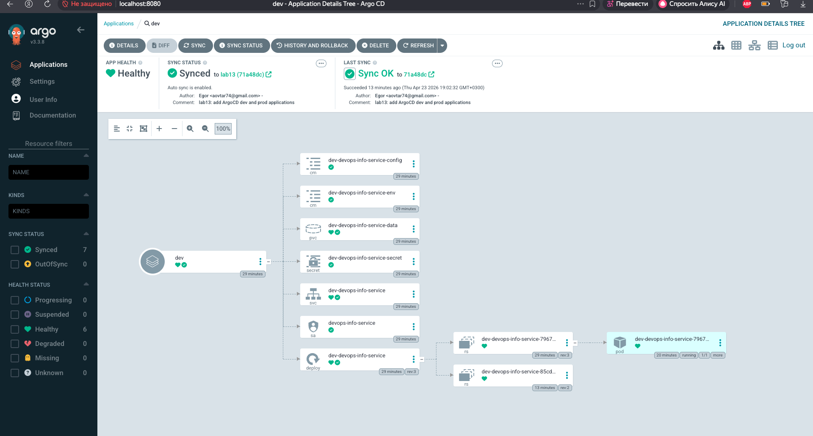

### Prod application details
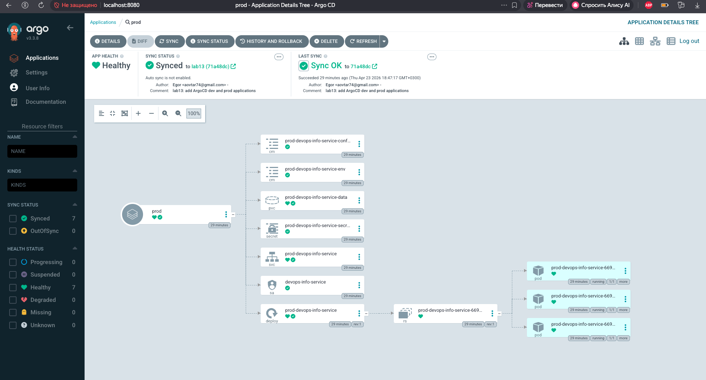

---

## Task 4 — Self-Healing & Sync Policies

### Dev Self-Healing Verification

The `dev` application was configured with:

```yaml
syncPolicy:
  automated:
    prune: true
    selfHeal: true
```

This was verified with:

```bash
kubectl get application dev -n argocd -o jsonpath='{.spec.syncPolicy.automated.selfHeal}{"\n"}'
kubectl get application dev -n argocd -o jsonpath='{.spec.syncPolicy.automated.prune}{"\n"}'
```

Output:

```text
true
true
```

### Manual Scale Drift Test

Initial state:

```bash
date -Iseconds
kubectl get deploy dev-devops-info-service -n dev
argocd app get dev
```

Initial output:

```text
2026-04-23T18:55:01+03:00
dev-devops-info-service   1/1
Sync Status:   Synced
Health Status: Healthy
```

At `2026-04-23T18:55:06+03:00`, the deployment was manually scaled from 1 replica to 5:

```bash
kubectl scale deployment dev-devops-info-service -n dev --replicas=5
argocd app diff dev
```

The diff showed:

```diff
<   replicas: 5
---
>   replicas: 1
```

After that, ArgoCD automatically restored the Deployment. Final state at `2026-04-23T18:55:31+03:00`:

```text
dev-devops-info-service   1/1
Sync Status:   Synced
Health Status: Healthy
```

This confirmed ArgoCD self-healing of configuration drift.

### Pod Deletion Test

A running pod was deleted manually:

```bash
kubectl get pods -n dev
kubectl delete pod -n dev dev-devops-info-service-79676c97b-7gtml
kubectl get pods -n dev -w
```

Observed sequence:

```text
2026-04-23T18:56:16+03:00
pod "dev-devops-info-service-79676c97b-7gtml" deleted from dev namespace

dev-devops-info-service-79676c97b-5c6c6   0/1 Running
dev-devops-info-service-79676c97b-5c6c6   1/1 Running
```

This demonstrated **Kubernetes self-healing**, because the Deployment/ReplicaSet controller recreated the pod automatically.

### Configuration Drift Test

A manual configuration drift was introduced by changing the Deployment environment variable:

```bash
date -Iseconds
kubectl set env deployment/dev-devops-info-service -n dev RELEASE_VERSION=manual-drift
kubectl get deployment dev-devops-info-service -n dev -o jsonpath='{range .spec.template.spec.containers[0].env[?(@.name=="RELEASE_VERSION")]}{.value}{"\n"}{end}'
```

Observed output:

```text
2026-04-23T19:02:31+03:00
deployment.apps/dev-devops-info-service env updated
manual-drift
```

After 10 seconds, the value was restored automatically:

```text
lab12-dev
```

`argocd app get dev --refresh` still showed the application as:

```text
Sync Status:   Synced
Health Status: Healthy
```

This confirmed that ArgoCD detected and corrected configuration drift automatically.

### Sync Behavior Explanation

Kubernetes and ArgoCD heal different things:

* **Kubernetes self-healing** restores runtime objects such as Pods when they fail or are deleted.
* **ArgoCD self-healing** restores declarative configuration drift and returns resources to the state stored in Git.
* ArgoCD compares desired state from Git with live cluster state on a schedule.
* With automated sync enabled, detected drift can be corrected automatically.
* With manual sync, applications become `OutOfSync` until synchronized manually.

### Scale drift and ArgoCD diff
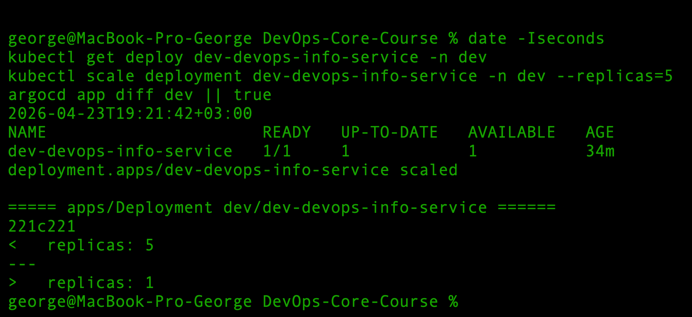

### Pod deletion and recreation
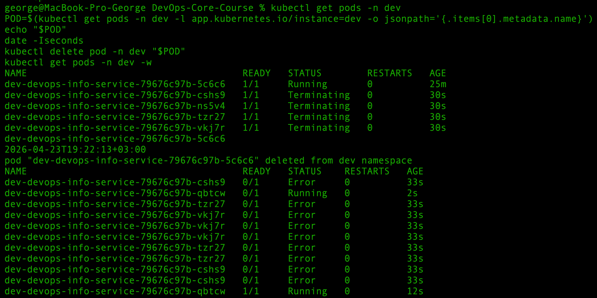

### Configuration drift restored
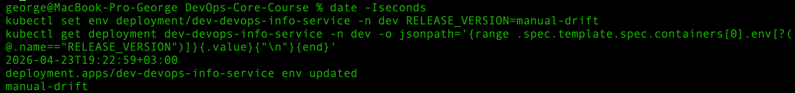

---

## Bonus Task — ApplicationSet

### Objective

The goal of the bonus task was to replace individual ArgoCD `Application` manifests with a single `ApplicationSet` that generates multiple applications from one template.

### Why ApplicationSet

ApplicationSet automatically generates ArgoCD `Application` resources from one higher-level manifest.  
This is useful for:
- multi-environment deployments;
- multi-cluster deployments;
- monorepo structures with multiple deployable applications.

In this project, ApplicationSet reduces duplication between the `dev` and `prod` ArgoCD applications.

### Generator Choice

The **List generator** was chosen because the environments are explicitly known:
- `dev`
- `prod`

Each environment provides a small set of parameters:
- application name
- namespace
- Helm values file
- whether automated sync should be enabled

This makes the List generator the simplest and clearest option for this repository.

### When to Use Different Generators

- **List generator** is best when environments or targets are explicitly known in advance.
- **Cluster generator** is useful when the same application must be deployed to multiple ArgoCD-managed clusters.
- **Git directory generator** is useful in a monorepo with multiple application directories that should be auto-discovered.

### ApplicationSet Manifest

File: `k8s/argocd/applicationset.yaml`

```yaml
apiVersion: argoproj.io/v1alpha1
kind: ApplicationSet
metadata:
  name: devops-info-service
  namespace: argocd
spec:
  goTemplate: true
  goTemplateOptions:
    - missingkey=error
  generators:
    - list:
        elements:
          - appName: dev
            namespace: dev
            valuesFile: values-dev.yaml
            autoSync: "true"
          - appName: prod
            namespace: prod
            valuesFile: values-prod.yaml
            autoSync: "false"
  template:
    metadata:
      name: '{{ .appName }}'
      labels:
        managed-by: applicationset
    spec:
      project: default
      source:
        repoURL: https://github.com/Boogyy/DevOps-Core-Course.git
        targetRevision: lab13
        path: k8s/devops-info-service
        helm:
          valueFiles:
            - '{{ .valuesFile }}'
      destination:
        server: https://kubernetes.default.svc
        namespace: '{{ .namespace }}'
      syncPolicy:
        syncOptions:
          - CreateNamespace=true
  templatePatch: |
    {{- if eq .autoSync "true" }}
    spec:
      syncPolicy:
        automated:
          prune: true
          selfHeal: true
        syncOptions:
          - CreateNamespace=true
    {{- end }}
```

First, the previously created individual ArgoCD applications were removed from the cluster:

```bash
kubectl delete application dev -n argocd
kubectl delete application prod -n argocd
```

Then the new ApplicationSet was applied:

```bash
kubectl apply -f k8s/argocd/applicationset.yaml
kubectl get applicationsets -n argocd
kubectl get applications -n argocd
argocd app list
```

### Result

The ApplicationSet generated two ArgoCD Applications:

* `dev`
* `prod`

The generated applications preserved the intended behavior:

* `dev` used `values-dev.yaml` and automated sync with `prune` and `selfHeal`
* `prod` used `values-prod.yaml` and manual sync

### Why This Pattern Is Better Than Individual Applications

Compared to manually maintaining separate `application-dev.yaml` and `application-prod.yaml` files, ApplicationSet:

* reduces YAML duplication;
* centralizes shared settings into one template;
* makes it easier to add new environments later;
* scales better for larger repositories and deployment topologies.

### Optional Git Directory Generator

A Git directory generator was not implemented in practice for this repository because the project contains one main deployable Helm chart (`k8s/devops-info-service`).

However, the Git directory generator would be useful in a monorepo where multiple applications are stored in separate directories and should be auto-discovered.

### Generated applications from ApplicationSet
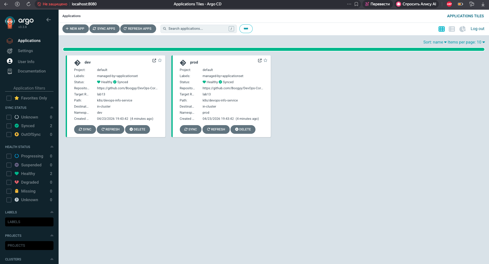

### ApplicationSet resources in terminal
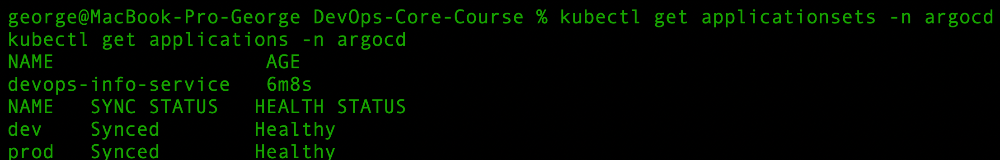
