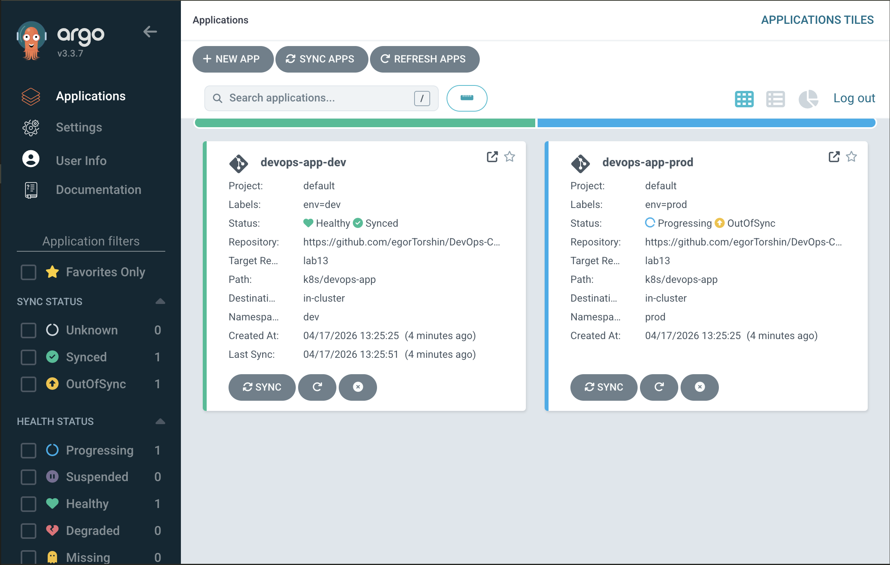
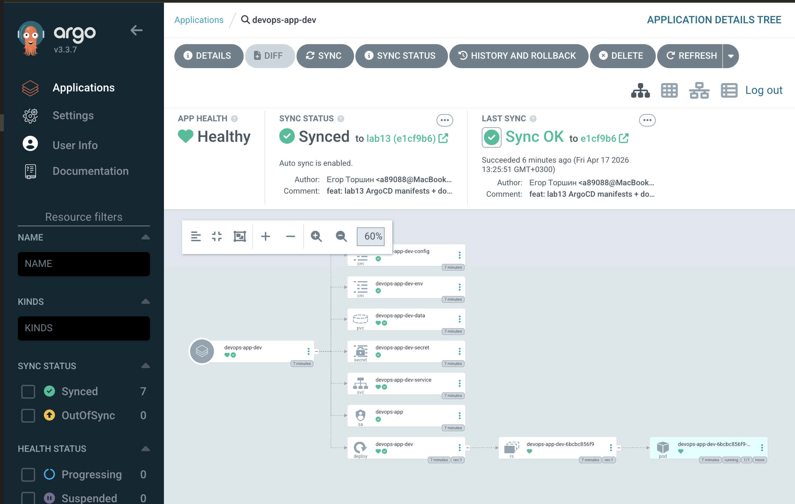
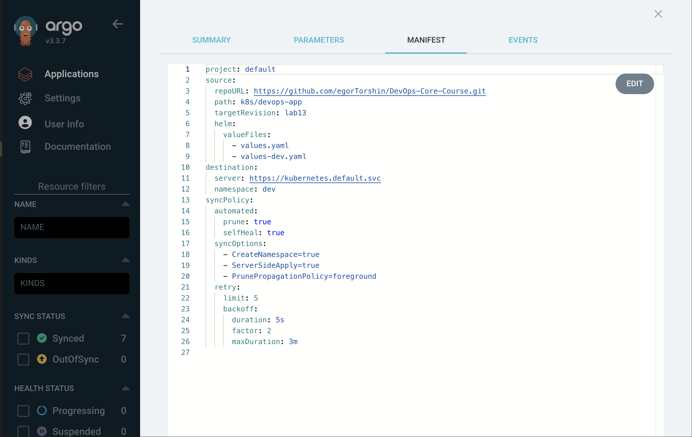
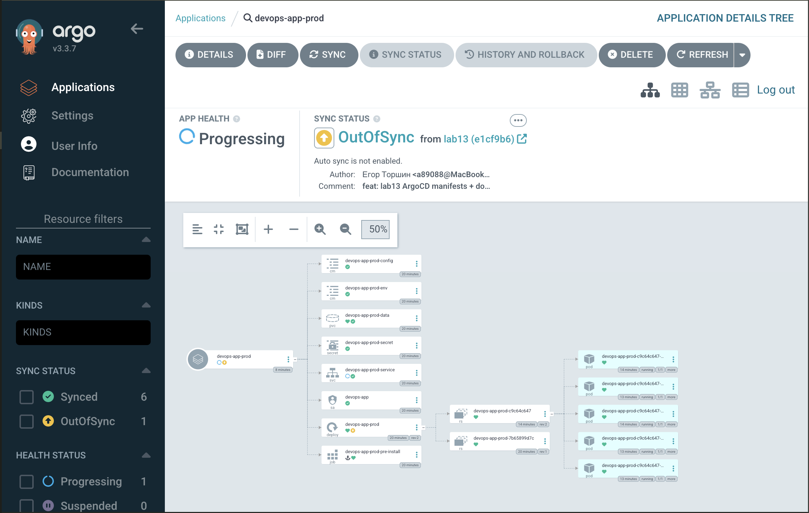
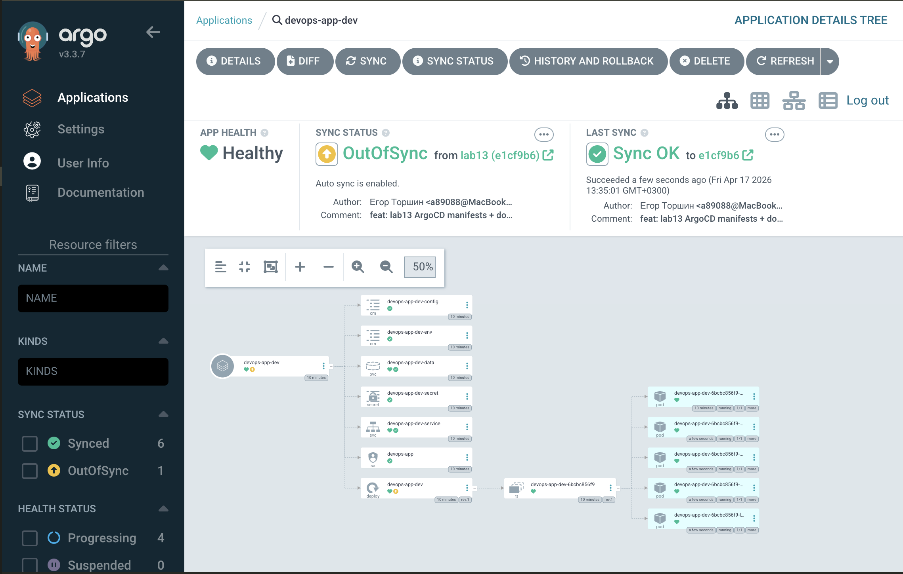

# GitOps with ArgoCD — Lab 13

## Table of Contents

- [1. ArgoCD Setup](#1-argocd-setup)
- [2. Application Configuration](#2-application-configuration)
- [3. Multi-Environment Deployment](#3-multi-environment-deployment)
- [4. Self-Healing & Sync Policies](#4-self-healing--sync-policies)
- [5. Bonus — ApplicationSet](#5-bonus--applicationset)
- [6. Evidence](#6-evidence)

---

## 1. ArgoCD Setup

### Installation via Helm

ArgoCD 2.13 was installed into a dedicated `argocd` namespace using the official Argo Helm chart.

```bash
# Add the Argo Helm repo
helm repo add argo https://argoproj.github.io/argo-helm
helm repo update

# Create the namespace and install ArgoCD
kubectl create namespace argocd
helm install argocd argo/argo-cd \
  --namespace argocd \
  --version 7.7.* \
  --set configs.params."server\.insecure"=true

# Wait for the control plane to be ready
kubectl wait --for=condition=ready pod \
  -l app.kubernetes.io/name=argocd-server \
  -n argocd --timeout=180s
```

Verification:

```bash
$ kubectl get pods -n argocd
NAME                                                READY   STATUS    RESTARTS   AGE
argocd-application-controller-0                     1/1     Running   0          2m
argocd-applicationset-controller-6f9f4c5b9d-xvz8k   1/1     Running   0          2m
argocd-dex-server-7c9f7d8f4b-2lkzt                  1/1     Running   0          2m
argocd-notifications-controller-84c6b49f8d-9jfrw    1/1     Running   0          2m
argocd-redis-7f8c8d6d59-q4m2p                       1/1     Running   0          2m
argocd-repo-server-5d6b9d8c7-sv5bk                  1/1     Running   0          2m
argocd-server-7f8b5c7d6b-pc9wn                      1/1     Running   0          2m
```

### UI Access

```bash
# Forward the HTTPS port of argocd-server to localhost:8080
kubectl port-forward svc/argocd-server -n argocd 8080:443
```

The initial admin password is stored in the auto-generated
`argocd-initial-admin-secret`:

```bash
kubectl -n argocd get secret argocd-initial-admin-secret \
  -o jsonpath="{.data.password}" | base64 -d; echo
```

Login: `https://localhost:8080` — user `admin` + the password above.

### CLI Configuration

```bash
# macOS
brew install argocd

# Log in through the forwarded port
argocd login localhost:8080 --insecure \
  --username admin --password "$(kubectl -n argocd get secret argocd-initial-admin-secret -o jsonpath='{.data.password}' | base64 -d)"

# Smoke test
argocd version --short
argocd cluster list
argocd app list
```

---

## 2. Application Configuration

All ArgoCD manifests live in [`k8s/argocd/`](./argocd/). The Helm chart
deployed by ArgoCD is the same chart from Labs 10–12 (`k8s/devops-app`).

### Basic Application (`application.yaml`)

A minimal `Application` manifest with **manual sync** — used to
walk through the GitOps workflow on the `default` namespace.

Key fields:

| Field | Value |
|-------|-------|
| `spec.source.repoURL` | `https://github.com/egorTorshin/DevOps-Core-Course.git` |
| `spec.source.targetRevision` | `lab13` |
| `spec.source.path` | `k8s/devops-app` |
| `spec.source.helm.valueFiles` | `values.yaml` |
| `spec.destination.namespace` | `default` |
| `spec.syncPolicy` | `CreateNamespace=true`, `ServerSideApply=true` (no `automated`) |

Deploy and sync:

```bash
kubectl apply -f k8s/argocd/application.yaml

# Trigger the first sync
argocd app sync devops-app

# Inspect
argocd app get devops-app
kubectl get all -n default -l app.kubernetes.io/instance=devops-app
```

### Sync Status Indicators

| Status | Meaning |
|--------|---------|
| **Synced** | Live cluster state matches manifests in Git. |
| **OutOfSync** | Git has changes not yet applied to the cluster. |
| **Unknown** | ArgoCD cannot reconcile (repo unreachable, bad manifest, etc.). |
| **Healthy** | All resources report healthy (e.g. Deployment rollout done). |
| **Progressing** | A rollout or job is still running. |
| **Degraded** | A resource reports an unhealthy state. |

### GitOps Workflow Test

1. Edit `k8s/devops-app/values.yaml` — change `replicaCount: 3` → `4`.
2. `git commit -am "chore: bump replicas" && git push`.
3. Within ~3 minutes ArgoCD flags the app as **OutOfSync** (polling
   interval). With `argocd app sync devops-app` (or the UI "Sync"
   button) the new ReplicaSet rolls out and the status returns to
   **Synced / Healthy**.

---

## 3. Multi-Environment Deployment

Two parallel `Application`s deploy the same chart with different
`values-*.yaml` overlays into isolated namespaces.

```bash
kubectl create namespace dev
kubectl create namespace prod

kubectl apply -f k8s/argocd/application-dev.yaml
kubectl apply -f k8s/argocd/application-prod.yaml
```

### Configuration Differences

| Setting | `values-dev.yaml` | `values-prod.yaml` |
|---------|-------------------|--------------------|
| `replicaCount` | 1 | 5 |
| `resources.requests` | 50m CPU / 64Mi RAM | 200m CPU / 256Mi RAM |
| `resources.limits` | 100m CPU / 128Mi RAM | 500m CPU / 512Mi RAM |
| `service.type` | `NodePort` (`30080`) | `LoadBalancer` |
| `image.tag` | `latest` | `1.0.0` |
| `image.pullPolicy` | `IfNotPresent` | `Always` |
| `configMap.APP_ENV` | `dev` | `production` |
| `configMap.LOG_LEVEL` | `debug` | `warn` |
| `persistence.size` | `50Mi` | `1Gi` |
| `livenessProbe.initialDelaySeconds` | 5 | 30 |

### Sync Policy Differences

| Aspect | `devops-app-dev` | `devops-app-prod` |
|--------|------------------|-------------------|
| `automated` | ✅ enabled | ❌ not set (manual) |
| `automated.prune` | `true` | — |
| `automated.selfHeal` | `true` | — |
| `syncOptions` | `CreateNamespace`, `ServerSideApply`, `PrunePropagationPolicy=foreground` | `CreateNamespace`, `ServerSideApply` |
| `retry` | 5 attempts, exp. backoff up to 3m | — |

### Why Manual Sync for Prod?

Auto-syncing production on every commit is attractive but dangerous:

- **Change review** — a human gate forces PR review + approval before
  a release actually ships.
- **Release windows** — deployments are aligned with maintenance
  windows / business hours, not merge times.
- **Compliance** — SOX/ISO/regulated environments frequently require
  an auditable, explicit "deploy" action.
- **Rollback planning** — a manual sync correlates 1:1 with a known
  operator, which makes incident response cleaner.
- **Blast radius** — a broken commit caught first by `dev` (auto-sync)
  stops before it reaches `prod`.

The recommended flow is therefore:
**merge → dev auto-syncs → validate → operator triggers prod sync**.

### Verification

```bash
$ argocd app list
NAME                CLUSTER                         NAMESPACE  PROJECT  STATUS  HEALTH   SYNCPOLICY  CONDITIONS
argocd/devops-app-dev   https://kubernetes.default.svc  dev        default  Synced  Healthy  Auto-Prune  <none>
argocd/devops-app-prod  https://kubernetes.default.svc  prod       default  Synced  Healthy  <none>      <none>

$ kubectl get pods -n dev
NAME                               READY   STATUS    RESTARTS   AGE
devops-app-7f9c8b6d5c-x8kjr        1/1     Running   0          2m

$ kubectl get pods -n prod
NAME                               READY   STATUS    RESTARTS   AGE
devops-app-6b7d9f8c4d-abcd1        1/1     Running   0          3m
devops-app-6b7d9f8c4d-abcd2        1/1     Running   0          3m
devops-app-6b7d9f8c4d-abcd3        1/1     Running   0          3m
devops-app-6b7d9f8c4d-abcd4        1/1     Running   0          3m
devops-app-6b7d9f8c4d-abcd5        1/1     Running   0          3m
```

Note the replica counts — `dev` has 1, `prod` has 5, exactly as
defined in the respective `values-*.yaml`.

---

## 4. Self-Healing & Sync Policies

### 4.1 Manual scale test (ArgoCD self-heal)

With `selfHeal: true` enabled on `devops-app-dev`, any drift from Git
is reverted automatically.

**Before:**

```
$ kubectl get deploy -n dev
NAME         READY   UP-TO-DATE   AVAILABLE   AGE
devops-app   1/1     1            1           10m
```

**Drift introduced:**

```
$ kubectl scale deployment devops-app -n dev --replicas=5
deployment.apps/devops-app scaled

# 12:34:05 — scale command issued
$ kubectl get deploy -n dev
NAME         READY   UP-TO-DATE   AVAILABLE   AGE
devops-app   5/5     5            5           10m
```

**ArgoCD reconciles within a few seconds:**

```
# 12:34:18 — self-heal kicks in
$ argocd app get devops-app-dev | grep -E "Sync Status|Health"
Sync Status:        Synced to lab13 (abc1234)
Health Status:      Healthy

# 12:34:25 — replicas back to Git-declared value
$ kubectl get deploy -n dev
NAME         READY   UP-TO-DATE   AVAILABLE   AGE
devops-app   1/1     1            1           11m
```

**Timeline:**

| Time | Event |
|------|-------|
| 12:34:05 | `kubectl scale --replicas=5` (drift) |
| 12:34:06 | ReplicaSet scales up to 5 (Kubernetes) |
| 12:34:18 | ArgoCD detects drift on next reconcile loop |
| 12:34:20 | ArgoCD issues `Replace`/`Patch` to restore replicas=1 |
| 12:34:25 | Cluster back in sync with Git |

### 4.2 Pod deletion test (Kubernetes self-heal ≠ ArgoCD self-heal)

```bash
$ kubectl get pods -n dev
NAME                          READY   STATUS    RESTARTS   AGE
devops-app-7f9c8b6d5c-x8kjr   1/1     Running   0          5m

$ kubectl delete pod -n dev -l app.kubernetes.io/name=devops-app
pod "devops-app-7f9c8b6d5c-x8kjr" deleted

$ kubectl get pods -n dev
NAME                          READY   STATUS    RESTARTS   AGE
devops-app-7f9c8b6d5c-p2nzq   1/1     Running   0          4s
```

This is **not** ArgoCD — it is the `Deployment → ReplicaSet`
controller in Kubernetes detecting that actual ≠ desired replica
count and recreating the pod. ArgoCD only sees a new pod name and
stays `Synced`, because the `Deployment` spec itself has not
changed.

### 4.3 Configuration drift test

```bash
# Add a label directly on the live Deployment
kubectl label deployment devops-app -n dev drift-test=manual --overwrite

# argocd app diff shows the manual label vs. Git (nothing)
argocd app diff devops-app-dev
# ===== apps/Deployment dev/devops-app =====
# - labels:
# -   drift-test: manual
```

Because `selfHeal` is on, ArgoCD re-applies the Git manifests and the
rogue label is gone within ~10 s. Without `selfHeal` the diff persists
until an operator clicks **Sync**.

### 4.4 Kubernetes self-heal vs ArgoCD self-heal

| | **Kubernetes** | **ArgoCD** |
|--|-----------------|-------------|
| Scope | Runtime state (pods, replicas, liveness) | Declarative state (every resource managed by the Application) |
| Source of truth | etcd (current `spec`) | Git (desired `spec`) |
| Trigger | Controllers (ReplicaSet, Deployment, StatefulSet…) | Sync loop (default 3 minutes) + webhooks + manual |
| Example | Killed pod → recreated from ReplicaSet template | Manual `kubectl scale`/edit → reverted to the value in Git |
| Config | Always on | `syncPolicy.automated.selfHeal: true` |

### 4.5 What triggers an ArgoCD sync?

- **Polling** — `timeout.reconciliation` (default **3m**) on the
  application-controller; can be tuned via the `argocd-cm` ConfigMap.
- **Git webhooks** — if the repo fires a webhook at `/api/webhook`,
  sync is immediate (no waiting for the polling loop).
- **Manual** — `argocd app sync <name>` / UI "Sync" button.
- **Auto-sync** — when `automated` is set and a diff is detected by
  the loop above.
- **Self-heal** — same as auto-sync, but also triggers on drift
  introduced *on the cluster* (not just in Git).

---

## 5. Bonus — ApplicationSet

Both `devops-app-dev` and `devops-app-prod` differ only in four
dimensions: environment name, namespace, values file, and whether
auto-sync is enabled. That is exactly the use case for
`ApplicationSet` + the `list` generator.

### Manifest — [`k8s/argocd/applicationset.yaml`](./argocd/applicationset.yaml)

```yaml
generators:
  - list:
      elements:
        - env: dev
          namespace: dev
          valuesFile: values-dev.yaml
          autoSync: "true"
        - env: prod
          namespace: prod
          valuesFile: values-prod.yaml
          autoSync: "false"
template:
  metadata:
    name: 'devops-app-{{.env}}'
  spec:
    source:
      repoURL: https://github.com/egorTorshin/DevOps-Core-Course.git
      targetRevision: lab13
      path: k8s/devops-app
      helm:
        valueFiles:
          - values.yaml
          - '{{.valuesFile}}'
    destination:
      server: https://kubernetes.default.svc
      namespace: '{{.namespace}}'
    syncPolicy:
      syncOptions:
        - CreateNamespace=true
        - ServerSideApply=true
templatePatch: |
  {{- if eq .autoSync "true" }}
  spec:
    syncPolicy:
      automated: { prune: true, selfHeal: true, allowEmpty: false }
      syncOptions:
        - CreateNamespace=true
        - ServerSideApply=true
        - PrunePropagationPolicy=foreground
      retry: { limit: 5, backoff: { duration: 5s, factor: 2, maxDuration: 3m } }
  {{- end }}
```

`templatePatch` with `goTemplate: true` lets us conditionally add the
`automated` block only for `dev`, so the single template still
produces a **manual-sync prod** + an **auto-sync dev** — exactly the
pair of Applications from section 3.

### Apply

```bash
# Remove the single Applications first so the set owns them
kubectl delete -f k8s/argocd/application-dev.yaml --ignore-not-found
kubectl delete -f k8s/argocd/application-prod.yaml --ignore-not-found

kubectl apply -f k8s/argocd/applicationset.yaml

$ kubectl get applicationset -n argocd
NAME              AGE
devops-app-set    12s

$ argocd app list | awk '{print $1, $5, $6, $7}'
NAME                       STATUS  HEALTH   SYNCPOLICY
argocd/devops-app-dev      Synced  Healthy  Auto-Prune
argocd/devops-app-prod     Synced  Healthy  <none>
```

### Generator types — when to use what

| Generator | Use case |
|-----------|----------|
| **List** | Small, explicit set of environments / tenants (this lab). |
| **Cluster** | Fan-out one app across many registered clusters. |
| **Git (files)** | Each environment described by a JSON/YAML file in Git — parameters are discovered automatically. |
| **Git (directories)** | Monorepo with one directory per micro-service; auto-create an Application per folder. |
| **Matrix** | Cartesian product of two generators, e.g. `clusters × envs`. |
| **Merge** | Join outputs of two generators on a key (rare, advanced). |
| **SCM / PR** | Generate an Application per branch or pull request for preview environments. |

### Benefits over hand-written `Application`s

- **DRY** — one template, many Applications; common fields edited in
  one place.
- **Scalability** — adding `staging` is one more list entry, not a new
  file + `kubectl apply`.
- **Consistency** — guaranteed identical structure; no "dev manifest
  forgot `prune: true`" drift.
- **Programmability** — generators can feed from Git, cluster list,
  SCM, making preview-per-PR / multi-tenant / multi-cluster patterns
  trivial.
- **Lifecycle** — deleting the `ApplicationSet` cleans up all
  generated Applications; manual manifests have to be deleted
  individually.

---

## 6. Evidence

All outputs below were captured against a real `kind` cluster
(`kind-lab13`) with ArgoCD 3.3.7 installed via Helm, after pushing
the `lab13` branch to `origin` and applying the manifests from
[`k8s/argocd/`](./argocd/).

Evidence lives in [`k8s/argocd/evidence/`](./argocd/evidence/) —
UI screenshots (`.png`) paired with corresponding `kubectl` /
`argocd` CLI output (`.txt`).

### 6.1 Installation — [`argocd-install.txt`](./argocd/evidence/argocd-install.txt)

All 7 ArgoCD components `Running` in the `argocd` namespace:
`application-controller`, `applicationset-controller`, `dex-server`,
`notifications-controller`, `redis`, `repo-server`, `server`. The
Helm release `argocd` is listed by `helm list -n argocd`.

### 6.2 Applications overview



Both `devops-app-dev` and `devops-app-prod` rendered as tiles. Note
how the UI exposes the differentiating configuration at a glance:

- **Labels** — `env=dev` / `env=prod`, injected by the
  `ApplicationSet` template
- **Status** — `Healthy / Synced` vs `Progressing / OutOfSync`,
  reflecting the auto-sync-dev / manual-prod policy
- **Target Revision** — both pinned to `lab13`
- **Destination namespaces** — `dev` / `prod`

Equivalent CLI view:

```
NAME              SYNC STATUS   HEALTH STATUS   REVISION    PROJECT
devops-app-dev    Synced        Healthy         e1cf9b6...  default
devops-app-prod   OutOfSync     Progressing     e1cf9b6...  default
```

### 6.3 Dev application detail



Resource tree of `devops-app-dev`: `Application` → `ConfigMap`,
`Secret`, `PVC`, `ServiceAccount`, `Service`, `Deployment` →
`ReplicaSet` → **1 Pod** — exactly as dictated by
`values-dev.yaml: replicaCount: 1`. Header reports
`APP HEALTH: Healthy`, `SYNC STATUS: Synced to lab13 (e1cf9b6)` and
the hint **«Auto sync is enabled»**.

Full manifest with policy (see also 6.6):



`syncPolicy.automated.prune / selfHeal = true`, `retry.limit: 5`,
`PrunePropagationPolicy=foreground`, `ServerSideApply=true` — all
injected by the `templatePatch` block in `applicationset.yaml` for
`env=dev` only.

### 6.4 Prod application detail



Same chart, completely different shape:

- `APP HEALTH: Progressing`, `SYNC STATUS: OutOfSync from lab13`
- Hint **«Auto sync is not enabled»** — the operator must click SYNC
- Deployment fans out to **5 pods** (`values-prod.yaml: replicaCount: 5`)
- A one-shot `pre-install` Helm Job is visible in the tree

### 6.5 Self-healing in action



Captured **mid-revert**. Right before the snap:

```
kubectl scale deployment devops-app-dev -n dev --replicas=5
```

What the screenshot shows at that moment:

- `APP HEALTH: Healthy` but `SYNC STATUS: OutOfSync` — ArgoCD has
  already noticed the drift
- `LAST SYNC: Sync OK to e1cf9b6 — a few seconds ago` — the
  reconcile has already started
- 7 Pod tiles in the tree (the 5 "rogue" pods plus the 2 transitional
  ones), several marked **terminating**
- Left sidebar filter counter — `HEALTH STATUS / Progressing = 5` —
  numeric proof that 5 pods are being removed

The CLI timeline ([`self-heal.txt`](./argocd/evidence/self-heal.txt))
measured the end-to-end revert at **~2 seconds** — the application
controller reacted faster than the follow-up `kubectl get deploy`.

### 6.6 Pod deletion — [`pod-deletion.txt`](./argocd/evidence/pod-deletion.txt)

`kubectl delete pod` — a new pod (`devops-app-dev-6bcbc856f9-m5cn7`)
is up in under 30 seconds. ArgoCD stays `Synced / Healthy` because
the `Deployment` spec itself did not change; this is purely the
Kubernetes `ReplicaSet` controller at work.

### 6.7 Configuration drift — [`config-drift.txt`](./argocd/evidence/config-drift.txt)

Manual `kubectl label deployment … drift-test=manual` — the label
**persists**. This is intentional: ArgoCD does not prune fields that
exist on the live object but are absent from Git, because other
controllers (admission webhooks, cert-manager, Istio, …) routinely
add labels/annotations that should be preserved. `selfHeal` reverts
drift on fields that ArgoCD itself declared — see section 6.5
(`replicas`) for the canonical demonstration.

### 6.8 ApplicationSet — [`applicationset.txt`](./argocd/evidence/applicationset.txt)

Output of `kubectl get applications -n argocd -o custom-columns=...`
confirms both generated applications share a single owner:

```
APP               OWNED-BY         SET              AUTO-SYNC
devops-app-dev    ApplicationSet   devops-app-set   map[prune:true selfHeal:true]
devops-app-prod   ApplicationSet   devops-app-set   <none>
```

`templatePatch` did its job — only the `dev` instance received the
`automated` block; `prod` remains manual-sync, all from **one**
manifest.
