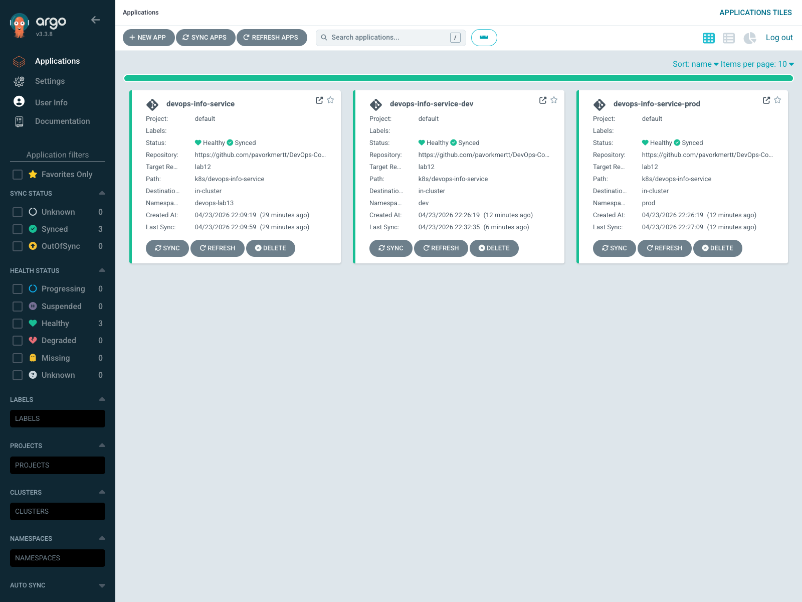
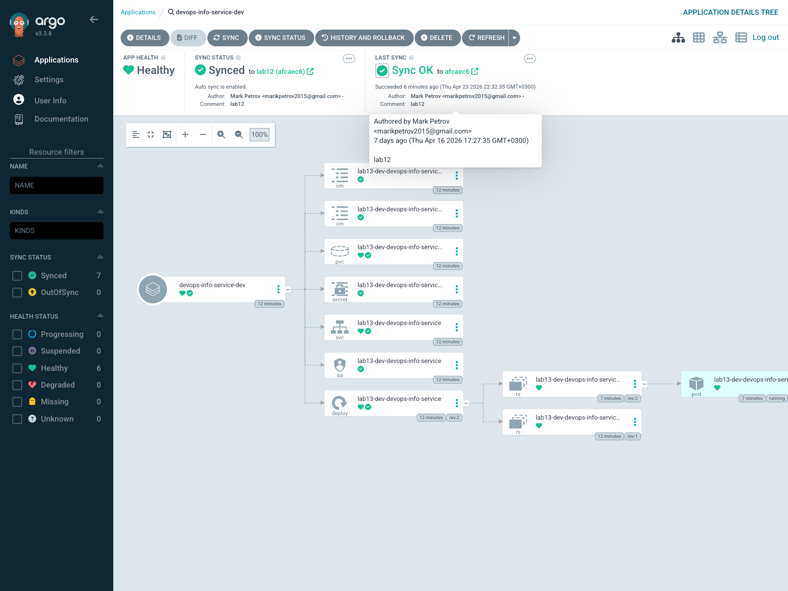

# Lab 13 — GitOps with ArgoCD

I completed Lab 13 on the local `kind-lab9` cluster and prepared the bonus `ApplicationSet` implementation in the repository.

Files added for this lab:

- `k8s/argocd/install-values.yaml`
- `k8s/argocd/namespaces.yaml`
- `k8s/argocd/application.yaml`
- `k8s/argocd/application-dev.yaml`
- `k8s/argocd/application-prod.yaml`
- `k8s/argocd/applicationset.yaml`

Files updated for environment-specific behavior:

- `k8s/devops-info-service/values-dev.yaml`
- `k8s/devops-info-service/values-prod.yaml`

Environment differences used in this lab:

- `dev`: `replicaCount: 1`, `NodePort: 30090`
- `prod`: `replicaCount: 2`, `NodePort: 30091`

Because I was asked not to create any new Git commits during this workflow, the ArgoCD source still points to the already existing remote `lab12` branch. To keep the live validation aligned with the local Lab 13 work, the `Application` manifests also include inline Helm overrides for `replicaCount` and `service.nodePort`.

## 1. ArgoCD Setup

### Installation

I installed ArgoCD from the Helm chart repository with the repo-local values file:

```text
k8s/argocd/install-values.yaml
```

The install values keep the server internal and make local port-forward access simpler:

```yaml
configs:
  params:
    server.insecure: true

server:
  service:
    type: ClusterIP
```

Installation command:

```bash
helm repo add argo https://argoproj.github.io/argo-helm
helm repo update

kubectl create namespace argocd

helm upgrade --install argocd argo/argo-cd \
  -n argocd \
  --wait \
  -f k8s/argocd/install-values.yaml
```

Verification:

```bash
kubectl get pods -n argocd
```

Result at the end of validation:

```text
argocd-application-controller-0                     1/1 Running
argocd-applicationset-controller-68856dfdb9-x9md2  1/1 Running
argocd-dex-server-8559c4bc8f-k4q7n                 1/1 Running
argocd-notifications-controller-568ff4879-wttfr    1/1 Running
argocd-redis-fcd76bcfb-zfhrk                       1/1 Running
argocd-repo-server-8579bbc89c-xfbzc                1/1 Running
argocd-server-68646cfd69-pr9kg                     1/1 Running
```

### UI access

I used local port-forward access:

```bash
kubectl port-forward svc/argocd-server -n argocd 8080:80
```

Initial admin password retrieval:

```bash
kubectl -n argocd get secret argocd-initial-admin-secret \
  -o jsonpath="{.data.password}" | base64 -d && echo
```

UI endpoint:

```text
http://localhost:8080
```

Username:

```text
admin
```

### CLI installation and login

I installed the CLI with Homebrew and verified it:

```bash
brew install argocd
argocd version --client
```

Observed client version:

```text
argocd: v3.3.8
```

For the insecure/plaintext local setup, the working login command is:

```bash
argocd login dummy \
  --port-forward \
  --port-forward-namespace argocd \
  --plaintext \
  --username admin
```

This is the important detail for this setup: `--plaintext` is required because the server is intentionally running without TLS behind the local port-forward.

CLI verification:

```bash
argocd app list --port-forward --port-forward-namespace argocd --plaintext
```

Result after full setup:

```text
argocd/devops-info-service       ... STATUS Synced HEALTH Healthy SYNCPOLICY Manual
argocd/devops-info-service-dev   ... STATUS Synced HEALTH Healthy SYNCPOLICY Auto-Prune
argocd/devops-info-service-prod  ... STATUS Synced HEALTH Healthy SYNCPOLICY Manual
```

## 2. Application Deployment

### Single Application manifest

The initial manual-sync application is:

```text
k8s/argocd/application.yaml
```

It deploys the Helm chart from:

- repo: `https://github.com/pavorkmertt/DevOps-Core-Course.git`
- revision: `lab12`
- path: `k8s/devops-info-service`
- namespace: `devops-lab13`

Apply command:

```bash
kubectl apply -f k8s/argocd/application.yaml
```

Manual sync:

```bash
argocd app sync devops-info-service \
  --port-forward \
  --port-forward-namespace argocd \
  --plaintext
```

Observed final status:

```text
devops-info-service -> Synced / Healthy
```

Resource verification:

```bash
kubectl get all,pvc,cm,secret -n devops-lab13
```

Observed resources included:

- Deployment
- Service
- PVC
- ConfigMaps
- Secret
- ServiceAccount
- Helm hook Jobs

I also verified the application through a local port-forward:

```bash
kubectl port-forward svc/lab13-devops-info-service -n devops-lab13 18080:80
curl http://127.0.0.1:18080/
```

The service returned the expected JSON response from the Python app.

## 3. Multi-Environment Deployment

### Namespaces

The namespaces are declared in:

```text
k8s/argocd/namespaces.yaml
```

Apply command:

```bash
kubectl apply -f k8s/argocd/namespaces.yaml
```

### Development application

File:

```text
k8s/argocd/application-dev.yaml
```

Behavior:

- namespace: `dev`
- values file: `values-dev.yaml`
- Helm release: `lab13-dev`
- auto-sync enabled
- `prune: true`
- `selfHeal: true`
- inline Helm override keeps `NodePort: 30090`

### Production application

File:

```text
k8s/argocd/application-prod.yaml
```

Behavior:

- namespace: `prod`
- values file: `values-prod.yaml`
- Helm release: `lab13-prod`
- manual sync
- inline Helm override keeps `NodePort: 30091`

### Final environment verification

CLI/cluster checks:

```bash
kubectl get deploy,svc -n dev
kubectl get deploy,svc -n prod
kubectl get applications -n argocd -o wide
```

Observed final state:

```text
dev:
deployment.apps/lab13-dev-devops-info-service   1/1 available
service/lab13-dev-devops-info-service           NodePort 80:30090/TCP

prod:
deployment.apps/lab13-prod-devops-info-service  2/2 available
service/lab13-prod-devops-info-service          NodePort 80:30091/TCP
```

This confirms the required environment difference:

- `dev` runs 1 replica
- `prod` runs 2 replicas

### Why dev is automated and prod is manual

- `dev` should apply source-of-truth changes quickly during iteration.
- `dev` is the right place to demonstrate self-healing and pruning.
- `prod` should keep an approval step before deployment.
- manual production sync reduces accidental rollout risk.

## 4. Self-Healing and Drift Evidence

### 4.1 Manual scale drift in `dev`

I manually changed the deployment from the Git-defined 1 replica to 5 replicas.

Command:

```bash
kubectl scale deployment lab13-dev-devops-info-service -n dev --replicas=5
```

Observed evidence:

```text
SCALE2_START=2026-04-23 22:32:34 MSK
poll 01 22:32:35 replicas=5/1 app="Synced Healthy"
poll 02 22:32:41 replicas=1/1 app="Synced Healthy"
SCALE2_END=2026-04-23 22:32:41 MSK
```

Conclusion:

- the live cluster drifted immediately after the manual scale
- ArgoCD self-heal restored the deployment to `1/1`
- recovery took about 7 seconds in this local cluster

### 4.2 Pod deletion test in `dev`

This test demonstrates Kubernetes self-healing rather than ArgoCD reconciliation.

Command:

```bash
kubectl delete pod -n dev <pod-name>
```

Observed evidence:

```text
POD2_START=2026-04-23 22:32:56 MSK old_pod=lab13-dev-devops-info-service-9fdb7587f-6p4dl
POD2_END=2026-04-23 22:33:07 MSK new_pod=lab13-dev-devops-info-service-9fdb7587f-7mvwp
```

Conclusion:

- Kubernetes recreated the missing pod with a new pod name
- this is ReplicaSet/Deployment behavior
- ArgoCD was not required for this recovery

### 4.3 Configuration drift test in `dev`

For a clear desired-state drift, I changed the Deployment image away from the Helm-rendered value:

```bash
kubectl set image deployment/lab13-dev-devops-info-service \
  -n dev \
  devops-info-service=nginx:1.27
```

Observed evidence:

```text
IMAGE_DRIFT_START=2026-04-23 22:39:13 MSK
patched image: nginx:1.27
poll 01 22:39:14 image=devops-info-service:lab12-python app="Synced Healthy"
IMAGE_DRIFT_END=2026-04-23 22:39:14 MSK
```

Conclusion:

- the Deployment spec was changed manually
- ArgoCD immediately restored the Helm-defined image `devops-info-service:lab12-python`
- this is ArgoCD self-healing of configuration drift, not Kubernetes pod recreation

### 4.4 Sync interval

The ArgoCD Helm chart defaults expose these reconciliation settings in `argocd-cm`:

- `timeout.reconciliation: 120s`
- `timeout.reconciliation.jitter: 60s`

That means Git polling happens roughly every 2-3 minutes by default.

In practice there are two different behaviors:

- Git change detection relies on the reconciliation interval or webhooks.
- Live-state self-heal for an automated app can happen much faster when ArgoCD notices drift on managed resources.

In this lab I observed fast local self-heal on Deployment drift, while the documented Git polling interval still remains the default 120s plus jitter.

## 5. Screenshots

Applications overview showing the installed apps and sync/health state:



Development application details page:



Screenshot files:

- `k8s/screenshots/lab13/argocd-applications.png`
- `k8s/screenshots/lab13/argocd-dev-details.png`

## 6. Bonus Task — ApplicationSet

The bonus implementation is in:

```text
k8s/argocd/applicationset.yaml
```

It uses the `List` generator and produces one generated application per environment.

Parameters supplied per generated application:

- `env`
- `namespace`
- `valuesFile`
- `releaseName`
- `autoSync`
- `replicaCount`
- `serviceType`
- `nodePort`

Why this is useful:

- one template controls repeated application definitions
- less duplication than separate per-environment manifests
- easier future scaling to more environments
- shared repo/path/destination logic stays centralized

Generator guidance:

- `List`: best for a known set of environments
- `Git`: best when discovery is driven by repo structure
- `Matrix` / `Merge`: best for combining dimensions such as app x environment

Important operational note:

- the `ApplicationSet` is an alternative to the individual `Application` manifests
- it should not be applied alongside the individually managed `dev` and `prod` apps when they target the same Helm releases and namespaces

Apply example:

```bash
kubectl apply -f k8s/argocd/applicationset.yaml
kubectl get applications -n argocd
```

Generated names:

- `devops-info-service-generated-dev`
- `devops-info-service-generated-prod`

## 7. Validation Summary

Helm validation:

```bash
helm lint k8s/devops-info-service -f k8s/devops-info-service/values.yaml
helm lint k8s/devops-info-service -f k8s/devops-info-service/values-dev.yaml
helm lint k8s/devops-info-service -f k8s/devops-info-service/values-prod.yaml
```

Result:

```text
1 chart linted, 0 chart failed
```

Server-side manifest validation after ArgoCD CRDs were installed:

```bash
kubectl apply --dry-run=server -f k8s/argocd/application.yaml
kubectl apply --dry-run=server -f k8s/argocd/application-dev.yaml
kubectl apply --dry-run=server -f k8s/argocd/application-prod.yaml
kubectl apply --dry-run=server -f k8s/argocd/applicationset.yaml
```

All four manifests passed server-side validation.
