# Lab 13 — GitOps with ArgoCD

## 1. ArgoCD Setup

### Installation

ArgoCD установлен через Helm в namespace `argocd`:

```bash
helm repo add argo https://argoproj.github.io/argo-helm
helm repo update
kubectl create namespace argocd
helm install argocd argo/argo-cd --namespace argocd
kubectl wait --for=condition=ready pod -l app.kubernetes.io/name=argocd-server -n argocd --timeout=300s
```

Все 7 подов ArgoCD запущены:
- argocd-application-controller
- argocd-applicationset-controller
- argocd-dex-server
- argocd-notifications-controller
- argocd-redis
- argocd-repo-server
- argocd-server

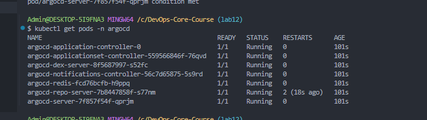

### UI Access

Port-forward к ArgoCD server (порт 8090, т.к. 8080 был занят):
```bash
kubectl port-forward svc/argocd-server -n argocd 8090:443
```

Получение initial admin password:
```bash
kubectl -n argocd get secret argocd-initial-admin-secret -o jsonpath="{.data.password}" | base64 -d
```

UI доступен по адресу `https://localhost:8090`, логин `admin`.

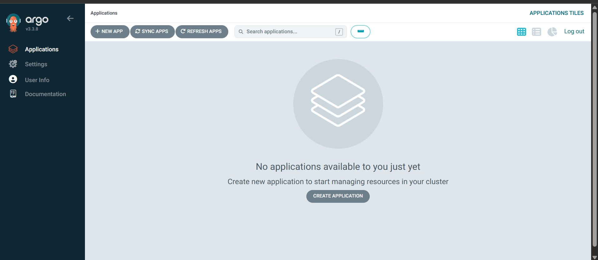

### CLI Configuration

ArgoCD CLI v3.3.8 установлен, логин выполнен:
```powershell
argocd login localhost:8090 --insecure --username admin --password <initial-password>
argocd app list
```

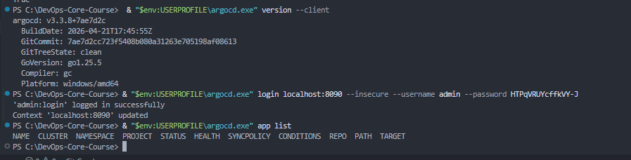

---

## 2. Application Configuration

### Application манифест

Файл: `k8s/argocd/application.yaml`

```yaml
apiVersion: argoproj.io/v1alpha1
kind: Application
metadata:
  name: info-service
  namespace: argocd
spec:
  project: default
  source:
    repoURL: https://github.com/TurikRoma/DevOps-Core-Course.git
    targetRevision: lab13
    path: k8s/info-service
    helm:
      valueFiles:
        - values.yaml
  destination:
    server: https://kubernetes.default.svc
    namespace: default
  syncPolicy:
    syncOptions:
      - CreateNamespace=true
```

Ключевые параметры:
- **source.repoURL** — репозиторий с Helm-чартом
- **targetRevision** — ветка `lab13`
- **path** — путь к Helm-чарту (`k8s/info-service`)
- **valueFiles** — `values.yaml` для базовой конфигурации
- **syncPolicy** — manual sync (отсутствие блока `automated`)

### Первый деплой

Применение манифеста:
```bash
kubectl apply -f k8s/argocd/application.yaml
```

До первого sync приложение в статусе **OutOfSync / Missing**:

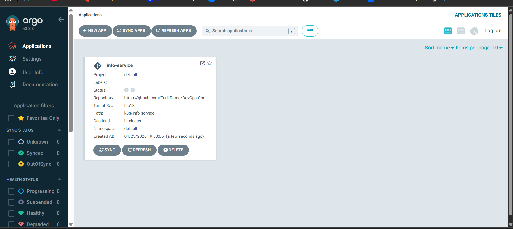

### Первый Sync

```bash
argocd app sync info-service
```

Sync прошёл за 54 секунды, все ресурсы созданы (Deployment, Service, ConfigMaps, Secret, PVC, PreSync Job, PostSync Job):

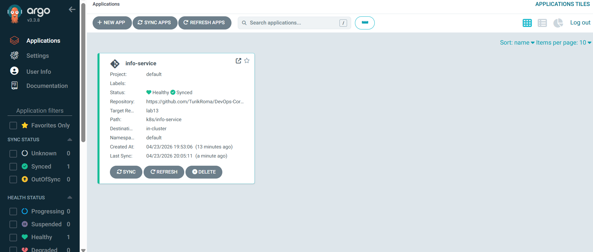

Детальный вид приложения с деревом ресурсов (все ресурсы Healthy + Synced):

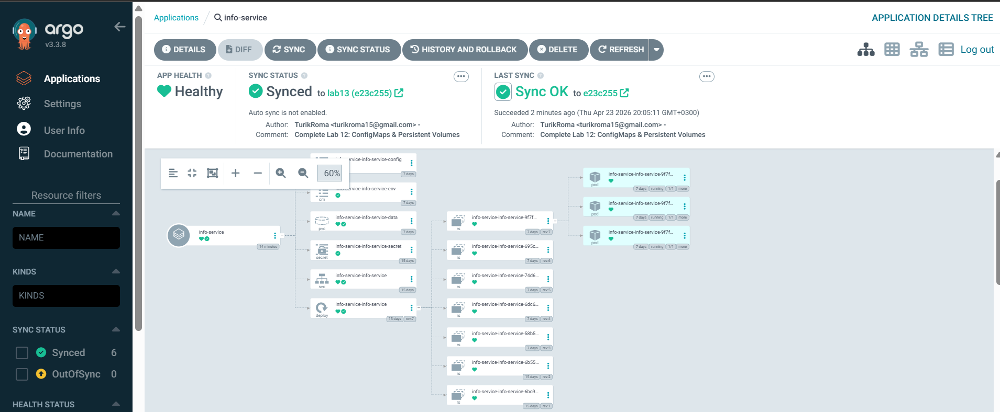

Приложение доступно через port-forward:
```bash
kubectl port-forward svc/info-service-info-service -n default 5000:80
```

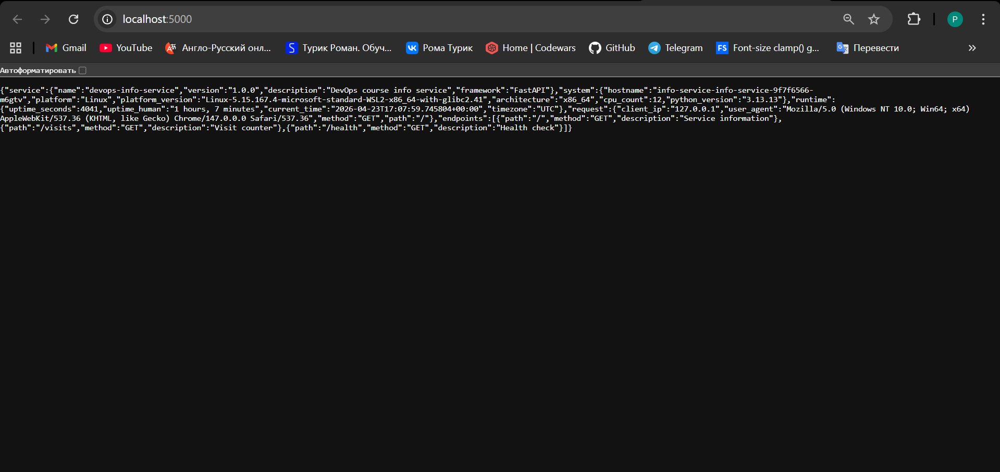

### GitOps Workflow Test (Drift Detection)

Изменили `replicaCount` в `values.yaml` с 3 на 2, закоммитили и запушили в Git. ArgoCD автоматически обнаружил drift:

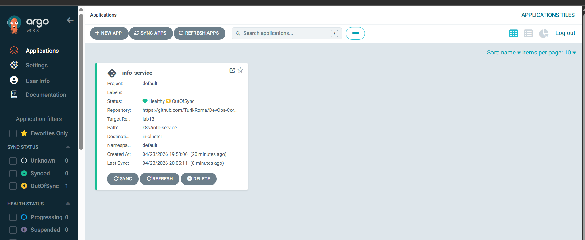

После ручного sync количество подов в кластере соответствует Git (2 пода):

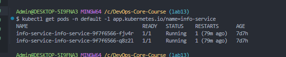

---

## 3. Multi-Environment Deployment

### Namespaces

Созданы отдельные namespaces для dev и prod:
```bash
kubectl create namespace dev
kubectl create namespace prod
```

### Dev Application (auto-sync)

Файл: `k8s/argocd/application-dev.yaml`

Ключевые отличия от prod:
- **values-dev.yaml** — replicaCount: 1, минимальные resources, NodePort service (30081)
- **syncPolicy.automated** — включены `prune: true` и `selfHeal: true`
- Namespace: `dev`

```yaml
syncPolicy:
  automated:
    prune: true
    selfHeal: true
  syncOptions:
    - CreateNamespace=true
```

### Prod Application (manual sync)

Файл: `k8s/argocd/application-prod.yaml`

Ключевые отличия от dev:
- **values-prod.yaml** — replicaCount: 5, больше resources (CPU 500m, RAM 512Mi), LoadBalancer service
- **syncPolicy БЕЗ `automated`** — только manual sync
- Namespace: `prod`

### Почему prod manual?

- **Контроль релизов** — deploy только после явного одобрения
- **Safety** — случайный push не попадёт сразу в prod
- **Compliance** — аудит развёртываний
- **Rollback planning** — время на подготовку отката

### Оба окружения запущены

Все три приложения в UI (info-service, info-service-dev, info-service-prod):

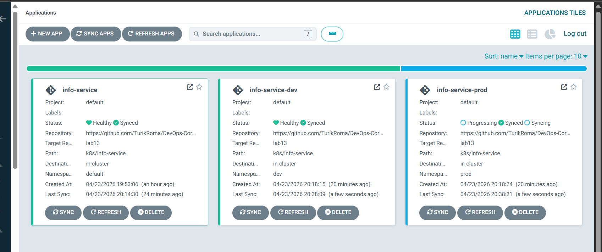

Поды в dev (1 реплика) и prod (5 реплик):

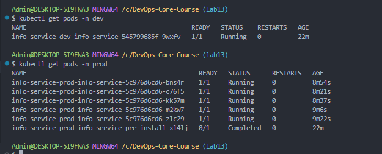

---

## 4. Self-Healing Evidence

### Test 1 — Scale (ArgoCD Self-Healing)

Вручную масштабировали deployment в dev до 5 реплик:
```bash
kubectl scale deployment info-service-dev-info-service -n dev --replicas=5
```

**Наблюдение:**
- Сразу после scale — 5 подов (1 Running + 4 ContainerCreating)
- Через ~30 секунд ArgoCD обнаружил drift (в Git `replicaCount: 1`)
- SelfHeal откатил — 4 пода в `Terminating`, остался 1 Running
- Итог: Deployment восстановлен к состоянию из Git (1 реплика)

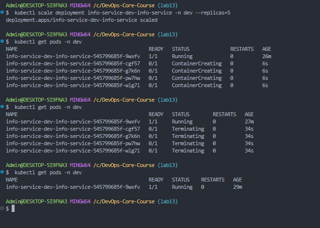

### Test 2 — Pod Deletion (Kubernetes Self-Healing)

```bash
kubectl delete pod -n dev -l app.kubernetes.io/name=info-service
```

**Наблюдение:**
- Под удалён
- Мгновенно (в течение 1-2 секунд) K8s ReplicaSet создал новый под с тем же label selector
- **Это НЕ ArgoCD** — это штатное поведение Kubernetes (ReplicaSet controller)

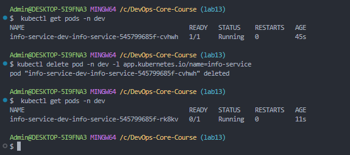

### Test 3 — Configuration Drift (Label Change)

Попытка изменить tracked label:
```bash
kubectl label deployment info-service-dev-info-service -n dev app.kubernetes.io/version=drifted --overwrite
```

**Наблюдение:**
- ArgoCD обнаружил drift (`Sync Status: OutOfSync`)
- SelfHeal откатил значение label в течение секунд (с `drifted` обратно на `1.0`)
- При тестировании через CLI проверка `kubectl get deployment ... -o jsonpath` сразу после изменения уже показывала `1.0` — настолько быстро сработал selfHeal

**Важное замечание:** добавление **нового** label (которого нет в манифесте Helm-чарта) ArgoCD **не** считает дрифтом — он трекает только поля, объявленные в источнике. Для демонстрации drift необходимо менять значения существующих полей.

### Ключевые различия

| Аспект | Kubernetes Self-Healing | ArgoCD Self-Healing |
|--------|-------------------------|---------------------|
| **Что отслеживает** | Количество подов (ReplicaSet) | Соответствие spec'а Git-манифесту |
| **Триггер** | Удаление/падение пода | Drift в kubernetes spec |
| **Скорость реакции** | Моментально (< 1 сек) | ~30 сек (зависит от polling interval) |
| **Обязательное условие** | Работающий ReplicaSet/Deployment | `syncPolicy.automated.selfHeal: true` |
| **Источник истины** | Текущий spec deployment в кластере | Git-репозиторий |

### Sync Interval

По умолчанию ArgoCD опрашивает Git **каждые 3 минуты**. Ускорение:
- Webhook от GitHub — моментальный trigger
- Ручной refresh через CLI/UI: `argocd app get <name> --hard-refresh`
- Manual sync: `argocd app sync <name>`

---

## Файловая структура

```
k8s/
├── argocd/
│   ├── application.yaml         # Основное приложение (manual sync, values.yaml)
│   ├── application-dev.yaml     # Dev (auto-sync, values-dev.yaml)
│   └── application-prod.yaml    # Prod (manual sync, values-prod.yaml)
├── info-service/                # Helm-чарт (из Lab 10-12)
│   ├── Chart.yaml
│   ├── values.yaml              # Базовый (3 реплики, NodePort, latest)
│   ├── values-dev.yaml          # Dev (1 реплика, NodePort 30081, latest)
│   ├── values-prod.yaml         # Prod (5 реплик, LoadBalancer, latest)
│   └── templates/
└── docs/screenshots/lab13/      # Все скриншоты (01-13)
```

---

## Ссылки

- [ArgoCD Documentation](https://argo-cd.readthedocs.io/)
- [Application Specification](https://argo-cd.readthedocs.io/en/stable/operator-manual/declarative-setup/)
- [Sync Policies](https://argo-cd.readthedocs.io/en/stable/user-guide/auto_sync/)
- [Self-Heal](https://argo-cd.readthedocs.io/en/stable/user-guide/auto_sync/#automatic-self-healing)
