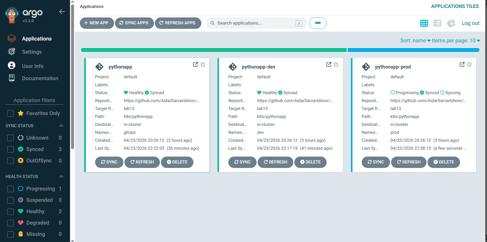
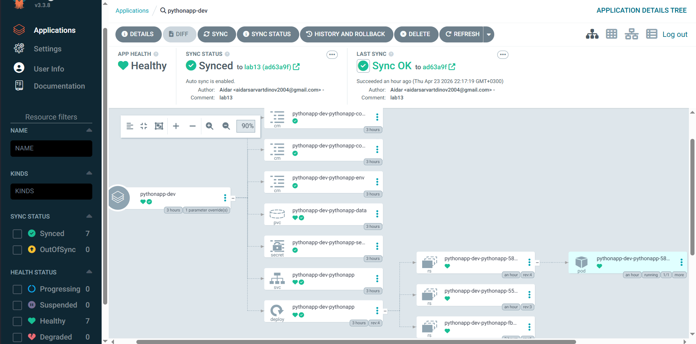

# ArgoCD Setup

## 1) ArgoCD Setup

- Installation: Helm chart `argo/argo-cd` in the `argocd` namespace.
- UI access: `kubectl port-forward svc/argocd-server -n argocd 8080:443` -> `https://localhost:8080`.
- CLI: `C:\Program Files\argocd\argocd.exe`.

Commands and output:

```bash
helm upgrade --install argocd argo/argo-cd --namespace argocd
kubectl get pods -n argocd
```

```text
NAME                                                READY   STATUS    RESTARTS   AGE
argocd-application-controller-0                     1/1     Running   0          2m4s
argocd-applicationset-controller-559566846f-c5lxp   1/1     Running   0          2m4s
argocd-dex-server-8f5687997-7pffd                   1/1     Running   0          2m4s
argocd-notifications-controller-56c7d65875-g2g5f    1/1     Running   0          2m4s
argocd-redis-fcd76bcfb-46mtg                        1/1     Running   0          2m4s
argocd-repo-server-7b8447858f-kmmp2                 1/1     Running   0          2m4s
argocd-server-7f857f54f-47prc                       1/1     Running   0          2m4s
```

```bash
kubectl -n argocd get secret argocd-initial-admin-secret -o jsonpath="{.data.password}"
```

```text
NVZkdW16d1FrMUQ5Rm9WbA==
```

```bash
& "C:/Program Files/argocd/argocd.exe" login localhost:8080 --insecure --username admin --password "<password>"
& "C:/Program Files/argocd/argocd.exe" account get-user-info
```

```text
'admin:login' logged in successfully
Context 'localhost:8080' updated
Logged In: true
Username: admin
```

## 2) Application Configuration

Manifests:

- `k8s/argocd/application.yaml` (manual sync, namespace `gitops`)
- `k8s/argocd/application-dev.yaml` (auto-sync + `selfHeal` + `prune`, namespace `dev`)
- `k8s/argocd/application-prod.yaml` (manual sync, namespace `prod`)

Source / destination:

- `repoURL`: `https://github.com/AidarSarvartdinov/DevOps-Core-Course.git`
- `targetRevision`: `lab13`
- `path`: `k8s/pythonapp`
- values:
  - base: `values-dev.yaml` + `service.nodePort=30081`, `image.tag=latest`
  - dev: `values-dev.yaml` + `service.nodePort=30082`
  - prod: `values-prod.yaml` + `image.tag=latest`

Commands and output:

```bash
kubectl apply -f k8s/argocd/application.yaml -f k8s/argocd/application-dev.yaml -f k8s/argocd/application-prod.yaml
& "C:/Program Files/argocd/argocd.exe" app list
```

```text
application.argoproj.io/pythonapp configured
application.argoproj.io/pythonapp-dev configured
application.argoproj.io/pythonapp-prod configured

NAME                   CLUSTER                         NAMESPACE  PROJECT  STATUS  HEALTH       SYNCPOLICY
argocd/pythonapp       https://kubernetes.default.svc  gitops     default  Synced  Healthy      Manual
argocd/pythonapp-dev   https://kubernetes.default.svc  dev        default  Synced  Healthy      Auto-Prune
argocd/pythonapp-prod  https://kubernetes.default.svc  prod       default  Synced  Progressing  Manual
```

## 3) Multi-Environment

Namespaces:

```bash
kubectl create namespace dev
kubectl create namespace prod
```

Dev/prod differences:

- dev: auto-sync (`automated`, `prune`, `selfHeal`), `replicaCount: 1`, `NodePort`.
- prod: manual sync, `replicaCount: 5`, `LoadBalancer`.
- namespace separation: `dev` and `prod`.

Verification:

```bash
kubectl get pods -n dev
kubectl get pods -n prod
```

```text
dev:
pythonapp-dev-pythonapp-588d66dcc9-wnfhc   1/1 Running

prod:
pythonapp-prod-pythonapp-874495784-9fxz9   1/1 Running
pythonapp-prod-pythonapp-874495784-dqmpz   1/1 Running
pythonapp-prod-pythonapp-874495784-hzgf2   1/1 Running
pythonapp-prod-pythonapp-874495784-llbhs   1/1 Running
pythonapp-prod-pythonapp-874495784-t6b26   1/1 Running
```

Why prod is manual:

- release control before deployment;
- explicit sync after change validation.
- note: in local `minikube`, `pythonapp-prod` can show `Progressing` while still being `Synced` because `Service` type `LoadBalancer` may not get an external IP immediately.

## 4) Self-Healing Evidence

### 4.1 Manual scale drift (ArgoCD self-heal)

```bash
kubectl get deployment -n dev pythonapp-dev-pythonapp -o jsonpath="{.spec.replicas}"
kubectl scale deployment pythonapp-dev-pythonapp -n dev --replicas=5
kubectl get deployment -n dev pythonapp-dev-pythonapp -o jsonpath="{.spec.replicas}"
```

```text
1
deployment.apps/pythonapp-dev-pythonapp scaled
1
```

ArgoCD reverted replicas back to the Git-defined value.

### 4.2 Pod deletion test (Kubernetes self-heal)

```bash
kubectl delete pod -n dev -l app.kubernetes.io/instance=pythonapp-dev
kubectl get pods -n dev
```

```text
pod "pythonapp-dev-pythonapp-588d66dcc9-rvdgc" deleted from dev namespace
pythonapp-dev-pythonapp-588d66dcc9-wnfhc   1/1 Running
```

The pod was recreated by Deployment/ReplicaSet controllers.

### 4.3 Configuration drift (managed field)

```bash
kubectl get deployment -n dev pythonapp-dev-pythonapp -o jsonpath="{.spec.template.spec.containers[0].image}"
kubectl set image deployment/pythonapp-dev-pythonapp -n dev pythonapp=nginx:1.27
kubectl get deployment -n dev pythonapp-dev-pythonapp -o jsonpath="{.spec.template.spec.containers[0].image}"
```

```text
aidarsarvartdinov/pythonapp:latest
deployment.apps/pythonapp-dev-pythonapp image updated
aidarsarvartdinov/pythonapp:latest
```

ArgoCD automatically reverted the image to the Git state.

### 4.4 Sync behavior

- Kubernetes self-healing: restores pods/replicas based on Deployment spec.
- ArgoCD self-healing: restores resource configuration to the Git state.
- ArgoCD sync triggers: manual sync, auto-sync policy, detected drift.
- Default polling interval: about 3 minutes (or faster with webhooks/manual sync).

## 5) Screenshots

Applications list (statuses visible):



Application details view (`pythonapp-dev`):



