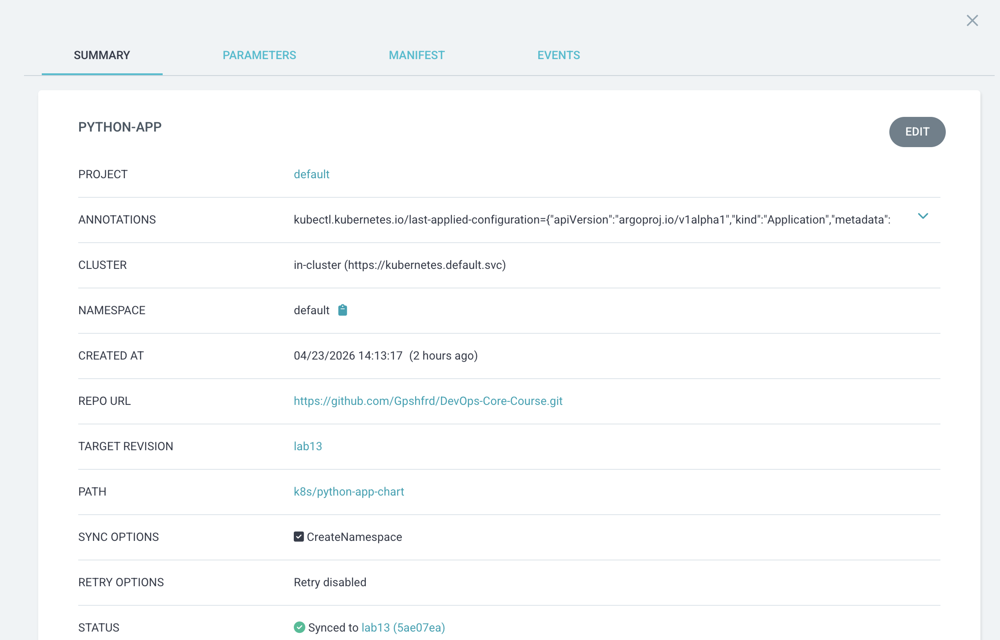

# Lab 13 — GitOps with ArgoCD

## ArgoCD Setup

### Installation Verification
ArgoCD was installed via kubectl using the core manifests from the official repository due to network limitations with Helm repositories.


**Verification — All Pods Running**


### UI Access Method
```bash
# Port forward to access ArgoCD UI
% kubectl port-forward svc/argocd-server -n argocd 8080:80

# Retrieve admin password
% kubectl -n argocd get secret argocd-initial-admin-secret -o jsonpath="{.data.password}" | base64 -d
```


### CLI Configuration
```bash
# Install CLI
brew install argocd

# Login to ArgoCD server
argocd login localhost:8080 --insecure --username admin
```

## Application Configuration

### Application Manifest

`k8s/argocd/application.yaml`
```
apiVersion: argoproj.io/v1alpha1
kind: Application
metadata:
  name: python-app
  namespace: argocd
spec:
  project: default
  source:
    repoURL: https://github.com/Gpshfrd/DevOps-Core-Course.git
    targetRevision: main
    path: k8s/python-app-chart
    helm:
      valueFiles:
        - values.yaml
  destination:
    server: https://kubernetes.default.svc
    namespace: default
  syncPolicy:
    syncOptions:
      - CreateNamespace=true
```

### Source and Destination Configuration
| Field	| Value |
|-------|-------|
|repoURL |	https://github.com/Gpshfrd/DevOps-Core-Course.git |
| targetRevision |	lab13 |
| path |	k8s/python-app-chart |
| destination.server |	https://kubernetes.default.svc |
| destination.namespace	| default |

### Values File Selection
The Helm chart uses `values.yaml` as the default configuration file, specified under `source.helm.valueFiles`.

## Multi-Environment
### Dev vs Prod Configuration Differences
Dev Configuration (`values-dev.yaml`):
```yaml
replicaCount: 1

image:
  repository: python
  tag: 3.9-slim
  pullPolicy: IfNotPresent

service:
  type: ClusterIP
  port: 80

resources:
  limits:
    cpu: 500m
    memory: 512Mi
  requests:
    cpu: 250m
    memory: 256Mi

environment: development
```

Prod Configuration (`values-prod.yaml`):
```yaml
replicaCount: 3

image:
  repository: python
  tag: 3.9-slim
  pullPolicy: IfNotPresent

service:
  type: ClusterIP
  port: 80

resources:
  limits:
    cpu: 1000m
    memory: 1Gi
  requests:
    cpu: 500m
    memory: 512Mi

environment: production
ingress:
  enabled: true
  host: app.example.com

```

## Sync Policy Differences and Rationale
| Environment |	Sync Policy |	SelfHeal |	Prune |	Rationale |
| ---- | ---- | ---- | ---- | ---- |
| Dev |	Automated	| Enabled	| Enabled |	Fast feedback, automatic updates, no manual intervention |
| Prod	| Manual	| Disabled	| Disabled |	Change review, controlled release timing, compliance requirements |

### Dev Application (application-dev.yaml) — Auto-Sync:

```yaml
apiVersion: argoproj.io/v1alpha1
kind: Application
metadata:
  name: python-app-dev
  namespace: argocd
spec:
  project: default
  source:
    repoURL: https://github.com/Gpshfrd/DevOps-Core-Course.git
    targetRevision: lab13
    path: k8s/python-app-chart
    helm:
      valueFiles:
        - values-dev.yaml
  destination:
    server: https://kubernetes.default.svc
    namespace: dev
  syncPolicy:
    automated:
      prune: true
      selfHeal: true
    syncOptions:
      - CreateNamespace=true
```

```yaml

apiVersion: argoproj.io/v1alpha1
kind: Application
metadata:
  name: python-app-prod
  namespace: argocd
spec:
  project: default
  source:
    repoURL: https://github.com/Gpshfrd/DevOps-Core-Course.git
    targetRevision: lab13
    path: k8s/python-app-chart
    helm:
      valueFiles:
        - values-prod.yaml
  destination:
    server: https://kubernetes.default.svc
    namespace: prod
  syncPolicy:
    syncOptions:
      - CreateNamespace=true
  # No automated block -> manual sync
```

### Namespace Separation
```bash
% kubectl get ns dev prod
NAME   STATUS   AGE
dev    Active   25m
prod   Active   25m
```
Dev application → `dev` namespace

Prod application → `prod` namespace

Default application → `default` namespace

## Self-Healing Evidence
### Manual Scale Test (Before/After)
**Before: 1 replica (as defined in Git):**

```bash
% kubectl get deployment -n dev
NAME                              READY   UP-TO-DATE   AVAILABLE   AGE
python-app-dev-python-app         1/1     1            1           15m

% kubectl get pods -n dev | grep python-app-dev | wc -l
1
```

**Manual scale command:**
```bash
% kubectl scale deployment python-app-dev-python-app -n dev --replicas=5
deployment.apps/python-app-dev-python-app scaled
```

**After scale — 5 replicas:**
```bash
% kubectl get pods -n dev | grep python-app-dev | wc -l
5
```

**After self-healing (30-60 seconds) — Reverted to 1 replica:**
```bash
% kubectl get deployment -n dev
NAME                              READY   UP-TO-DATE   AVAILABLE   AGE
python-app-dev-python-app         1/1     1            1           16m

% kubectl get pods -n dev | grep python-app-dev | wc -l
1
```

### Pod Deletion Test
**Delete a pod manually:**
```bash
% kubectl delete pod python-app-dev-python-app-7575d84f8f-j5xz5 -n dev
pod "python-app-dev-python-app-7575d84f8f-j5xz5" deleted
```

**Kubernetes recreates it immediately:**
``` bash
$ kubectl get pods -n dev
NAME                                          READY   STATUS    RESTARTS   AGE
python-app-dev-python-app-7575d84f8f-abcde    1/1     Running   0          2s
```

### Configuration Drift Test
**Add manual label to deployment:**

```bash
% kubectl label deployment python-app-dev-python-app -n dev test=manual --overwrite
deployment.apps/python-app-dev-python-app labeled
```

**ArgoCD detects drift:**

```bash
% argocd app diff python-app-dev
===== apps/Deployment dev/python-app-dev-python-app ======
@@ -61,0 +62,1 @@
+  test: manual
```

**After self-healing — label removed:**

```bash
% kubectl get deployment python-app-dev-python-app -n dev -o yaml | grep test
# No output — label has been removed
```

### Explanation of Behaviors
| Behavior	| Trigger	| Response	| Timeframe |
| --------- | ------- | --------- | --------- |
| Kubernetes Self-Healing	| Pod deletion or crash	 | ReplicaSet recreates pod	| Immediate (< 5 seconds) |
| ArgoCD Self-Healing	| Configuration drift from Git	| Syncs to match Git state	| Within sync interval (3 minutes) |

**Key Difference:**
- Kubernetes maintains desired pod count (ReplicaSet controller)
- ArgoCD maintains desired configuration state (Git as source of truth)

## Screenshots



