# Lab 13 — GitOps with ArgoCD

## 1. ArgoCD Setup

### Installation verification
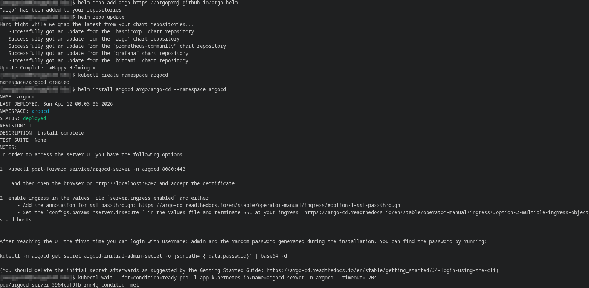
ArgoCD was installed into the argocd namespace via the Helm chart `argo/argo-cd`, and component status checks confirmed that the main pods were installed correctly.

### UI access method
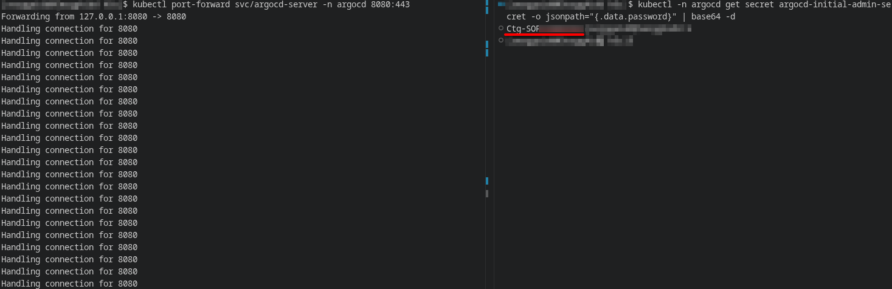
Access to the ArgoCD web interface was established via `port-forward` to the `argocd-server` service. Afterwards, the initial administrator password was obtained and the UI was logged in at `localhost:8080`.

### CLI configuration

The `argocd` CLI was installed locally and used to authorize and manage applications.

---

## 2. Application Configuration
### Application manifests
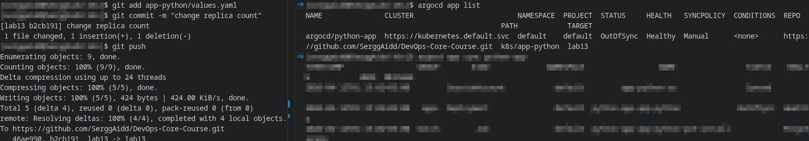
The following manifests were created for working with ArgoCD:
- `k8s/argocd/application.yaml` — the base application in the `default` namespace
- `k8s/argocd/application-dev.yaml` — the `dev` environment
- `k8s/argocd/application-prod.yaml` — the `prod` environment

### Source and destination configuration
All Application manifests used the following sources:
- Git repository `https://github.com/SerggAidd/DevOps-Core-Course.git`
- Branch `lab13`
- Helm chart `k8s/app-python`

**Purpose of applications:**
- `python-app` - namespace `default`
- `python-app-dev` - namespace `dev`
- `python-app-prod` - namespace `prod`

### Values file selection
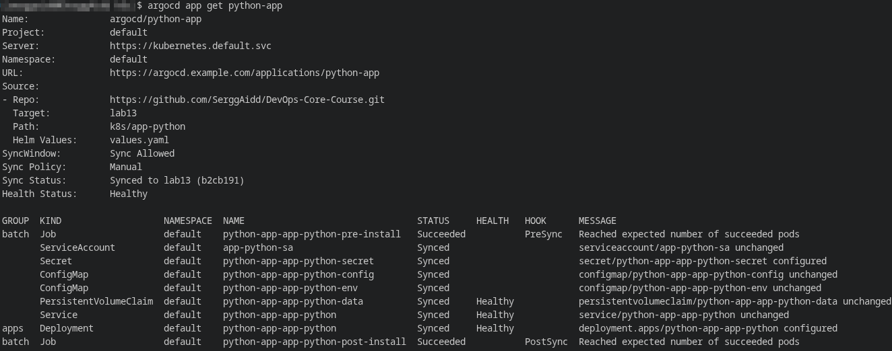
Different values ​​files were used for different environments:
- `values.yaml` — base environment
- `values-dev.yaml` — development environment
- `values-prod.yaml` — production environment

The base application `python-app` used `values.yaml` and was manually synced. After the first use, the application was visible in ArgoCD, then an initial sync was performed. After changing the `replicaCount` in Git, ArgoCD recorded the `OutOfSync` state; after a manual sync, the application returned to `Synced/Healthy`.

---

## 3. Multi-Environment

### Dev vs Prod configuration differences
Separate values ​​files were prepared for the environments.

#### Dev
- `replicaCount: 1`
- `service.type: NodePort`
- `nodePort: 30081`
- reduced requests/limits
- `debug: True`
- `releaseVersion: dev`
- `appEnv: dev`
- `logLevel: DEBUG`

#### Prod
- `replicaCount: 2`
- `service.type: NodePort`
- `nodePort: 30082`
- stricter requests/limits
- `debug: False`
- `releaseVersion: prod`
- `appEnv: prod`
- `logLevel: WARN`

### Sync policy differences and rationale
Automatic sync has been enabled for `dev` to automatically apply changes from Git and revert manual changes across the cluster:
```yaml
syncPolicy:
  automated:
    prune: true
    selfHeal: true
```

For `prod`, synchronization was left manual, as this approach is convenient for a controlled rollout of changes, review before release, and reducing the risk of accidentally updating the production environment:
```yaml
syncPolicy:
  syncOptions:
    - CreateNamespace=true
```

### Namespace separation
To separate the applications, the namespaces `dev` and `prod` were created:
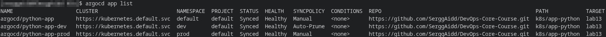

Result:
- `python-app-dev` was deployed to `dev`
- `python-app-prod` was deployed to `prod`

The test showed that the configurations are indeed different:
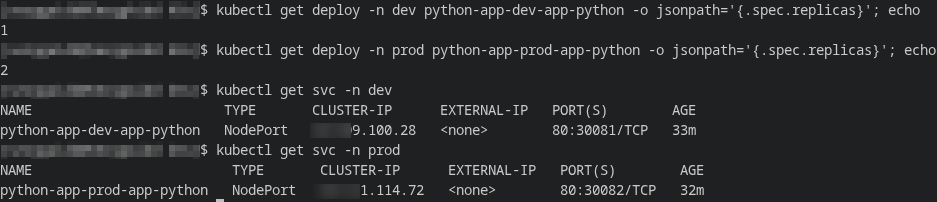

---

## 4. Self-Healing Evidence
### Manual scale test with before/after
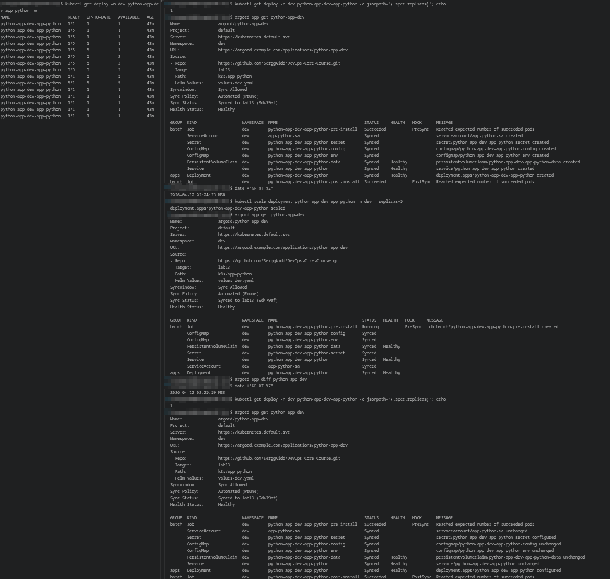
The test was performed in the `dev` environment with `selfHeal` enabled. The test showed that before the change, the deployment had `1` replica and a `Synced/Healthy` status. After manually scaling to `5`, ArgoCD automatically reverted the deployment to its Git state: the number of replicas returned to `1`, and the application remained in the `Synced/Healthy` state.

### Pod deletion test
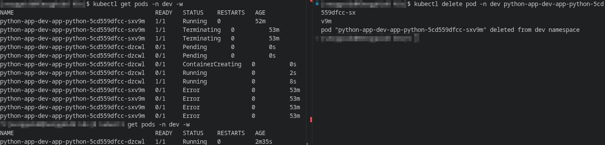
In the `dev` namespace, an application pod was manually deleted, after which Kubernetes automatically created a new pod with a different name: the old pod entered the `Terminating` state, and the new one sequentially went through the `Pending`, `ContainerCreating`, and `Running` states. This is an example of **Kubernetes self-healing**, as the pod was restored by the `Deployment/ReplicaSet` controller, not ArgoCD.

### Configuration drift test
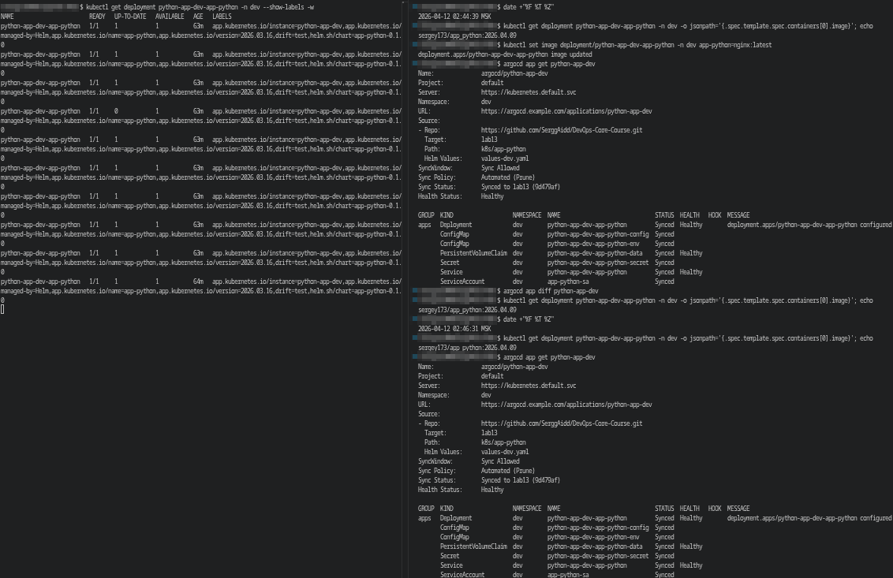
To check for configuration drift, the container image in the `python-app-dev-app-python` deployment was manually modified from `sergey173/app_python:2026.04.09` to `nginx:latest`.

After a short period of time, ArgoCD automatically reverted the image from the Git/Helm chart to its original value – `sergey173/app_python:2026.04.09`.

This confirms that ArgoCD detects drift and restores the desired state.

**Kubernetes self-healing** is responsible for recreating pods and maintaining the required number of replicas, while **ArgoCD self-healing** is responsible for returning the object's configuration to the state from Git.

Results:
- pod deletion – Kubernetes
- manual modification of spec/deployment – ​​ArgoCD

### Sync behavior
ArgoCD synchronizes the state in the following cases:

- when sync is run manually
- when drift is detected in auto-sync applications
- when the Git source changes

For `dev`, changes were applied automatically, for `prod`, changes were applied manually.

The default Git polling interval is approximately **3 minutes**. You can also use a webhook or run sync manually.

## 5. Screenshots
### ArgoCD UI showing both applications
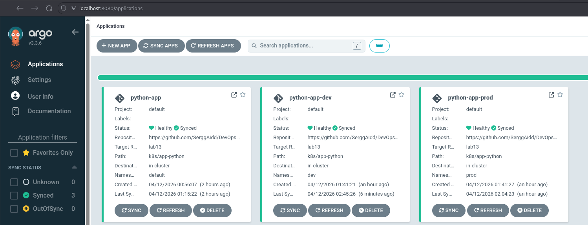

### Sync status


### Application details view
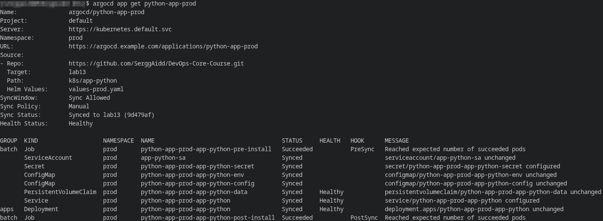
