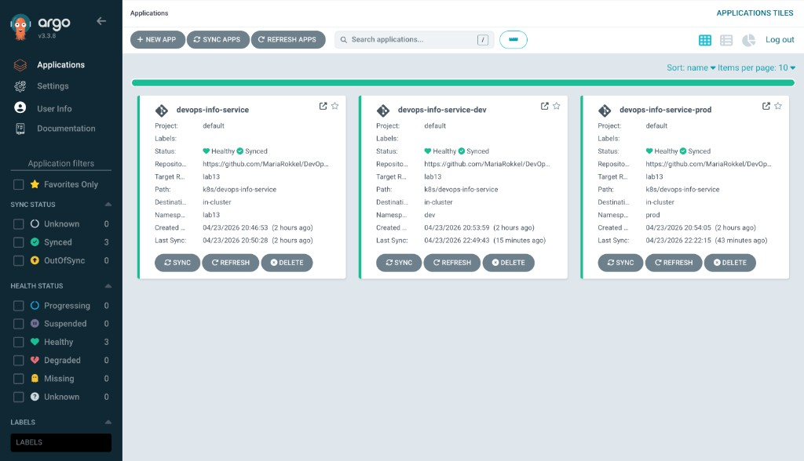
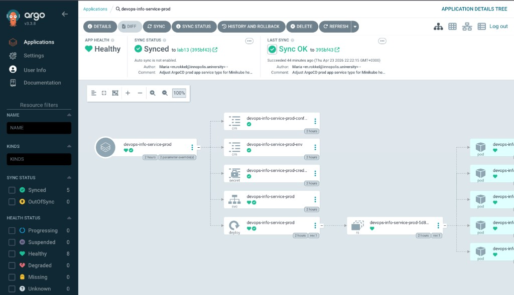

# Lab 13 — GitOps with ArgoCD

This report documents the completed Lab 13 implementation.

---

## 1. ArgoCD installation and setup

### 1.1 Cluster context and namespace

```bash
kubectl config use-context minikube
kubectl cluster-info
kubectl create namespace argocd
```

```text
Switched to context "minikube".
Kubernetes control plane is running at https://127.0.0.1:60956
CoreDNS is running at https://127.0.0.1:60956/api/v1/namespaces/kube-system/services/kube-dns:dns/proxy
namespace/argocd created
```

### 1.2 Helm install

```bash
helm upgrade --install argocd argo/argo-cd --namespace argocd
```

```text
NAME: argocd
LAST DEPLOYED: Thu Apr 23 20:03:29 2026
NAMESPACE: argocd
STATUS: deployed
REVISION: 1
```

### 1.3 Readiness checks

```bash
kubectl get pods -n argocd
kubectl rollout status deploy/argocd-server -n argocd
kubectl rollout status deploy/argocd-repo-server -n argocd
kubectl rollout status statefulset/argocd-application-controller -n argocd
```

```text
NAME                                                READY   STATUS    RESTARTS   AGE
argocd-application-controller-0                     1/1     Running   0          112s
argocd-applicationset-controller-754f66bd99-7mnvb   1/1     Running   0          112s
argocd-dex-server-5584f66c5d-58pnp                  1/1     Running   0          112s
argocd-notifications-controller-7646987985-rpcsl    1/1     Running   0          112s
argocd-redis-7c845cf5b9-2pg89                       1/1     Running   0          112s
argocd-repo-server-7c9654f7b-lphqk                  1/1     Running   0          112s
argocd-server-5f649867b4-cj4fz                      1/1     Running   0          112s
```

```text
deployment "argocd-server" successfully rolled out
deployment "argocd-repo-server" successfully rolled out
partitioned roll out complete: 1 new pods have been updated...
```

### 1.4 UI access and initial login

Port-forward method:

```bash
kubectl port-forward service/argocd-server -n argocd 8080:443
```

Initial admin password retrieval:

```bash
kubectl -n argocd get secret argocd-initial-admin-secret -o jsonpath="{.data.password}" | base64 -d
```

Used account:

- username: `admin`
- password: `<retrieved from argocd-initial-admin-secret>`

### 1.5 ArgoCD CLI setup

```bash
HOMEBREW_NO_AUTO_UPDATE=1 brew install argocd
argocd login localhost:8080 --username admin --password "<password>" --insecure
argocd account get-user-info
argocd app list
```

```text
'admin:login' logged in successfully
Context 'localhost:8080' updated
```

```text
Logged In: true
Username: admin
Issuer: argocd
Groups:
```

```text
NAME  CLUSTER  NAMESPACE  PROJECT  STATUS  HEAL
```

Task 1 conclusion: ArgoCD is installed, UI is reachable, and CLI auth works.

---

## 2. Application deployment (Task 2)

### 2.1 ArgoCD Application manifest

File created: [`k8s/argocd/application.yaml`](./argocd/application.yaml)

```yaml
apiVersion: argoproj.io/v1alpha1
kind: Application
metadata:
  name: devops-info-service
  namespace: argocd
spec:
  project: default
  source:
    repoURL: https://github.com/MariaRokkel/DevOps-Core-Course.git
    targetRevision: lab13
    path: k8s/devops-info-service
    helm:
      valueFiles:
        - values-dev.yaml
  destination:
    server: https://kubernetes.default.svc
    namespace: lab13
  syncPolicy:
    syncOptions:
      - CreateNamespace=true
```

Sync mode is **manual** (no `automated` policy block).

### 2.2 Apply and initial sync

```bash
kubectl apply -f k8s/argocd/application.yaml
argocd app list
argocd app get devops-info-service
argocd app sync devops-info-service
kubectl get all -n lab13
```

```text
$ kubectl apply -f k8s/argocd/application.yaml
application.argoproj.io/devops-info-service created
```

```text
$ argocd app list
NAME                        CLUSTER                         NAMESPACE  PROJECT  STATUS     HEALTH   SYNCPOLICY
argocd/devops-info-service  https://kubernetes.default.svc  lab13      default  OutOfSync  Missing  Manual
```

```text
$ argocd app get devops-info-service
Sync Status:        OutOfSync from lab13 (f8553df)
Health Status:      Missing
```

First sync failed due to a NodePort collision inherited from `values-dev.yaml`:

```text
Service "devops-info-service" is invalid: spec.ports[0].nodePort:
Invalid value: 30082: provided port is already allocated
```

Resolution: set a different NodePort declaratively in the ArgoCD Application Helm parameters (`service.nodePort=30084`) and re-sync.

Successful re-sync evidence:

```text
$ kubectl apply -f k8s/argocd/application.yaml
application.argoproj.io/devops-info-service configured
```

```text
$ argocd app sync devops-info-service
...
Sync Status:        Synced to lab13 (6477475)
Health Status:      Healthy
Phase:              Succeeded
Message:            successfully synced (no more tasks)
...
Service                lab13   devops-info-service               Synced     Healthy
Deployment             lab13   devops-info-service               Synced     Healthy
```

```text
$ argocd app wait devops-info-service --sync --health --timeout 180
Sync Status:        Synced to lab13 (6477475)
Health Status:      Healthy
```

Cluster resources in target namespace:

```text
$ kubectl get all -n lab13
NAME                                       READY   STATUS    RESTARTS   AGE
pod/devops-info-service-79f4477485-2lcm4   1/1     Running   0          3m9s

NAME                          TYPE       CLUSTER-IP    EXTERNAL-IP   PORT(S)        AGE
service/devops-info-service   NodePort   10.97.23.19   <none>        80:30084/TCP   38s

NAME                                  READY   UP-TO-DATE   AVAILABLE   AGE
deployment.apps/devops-info-service   1/1     1            1           3m9s

NAME                                             DESIRED   CURRENT   READY   AGE
replicaset.apps/devops-info-service-79f4477485   1         1         1       3m9s
```

Task 2 conclusion: Application resource created, manual sync performed, and workloads are healthy in namespace `lab13`.

---

## 3. Multi-environment deployment (Task 3)

### 3.1 Namespaces and application manifests

Created:

- [`k8s/argocd/application-dev.yaml`](./argocd/application-dev.yaml)
- [`k8s/argocd/application-prod.yaml`](./argocd/application-prod.yaml)

`dev` Application:

- namespace: `dev`
- values file: `values-dev.yaml`
- sync policy: **automated** with `prune: true` and `selfHeal: true`
- NodePort override: `service.nodePort=30085` to avoid collision with previous labs

`prod` Application:

- namespace: `prod`
- values file: `values-prod.yaml`
- sync policy: **manual** (no `automated` block)
- Minikube override in ArgoCD parameters: `service.type=NodePort`, `service.nodePort=30086` (to avoid `LoadBalancer` health staying `Progressing` without an external LB)

### 3.2 Apply and verify

```bash
kubectl apply -f k8s/argocd/application-dev.yaml
kubectl apply -f k8s/argocd/application-prod.yaml
argocd app list
argocd app get devops-info-service-dev
argocd app get devops-info-service-prod
```

Observed behavior:

- `devops-info-service-prod` remained manual and required explicit sync.
- Initial `prod` wait timed out when a previous operation was still active; this was resolved by terminating the operation and syncing again.

Manual sync for prod:

```bash
argocd app sync devops-info-service-prod
argocd app wait devops-info-service-prod --sync --health --timeout 180
```

Recovery command used when operation lock was present:

```bash
argocd app terminate-op devops-info-service-prod
```

Evidence (prod):

```text
$ argocd app sync devops-info-service-prod
...
Sync Status:        Synced to lab13 (395bf43)
Health Status:      Healthy
Phase:              Succeeded
Message:            successfully synced (no more tasks)
```

```text
$ argocd app wait devops-info-service-prod --sync --health --timeout 180
Sync Status:        Synced to lab13 (395bf43)
Health Status:      Healthy
```

```text
$ argocd app get devops-info-service-prod
Sync Policy:        Manual
Sync Status:        Synced to lab13 (395bf43)
Health Status:      Healthy
```

```text
$ kubectl get svc -n prod
NAME                       TYPE       CLUSTER-IP      EXTERNAL-IP   PORT(S)        AGE
devops-info-service-prod   NodePort   10.104.15.139   <none>        80:30086/TCP   87m
```

Cluster verification commands:

```bash
kubectl get all -n dev
kubectl get all -n prod
```

Task 3 conclusion: multi-environment ArgoCD applications are defined and deployed with different sync policies (dev automated, prod manual), and `prod` is confirmed `Synced`/`Healthy` after manual sync.

Evidence summary:

```text
$ argocd app get devops-info-service-prod
Sync Policy:        Manual
Sync Status:        Synced to lab13 (395bf43)
Health Status:      Healthy
```

```text
$ argocd app get devops-info-service-dev
Sync Policy:        Automated (Prune)
Sync Status:        Synced to lab13 (395bf43)
Health Status:      Healthy
```

```text
$ kubectl get svc -n prod
NAME                       TYPE       CLUSTER-IP      EXTERNAL-IP   PORT(S)        AGE
devops-info-service-prod   NodePort   10.104.15.139   <none>        80:30086/TCP   87m
```

---

## 4. Self-healing and drift behavior (Task 4)

### 4.1 Self-healing test: manual scale drift in `dev`

Command:

```bash
kubectl scale deployment/devops-info-service-dev -n dev --replicas=5
kubectl get deploy -n dev -w
```

Observed rollout stream:

```text
NAME                      READY   UP-TO-DATE   AVAILABLE   AGE
devops-info-service-dev   1/5     5            1           91m
devops-info-service-dev   1/1     5            1           91m
devops-info-service-dev   1/1     5            1           91m
devops-info-service-dev   1/1     5            1           91m
devops-info-service-dev   1/1     1            1           91m
```

Interpretation: the deployment was manually scaled to 5 replicas, then ArgoCD (automated + self-heal) reconciled it back to the Git-defined value (`replicaCount: 1` in `values-dev.yaml`).

Post-check:

```text
$ argocd app get devops-info-service-dev
Sync Policy:        Automated (Prune)
Sync Status:        Synced to lab13 (395bf43)
Health Status:      Healthy
```

```text
$ kubectl get deploy -n dev
NAME                      READY   UP-TO-DATE   AVAILABLE   AGE
devops-info-service-dev   1/1     1            1           99m
```

### 4.2 Pod deletion test (`dev`)

Command sequence:

```bash
kubectl get pods -n dev
kubectl delete pod -n dev devops-info-service-dev-7cf799f8d7-t49jd
kubectl get pods -n dev -w
```

Observed behavior:

```text
NAME                                       READY   STATUS    RESTARTS   AGE
devops-info-service-dev-7cf799f8d7-t49jd   1/1     Running   0          101m
pod "devops-info-service-dev-7cf799f8d7-t49jd" deleted
NAME                                       READY   STATUS    RESTARTS   AGE
devops-info-service-dev-7cf799f8d7-4ppxm   1/1     Running   0          3m41s
```

Interpretation: pod recreation is Kubernetes controller behavior (Deployment/ReplicaSet reconciliation), not ArgoCD drift correction.

Post-check:

```text
$ argocd app get devops-info-service-dev
Sync Status:        Synced to lab13 (395bf43)
Health Status:      Healthy
```

### 4.3 Configuration drift test (`dev`)

Test command:

```bash
kubectl set image deployment/devops-info-service-dev \
  devops-info-service=nginx:latest -n dev
```

```text
deployment.apps/devops-info-service-dev image updated
```

Immediate and delayed app checks:

```text
$ argocd app get devops-info-service-dev
Sync Policy:        Automated (Prune)
Sync Status:        Synced to lab13 (395bf43)
Health Status:      Healthy
```

```text
$ kubectl get deployment devops-info-service-dev -n dev -o jsonpath='{.spec.template.spec.containers[0].image}'
mararokkel/devops-info-service:latest
```

Interpretation: the manual runtime mutation was automatically reconciled back to the Git-defined image. In this run, auto-sync/self-heal acted fast enough that `OutOfSync` was not visible in CLI output snapshots.

### 4.4 Sync behavior explanation

- **Kubernetes self-healing:** replacing failed/deleted pods to satisfy the Deployment replica target.
- **ArgoCD self-healing:** reconciling managed resource spec drift back to Git state (for automated apps with `selfHeal: true`).
- **What triggers ArgoCD sync checks:** repository revision changes and periodic refresh/reconciliation loops.
- **Observed policy difference in this lab:** `dev` auto-sync+prune+self-heal; `prod` manual sync.

Task 4 conclusion: self-healing behavior was demonstrated for replica drift and spec drift in `dev`, and pod recreation behavior was distinguished as native Kubernetes reconciliation.

---

## 5. Screenshots

### 5.1 Applications list (all apps + sync/health)



### 5.2 Dev application details (`devops-info-service-dev`)


### 5.3 Prod application details (`devops-info-service-prod`)


