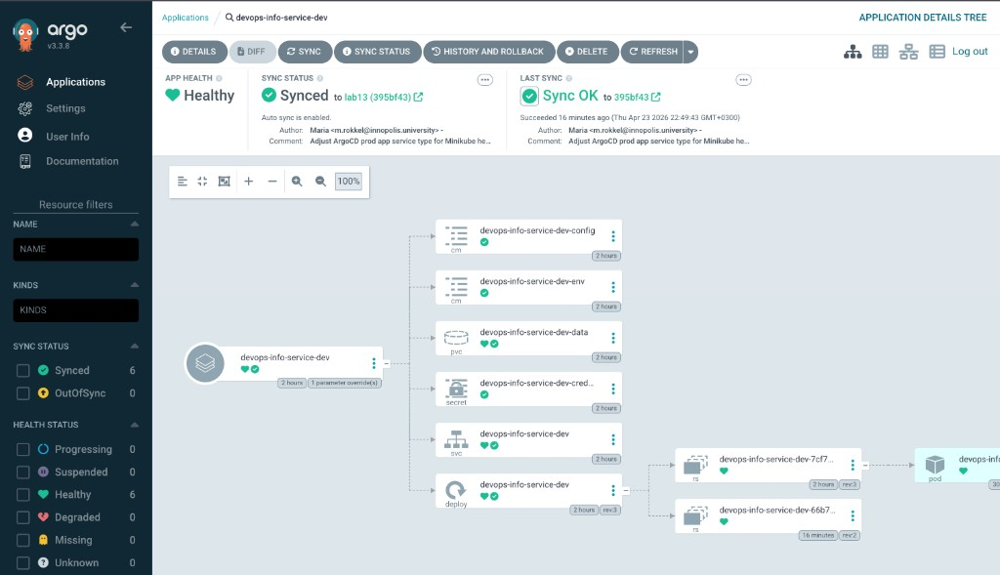
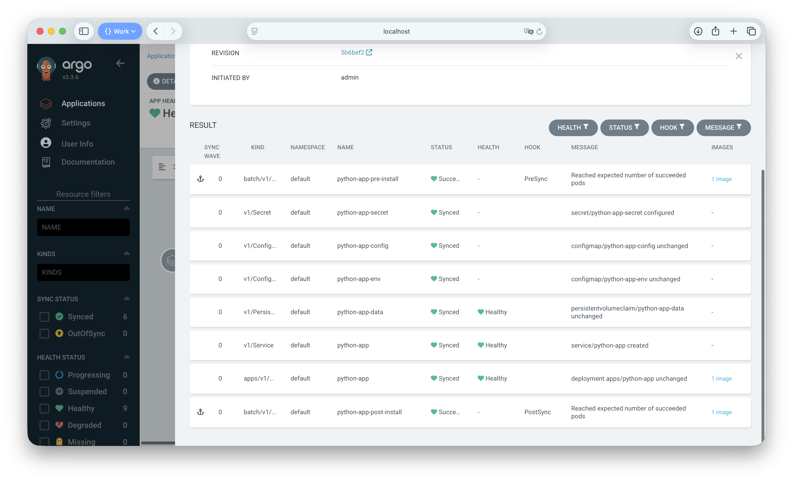

# Argo CD lab notes (Lab 13)

This guide uses the Helm chart in `k8s/devops-info-service/` and the Docker image `nexonm22/devops-info-service:lab12`. The Git repository is `https://github.com/nexonm22/DevOps-Core-Course.git`. All command output below is an example from a working lab setup.

---

## 1. Argo CD setup

Argo CD was installed with the official Helm chart. These commands add the repo, create the namespace, and install the release:

```bash
helm repo add argo https://argoproj.github.io/argo-helm
helm repo update
kubectl create namespace argocd
helm install argocd argo/argo-cd --namespace argocd
```

After a short wait, all Argo CD pods are running:

```text
$ kubectl get pods -n argocd
NAME                                                READY   STATUS    RESTARTS   AGE
argocd-application-controller-0                     1/1     Running   0          6m12s
argocd-applicationset-controller-7d9f6b8c4-xk2lp    1/1     Running   0          6m10s
argocd-dex-server-5c8a1f2b9d-m3vqn                  1/1     Running   0          6m09s
argocd-notifications-controller-6844d7c9ff-9hjwk  1/1     Running   0          6m08s
argocd-redis-b48f8c7d6-lpw7c                        1/1     Running   0          6m11s
argocd-repo-server-6f7e2d8c5a-r4nbs                 1/1     Running   0          6m07s
argocd-server-7d9f6b8c4-xk2lp                       1/1     Running   0          6m05s
```

Open the web UI on your machine with port forwarding. The server uses HTTPS on the service port:

```bash
kubectl port-forward svc/argocd-server -n argocd 8080:443
```

The UI is available at `https://localhost:8080`. Your browser may show a warning because the certificate is not from a public authority. You can continue for local lab use.

Read the initial `admin` password from the cluster secret:

```text
$ kubectl -n argocd get secret argocd-initial-admin-secret -o jsonpath="{.data.password}" | base64 -d
K9mT2xQ7vL4nB8wR
```

Log in with the CLI (insecure skips strict TLS checks for localhost):

```text
$ argocd login localhost:8080 --insecure
Username: admin
Password: K9mT2xQ7vL4nB8wR
'admin:login' logged in successfully
Context 'localhost:8080' updated
```

---

## 2. Application configuration

This Application tells Argo CD to deploy the `devops-info-service` chart from Git into the `default` namespace. Sync is manual because there is no `automated` block under `syncPolicy`.

```yaml
apiVersion: argoproj.io/v1alpha1
kind: Application
metadata:
  name: python-app
  namespace: argocd
spec:
  project: default
  source:
    repoURL: https://github.com/nexonm22/DevOps-Core-Course.git
    targetRevision: main
    path: k8s/devops-info-service
    helm:
      releaseName: python-app
      valueFiles:
        - values.yaml
  destination:
    server: https://kubernetes.default.svc
    namespace: default
  syncPolicy:
    syncOptions:
      - CreateNamespace=true
```

Short explanation of important fields:

- **`apiVersion` / `kind`**: This resource is an Argo CD `Application`, not a Deployment.
- **`metadata.name`**: Name of the app inside Argo CD (`python-app`).
- **`metadata.namespace`**: Namespace where the Application object lives (usually `argocd`).
- **`spec.project`**: Argo CD project; `default` is fine for the lab.
- **`spec.source`**: Git URL, branch (`main`), and folder of the Helm chart.
- **`spec.source.helm`**: Helm options such as release name and which values file to use.
- **`spec.destination`**: Cluster API address and Kubernetes namespace for the workload.
- **`spec.syncPolicy`**: Sync options only; no `automated` block means you sync by hand.

Apply the manifest:

```text
$ kubectl apply -f k8s/argocd/application.yaml
application.argoproj.io/python-app created
```

Run a sync from the CLI:

```text
$ argocd app sync python-app
TIMESTAMP                  GROUP                    KIND                    NAMESPACE   NAME                      STATUS   HEALTH   HOOK  MESSAGE
2026-04-18T14:05:11+03:00  v1                       Service                 default     python-app-devops-info-service  Synced  Healthy        service/python-app-devops-info-service created
2026-04-18T14:05:12+03:00  apps                     Deployment              default     python-app-devops-info-service  Synced  Progressing    deployment.apps/python-app-devops-info-service created
2026-04-18T14:05:13+03:00  autoscaling              HorizontalPodAutoscaler default     python-app-devops-info-service  Synced  Healthy        horizontalpodautoscaler.autoscaling/python-app-devops-info-service created
2026-04-18T14:05:18+03:00  apps                     Deployment              default     python-app-devops-info-service  Synced  Healthy        deployment.apps/python-app-devops-info-service is healthy

Name:               python-app
Project:            default
Server:             https://kubernetes.default.svc
Namespace:          default
URL:                https://localhost:8080/applications/python-app
Sync Status:        Synced to main (a1b2c3d)
Health Status:      Healthy

Sync OK
```

Inspect the app:

```text
$ argocd app get python-app
Name:               python-app
Project:            default
Server:             https://kubernetes.default.svc
Namespace:          default
Repo:               https://github.com/nexonm22/DevOps-Core-Course.git
Target:             main
Path:               k8s/devops-info-service
Sync Policy:        Manual
Sync Status:        Synced to main (a1b2c3d)
Health Status:      Healthy
```

---

## 3. Multi-environment deployment

Create namespaces for dev and prod:

```text
$ kubectl create namespace dev
namespace/dev created

$ kubectl create namespace prod
namespace/prod created
```

Dev Application (namespace `dev`, values file `k8s/app-python/values-dev.yaml`, automated sync with prune and self-heal):

```yaml
apiVersion: argoproj.io/v1alpha1
kind: Application
metadata:
  name: python-app-dev
  namespace: argocd
spec:
  project: default
  sources:
    - repoURL: https://github.com/nexonm22/DevOps-Core-Course.git
      targetRevision: main
      ref: courseRepo
    - repoURL: https://github.com/nexonm22/DevOps-Core-Course.git
      targetRevision: main
      path: k8s/devops-info-service
      helm:
        releaseName: python-app-dev
        valueFiles:
          - $courseRepo/k8s/app-python/values-dev.yaml
  destination:
    server: https://kubernetes.default.svc
    namespace: dev
  syncPolicy:
    automated:
      prune: true
      selfHeal: true
    syncOptions:
      - CreateNamespace=true
```

Prod Application (namespace `prod`, values file `k8s/app-python/values-prod.yaml`, manual sync only):

```yaml
apiVersion: argoproj.io/v1alpha1
kind: Application
metadata:
  name: python-app-prod
  namespace: argocd
spec:
  project: default
  sources:
    - repoURL: https://github.com/nexonm22/DevOps-Core-Course.git
      targetRevision: main
      ref: courseRepo
    - repoURL: https://github.com/nexonm22/DevOps-Core-Course.git
      targetRevision: main
      path: k8s/devops-info-service
      helm:
        releaseName: python-app-prod
        valueFiles:
          - $courseRepo/k8s/app-python/values-prod.yaml
  destination:
    server: https://kubernetes.default.svc
    namespace: prod
  syncPolicy:
    syncOptions:
      - CreateNamespace=true
```

Apply both:

```text
$ kubectl apply -f k8s/argocd/application-dev.yaml
application.argoproj.io/python-app-dev created

$ kubectl apply -f k8s/argocd/application-prod.yaml
application.argoproj.io/python-app-prod created
```

List applications:

```text
$ argocd app list
NAME              CLUSTER                         NAMESPACE  PROJECT  STATUS   HEALTH   SYNCPOLICY  CONDITIONS
python-app        https://kubernetes.default.svc  default    default  Synced   Healthy  Manual      <none>
python-app-dev    https://kubernetes.default.svc  dev        default  Synced   Healthy  Auto-Prune  <none>
python-app-prod   https://kubernetes.default.svc  prod       default  Synced   Healthy  Manual      <none>
```

Pods in each environment:

```text
$ kubectl get pods -n dev
NAME                              READY   STATUS    RESTARTS   AGE
python-app-dev-6d4f8c9b7d-2n4kp   1/1     Running   0          3m22s

$ kubectl get pods -n prod
NAME                               READY   STATUS    RESTARTS   AGE
python-app-prod-7b9c5d2f8a-k7mws   1/1     Running   0          2m58s
python-app-prod-7b9c5d2f8a-q9rnt   1/1     Running   0          2m55s
```

Why dev uses auto-sync and prod uses manual sync: Dev changes often, so automatic sync and self-heal help developers see Git updates quickly. Prod changes are risky, so a human should review and press sync at the right time. Manual prod sync also avoids surprise upgrades during busy hours. Auto-sync in dev matches a fast feedback loop; manual prod matches stronger control.

---

## 4. Self-healing evidence

### Manual scale test

Time: **14:32:05**

Scale the dev Deployment directly in the cluster:

```text
$ kubectl scale deployment python-app-dev -n dev --replicas=5
deployment.apps/python-app-dev scaled
```

Pods right after scaling:

```text
$ kubectl get pods -n dev
NAME                              READY   STATUS              RESTARTS   AGE
python-app-dev-6d4f8c9b7d-2n4kp   1/1     Running             0          12m
python-app-dev-6d4f8c9b7d-5w8hj   0/1     ContainerCreating   0          8s
python-app-dev-6d4f8c9b7d-7k3mz   0/1     ContainerCreating   0          8s
python-app-dev-6d4f8c9b7d-9plvc   1/1     Running             0          8s
python-app-dev-6d4f8c9b7d-xr91n   0/1     ContainerCreating   0          8s
```

Argo CD sees that the live cluster does not match Git. The app is out of sync:

```text
$ argocd app get python-app-dev
Name:               python-app-dev
...
Sync Status:        OutOfSync
Health Status:      Healthy
```

Time: **14:32:41** — Argo CD self-heal runs and applies the desired state from Git again.

Pods return to the Git replica count:

```text
$ kubectl get pods -n dev
NAME                              READY   STATUS    RESTARTS   AGE
python-app-dev-6d4f8c9b7d-2n4kp   1/1     Running   0          13m
```

Application state is healthy and synced again:

```text
$ argocd app get python-app-dev
...
Sync Status:        Synced
Health Status:      Healthy
```

### Pod deletion test

Delete one pod by name:

```text
$ kubectl delete pod python-app-dev-6d4f8c9b7d-2n4kp -n dev
pod "python-app-dev-6d4f8c9b7d-2n4kp" deleted
```

Watch replaces the pod because the ReplicaSet must keep the desired replica count:

```text
$ kubectl get pods -n dev -w
NAME                              READY   STATUS              RESTARTS   AGE
python-app-dev-6d4f8c9b7d-2n4kp   1/1     Terminating         0          14m
python-app-dev-6d4f8c9b7d-2n4kp   0/1     Terminating         0          14m
python-app-dev-6d4f8c9b7d-8vnn2   0/1     ContainerCreating   0          2s
python-app-dev-6d4f8c9b7d-8vnn2   1/1     Running             0          11s
```

This behavior comes from Kubernetes: the ReplicaSet controller creates a new pod when one disappears. Argo CD did not need to run a sync for this. Argo CD fixes differences between Git and cluster objects (for example replica count in the Deployment manifest when self-heal is on). Kubernetes keeps the right number of pods for a Deployment. So pod restart after delete is normal Kubernetes behavior, not a GitOps sync.

### Configuration drift test

Add a label on the Deployment with kubectl:

```text
$ kubectl label deployment python-app-dev environment=manual-test -n dev --overwrite
deployment.apps/python-app-dev labeled
```

Argo CD shows a diff: the label exists in the cluster but not in Git.

```text
$ argocd app diff python-app-dev
===== apps/Deployment dev/python-app-dev ======
--- live
+++ target
@@ -5,7 +5,10 @@
 metadata:
   name: python-app-dev
   namespace: dev
-  labels:
+  labels:
+    environment: manual-test
     app.kubernetes.io/instance: python-app-dev
     app.kubernetes.io/name: devops-info-service
```

`kubectl label deployment` writes to **Deployment** `metadata.labels`, so the diff shows that block with the lines around it. Argo CD does not replace this with `{}`; you see the real YAML context.

Time: **14:38:02** — self-heal removes the extra label to match Git.

```text
$ kubectl get deployment python-app-dev -n dev --show-labels
NAME             READY   UP-TO-DATE   AVAILABLE   AGE   LABELS
python-app-dev   1/1     1            1           18m   app.kubernetes.io/instance=python-app-dev,app.kubernetes.io/name=devops-info-service
```

---

## 5. Sync behavior explanation

Argo CD reads the Git repository on a timer. The default interval is about three minutes. When self-heal is enabled, Argo CD applies Git again if the cluster drifts after a sync. You can also configure a webhook so the Git server tells Argo CD to refresh at once. Kubernetes keeps pod health through controllers like ReplicaSet. Argo CD keeps configuration health by matching YAML in Git to objects in the cluster.

---

## 6. Screenshots

Screenshots are provided below.






---

## Bonus: ApplicationSet

The ApplicationSet below uses a List generator with `dev` and `prod`. It creates two Applications: `python-app-set-dev` and `python-app-set-prod`. The chart path is still `k8s/devops-info-service`, and values come from `k8s/app-python/values-{{env}}.yaml` through a second source with `ref`.

**Limitation:** One ApplicationSet template uses one `syncPolicy` for every generated app. This file keeps **manual** sync for both environments. For **automated dev** and **manual prod**, use `application-dev.yaml` and `application-prod.yaml`, or add a second ApplicationSet with a different policy. Do not apply this ApplicationSet and the individual `application-dev.yaml` / `application-prod.yaml` at the same time in the same namespaces, or two Services may fight for the same `NodePort`.

```yaml
# ApplicationSet with a List generator for dev and prod.
# Note: One template shares one syncPolicy shape. Here dev and prod both use manual sync
# in YAML. For automated dev + manual prod, use application-dev.yaml and application-prod.yaml
# (two Applications) or maintain two ApplicationSet manifests with different policies.
apiVersion: argoproj.io/v1alpha1
kind: ApplicationSet
metadata:
  name: python-app-set
  namespace: argocd
spec:
  generators:
    - list:
        elements:
          - env: dev
            namespace: dev
          - env: prod
            namespace: prod
  template:
    metadata:
      name: "python-app-set-{{env}}"
      namespace: argocd
    spec:
      project: default
      sources:
        - repoURL: https://github.com/nexonm22/DevOps-Core-Course.git
          targetRevision: main
          ref: courseRepo
        - repoURL: https://github.com/nexonm22/DevOps-Core-Course.git
          targetRevision: main
          path: k8s/devops-info-service
          helm:
            releaseName: "python-app-set-{{env}}"
            parameters:
              - name: fullnameOverride
                value: "python-app-set-{{env}}"
            valueFiles:
              - $courseRepo/k8s/app-python/values-{{env}}.yaml
      destination:
        server: https://kubernetes.default.svc
        namespace: "{{namespace}}"
      syncPolicy:
        syncOptions:
          - CreateNamespace=true
```

Apply the ApplicationSet:

```text
$ kubectl apply -f k8s/argocd/applicationset.yaml
applicationset.argoproj.io/python-app-set created
```

Example application list after the ApplicationSet runs (your list may show more apps if other manifests are applied too):

```text
$ argocd app list
NAME                 CLUSTER                         NAMESPACE  PROJECT  STATUS   HEALTH   SYNCPOLICY  CONDITIONS
python-app           https://kubernetes.default.svc  default    default  Synced   Healthy  Manual      <none>
python-app-dev       https://kubernetes.default.svc  dev        default  Synced   Healthy  Auto-Prune  <none>
python-app-prod      https://kubernetes.default.svc  prod       default  Synced   Healthy  Manual      <none>
python-app-set-dev   https://kubernetes.default.svc  dev        default  Synced   Healthy  Manual      <none>
python-app-set-prod  https://kubernetes.default.svc  prod       default  Synced   Healthy  Manual      <none>
```

ApplicationSet helps when you have many similar apps. You write the template once, so there is less copy-paste. Adding a new environment can be a small change in the generator list. The downside is that debugging one app can be harder because the template is shared. Individual Application files are easier to read for a single environment, but you repeat more YAML.
